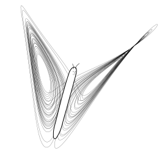

---
title: FeenoX
subtitle: a free no-fee no-X uniX-like finite-element(ish) computational engineering tool
titleblock: |
 FeenoX: a free no-fee no-X uniX-like finite-element(ish) computational engineering tool
 =======================================================================================

lang: en-US
number-sections: true
fontsize: 11pt
geometry:
- paper=a4paper
- left=2.5cm
- right=2cm
- bottom=3.5cm
- foot=2cm
- top=3.5cm
- head=2cm
colorlinks: true
mathspec: true
syntax-definition: feenox.xml
header-includes: \include{syntax.tex}
listings: true
toc: false
...

::: {.not-in-format .plain .markdown .gfm .plain .latex }



:::::: {.text-center}
[Downloads](doc/install){.btn .btn-primary}
[Documentation](doc){.btn .btn-secondary}
[Licensing](#licensing){.btn .btn-info}
::::::
:::

:::{.alert .alert-warning}
> Please note that FeenoX is a [back end](https://en.wikipedia.org/wiki/Front_and_back_ends) aimed at advanced users.
> It **does not include a graphical interface**. For an easy-to-use web-based front end with FeenoX running in the cloud directly from your browser see [CAEplex](https://www.caeplex.com) at <https://www.caeplex.com>.
> Any contribution to make dekstop GUIs such as [PrePoMax](https://prepomax.fs.um.si/) or [FreeCAD](http://https://www.freecadweb.org) to work with FeenoX are welcome.

:::::: {.not-in-format .plain .markdown .gfm .plain .latex }
<div class="embed-responsive embed-responsive-16by9 mb-3">
 <iframe class="embed-responsive-item" src="https://www.youtube.com/embed/kD3tQdq17ZE" frameborder="0" allow="accelerometer; autoplay; encrypted-media; gyroscope; picture-in-picture" allowfullscreen></iframe>
</div> 
::::::
:::


# What is FeenoX?

FeenoX can be seen as

 * a syntactically-sweetened way of asking the computer to solve engineering-related mathematical problems, and/or
 * a finite-element(ish) tool with a particular design basis

Note that some of the problems solved with FeenoX might not actually rely on the finite element method, but on general mathematical models and even on the finite volumes method. That is why we say it is a finite-element(ish) tool.

One of the main features of this allegedly particular design basis is that **simple problems ought to have simple inputs** (_rule of simplicity_). For instance, to solve one-dimensional heat conduction over the domain $x\in[0,1]$ (which is indeed one of the most simple engineering problems we can find) the following input file is enough:

```feenox
READ_MESH slab.msh               # read mesh in Gmsh's v4.1 format
PROBLEM thermal DIMENSIONS 1     # tell FeenoX what we want to solve 
k = 1                            # set uniform conductivity
BC left  T=0                     # set fixed temperatures as BCs
BC right T=1                     # "left" and "right" are defined in the mesh
SOLVE_PROBLEM                    # tell FeenoX we are ready to solve the problem
PRINT T(0.5)                     # ask for the temperature at x=0.5
```

```terminal
$ feenox thermal-1d-dirichlet-constant-k.fee 
0.5
$ 
```

The mesh is assumed to have been already created with [Gmsh](http://gmsh.info/) (or any other pre-processing tool and converted to `.msh` format with [Meshio](https://github.com/nschloe/meshio) for example). This assumption follows the _rule of composition_  and prevents the actual input file to be polluted with mesh-dependent data (such as node coordinates and/or nodal loads) so as to keep it simple and make it [Git](https://git-scm.com/)-friendly (_rule of generation_). The only link between the mesh and the FeenoX input file is through physical groups (in the case above `left` and `right`) used to set boundary conditions and/or material properties.

Another design-basis decision is that **similar problems ought to have similar inputs** (_rule of least surprise_). So in order to have a space-dependent conductivity, we only have to replace one line in the input above: instead of defining a scalar $k$ we define a function of $x$ (we also update the output to show the analytical solution as well):

```feenox
READ_MESH slab.msh
PROBLEM thermal DIMENSIONS 1
k(x) = 1+x                       # space-dependent conductivity
BC left  T=0
BC right T=1
SOLVE_PROBLEM
PRINT T(1/2) log(1+1/2)/log(2)   # print numerical and analytical solutions
```

```terminal
$ feenox thermal-1d-dirichlet-space-k.fee 
0.584959	0.584963
$
```

FeenoX has an **everything is an expression** design principle, meaning that any numerical input can be an algebraic expression (e.g. `T(1/2)` is the same as `T(0.5)`). If we want to have a temperature-dependent conductivity (which renders the problem non-linear) we can take advantage of the fact that $T(x)$ is available not only as an argument to `PRINT` but also for the definition of algebraic functions:

```feenox
READ_MESH slab.msh
PROBLEM thermal DIMENSIONS 1
k(x) = 1+T(x)                    # temperature-dependent conductivity
BC left  T=0
BC right T=1
SOLVE_PROBLEM
PRINT T(1/2) sqrt(1+(3*0.5))-1   # print numerical and analytical solutions
```

```terminal
$ feenox thermal-1d-dirichlet-temperature-k.fee 
0.581139	0.581139
$
```

For example, we can solve the [NAFEMS\ LE11](https://www.nafems.org/publications/resource_center/p18/) “Solid cylinder/Taper/Sphere-Temperature” benchmark like

```{.feenox style=feenox}
READ_MESH nafems-le11.msh DIMENSIONS 3
PROBLEM mechanical

# linear temperature gradient in the radial and axial direction
T(x,y,z) = sqrt(x^2 + y^2) + z

# Boundary conditions
BC xz     symmetry  # same as v=0 but "symmetry" follows the statement
BC yz     symmetry  # ide with u=0
BC xy     w=0
BC HIH'I' w=0

# material properties (isotropic & uniform so we can use scalar constants)
E = 210e3*1e6       # mesh is in meters, so E=210e3 MPa -> Pa
nu = 0.3            # dimensionless
alpha = 2.3e-4      # in 1/ºC as in the problem

SOLVE_PROBLEM
WRITE_MESH nafems-le11.vtk VECTOR u v w   T sigma1 sigma2 sigma3 sigma sigmaz
PRINT "sigma_z(A) = " sigmaz(0,1,0)/1e6 "MPa"
```

Another example would be the famous chaotic [Lorenz’ dynamical system](http://en.wikipedia.org/wiki/Lorenz_system)---the one of the butterfly---whose differential equations are

```{=plain}
dx/dt = σ (y-x)  
dy/dt = x (r-z) - y
dz/dt = x y - b z
```

```{=latex}
\begin{equation*}
\begin{cases}
\dot{x} &= \sigma \cdot (y - x)  \\
\dot{y} &= x \cdot (r - z) - y   \\
\dot{z} &= x y - b z       \\
\end{cases}
\end{equation*}
```

::: {.not-in-format .plain .latex }
$$\dot{x} = \sigma \cdot (y - x)$$  
$$\dot{y} = x \cdot (r - z) - y$$  
$$\dot{z} = x \cdot y - b \cdot z$$  
:::

where $\sigma=10$, $b=8/3$ and $r=28$ are the classical parameters that generate the butterfly as presented by Edward Lorenz back in his seminal 1963 paper [Deterministic non-periodic flow](http://journals.ametsoc.org/doi/abs/10.1175/1520-0469%281963%29020%3C0130%3ADNF%3E2.0.CO%3B2). We can solve it with FeenoX by writing the equations in the input file as naturally as possible, as illustrated in the input file that follows:

```{.feenox style=feenox}
PHASE_SPACE x y z     # Lorenz attractor’s phase space is x-y-z
end_time = 40         # we go from t=0 to 40 non-dimensional units

sigma = 10            # the original parameters from the 1963 paper
r = 28
b = 8/3

x_0 = -11             # initial conditions
y_0 = -16
z_0 = 22.5

# the dynamical system's equations written as naturally as possible
x_dot = sigma*(y - x)
y_dot = x*(r - z) - y
z_dot = x*y - b*z

PRINT t x y z        # four-column plain-ASCII output
```


Please note the following two points about both cases above:

 1. The input files are very similar to the statements of each problem in plain English words (_rule of clarity_). Take some time to read the [problem statement of the NAFEMS\ LE11 benchmark](doc/design/nafems-le11/nafems-le11.png) and the FeenoX input to see how well the latter matches the former. Same for the Lorenz’ chaotic system. Those with some experience may want to compare them to the inputs decks (sic) needed for other common FEA programs.
 2. By design, 100% of FeenoX’ output is controlled by the user. Had there not been any `PRINT` or `WRITE_MESH` instructions, the output would have been empty, following the _rule of silence_. This is a significant change with respect to traditional engineering codes that date back from times when one CPU hour was worth dozens (or even hundreds) of engineering hours. At that time, cognizant engineers had to dig into thousands of lines of data to search for a single individual result. Nowadays, following the _rule of economy_, it is actually far easier to ask the code to write only what is needed in the particular format that suits the user.

 
In other words, FeenoX is a computational tool to solve

 * dynamical systems written as sets of ODEs/DAEs, or
 * steady or quasi-static thermo-mechanical problems, or
 * steady or transient heat conduction problems, or
 * modal analysis problems,
 * neutron diffusion or transport problems
 * community-contributed problems

in such a way that the input is a near-English text file that defines the problem to be solved. Some basic rules are

 * FeenoX is just a **solver** working as a _transfer function_ between input and output files. Following the _rules of separation, parsimony and diversity_, **there is no embedded graphical interface** but means of using generic pre and post processing tools---in particular, [Gmsh](http://gmsh.info/) and [Paraview](https://www.paraview.org/) respectively. See also [CAEplex](www.caeplex.com).
 
 
 * The input files should be [syntactically sugared](https://en.wikipedia.org/wiki/Syntactic_sugar) so as to be as self-describing as possible.
 * Simple problems ought to need simple input files.
 * Similar problems ought to need similar input files.
 * Everything is an expression. Whenever a number is expected, an algebraic expression can be entered as well. Variables, vectors, matrices and functions are supported. Here is how to replace the boundary condition on the right side of the slab above with a radiation condition:
 
   ```feenox
   sigma = 1       # non-dimensional stefan-boltzmann constant
   e = 0.8         # emissivity 
   Tinf=1          # non-dimensional reference temperature
   BC right q=sigma*e*(Tinf^4-T(x)^4)
   ```
   
   
 * FeenoX should run natively in the cloud and be able to massively scale in parallel. See the [Software Requirements Specification](doc/sds.md) and the [Software Development Specification](doc/sds.md) for details.
 
Since it is free ([as in freedom](https://www.gnu.org/philosophy/free-sw.en.html)) and open source, contributions to add features (and to fix bugs) are welcome. In particular, each kind of problem supported by FeenoX (thermal, mechanical, modal, etc.) has a subdirectory of source files which can be used as a template to add new problems, as implied in the “community-contributed problems” bullet above (_rules of modularity and extensibility_). See the [documentation](doc) for details about how to contribute.


## Why?

The world is already full of finite-element programs and every day a grad student creates a new one from scratch.
However, almost every piece of FEA software falls in either one of these two categories:

 a. Powerful, flexible and complex advanced numerical solvers of general non-linear partial differential equations written by academics (for academics) distributed under the form of 
     i. libraries, which the user has to compile and link to their own codes, or
     ii. interpreted languages (i.e. Python) wrappers, which the user has to call from their own scripts, or
     iii. input-file reading binaries, which the user needs to fill in with the weak form of the equation they need to solve.
     
    **Examples:** [MoFEM](http://mofem.eng.gla.ac.uk/mofem/html/), [Sparselizard](http://sparselizard.org/), [GetDP](http://getdp.info/), [FEnICS](https://fenicsproject.org/), [MOOSE](https://mooseframework.org/), [FreeFEM](https://freefem.org/), ...  
     
 b. Commercial, non-free (well some of them are free but coded in FORTRAN 77 so the source is unintelligible) and complex GUI-based programs that are
     i. closed-source, so nobody can know what the actual equations are nor how they are solved, and/or
     ii. complicated, so the only way to use them is through their embedded mouse-based GUI, and/or
     iii. expensive and out of the league of many companies and professionals.
     
    **Examples:** [CalculiX](http://calculix.de/), [CodeAster](https://www.code-aster.org), [NASTRAN](https://github.com/nasa/NASTRAN-95)^[We list just the open-source ones because we [at Seamplex do not want to encourage the usage of non-free software](https://www.seamplex.com/mission.html#principles), but---with some exceptions---any of the commercial packages out there would also apply.] 
     
Hence, Fino tries to fill in the gap between these two worlds with a different design basis.


# Download

FeenoX is distributed under the terms of the [GNU General Public License version 3](https://www.gnu.org/licenses/gpl-3.0.en.html) or (at your option) any later version. See [licensing below](#licensing) for details.

|                             |                                                       |
|-----------------------------|-------------------------------------------------------|
|  GNU/Linux binaries         | <https://www.seamplex.com/feenox/dist/linux>          |
|  Windows binaries           | <https://www.seamplex.com/feenox/dist/windows>        |
|  Source tarballs            | <https://www.seamplex.com/feenox/dist/src>            |


 * Binaries are provided as statically-linked executables for convenience.
 * They do not support MUMPS nor MPI and have only basic optimization flags. Please compile from source for high-end applications.
 * Try to avoid Windows as much as you can. The binaries are provided as transitional packages for people that for some reason still use such an outdated, anachronous, awful and invasive operating system. They are compiled with Cygwin and have no support whatsoever. Really, really, get rid of Windows ASAP.
 
   > “It is really worth any amount of time and effort to get away from Windows if you are doing computational science.”
   >
   > [<https://lists.mcs.anl.gov/pipermail/petsc-users/2015-July/026388.html>]

## Git repository

If the statically-linked binaries above do not fit your needs, the recommended way of getting FeenoX is to compile from source.

 1. Install mandatory dependencies

    ```terminal
    sudo apt-get install git gcc make automake autoconf libgsl-dev
    ```

 2. Install optional dependencies (of course these are _optional_ but recommended)
 
    ```terminal
    sudo apt-get install lib-sundials-dev petsc-dev slepc-dev libreadline-dev
    ```

 3. Clone Github repository
 
    ```terminal
    git clone https://github.com/seamplex/feenox
    ```

 4. Boostrap, configure, compile & make
 
    ```terminal
    cd feenox
    ./autogen.sh
    ./configure
    make
    ```

 5. Run test suite (optional, this might take some time)
 
    ```terminal
    make check
    ```

 6. Install the binary system wide (optional)
 
    ```terminal
    sudo make install
    ```


# Licensing

FeenoX is distributed under the terms of the [GNU General Public License](http://www.gnu.org/copyleft/gpl.html) version 3 or (at your option) any later version. The following text was borrowed from the [Gmsh documentation](http://gmsh.info/doc/texinfo/gmsh.html#Copying-conditions). Replacing “Gmsh” with “FeenoX” gives:

::: {.alert .alert-light}
>FeenoX is “free software”; this means that everyone is free to use it and to redistribute it on a free basis. FeenoX is not in the public domain; it is copyrighted and there are restrictions on its distribution, but these restrictions are designed to permit everything that a good cooperating citizen would want to do. What is not allowed is to try to prevent others from further sharing any version of FeenoX that they might get from you.
>
>Specifically, we want to make sure that you have the right to give away copies of FeenoX, that you receive source code or else can get it if you want it, that you can change FeenoX or use pieces of FeenoX in new free programs, and that you know you can do these things.
>
>To make sure that everyone has such rights, we have to forbid you to deprive anyone else of these rights. For example, if you distribute copies of FeenoX, you must give the recipients all the rights that you have. You must make sure that they, too, receive or can get the source code. And you must tell them their rights.
>
>Also, for our own protection, we must make certain that everyone finds out that there is no warranty for FeenoX. If FeenoX is modified by someone else and passed on, we want their recipients to know that what they have is not what we distributed, so that any problems introduced by others will not reflect on our reputation.
>
>The precise conditions of the license for FeenoX are found in the [General Public License](https://github.com/seamplex/feenox/blob/master/COPYING) that accompanies the source code. Further information about this license is available from the GNU Project webpage <http://www.gnu.org/copyleft/gpl-faq.html>.
:::

# Further information

Home page: <https://www.seamplex.com/feenox>  
Repository: <https://github.com/seamplex/feenox.git>  
Mailing list and bug reports: <wasora@seamplex.com>  (you need to subscribe first at <wasora+subscribe@seamplex.com>)  
Web interface for mailing list: <https://www.seamplex.com/lists.html>  
Follow us: [YouTube](https://www.youtube.com/channel/UCC6SzVLxO8h6j5rLlfCQPhA)
           [LinkedIn](https://www.linkedin.com/company/seamplex/)
           [Github](https://github.com/seamplex)

---------------------------

FeenoX is copyright ©2009-2021 [Seamplex](https://www.seamplex.com)  
FeenoX is licensed under [GNU GPL version 3](http://www.gnu.org/copyleft/gpl.html) or (at your option) any later version.  
FeenoX is free software: you are free to change and redistribute it.  
There is **NO WARRANTY**, to the extent permitted by law.  
See the [copying conditions](COPYING).  
