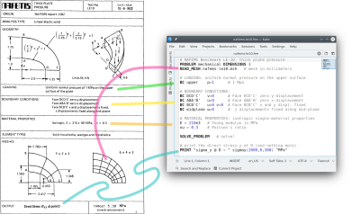

# What is FeenoX?

It is "cloud-first a free no-fee no-X uniX-like finite-element(ish) computational engineering tool."
Essentially, a finite-element program with a particular design basis:

> FeenoX is to finite-element programs and libraries what Markdown is to word processors (like Word) and typesetting systems (like TeX), respectively.

In increasing order of complexity and comprehensiveness, these resources explain what [FeenoX](https://www.seamplex.com/feenox) is:

 * The [examples](https://www.seamplex.com/feenox/examples) will give a brief overview of what FeenoX can do.
 * The [tutorials](https://www.seamplex.com/feenox/doc/tutorials) will walk your through how to use FeenoX to solve problems.
 * The [README](https://www.seamplex.com/feenox/) in the [GitHub repository](https://github.com/seamplex/feenox/) has a brief introduction (after explaining why).
 * There is also a [description](https://www.seamplex.com/feenox/doc/feenox-desc.html) in the [documentation](https://seamplex.com/feenox/doc/).
 * FeenoX is an "offer" to a fictitious "tender" for a computational tool. The RFQ is the [Software Requirements Specification](https://www.seamplex.com/feenox/doc/srs.pdf) and the explanation of how FeenoX addresses each requirement is the [Software Design Specification](https://www.seamplex.com/feenox/doc/srs.pdf).
 * This [presentation from August 2021]((https://www.seamplex.com/feenox/doc/2021-feenox.pdf)) explains the SRS/SDS pair. The sources and the examples can be found in [this Github repository](https://github.com/gtheler/2021-presentation). There is a [recording of the presentation]((https://youtu.be/-RJ5qn7E9uE)) (audio is in Spanish).
 * Finally the [manual](https://www.seamplex.com/feenox/doc/feenox-manual.pdf) will be the ultimate guide.


# What does FeenoX mean?

It does not mean anything particular, but

 * The last X makes it rhyme with Unix and Linux.
 * "noX" means that there is no graphical (i.e. _X_) interface
 * Fee-no means that there are no fees involved (free as in "free beer")
 * FeenoX is the successor of the now-superseded FEA program Fino
 * It rhymes with FEniCS
 * With some luck one can read "Finite ElEments NO-X"
 * With mode luck, "FrEE" (as in "free speech")

```include
double-click.md
```

# How do I create input decks for FeenoX?

FeenoX does not have "input decks." It has "input files," which are syntactically-sugared English-like plain-text ASCII files that describe the problem to be solved. First see the [examples](https://www.seamplex.com/feenox/examples/) and the [test directory](https://github.com/seamplex/feenox/tree/main/tests). Then read the [documentation](https://www.seamplex.com/feenox/doc/).

There is a syntax highlight file for the text Kate that helps the edition of input files.



# Does FeenoX support beam and/or shell elements?

No, it currently supports solid elements only. Therefore, three-dimensional problems need to have tetrahedra, hexahedra, prisms and/or pyramids; and two-dimensional problems need to have triangles or quadrangles.

It might support non-solid elements for elasticity in future versions, though.
Contributions are welcome. Check out the [contributing guidelines](https://www.seamplex.com/feenox/doc/#contributing-guidelines).

# What license does FeenoX have?

TL;DR:

 * The code is GPLv3+: you can use it, modify it and re-distribute it freely (as in free speech) as long as you keep the same licensing terms.
 * The documentation is released under the terms of the GNU Free Documentation License version 1.3 or, at your option, any later version: same thing but with particular considerations for documentation instead of code.
 
```include
licensing.md
```


# Why is FeenoX written in C and not in...

## C++?

Let us first start with some generalities

Why is C still in use even though we have C++?

:   <https://www.quora.com/Why-is-C-still-in-use-even-though-we-have-C++-Is-there-anything-that-C-can-do-but-C++-cant-or-maybe-something-that-is-easier-to-do-in-C-rather-than-C++>


As a C programmer, why didn't you switch to C++ in your career?

:   <https://qr.ae/pGzfAO>

Why is PETSc programmed in C, instead of Fortran or C++?
   
:   C enables us to build data structures for storing sparse matrices, solver information, etc. in ways that Fortran simply does not allow. ANSI C is a complete standard that all modern C compilers support. The language is identical on all machines. C++ is still evolving and compilers on different machines are not identical. Using C function pointers to provide data encapsulation and polymorphism allows us to get many of the advantages of C++ without using such a large and more complicated language. It would be natural and reasonable to have coded PETSc in C++; we opted to use C instead. 
   
:   <https://www.mcs.anl.gov/petsc/documentation/faq.html#why-c>


Why Git is written in C and not in C++, by Linus Torvalds

:   C++ is a horrible language. It's made more horrible by the fact that a lot 
    of substandard programmers use it, to the point where it's much much 
    easier to generate total and utter crap with it. Quite frankly, even if 
    the choice of C were to do *nothing* but keep the C++ programmers out, 
    that in itself would be a huge reason to use C.
   
:   <http://harmful.cat-v.org/software/c++/linus>


In particular, I think that even though object-oriented programming does provide a heck of a paradigm (hey, I actually rewrote my [Blackjack engine](https://www.seamplex.com/blackjack/) in C++ from its first version in C), it might subtly “force” people to do stuff that is either way too

 * convoluted
 * artificial
 * hard to debug
 * long to compile

I nevertheless think that

 * std containers are pretty cool
 * templating can give and edge on some cases
 * sometimes OOP may be a better approach to the UNIX rule of representation (sometimes)

However, the pros of C++ do not outweigh its cons for a cloud-first finite-elementish tool.
Also, the name C++ is lame.

 
## Fortran?

Because I am not insane (yet). I do not know any sane person that would start writing a piece of software from scratch using Fortran in the 21st century AD.

## Python or R?

Python was not designed to perform actual computations but to add another layer so as to ease some (and only some) tasks. The actual computations are written in low-level languages, not in Python (nor Octave, R, etc.)
And even if it was, I would not choose a language where scope depends on the indentation.

## Go, Rust or Julia?

I don't know them in detail so I cannot tell if any of these languages would be a good fit for FeenoX.
Keep in mind that it took me a while to know why not Fortran nor C++ even though there are people that would choose them over C.
Maybe something of the sort happens with these new ideas (or not, I don't know).

