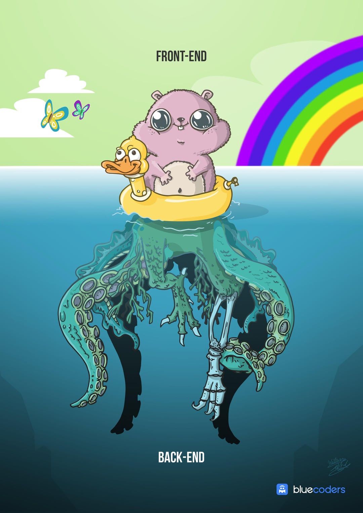

In web design theory, there is a difference between mobile-first and mobile-friendly interfaces.
In the same sense, FeenoX is cloud first and not just cloud friendly.

But what does this mean? Let us first start with the concept of "cloud friendliness," meaning that it is _possible_ to run something on the cloud without substantial effort. This implies that a computational tool is cloud friendly if it

 #. can be executed remotely without any special care, i.e. a GNU/Linux binary ran on a server through SSH,
 #. can exploit the (in principle) unbounded resources provided by a set of networked servers, and
 #. does not need interactive input meaning that, once launched, it can finish without needing further human intervention.

Yet, a cloud-first tool needs to take account other more profound concepts as well in early-stage design decisions.
In software development, the modification of an existing desktop-based piece of software to allow remote execution is called "cloud-enabling." In words of a senior manager, "cloud development is the opposite of desktop development."
So starting from scratch a cloud-first tool is a far better approach than refactoring an existing desktop program to make it cloud friendly.

For instance, to make proper use of the computational resources available in remote servers launched on demand, it is needed to

 * have all the hosts in a particular network
 * configure a proper domain name service
 * design shared network file systems
 * etc.
 
Instead of having to manually perform this set up each time a calculation is needed, one can automatize the workflow with _ad-hoc_ scripts acting as "thin clients" which would, for instance,

 * launch and configure the remote computing instances, optionally using containerization technology
 * send the input files needed by the computational tools
 * launch the actual computational tools (Gmsh, FeenoX, etc.) over the instances, e.g. using `mpiexec` or similar to be able to either
   a. to reduce the wall time needed to solve a problem, and/or
   b. to allow the solution of large problems that do not fit into a single copmuter
 * monitor and communicate with the solver as the calculation progresses
 * handle eventual errors
 * get back and process the results
 
Furthermore, we could design and implement more complex clients able to handle things like

 * authentication
 * resource management (i.e. CPU hours)
 * estimation of the number and type of instances needed to solve a certain problem
 * parametric sweeps
 * optimization loops
 * conditionally-chained simulations
 * etc.

Therefore, the computational tools that would perform the actual calculations should be designed in such a way not only to allow these kind of workflows but also to make them efficient.
In fact, we say "clients" in plural because---as the Unix rule of diversity (@sec:unix-diversity) asks for--depending on the particular problem type and requirements different clients might be needed.
And since FeenoX itself is flexible enough to be able to solve not only different types of parial differential equations but also

 * different types of problems
   - coupled
   - parametric
   - optimization
   - etc.
 * in different environments
   - many small cases
   - a few big ones
   - only one but huge
   - etc.
 * under different conditions
   - in the industry by a single engineer
   - in the academy by several researchers
   - as a service in a public platform 
   - etc.

then it is expected nor to exist a one-size-fits-all solution able to handle all the combinations in an optimum way.

However, if the underlying computational tool has been carefully designed to be able to handle all these details and to be flexible enough to accommodate other eventual and/or unexpected requirements by design, then we say that the tool is "cloud first."
Throughout this SDS we thoroughly explain the features of this particular cloud-first design.
Indeed, FeenoX is essentially a back end which can work with a number of different front ends (@fig:front-back), including these thin clients and web-based interfaces (@fig:caeplex-ipad)

{#fig:front-back width=40%}

 for FeenoX. <https://www.youtube.com/watch?v=7KqiMbrSLDc>](caeplex-ipad.jpg){#fig:caeplex-ipad}
