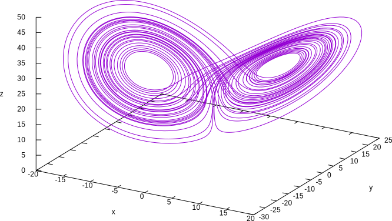

For example, let us consider the famous chaotic [Lorenz’ dynamical system](http://en.wikipedia.org/wiki/Lorenz_system). Here is one way of getting an image of the butterfly-shaped attractor using FeenoX to compute it and [gnuplot](http://www.gnuplot.info/) to draw it. Solve 

::: {.not-in-format .texi .plain .gfm}
$$
\begin{cases}
\dot{x} &= \sigma \cdot (y - x)  \\
\dot{y} &= x \cdot (r - z) - y   \\
\dot{z} &= x y - b z             \\
\end{cases}
$$
:::

::: {.in-format .texi .plain .gfm}
$$
\dot{x} = \sigma \cdot (y - x)
$$
$$
\dot{y} = x \cdot (r - z) - y
$$
$$
\dot{z} = x y - b z
$$
:::

for $0 < t < 40$ with initial conditions

::: {.not-in-format .texi .plain .gfm}
$$
\begin{cases}
x(0) = -11  \\
y(0) = -16  \\
z(0) = 22.5 \\
\end{cases}
$$
:::

::: {.in-format .texi .plain .gfm}
$$
x(0) = -11
$$
$$
y(0) = -16
$$
$$
z(0) = 22.5
$$
:::


and $\sigma=10$, $r=28$ and $b=8/3$, which are the classical parameters that generate the butterfly as presented by Edward Lorenz back in his seminal 1963 paper [Deterministic non-periodic flow](http://journals.ametsoc.org/doi/abs/10.1175/1520-0469%281963%29020%3C0130%3ADNF%3E2.0.CO%3B2).

The following ASCII input file ressembles the parameters, inital conditions and differential equations of the problem as naturally as possible:

```{.feenox include="lorenz.fee"}
```

{width_latex=100% width_html=100% width_texinfo=12cm}

Indeed, when executing FeenoX with this input file, we get four ASCII columns ($t$, $x$, $y$ and $z$) which we can then redirect to a file and plot it with a standard tool such as Gnuplot. Note the importance of relying on plain ASCII text  formats both for input and output, as recommended by the UNIX philosophy and the _rule of composition_: other programs can easily create inputs for FeenoX and other programs can easily understand FeenoX' outputs. This is essentially how UNIX filters and pipes work.


 
