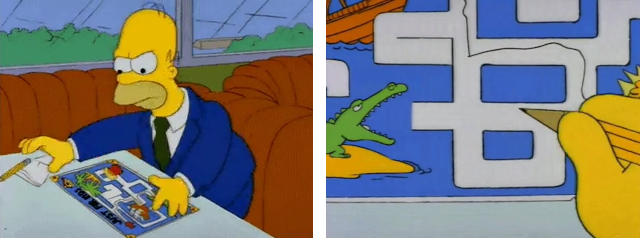
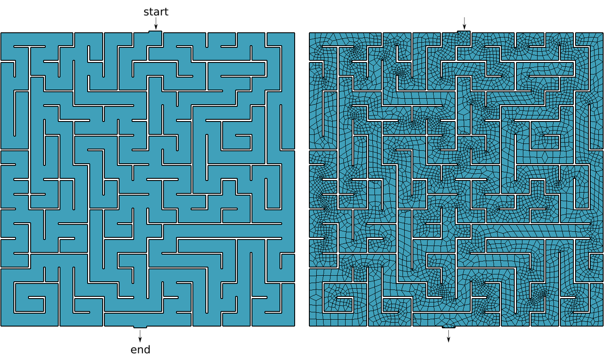
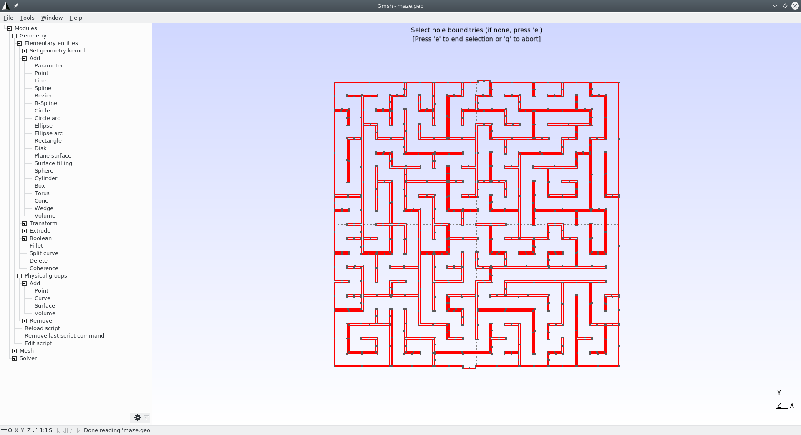
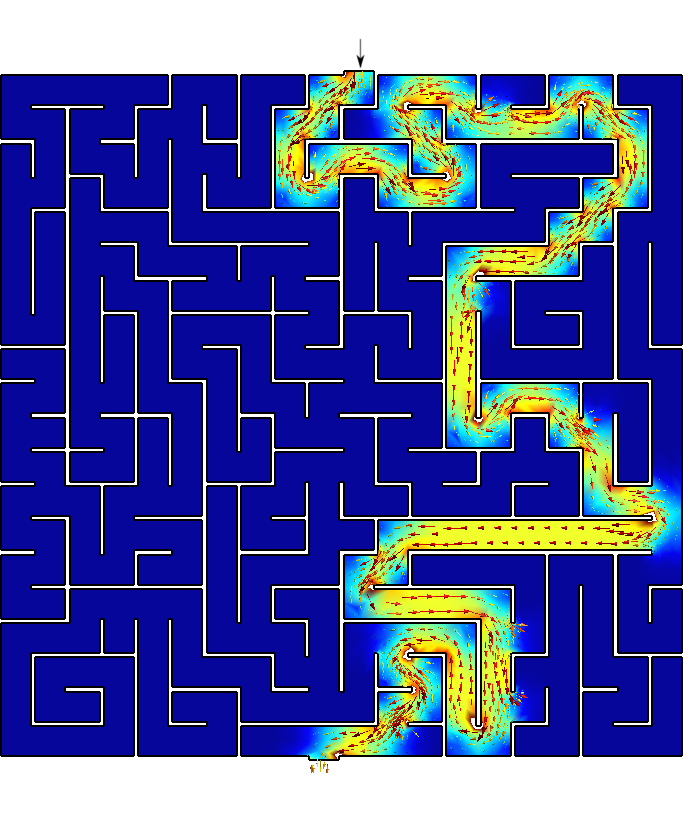

{#fig:maze-homer}

Say you are Homer Simpson and you want to solve a maze drawn in a restaurant's placemat, one where both the start and end are known beforehand as show in @fig:maze-homer. In order to avoid falling into the alligator's mouth, you can exploit the ellipticity of the Laplacian operator to solve any maze (even a hand-drawn one) without needing any fancy AI or ML algorithm. Just FeenoX and a bunch of standard open source tools to convert a bitmapped picture of the maze into an unstructured mesh.


{#fig:maze12}

 1. Go to <http://www.mazegenerator.net/>

 2. Create a maze
 
 3. Download it in PNG (@fig:maze12)
 
 4. Perform some conversions
     - PNG $\rightarrow$ PNM $\rightarrow$ SVG $\rightarrow$ DXF $\rightarrow$ GEO
 
    ```terminal
    $ wget http://www.mazegenerator.net/static/orthogonal_maze_with_20_by_20_cells.png
    $ convert orthogonal_maze_with_20_by_20_cells.png -negate maze.png
    $ potrace maze.pnm --alphamax 0  --opttolerance 0 -b svg -o maze.svg
    $ ./svg2dxf maze.svg maze.dxf
    $ ./dxf2geo maze.dxf 0.1
    ```
    
 5. Open it with Gmsh 
 
    {width=50%}\ 
 
    - Add a surface
    - Set physical curves for "start" and "end"
    
 6. Mesh it (@fig:maze12)
 
    ```terminal
    gmsh -2 maze.geo
    ```

 7. Solve $\nabla^2 \phi = 0$ with BCs

    $$
    \begin{cases}
    \phi=0 & \text{at “start”} \\
    \phi=1 & \text{at “end”} \\
    \nabla \phi \cdot \hat{\vec{n}} = 0 & \text{everywhere else} \\
    \end{cases}
    $$

    ```{.feenox include="maze.fee"}
    ```
   
    ```terminal
    $ feenox maze.fee
    $
    ```
 
 8. Open `maze-solved.msh`, go to start and follow the gradient\ $\nabla \phi$!



