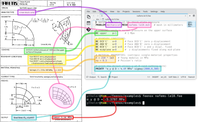

Let us solve the linear elasticity benchmark problem [NAFEMS\ LE10](https://www.nafems.org/publications/resource_center/p18/) “Thick plate pressure.” Assuming a proper mesh has already been created in Gmsh, note how well the FeenoX input file matches the problem statement:

```{.feenox include="nafems-le10.fee"}
```

The problem asks for the normal stress in the\ $y$ direction $\sigma_y$ at point\ “D,” which is what FeenoX writes (and nothing else, *rule of economy*):

```terminal
$ feenox nafems-le10.fee 
sigma_y @ D =   -5.38016        MPa
$ 
```

Also note that since there is only one material there is no need to do an explicit link between material properties and physical volumes in the mesh (*rule of simplicity*). And since the properties are uniform and isotropic, a single global scalar for\ $E$ and a global single scalar for\ $\nu$ are enough.


{width_html=100% width_latex=100% width_texinfo=15cm} 

{width_html=100% width_latex=70% width_texinfo=12cm}

For the sake of visual completeness, post-processing data with the scalar distribution of $\sigma_y$ and the vector field of displacements $[u,v,w]$ can be created by adding one line to the input file:

```feenox
WRITE_MESH nafems-le10.vtk sigmay VECTOR u v w
```

This VTK file can then be post-processed to create interactive 3D views, still screenshots, browser and mobile-friendly webGL models, etc. In particular, using [Paraview](https://www.paraview.org) one can get a colorful bitmapped PNG (the displacements are far more interesting than the stresses in this problem).


