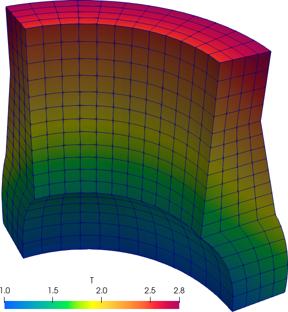
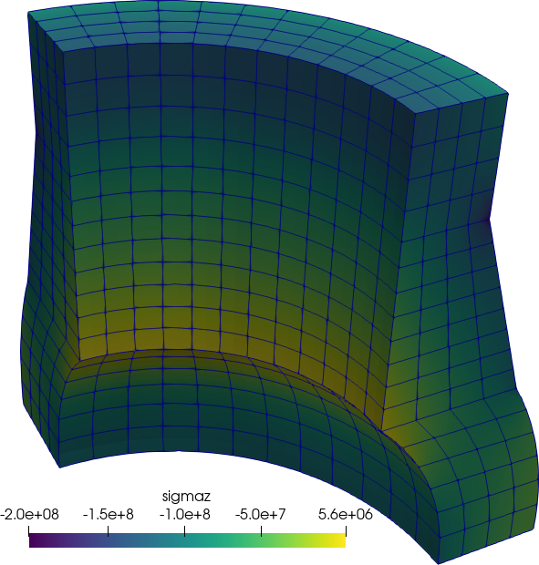

Let us consider the [NAFEMS\ LE11](https://www.nafems.org/publications/resource_center/p18/) benchmark problem titled “Solid cylinder/taper/sphere-temperature” stated in @fig:nafems-le11-problem. It consists of an axi-symmetrical geometry subject to thermal loading by a temperature distribution given by an algebraic expression. The material properties are linear, orthotropic and uniform. The boundary conditions prescribe symmetries in all directions.

{#fig:nafems-le11-problem width_html=100% width_latex=100% width_texinfo=15cm}

* Loading
   - Linear temperature gradient in the radial an axial direction

     $$T(x,y,z)~\text{[ºC]} = \left(x^2+ y^2\right)^{1/2} + z$$

* Boundary conditions
   - Symmetry on $x$-$z$ plane, i.e. zero $y$-displacement
   - Symmetry on $y$-$z$ plane, i.e. zero $x$-displacement
   - Face on $x$-$y$ plane zero $z$-displacement
   - Face $HIH'I'$ zero $z$-displacement
    
* Material properties
   - Isotropic, $E=210 \times 10^3~\text{MPa}$, $\nu = 0.3$
   - Thermal expansion coefficient\ $\alpha = 2.3 \times 10^{-4}~\text{ºC}^{-1}$
    
* Output
   - Direct stress\ $\sigma_{zz}$ at point\ $A$

To solve this problem, we can use the following FeenoX input file that exactly matches the human-readable formulation:
   
```{.feenox include="nafems-le11.fee"}
```

```{.terminal}
$ time feenox nafems-le11.fee
sigma_z(A) = -105.041 MPa (target was -105 MPa)

real    0m1.766s
user    0m1.642s
sys     0m0.125s
```

::: {#fig:nafems-le11-result}
{width=48%}
{width=48%}

The NAFEMS\ LE11 problem results
:::
