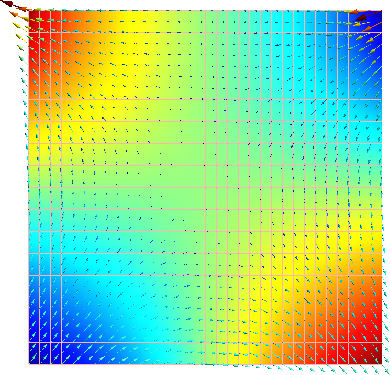
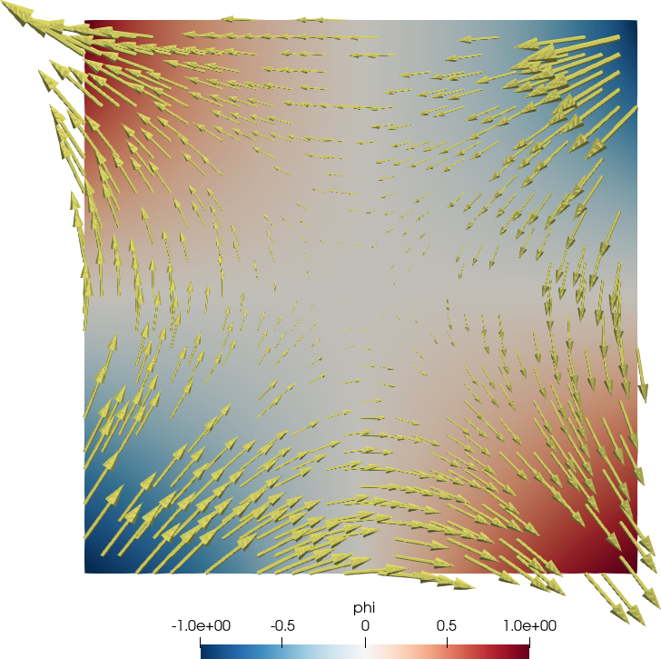

FeenoX is a computational tool that can solve engineering problems which are usually casted as differential-algebraic equations (DAEs) or partial differential equations (PDEs).
It is to finite elements programs and libraries what Markdown is to Word and TeX, respectively.
In particular, it can solve

 * dynamical systems defined by a set of user-provided DAEs (such as plant control dynamics for example)
 * mechanical elasticity
 * heat conduction
 * structural modal analysis
 * neutron diffusion
 * neutron transport

FeenoX reads a plain-text input file which contains the problem definition and writes 100%-user defined results in ASCII (through `PRINT` or other user-defined output instructions within the input file). For PDE problems, it needs a reference to at least one [Gmsh](http://gmsh.info/) mesh file for the discretization of the domain. It can write post-processing views in either `.msh` or `.vtk` formats. 

Keep in mind that FeenoX is just a back end reading a set of input files and writing a set of output files following the design philosophy of UNIX (separation, composition, representation, economy, extensibility, etc). Think of it as a transfer function (or a filter in computer-science jargon) between input files and output files:

```include
transfer.md
```

Following the UNIX programming philosophy, there are no graphical interfaces attached to the FeenoX core, although a wide variety of pre and post-processors can be used with FeenoX. To illustrate the transfer-function approach, consider the following input file that solves Laplace’s equation $\nabla^2 \phi = 0$ on a square with some space-dependent boundary conditions:

::: {.not-in-format .texinfo .man}
$$
\begin{cases}
\phi(x,y) = +y & \text{for $x=-1$ (left)} \\
\phi(x,y) = -y & \text{for $x=+1$ (right)} \\
\nabla \phi \cdot \hat{\vec{n}} = \sin\left(\frac{\pi}{2} \cdot x\right) & \text{for $y=-1$ (bottom)} \\
\nabla \phi \cdot \hat{\vec{n}} =0 & \text{for $y=+1$ (top)} \\
\end{cases}
$$
:::

::: {.only-in-format .texinfo .man}
$\phi(x,y) = +y \quad$ for $x=-1$ (left)

$\phi(x,y) = -y \quad$ for $x=+1$ (right)

$\nabla \phi \cdot \hat{n} = \sin(\pi/2 x) \quad$ for $y=-1$ (bottom)

$\nabla \phi \cdot \hat{n} =0 \quad$ for $y=+1$ (top)
:::


```{.feenox include="laplace-square.fee"}
```

The `.msh` file can be post-processed with [Gmsh](http://gmsh.info/), and the `.vtk` file can be post-processed with [Paraview](https://www.paraview.org/).
See <https://www.caeplex.com> for a mobile-friendly web-based interface for solving finite elements in the cloud directly from the browser.

{width_latex=48% width_texinfo=7cm}

{width_latex=48% width_texinfo=7cm}

