#  `abs`

Returns the absolute value of the argument\ $x$.

~~~feenox
abs(x)  
~~~

::: {.not-in-format .man}
$$|x|$$
:::

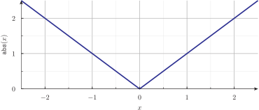{width=90%}\ 

## Example #1, abs.fee

~~~feenox
PRINT sqrt(abs(-2))

# exercise: remove the absolute value from the sqrt argument
~~~

~~~terminal
$ feenox abs.fee
1.41421
$
~~~

#  `acos`

Computes the arc in radians whose cosine is equal to the argument\ $x$.
A NaN error is raised if\ $|x|>1$.

~~~feenox
acos(x)  
~~~

::: {.not-in-format .man}
$$\arccos(x)$$
:::

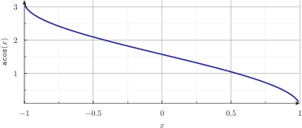{width=90%}\ 

## Example #1, acos.fee

~~~feenox
PRINT acos(0)
PRINT acos(1)
PRINT cos(acos(0.5))  acos(cos(0.5))
~~~

~~~terminal
$ feenox acos.fee
1.5708
0
0.5	0.5
$
~~~

#  `asin`

Computes the arc in radians whose sine is equal to the argument\ $x$.
A NaN error is raised if\ $|x|>1$.

~~~feenox
asin(x)  
~~~

::: {.not-in-format .man}
$$\arcsin(x)$$
:::

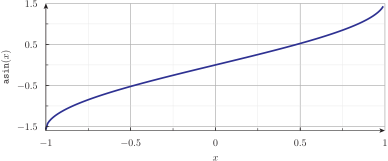{width=90%}\ 

## Example #1, asin.fee

~~~feenox
PRINT asin(0)
PRINT asin(1)
PRINT sin(asin(0.5))  asin(sin(0.5))
~~~

~~~terminal
$ feenox asin.fee
0
1.5708
0.5	0.5
$
~~~

#  `atan`

Computes, in radians, the arc tangent of the argument\ $x$.

~~~feenox
atan(x)  
~~~

::: {.not-in-format .man}
$$\arctan(x)$$
:::

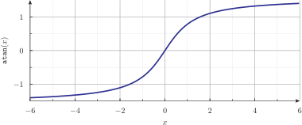{width=90%}\ 

#  `atan2`

Computes, in radians, the arc tangent of quotient\ $y/x$, using the signs of the two arguments
to determine the quadrant of the result, which is in the range $[-\pi,\pi]$.

~~~feenox
atan2(y,x)  
~~~

::: {.not-in-format .man}
$$\arctan(y/x)$$
:::

## Example #1, atan.fee

~~~feenox
PRINT atan(-0.5)  mod(atan(-0.5),2*pi)-pi
~~~

~~~terminal
$ feenox atan.fee
-0.463648	2.67795
$
~~~

## Example #2, atan2.fee

~~~feenox
PRINT atan2(1,-2) mod(atan(-0.5),2*pi)-pi
~~~

~~~terminal
$ feenox atan2.fee
2.67795	2.67795
$
~~~

#  `ceil`

Returns the smallest integral value not less than the argument\ $x$.

~~~feenox
ceil(x)  
~~~

::: {.not-in-format .man}
$$\lceil x \rceil$$
:::

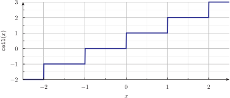{width=90%}\ 

#  `clock`

Returns the value of a certain clock in seconds measured from a certain (but specific) milestone.
The kind of clock and the initial milestone depend on the optional integer argument\ $f$.
It defaults to one, meaning `CLOCK_MONOTONIC`.
The list and the meanings of the other available values for\ $f$ can be checked
in the `clock_gettime (2)` system call manual page.

~~~feenox
clock([f])  
~~~

## Example #1, clock.fee

~~~feenox
t1 = clock()
PRINT "doing something in between"
t2 = clock()
PRINT "difference" t2-t1 "[seconds]"
~~~

~~~terminal
$ feenox clock.fee
doing something in between
difference	5.3888e-05	[seconds]
$
~~~

#  `cos`

Computes the cosine of the argument\ $x$, where\ $x$ is in radians.
A cosine wave can be generated by passing as the argument\ $x$
a linear function of time such as\ $\omega t+\phi$, where $\omega$ controls 
the frequency of the wave and $\phi$ controls its phase.

~~~feenox
cos(x)  
~~~

::: {.not-in-format .man}
$$\cos(x)$$
:::

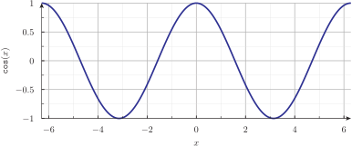{width=90%}\ 

#  `cosh`

Computes the hyperbolic cosine of the argument\ $x$, where\ $x$ is in radians.

~~~feenox
cosh(x)  
~~~

::: {.not-in-format .man}
$$\cosh(x)$$
:::

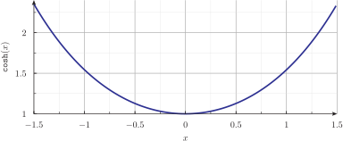{width=90%}\ 

#  `cpu_time`

Returns the CPU time used by FeenoX, in seconds.
If the optional argument `f` is not provided  or it is zero (default),
the sum of times for both user-space and kernel-space usage is returned.
For `f=1` only user time is returned.
For `f=2` only system time is returned.

~~~feenox
cpu_time([f])  
~~~

#  `d_dt`

Computes the time derivative of the expression given in the argument\ $x$
during a transient problem
using the difference between the value of the signal in the previous time step
and the actual value divided by the time step\ $\delta t$ stored in `dt`.
The argument\ $x$ does not neet to be a variable, it can be an expression
involving one or more variables that change in time.
For $t=0$, the return value is zero.
Unlike the functional `derivative`, the full dependence of these variables with time
does not need to be known beforehand, i.e. the expression `x` might involve variables
read from a shared-memory object at each time step.

~~~feenox
d_dt(x)  
~~~

::: {.not-in-format .man}
$$\frac{x(t) - x(t-\Delta t)}{\Delta t} \approx \frac{d}{dt} \Big( x (t) \Big)$$
:::

## Example #1, d_dt.fee

~~~feenox
end_time = 5
dt = 1/10
t0 = 0.5
r = heaviside(t-t0)

PRINT t r lag(r,1) d_dt(lag(r,1)) r*exp(-(t-t0)) HEADER

# exercise: plot output for different values of dt
~~~

~~~terminal
$ feenox d_dt.fee > d_dt.dat
$
~~~

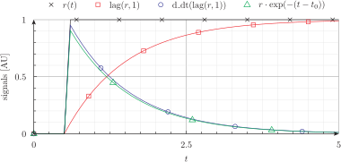{width=90%}\ 

#  `deadband`

Filters the first argument\ $x$ with a deadband centered at zero with an amplitude
given by the second argument $a$.

~~~feenox
deadband(x, a)  
~~~

::: {.not-in-format .man}
$$\begin{cases} 0 & \text{if $| x | \leq a$} \\ x + a & \text{if $x < a$} \\ x - a & \text{if $x > a$} \end{cases}$$
:::

#  `equal`

Checks if the two first expressions $a$ and $b$ are equal, up to the tolerance
given by the third optional argument $\epsilon$. If either $|a|>1$ or $|b|>1$,
the arguments are compared using GSL's `gsl_fcmp`, otherwise the
absolute value of their difference is compared against $\epsilon$. This function
returns zero if the arguments are not equal and one otherwise.
Default value for $\epsilon = 10^{-9}$.

~~~feenox
equal(a, b, [eps])  
~~~

::: {.not-in-format .man}
$$\begin{cases} 1 & \text{if $a = b$} \\ 0 & \text{if $a \neq b$} \end{cases}$$
:::

#  `exp`

Computes the exponential function the argument\ $x$, i.e. the base of the
natural logarithm\ $e$ raised to the\ $x$-th power.

~~~feenox
exp(x)  
~~~

::: {.not-in-format .man}
$$e^x$$
:::

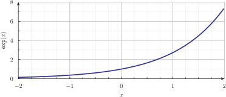{width=90%}\ 

## Example #1, exp.fee

~~~feenox
PHASE_SPACE x
end_time = 1
alpha = 1.8
x_0 = 1.2
y(t) := x_0 * exp(-alpha*t)

x_dot .= -alpha*x

PRINT t x y(t) y(t)-x 
~~~

~~~terminal
$ feenox exp.fee > exp.dat
$
~~~

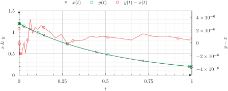{width=90%}\ 

#  `expint1`

Computes the first exponential integral function of the argument\ $x$.
If\ $x$ is zero, a NaN error is issued.

~~~feenox
expint1(x)  
~~~

::: {.not-in-format .man}
$$\text{Re} \left[ \int_1^{\infty}\! \frac{\exp(-xt)}{t} \, dt \right]$$
:::

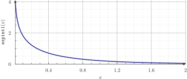{width=90%}\ 

## Example #1, expint1.fee

~~~feenox
Def(x) := integral(exp(-x*t)/t,t,1,99)
PRINT_FUNCTION Def expint1(x) MIN 1e-2 MAX 2.0 STEP 1e-2 HEADER
~~~

~~~terminal
$ feenox expint1.fee > expint1.dat
$
~~~

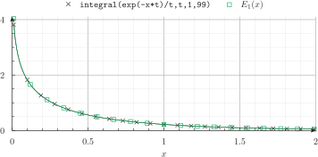{width=90%}\ 

#  `expint2`

Computes the second exponential integral function of the argument\ $x$.

~~~feenox
expint2(x)  
~~~

::: {.not-in-format .man}
$$\text{Re} \left[ \int_1^{\infty}\! \frac{\exp(-xt)}{t^2} \, dt \right]$$
:::

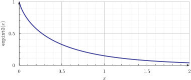{width=90%}\ 

#  `expint3`

Computes the third exponential integral function of the argument\ $x$.

~~~feenox
expint3(x)  
~~~

::: {.not-in-format .man}
$$\text{Re} \left[ \int_1^{\infty}\! \frac{\exp(-xt)}{t^3} \, dt \right]$$
:::

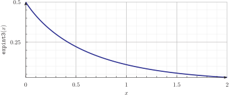{width=90%}\ 

#  `expintn`

Computes the $n$-th exponential integral function of the argument\ $x$.
If\ $n$ is zero or one and\ $x$ is zero, a NaN error is issued.

~~~feenox
expintn(n,x)  
~~~

::: {.not-in-format .man}
$$\text{Re} \left[ \int_1^{\infty}\! \frac{\exp(-xt)}{t^n} \, dt \right]$$
:::

#  `floor`

Returns the largest integral value not greater than the argument\ $x$.

~~~feenox
floor(x)  
~~~

::: {.not-in-format .man}
$$\lfloor x \rfloor$$
:::

{width=90%}\ 

#  `heaviside`

Computes the zero-centered Heaviside step function of the argument\ $x$.
If the optional second argument $\delta$ is provided, the discontinuous
step at\ $x=0$ is replaced by a ramp starting at\ $x=0$ and finishing at\ $x=\delta$.

~~~feenox
heaviside(x, [delta])  
~~~

::: {.not-in-format .man}
$$\begin{cases} 0 & \text{if $x < 0$} \\ x / \delta & \text{if $0 < x < \delta$} \\ 1 & \text{if $x > \delta$} \end{cases}$$
:::

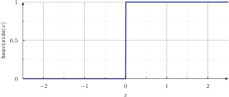{width=90%}\ 

## Example #1, heaviside.fee

~~~feenox
end_time = 1

PRINT t heaviside(t-0.5,0.25)

# exercise: what happens if the second argument is negative?
~~~

~~~terminal
$ feenox heaviside.fee > heaviside.dat
$
~~~

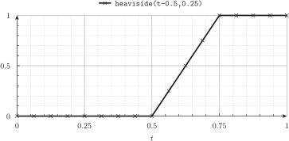{width=90%}\ 

#  `if`

Performs a conditional testing of the first argument $a$, and returns either the
second optional argument $b$ if $a$ is different from zero or the third optional argument $c$
if $a$ evaluates to zero. The comparison of the condition $a$ with zero is performed
within the precision given by the optional fourth argument $\epsilon$.
If the second argument $c$ is not given and $a$ is not zero, the function returns one.
If the third argument $c$ is not given and $a$ is zero, the function returns zero.
The default precision is $\epsilon = 10^{-9}$.
Even though `if` is a logical operation, all the arguments and the returned value
are double-precision floating point numbers.

~~~feenox
if(a, [b], [c], [eps])  
~~~

::: {.not-in-format .man}
$$\begin{cases} b & \text{if $|a|<\epsilon$} \\ c & \text{otherwise} \end{cases}$$
:::

#  `integral_dt`

Computes the time integral of the expression given in the argument\ $x$
during a transient problem with the trapezoidal rule
using the value of the signal in the previous time step and the current value.
At $t = 0$ the integral is initialized to zero.
Unlike the functional `integral`, the full dependence of these variables with time
does not need to be known beforehand, i.e. the expression `x` might involve variables
read from a shared-memory object at each time step.

~~~feenox
integral_dt(x)  
~~~

::: {.not-in-format .man}
$$z^{-1}\left[ \int_0^{t-\Delta t} x(t') \, dt' \right] +  \frac{x(t) + x(t-\Delta t)}{2} \, \Delta t \approx \int_0^{t} x(t') \, dt'$$
:::

## Example #1, integral_dt.fee

~~~feenox
end_time = 2*pi
dt = end_time/100

y = sin(t) + random_gauss(0,0.05,0)

PRINT t y integral_dt(y)

# exercise: compute also  the instantaneous 
# mean value of the signal y(t)
~~~

~~~terminal
$ feenox integral_dt.fee > integral_dt.dat
$
~~~

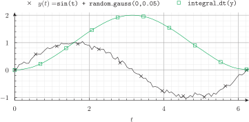{width=90%}\ 

#  `integral_euler_dt`

Idem as `integral_dt` but uses the backward Euler rule to update the instantaenous integral value.
This function is provided in case this particular way
of approximating time integrals is needed,
for instance to compare FeenoX solutions with other computer codes.
In general, it is recommended to use `integral_dt`.

~~~feenox
integral_euler_dt(x)  
~~~

::: {.not-in-format .man}
$$z^{-1}\left[ \int_0^{t-\Delta t} x(t') \, dt' \right] +   x(t) \, \Delta t \approx \int_0^{t} x(t') \, dt'$$
:::

#  `is_even`

Returns one if the argument\ $x$ rounded to the nearest integer is even.

~~~feenox
is_even(x)  
~~~

::: {.not-in-format .man}
$$ \begin{cases}1 &\text{if $x$ is even} \\ 0 &\text{if $x$ is odd} \end{cases}$$
:::

#  `is_in_interval`

Returns true if the argument\ $x$ is in the interval\ $[a,b)$, 
i.e. including\ $a$ but excluding\ $b$.

~~~feenox
is_in_interval(x, a, b)  
~~~

::: {.not-in-format .man}
$$\begin{cases} 1 & \text{if $a \leq x < b$} \\ 0 & \text{otherwise} \end{cases}$$
:::

#  `is_odd`

Returns one if the argument\ $x$ rounded to the nearest integer is odd.

~~~feenox
is_odd(x)  
~~~

::: {.not-in-format .man}
$$ \begin{cases}1 &\text{if $x$ is odd} \\ 0 &\text{if $x$ is even} \end{cases}$$
:::

#  `j0`

Computes the regular cylindrical Bessel function of zeroth order evaluated at the argument\ $x$.

~~~feenox
j0(x)  
~~~

::: {.not-in-format .man}
$$J_0(x)$$
:::

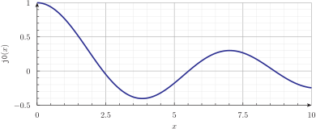{width=90%}\ 

## Example #1, j0.fee

~~~feenox
VAR nu
nu0 = root(j0(nu), nu, 0, 3)
PRINT "J0's first zero is" nu0 SEP " "
PRINT "Indeed, J0(nu0) is equal to" j0(nu0) SEP " "
~~~

~~~terminal
$ feenox j0.fee
J0's first zero is 2.40483
Indeed, J0(nu0) is equal to 2.32985e-10
$
~~~

#  `lag`

Filters the first argument\ $x(t)$ with a first-order lag of characteristic time $\tau$,
i.e. this function applies the transfer function\ $G(s) = \frac{1}{1 + s\tau}$
to the time-dependent signal\ $x(t)$ to obtain a filtered signal\ $y(t)$, 
by assuming that it is constant during the time 
interval\ $[t-\Delta t,t]$ and using the analytical solution of the differential equation
 for that case at\ $t = \Delta t$ with the initial condition\ $y(0) = y(t-\Delta t)$.

~~~feenox
lag(x, tau)  
~~~

::: {.not-in-format .man}
$$x(t) - \Big[ x(t) - y(t-\Delta t) \Big] \cdot \exp\left(-\frac{\Delta t}{\tau}\right)$$
:::

#  `lag_bilinear`

Filters the first argument\ $x(t)$ with a first-order lag of characteristic time $\tau$
to the time-dependent signal\ $x(t)$ by using the bilinear transformation formula.

~~~feenox
lag_bilinear(x, tau)  
~~~

::: {.not-in-format .man}
$$x(t-\Delta t) \cdot \left[ 1 - \frac{\Delta t}{2\tau} \right] + \left[ \frac{x(t) + x(t - \Delta t)}{1 + \frac{\Delta t}{2\tau}}\right] \cdot \frac{\Delta t}{2\tau}$$
:::

#  `lag_euler`

Filters the first argument\ $x(t)$ with a first-order lag of characteristic time $\tau$
to the time-dependent signal\ $x(t)$ by using the Euler forward rule.

~~~feenox
lag_euler(x, tau)  
~~~

::: {.not-in-format .man}
$$x(t-\Delta t) + \Big[ x(t) - x(t - \Delta t) \Big] \cdot \frac{\Delta t}{\tau}$$
:::

#  `last`

Returns the value the variable\ $x$ had in the previous time step.
This function is equivalent to the\ $Z$-transform operator "delay" denoted by\ $z^{-1}\left[ x\right]$.
For\ $t=0$ the function returns the actual value of\ $x$.
The optional flag\ $p$ should be set to one if the reference to `last`
is done in an assignment over a variable that already appears inside
expression\ $x$ such as `x = last(x)`. See example number 2.

~~~feenox
last(x,[p])  
~~~

::: {.not-in-format .man}
$$z^{-1}\left[ x \right] = x(t-\Delta t)$$
:::

## Example #1, last1.fee

~~~feenox
static_steps = 5
end_time = 1
dt = 0.1

IF in_static
  PRINT step_static last(step_static) last(last(step_static))
ENDIF
IF done_static
  PRINT t last(t) last(last(1-t))
ENDIF  
~~~

~~~terminal
$ feenox last1.fee
1	1	1
2	1	1
3	2	1
4	3	2
5	4	3
0	0	1
0.1	0	1
0.2	0.1	1
0.3	0.2	0.9
0.4	0.3	0.8
0.5	0.4	0.7
0.6	0.5	0.6
0.7	0.6	0.5
0.8	0.7	0.4
0.9	0.8	0.3
1	0.9	0.2
$
~~~

## Example #2, last2.fee

~~~feenox
end_time = 1
dt = 0.1

y = y + 1
z  = last(z,1) + 1
z' = last(z')  + 1

PRINT t %g y z z'
~~~

~~~terminal
$ feenox last2.fee
0	1	1	1
0.1	2	2	1
0.2	3	3	2
0.3	4	4	2
0.4	5	5	3
0.5	6	6	3
0.6	7	7	4
0.7	8	8	4
0.8	9	9	5
0.9	10	10	5
1	11	11	6
$
~~~

#  `limit`

Limits the first argument\ $x$ to the interval $[a,b]$. The second argument $a$ should
be less than the third argument $b$.

~~~feenox
limit(x, a, b)  
~~~

::: {.not-in-format .man}
$$\begin{cases} a & \text{if $x < a$} \\ x & \text{if $a \leq x \leq b$} \\ b & \text{if $x > b$} \end{cases}$$
:::

#  `limit_dt`

Limits the value of the first argument\ $x(t)$ so to that its time derivative
is bounded to the interval $[a,b]$. The second argument $a$ should
be less than the third argument $b$.

~~~feenox
limit_dt(x, a, b)  
~~~

::: {.not-in-format .man}
$$\begin{cases} x(t) & \text{if $a \leq dx/dt \leq b$} \\ x(t-\Delta t) + a \cdot \Delta t & \text{if $dx/dt < a$} \\ x(t-\Delta t) + b \cdot \Delta t & \text{if $dx/dt > b$} \end{cases}$$
:::

#  `log`

Computes the natural logarithm of the argument\ $x$. If\ $x$ is zero or negative,
a NaN error is issued.

~~~feenox
log(x)  
~~~

::: {.not-in-format .man}
$$\ln(x)$$
:::

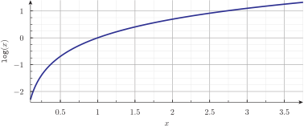{width=90%}\ 

## Example #1, log1.fee

~~~feenox
end_time = 1
dt = 1/50

x = d_dt(log(1+t))
y = 1/(1+t)

PRINT t x y y-x 

# exercise: why does this example give a bigger error than the exp.fee example?
~~~

~~~terminal
$ feenox log1.fee > log1.dat
$
~~~

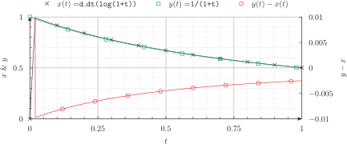{width=90%}\ 

## Example #2, log2.fee

~~~feenox
VAR t'
x(t) := derivative(log(1+t'), t', t)
y(t) := 1/(1+t)

PRINT_FUNCTION x y y(t)-x(t) MIN 0 MAX 1 NSTEPS 50

# exercise: why does this example give a smaller error than the exp.fee example?
~~~

~~~terminal
$ feenox log2.fee > log2.dat
$
~~~

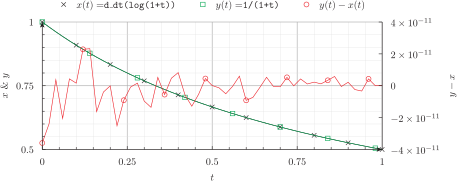{width=90%}\ 

#  `mark_max`

Returns the integer index $i$ of the maximum of the arguments\ $x_i$ provided. Currently only maximum of ten arguments can be provided.

~~~feenox
mark_max(x1, x2, [...], [x10])  
~~~

::: {.not-in-format .man}
$$ i / \max \Big (x_1, x_2, \dots, x_{10} \Big) = x_i$$
:::

#  `mark_min`

Returns the integer index $i$ of the minimum of the arguments\ $x_i$ provided. Currently only maximum of ten arguments can be provided.

~~~feenox
mark_max(x1, x2, [...], [x10])  
~~~

::: {.not-in-format .man}
$$ i / \min \Big (x_1, x_2, \dots, x_{10} \Big) = x_i$$
:::

#  `max`

Returns the maximum of the arguments\ $x_i$ provided. Currently only maximum of ten arguments can be given.

~~~feenox
max(x1, x2, [...], [x10])  
~~~

::: {.not-in-format .man}
$$ \max \Big (x_1, x_2, \dots, x_{10} \Big)$$
:::

#  `memory`

Returns the maximum memory (resident set size) used by FeenoX, in Gigabytes.

~~~feenox
memory()  
~~~

#  `min`

Returns the minimum of the arguments\ $x_i$ provided. Currently only maximum of ten arguments can be given.

~~~feenox
min(x1, x2, [...], [x10])  
~~~

::: {.not-in-format .man}
$$ \min \Big (x_1, x_2, \dots, x_{10} \Big)$$
:::

#  `mod`

Returns the remainder of the division between the first argument\ $a$ and the
second one\ $b$. Both arguments may be non-integral.

~~~feenox
mod(a, b)  
~~~

::: {.not-in-format .man}
$$a - \left\lfloor \frac{a}{b} \right\rfloor \cdot b$$
:::

#  `not`

Returns one if the first argument\ $x$ is zero and zero otherwise.
The second optional argument $\epsilon$ gives the precision of the 
"zero" evaluation. If not given, default is $\epsilon = 10^{-9}$.

~~~feenox
not(x, [eps])  
~~~

::: {.not-in-format .man}
$$ \begin{cases}1 &\text{if $|x| < \epsilon$} \\ 0 &\text{otherwise} \end{cases}$$
:::

#  `random`

Returns a random real number uniformly distributed between the first
real argument\ $x_1$ and the second one\ $x_2$.
If the third integer argument $s$ is given, it is used as the seed and thus
repetitive sequences can be obtained. If no seed is provided, the current time
(in seconds) plus the internal address of the expression is used. Therefore,
two successive calls to the function without seed (hopefully) do not give the same result.
This function uses a second-order multiple recursive generator described by
Knuth in Seminumerical Algorithms, 3rd Ed., Section 3.6.

~~~feenox
random(x1, x2, [s])  
~~~

::: {.not-in-format .man}
$$ x_1 + r \cdot (x_2-x_1) \quad \quad 0 \leq r < 1$$
:::

#  `random_gauss`

Returns a random real number with a Gaussian distribution with a mean
equal to the first argument\ $x_1$ and a standard deviation equatl to the second one\ $x_2$.
If the third integer argument $s$ is given, it is used as the seed and thus
repetitive sequences can be obtained. If no seed is provided, the current time
(in seconds) plus the internal address of the expression is used. Therefore,
two successive calls to the function without seed (hopefully) do not give the same result.
This function uses a second-order multiple recursive generator described by
Knuth in Seminumerical Algorithms, 3rd Ed., Section 3.6.

~~~feenox
random_gauss(x1, x2, [s])  
~~~

#  `round`

Rounds the argument\ $x$ to the nearest integer. Halfway cases are rounded away from zero.

~~~feenox
round(x)  
~~~

::: {.not-in-format .man}
$$\begin{cases} \lceil x \rceil & \text{if $\lceil x \rceil - x < 0.5$} \\ \lceil x \rceil & \text{if $\lceil x \rceil - x = 0.5 \wedge x > 0$} \\ \lfloor x \rfloor & \text{if $x-\lfloor x \rfloor < 0.5$} \\ \lfloor x \rfloor & \text{if $x-\lfloor x \rfloor = 0.5 \wedge x < 0$} \end{cases}$$
:::

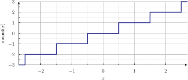{width=90%}\ 

#  `sawtooth_wave`

Computes a sawtooth wave between zero and one with a period equal to one.
As with the sine wave, a sawtooh wave can be generated by passing as the argument\ $x$
a linear function of time such as\ $\omega t+\phi$, where\ $\omega$ controls 
the frequency of the wave and $\phi$ controls its phase.

~~~feenox
sawtooth_wave(x)  
~~~

::: {.not-in-format .man}
$$x - \lfloor x \rfloor$$
:::

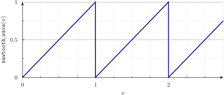{width=90%}\ 

## Example #1, sawtooth_wave.fee

~~~feenox
end_time = 10
dt = 1e-2

r = 2*sawtooth_wave(0.2*t + 0.5) - 1
y = lag(r, 0.5)

PRINT t r y
~~~

~~~terminal
$ feenox sawtooth_wave.fee > sawtooth_wave.dat
$
~~~

{width=90%}\ 

#  `sgn`

Returns minus one, zero or plus one depending on the sign of the first argument\ $x$.
The second optional argument $\epsilon$ gives the precision of the "zero"
evaluation. If not given, default is $\epsilon = 10^{-9}$.

~~~feenox
sgn(x, [eps])  
~~~

::: {.not-in-format .man}
$$ \begin{cases}-1 &\text{if $x \le -\epsilon$} \\ 0 &\text{if $|x| < \epsilon$} \\ +1 &\text{if $x \ge +\epsilon$} \end{cases}$$
:::

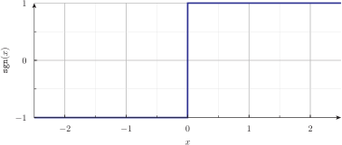{width=90%}\ 

#  `sin`

Computes the sine of the argument\ $x$, where\ $x$ is in radians.
A sine wave can be generated by passing as the argument\ $x$
a linear function of time such as\ $\omega t+\phi$, where\ $\omega$ controls the frequency of the wave
and\ $\phi$ controls its phase.

~~~feenox
sin(x)  
~~~

::: {.not-in-format .man}
$$\sin(x)$$
:::

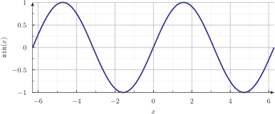{width=90%}\ 

## Example #1, sin.fee

~~~feenox
PRINT sin(1)
PRINT sqrt(1-cos(1)^2)
~~~

~~~terminal
$ feenox sin.fee
0.841471
0.841471
$
~~~

#  `sinh`

Computes the hyperbolic sine of the argument\ $x$, where\ $x$ is in radians.

~~~feenox
sinh(x)  
~~~

::: {.not-in-format .man}
$$\sinh(x)$$
:::

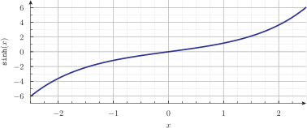{width=90%}\ 

#  `sqrt`

Computes the positive square root of the argument\ $x$.
If\ $x$ is negative, a NaN error is issued.

~~~feenox
sqrt(x)  
~~~

::: {.not-in-format .man}
$$+\sqrt{x}$$
:::

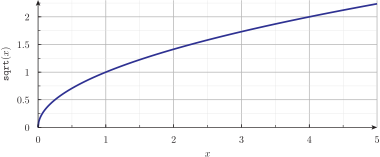{width=90%}\ 

#  `square_wave`

Computes a square function between zero and one with a period equal to one.
The output is one for $0 < x < 1/2$ and zero for $1/2 \leq x < 1$.
As with the sine wave, a square wave can be generated by passing as the argument\ $x$
a linear function of time such as\ $\omega t+\phi$, where\ $\omega$ 
controls the frequency of the wave and\ $\phi$ controls its phase.

~~~feenox
square_wave(x)  
~~~

::: {.not-in-format .man}
$$\begin{cases} 1 & \text{if $x - \lfloor x \rfloor < 0.5$} \\ 0 & \text{otherwise} \end{cases}$$
:::

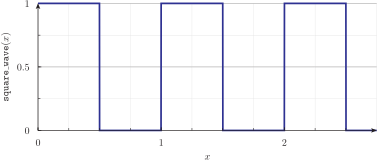{width=90%}\ 

## Example #1, square_wave.fee

~~~feenox
end_time = 10
dt = 1e-2

r = 2*square_wave(0.2*t - 0.1) - 1
y = lag(r, 0.5)

PRINT t r y
~~~

~~~terminal
$ feenox square_wave.fee > square_wave.dat
$
~~~

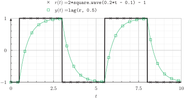{width=90%}\ 

#  `tan`

Computes the tangent of the argument\ $x$, where\ $x$ is in radians.

~~~feenox
tan(x)  
~~~

::: {.not-in-format .man}
$$ \tan(x)$$
:::

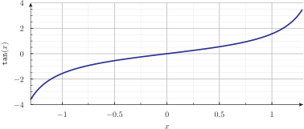{width=90%}\ 

#  `tanh`

Computes the hyperbolic tangent of the argument\ $x$, where\ $x$ is in radians.

~~~feenox
tanh(x)  
~~~

::: {.not-in-format .man}
$$\tanh(x)$$
:::

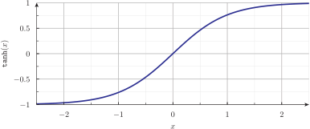{width=90%}\ 

#  `threshold_max`

Returns one if the first argument\ $x$ is greater than the threshold given by
the second argument $a$, and \textit{exactly} zero otherwise. If the optional
third argument $b$ is provided, an hysteresis of width $b$ is needed in order
to reset the function value. Default is no hysteresis, i.e. $b=0$.

~~~feenox
threshold_max(x, a, [b])  
~~~

::: {.not-in-format .man}
$$\begin{cases} 1 & \text{if $x > a$} \\ 0 & \text{if $x < a-b$} \\ \text{last value of $y$} & \text{otherwise} \end{cases}$$
:::

#  `threshold_min`

Returns one if the first argument\ $x$ is less than the threshold given by
the second argument $a$, and \textit{exactly} zero otherwise. If the optional
third argument $b$ is provided, an hysteresis of width $b$ is needed in order
to reset the function value. Default is no hysteresis, i.e. $b=0$.

~~~feenox
threshold_min(x, a, [b])  
~~~

::: {.not-in-format .man}
$$\begin{cases} 1 & \text{if $x < a$} \\ 0 & \text{if $x > a+b$} \\ \text{last value of $y$} & \text{otherwise} \end{cases}$$
:::

#  `triangular_wave`

Computes a triangular wave between zero and one with a period equal to one.
As with the sine wave, a triangular wave can be generated by passing as the argument\ $x$
a linear function of time such as\ $\omega t+\phi$, where\ $\omega$
controls the frequency of the wave and\ $\phi$ controls its phase.

~~~feenox
triangular_wave(x)  
~~~

::: {.not-in-format .man}
$$\begin{cases} 2 (x - \lfloor x \rfloor) & \text{if $x - \lfloor x \rfloor < 0.5$} \\ 2 [1-(x - \lfloor x \rfloor)] & \text{otherwise} \end{cases}$$
:::

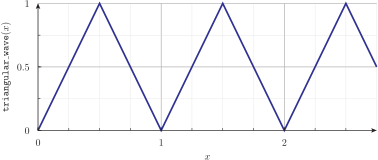{width=90%}\ 

#  `wall_time`

Returns the time ellapsed since the invocation of FeenoX, in seconds.

~~~feenox
wall_time()  
~~~

