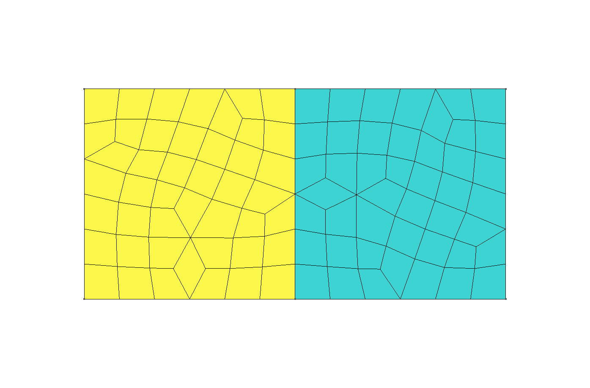

---
title: FeenoX Software Design Specification
lang: en-US
abstract: This Software Design Specifications (SDS) document applies to a fictitious Software Requirement Specifications (SRS) document. The latter can be seen as a request for quotation and the former as an offer for the tender. Each section  of this SDS addresses one section of the SRS. The original text from the SRS is shown quoted at the very beginning before the actual SDS content.
number-sections: true
toc: true
...

# Introduction {#sec:introduction}

> ```include
> 100-introduction.md
> ```

Besides noting that software being _free_ (regarding freedom, not price) does not imply the same as being _open source_, the requirement is clear in that the tool has to be both _free_ and _open source_, a combination which is usually called [FOSS](https://en.wikipedia.org/wiki/Free_and_open-source_software). This condition leaves all of the well-known non-free (i.e. wrongly-called "commercial") finite-element solvers in the market (NASTRAN, Abaqus, ANSYS, Midas, etc.) out of the tender.

```include
licensing.md
```

## Objective {#sec:objective}

> ```include
> 110-objective.md
> ```

The choice of the initial supported features is based on the types of problem that the FeenoX' precursor codes (namely wasora, Fino and milonga, referred to as "previous versions" from now ow) already have been supporting since more than ten years now. It is also a first choice so scope can be bounded. A subsequent road map and release plans can be designed as requested. FeenoX' first version includes a subset of the required functionality, namely

 * open and closed-loop dynamical systems
 * Laplace/Poisson/Helmholtz equations
 * heat conduction
 * mechanical elasticity
 * structural modal analysis
 * multi-group neutron transport and diffusion
 
FeenoX is designed to be developed and executed under GNU/Linux, which is the architecture of more than 95% of the internet servers which we collectively call “the cloud.” It should be noted that GNU/Linux is a POSIX-compliant version of UNIX and that FeenoX follows the rules of UNIX philosophy for the actual computational implementation. Besides POSIX, as explained further below, FeenoX also uses MPI which is a well-known industry standard for massive parallel executions of processes, both in multi-core hosts and multi-hosts environments. Finally, if performance and/or scalability are not important issues, FeenoX can be run in a (properly cooled) local PC or laptop.

The requirement to run in the cloud and scale up as needed rules out some of the FOSS solvers available online, such as CalculiX.

## Scope {#sec:scope}

> ```include
> 120-scope.md
> ```


Indeed, FeenoX is designed to work very much like a transfer function between one (or more) files and zero or more output files:

```include
transfer.md
```

For example, let us consider the famous chaotic [Lorenz’ dynamical system](http://en.wikipedia.org/wiki/Lorenz_system)---the one of the butterfly---with FeenoX.

```include
lorenz.md
```


As already stated, FeenoX is designed and implemented following the UNIX philosophy in general and Eric Raymond's 17 Unix Rules ([sec:unix]) in particular. One of the main ideas is the rule of _separation_ that essentially implies to separate mechanism from policy, that in the computational engineering world translates into separating the frontend from the backend. Even though most FEA programs eventually separate the interface from the solver up to some degree, there are cases in which they are still dependent such that changing the former needs updating the latter.

From the very beginning, FeenoX is designed as a pure backend which should nevertheless provide appropriate mechanisms for different frontends to be able to communicate and to provide a friendly interface for the final user. Yet, the separation is complete in the sense that the nature of the frontends can radically change (say from a desktop-based point-and-click program to a web-based immersive augmented-reality application) without needing the modify the backend. Not only far more flexibility is given by following this path, but also develop efficiency and quality is encouraged since programmers working on the lower-level of an engineering tool usually do not have the skills needed to write good user-experience interfaces, and conversely.

In the very same sense, FeenoX does not discretize continuous domains for PDE problems itself, but relies on separate tools for this end. Fortunately, there already exists one meshing tool which is FOSS (GPLv2) and shares most (if not all) of the design basis principles with FeenoX: the three-dimensional finite element mesh generator [Gmsh](http://gmsh.info/).
Strictly speaking, FeenoX does not need to be used along with Gmsh but with any other mesher able to write meshes in Gmsh's format `.msh`. But since Gmsh also

 * is free and open source,
 * works also in a transfer-function-like fashion,
 * runs natively on GNU/Linux,
 * has a similar (but more comprehensive) API for Python/Julia,
 * etc.
 
it is a perfect match for FeenoX. Even more, it provides suitable domain decomposition methods (through other FOSS third-party libraries such as [Metis](http://glaros.dtc.umn.edu/gkhome/metis/metis/overview)) for scaling up large problems.

```include
le10.md
```


Even though the initial version of FeenoX does not provide an API for high-level interpreted languages such as Python or Julia, the code is written in such a way that this feature can be added without needing a major refactoring. This will allow to fully define a problem in a procedural way, increasing also flexibility.


# Architecture {#sec:architecture}

> ```include
> 200-architecutre.md
> ```

FeenoX’ main development architecture is Debian GNU/Linux running over 64-bits Intel-compatible processors. Compatibility with other operating systems and architectures is encouraged although not required. All the required dependencies are free and/or open source and already available in Debian’s official repositories and the POSIX standard is followed whenever possible. 

FeenoX is written in plain\ C conforming to the ISO\ C99 specification (plus POSIX extensions), which is a standard, mature and widely supported language with compilers for a wide variety of architectures. 
For its basic mathematical capabilities, FeenoX uses the [GNU Scientifc Library](https://www.gnu.org/software/gsl/).
For solving ODEs/DAEs, FeenoX relies on [Lawrence Livermore’s SUNDIALS library](https://computing.llnl.gov/projects/sundials/ida). For PDEs, FeenoX uses [Argonne’s PETSc library](https://www.mcs.anl.gov/petsc/). All three of them are

 * free and open source,
 * written in C (neither Fortran nor C++),
 * mature and stable,
 * actively developed and updated,
dnl * scalable through the [MPI standard](https://www.mcs.anl.gov/research/projects/mpi/standard.html),
 * very well known in the industry and academia.

Programs using both these libraries can run on either large high-performance supercomputers or low-end laptops. There are people that have been able to compile them under macOS and Windows apart from the main architecture based on GNU/Linux. Due to the way that FeenoX is designed and the policy separated from the mechanism, it is possible to control a running instance remotely from a separate client which can eventually run on a mobile device.


## Deployment {#sec:deployment}

> ```include
> 210-deployment.md
> ```


FeenoX can be compiled from its sources using the well-established `configure` & `make` procedure. The code’s source tree is hosted on Github so cloning the repository is the preferred way to obtain FeenoX, but source tarballs are periodically released too.

The configuration and compilation is based on GNU Autotools that has more than thirty years of maturity and it is the most portable way of compiling C code in a wide variety of UNIX variants. It can use the any C99-compatible C compiler (it has been tested with GNU C compiler and LLVM’s Clang compiler). 

FeenoX relies on a few open source libraries---most of them optional. The only mandatory library is the GNU Scientific Library which is part of the GNU/Linux operating system and as such is readily available in all distributions as `libgsl-dev`. The sources of the rest of the optional libraries are also widely available in most common GNU/Linux distributions:

 * [GNU Readline](https://tiswww.case.edu/php/chet/readline/rltop.html): `libreadline-dev`
 * [SUNDIALS IDA](https://computing.llnl.gov/projects/sundials/ida): `libsundials-dev`
 * [PETSc](https://www.mcs.anl.gov/petsc/): `petsc-dev`
 * [SLEPc](https://slepc.upv.es/): `slepc-dev`

Even though compiling FeenoX from sources is the recommended way to obtain the tool, since the target binary can be compiled using particularly suited compilation options, flags and optimizations (especially those related to MPI, linear algebra kernels and direct and/or iterative sparse solvers), there are also tarballs with usable binaries for some of the most common architectures---including some non-GNU/Linux variants. These binary distributions contain statically-linked executables that do not need any other shared libraries to be present on the target host, but their flexibility and efficiency is generic and far from ideal. Yet the flexibility of having an execution-ready distribution package for users that do not know how to compile C source code outweights the limited functionality and scalability of the tool.


```include
binary.md
```

```include
source.md
```

```include
git.md
```


## Execution {#sec:execution}


> ```include
> 220-execution.md
> ```

As FeenoX is designed to run as a file filter (i.e. as a transfer function between input and output files) and it explicitly avoids having a graphical interface, the binary executable works as any other UNIX terminal command. When invoked without arguments, it prints its version, one-line description and the usage options:

```{.terminal style=terminal}
esyscmd(feenox)
```

Of course the program can be executed remotely

 1. on a server through a SSH session
 2. in a container as part of a provisioning script

 
FeenoX provides mechanisms to inform its progress by writing certain information to devices or files, which in turn can be monitored remotely or even trigger server actions. This is part of the UNIX philosophy.

There are two ways of performing parametric runs in FeenoX. The first one is through the expansion of command line arguments as string literals `$1`, `$2`, etc. appearing in the input file. For example, if `expansion.fee` is

```feenox
include(parametric/hello.fee)
```

then it can be used as a custom greeting tool:

```terminal
$ feenox World
Hello World!
$ feenox Universe
Hello Universe!
```

When this feature is used in conjunction with a shell loop, flexible parametric runs are possible. Say there are two meshes of the same domain (two squares made of two different materials): one using triangles and one using quadrangles. Let us say also that it is desired to solve a non-linear thermal problem with different values for the fixed temperature on the right boundary.

:::{#fig:two-squares}
{#fig:two-squares-triang width=50%}
{#fig:two-squares-quad width=50%}

Heat conduction on two 2D squares with different temprature-depedent conductivities
:::

Consider the input file

```{.feenox style=feenox}
include(parametric/two-squares-thermal.fee)
```

and the shell script

```{.bash style=bash}
include(parametric/two-squares-thermal.sh)
```

Then it is possible to run the six combinations at once, obtaining

```{.terminal style=terminal}
$ ./two-squares-thermal.sh
1       Tright=1        0.432843
1       Tright=1        0.432965
2       Tright=2        0.767466
2       Tright=2        0.767729
3       Tright=3        1.03429
3       Tright=3        1.03464
```

This way of performing parametric studies is very flexible since the varied arguments can be either strings or numbers. Both the actual input itself and the external driver script can be tracked using version control systems, allowing for an efficient and flexible traceability scheme. This is a design feature of FeenoX, inspired by the UNIX rules of generation and of economy. 

**Cantilever beam with tet4/tet10/hex8/hex20/hex27 struct/delaunay/etc**

Max. deflection vs. element size
                vs. total DOFs
                vs. CPU  (run several times and take average and standard deviation)
                vs. memory
                
MUMPS/GAMG, local, aws, contabo

The second way of running parametric studies is by using the internal keyword `PARAMETRIC` that allows sweeping a numerical range of one or more FeenoX variables. 

**TODO**


## Efficiency {#sec:efficiency}

> ```include
> 230-efficiency.md
> ```

Solve LE10 with FeenoX & ccx, show results, CPU & memory

Include time to pre-process ccx!

SPOOLES (ccx) vs. MUMPS (feenox)

 * auto KSP/SNES
 * `--log_view`
 

cloud, rent don't buy
benchmark and comparisons

 * thermal
 * mechanical
 * modal
 
vs

 * ccx
 * sparselizard
 * elmer
 * code aster

 
## Scalability  {#sec:scalability}
 
> ```include
> 240-scalability.md
> ```

 * OpenMP in PETSc
 * Gmsh partitions
 * run something big to see how it fails
 
 * show RAM vs. nodes for mumps & gamg

## Flexibility
 
> ```include
> 250-flexibility.md
> ```

FeenoX comes from nuclear + experience (what to do and what not to do)

Materials: a material library (perhaps included in a frontend GUI?) can write FeenoX’ material definitions. Flexiblity.
 
 * everything is an expression, show sophomore's identity
 * 1d & 2d interpolated data for functions
 * thermal transient valve with k(T) and BCs(x,t)

## Extensibility {#sec:extensibility}


> ```include
> 260-extensibility.md
> ```

 * user-provided routines
 * skel for pdes and annotated models
 * laplace skel

## Interoperability {#sec:interoperability}
 
> ```include
> 270-interoperatibility.md
> ```

 * UNIX
 * POSIX
 * shmem
 * mpi
 * Gmsh
 * moustache
 * print -> awk -> latex tables NUREG

# Interfaces

 
> ```include
> 300-interfaces.md
> ```

## Problem input {#sec:input}

> ```include
> 310-input.md
> ```

dar ejemplos
comparar con <https://cofea.readthedocs.io/en/latest/benchmarks/004-eliptic-membrane/tested-codes.html>

macro-friendly inputs, rule of generation

**Simple problems should need simple inputs.**

English-like input. Nouns are definitions, verbs are instructions.

**Similar problems should need similar inputs.**

thermal slab steady state and transient

1d neutron

VCS tracking, example with hello world.

API in C?

## Results output {#sec:output}

> ```include
> 320-output.md
> ```

JSON/YAML, state of the art open post-processing formats.
Mobile & web-friendly.

Common and preferably open-source formats.


100% user-defined output with PRINT, rule of silence
rule of economy, i.e. no RELAP
yaml/json friendly outputs
vtk (vtu), gmsh, frd?

90% is serial (vtk), no need to complicate due to 10%


> ```include
> 400-qa.md
> ```


> ```include
> 410-reproducibility.md
> ```


simple <-> simple

similar <-> similar

> ```include
> 420-testing.md
> ```

make check

regressions, example of the change of a sign

> ```include
> 430-bugs.md
> ```

github

mailing listings

> ```include
> 440-verification.md
> ```


open source (really, not like CCX -> mostrar ejemplo)
GPLv3+ free
Git + gitlab, github, bitbucket


> ```include
> 450-validation.md
> ```

already done for Fino

hip implant, 120+ pages, ASME, cases of increasing complexity


> ```include
> 460-documentation.md
> ```

it's not compact, but almost!
Compactness is the property that a design can fit inside a human being's head. A good practical test for compactness is this: Does an experienced user normally need a manual? If not, then the design (or at least the subset of it that covers normal use) is compact.
unix man page
markdown + pandoc = html, pdf, texinfo
 


# Appendix: Rules of UNIX philosophy {#sec:unix}

```{.include shift-heading-level-by=1}
unix.md
```
