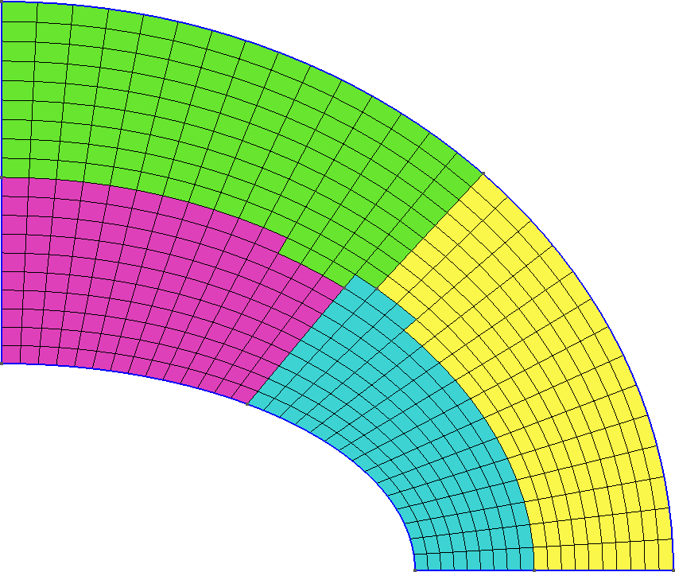

---
title: FeenoX Software Design Specification
lang: en-US
abstract: This Software Design Specifications (SDS) document applies to an imaginary Software Requirement Specifications (SRS) document issued by a fictitious agency asking for vendors to offer a free and open source cloud-based computational tool to solve engineering problems. The latter can be seen as a request for quotation and the former as an offer for the fictitious tender. Each section  of this SDS addresses one section of the SRS. The original text from the SRS is shown quoted at the very beginning before the actual SDS content.
number-sections: true
toc: true
documentclass: report
...

# Introduction {#sec:introduction}

> ```include
> 100-introduction.md
> ```

Besides noting that software being _free_ (regarding freedom, not price) does not imply the same as being _open source_, the requirement is clear in that the tool has to be both _free_ and _open source_, a combination which is usually called [FOSS](https://en.wikipedia.org/wiki/Free_and_open-source_software). This condition leaves all of the well-known non-free (i.e. [incorrectly-called "commercial"](https://www.gnu.org/philosophy/words-to-avoid.en.html#Commercial)) finite-element solvers available in the market (NASTRAN, Abaqus, ANSYS, Midas, etc.) out of the tender.

```include
licensing.md
```

## Objective {#sec:objective}

> ```include
> 110-objective.md
> ```

The choice of the initial supported features is based on the types of problem that the FeenoX' precursor codes (namely wasora, Fino and milonga, referred to as "previous versions" from now on) already have been supporting since more than ten years now. It is also a first usable version so scope can be bounded. A subsequent road map and release plans can be designed as requested. FeenoX' first version includes a subset of the required functionality, namely

 * open and closed-loop dynamical systems
 * Laplace/Poisson/Helmholtz equations
 * heat conduction
 * mechanical elasticity
 * structural modal analysis
 * multi-group neutron transport and diffusion
 
FeenoX is designed to be developed and executed under GNU/Linux, which is the architecture of more than 95% of the internet servers which we collectively call “the cloud.” It should be noted that GNU/Linux is a POSIX-compliant version of UNIX and that FeenoX follows the rules of Unix philosophy (further explained in @sec:unix) for the actual computational implementation. Besides POSIX, as explained further below in @sec:scalability, FeenoX also uses MPI which is a well-known industry standard for massive execution of parallel processes, both in multi-core hosts and multi-hosts environments. Finally, if performance and/or scalability are not important issues, FeenoX can be run in a (properly cooled) local PC or laptop.

The requirement to run in the cloud and scale up as needed rules out some the open source solver [CalculiX](http://www.calculix.de/). There are some other requirements in the SRS that also leave CalculiX out of the tender.

## Scope {#sec:scope}

> ```include
> 120-scope.md
> ```


Indeed, FeenoX is designed to work very much like a transfer function between one (or more) files and zero or more output files:

```include
transfer.md
```

Technically speaking, FeenoX can be seen as a Unix filter designed to read an ASCII-based stream of characters (i.e. the input file, which in turn can include other input files or contain instructions to read data from mesh and/or other data files) and to write ASCII-formatted data into the standard output and/or other files. The input file can be created either by a human or by another program. The output stream and/or files can be read by either a human and/or another programs.
A quotation from [Eric Raymond](http://www.catb.org/esr/)’s [The Art of Unix Programming](http://www.catb.org/esr/writings/taoup/) helps to illustrate this idea:

> [Doug McIlroy](https://en.wikipedia.org/wiki/Douglas_McIlroy), the inventor of [Unix pipes](https://en.wikipedia.org/wiki/Pipeline_%28Unix%29) and one of the founders of the [Unix tradition](https://en.wikipedia.org/wiki/Unix), had this to say at the time:
>
>   (i) Make each program do one thing well. To do a new job, build afresh rather than complicate old programs by adding new features.
>
>   (ii) Expect the output of every program to become the input to another, as yet unknown, program. Don't clutter output with extraneous information. Avoid stringently columnar or binary input formats. Don't insist on interactive input.
>
> [...]
>
> He later summarized it this way (quoted in “A Quarter Century of Unix” in 1994):
>
>   * This is the Unix philosophy: Write programs that do one thing and do it well. Write programs to work together. Write programs to handle text streams, because that is a universal interface.


Keep in mind that even though 

 i. the quotes above, and
 ii. many FEA programs that are still mainstream today
 
date both from the early 1970s, fifty years later they still

 * do not make just only one thing well,
 * do complicate old programs by adding new features,
 * do not expect the their output to become the input to another,
 * do clutter output with extraneous information,
 * do use stringently columnar and/or binary input (and output!) formats, and/or
 * do insist on interactive output.


```include
lorenz.md
```

As already stated, FeenoX is designed and implemented following the UNIX philosophy in general and Eric Raymond's 17 Unix Rules ([sec:unix]) in particular. One of the main ideas is the _rule of separation_ that essentially asks to separate mechanism from policy, that in the computational engineering world translates into separating the frontend from the backend. The usage of FeenoX to compute and of Gnuplot to plot is a clear example of separation. Same idea applies to PDEs, where the mesh is created with Gmsh and the output can be post-processed with Gmsh, Paraview or any other post-processing system (even a web-based interface) that follows rule of separation.
Even though most FEA programs eventually separate the interface from the solver up to some degree, there are cases in which they are still dependent such that changing the former needs updating the latter.

From the very beginning, FeenoX is designed as a pure backend which should nevertheless provide appropriate mechanisms for different frontends to be able to communicate and to provide a friendly interface for the final user. Yet, the separation is complete in the sense that the nature of the frontends can radically change (say from a desktop-based point-and-click program to a web-based immersive augmented-reality application) without needing the modify the backend. Not only far more flexibility is given by following this path, but also develop efficiency and quality is encouraged since programmers working on the lower-level of an engineering tool usually do not have the skills needed to write good user-experience interfaces, and conversely.

In the very same sense, FeenoX does not discretize continuous domains for PDE problems itself, but relies on separate tools for this end. Fortunately, there already exists one meshing tool which is FOSS (GPLv2) and shares most (if not all) of the design basis principles with FeenoX: the three-dimensional finite element mesh generator [Gmsh](http://gmsh.info/).
Strictly speaking, FeenoX does not need to be used along with Gmsh but with any other mesher able to write meshes in Gmsh's format `.msh`. But since Gmsh also

 * is free and open source,
 * works also in a transfer-function-like fashion,
 * runs natively on GNU/Linux,
 * has a similar (but more comprehensive) API for Python/Julia,
 * etc.
 
it is a perfect match for FeenoX. Even more, it provides suitable domain decomposition methods (through other FOSS third-party libraries such as [Metis](http://glaros.dtc.umn.edu/gkhome/metis/metis/overview)) for scaling up large problems.

```include
nafems-le10.md
```

See <https://www.caeplex.com> for a mobile-friendly web-based interface for solving finite elements in the cloud directly from the browser.

Even though the initial version of FeenoX does not provide an API for high-level interpreted languages such as Python or Julia, the code is written in such a way that this feature can be added without needing a major refactoring. This will allow to fully define a problem in a procedural way, increasing also flexibility.


# Architecture {#sec:architecture}

> ```include
> 200-architecture.md
> ```

FeenoX can be seen as a third-system effect, being the third version written from scratch after a first implementation in 2009 and an second one which was far more complex and had far more features circa 2012--2014. The third attempt explicitly addresses the "do one thing well" idea from Unix. 

Furthermore, not only is FeenoX itself both [free](https://www.gnu.org/philosophy/free-sw.en.html) and [open-source](https://opensource.com/resources/what-open-source) software but, following the _rule of composition_, it also is designed to connect and to work with  other free and open source software such as

 * [Gmsh](http://gmsh.info/) for pre and/or post-processing
 * [ParaView](https://www.paraview.org/) for post-processing
 * [Gnuplot](http://gnuplot.info/) for plotting
 * [Pyxplot](http://www.pyxplot.org.uk/) for plotting
 * [Pandoc](https://pandoc.org/) for creating tables and documents
 * [TeX](https://tug.org/) for creating tables and documents
 
and many others, which are readily available in all major GNU/Linux distributions.

FeenoX also makes use of high-quality free and open source mathematical libraries which contain numerical methods designed by mathematicians and programmed by professional programmers. In particuar, it depends on

 * [GNU Scientific Library](https://www.gnu.org/software/gsl/) for general mathematics,
 * [SUNDIALS IDA](https://computing.llnl.gov/projects/sundials/ida) for ODEs and DAEs,
 * [PETSc](http://https://petsc.org) for PDEs, and
 * [SLEPc](http://slepc.upv.es/) for PDEs involving eigen problems
 
Therefore, if one zooms in into the block of the transfer function above, FeenoX can also be seen as a glue layer between the input file and the mesh defining a PDE-casted problem and the mathematical libraries used to solve the discretized equations. This way, FeenoX bounds its scope to do only one thing and to do it well: to build and solve finite-element formulations of thermo-mechanical problems. And it does so on high grounds, both

 i. ethical: since it is [free software](https://www.gnu.org/philosophy/open-source-misses-the-point.en.html), all users can
      0. run,
      1. share,
      2. modify, and/or
      3. re-share their modifications.
      
    If a user cannot read or write code to make FeenoX suit her needs, at least she has the _freedom_ to hire someone to do it for her, and
    
 ii. technological: since it is [open source](http://www.catb.org/~esr/writings/cathedral-bazaar/cathedral-bazaar/), advanced users can detect and correct bugs and even improve the algorithms. [Given enough eyeballs, all bugs are shallow.](https://en.wikipedia.org/wiki/Linus%27s_law)

FeenoX’ main development architecture is Debian GNU/Linux running over 64-bits Intel-compatible processors.
All the dependencies are free and/or open source and already available in Debian’s official repositories, as explained in @sec:deployment.

The POSIX standard is followed whenever possible, allowing thus FeenoX to be compiled in other operating systems and architectures such as Windows (using [Cygwin](https://www.cygwin.com/)) and MacOS. The build procedure is the well-known and mature `./configure && make` command. 

FeenoX is written in plain\ C conforming to the ISO\ C99 specification (plus POSIX extensions), which is a standard, mature and widely supported language with compilers for a wide variety of architectures. 
For its basic mathematical capabilities, FeenoX uses the [GNU Scientifc Library](https://www.gnu.org/software/gsl/).
For solving ODEs/DAEs, FeenoX relies on [Lawrence Livermore’s SUNDIALS library](https://computing.llnl.gov/projects/sundials/ida). For PDEs, FeenoX uses [Argonne’s PETSc library](https://www.mcs.anl.gov/petsc/) and [Universitat Politècnica de València's SLEPc library](https://slepc.upv.es/). All of them are

 * free and open source,
 * written in C (neither Fortran nor C++),
 * mature and stable,
 * actively developed and updated,
 * very well known in the industry and academia.

Moreover, PETSc and SLEPc are scalable through the [MPI standard](https://www.mcs.anl.gov/research/projects/mpi/standard.html) (further discussed in @sec:scalability). This means that programs using both these libraries can run on either large high-performance supercomputers or low-end laptops. FeenoX has been run on

 - Raspberry Pi
 - Laptop (GNU/Linux & Windows 10)
 - Macbook
 - Desktop PC
 - Bare-metal servers
 - Vagrant/Virtualbox
 - Docker/Kubernetes
 - AWS/DigitalOcean/Contabo

Due to the way that FeenoX is designed and the policy separated from the mechanism, it is possible to control a running instance remotely from a separate client which can eventually run on a mobile device ([@fig:caeplex-ipad]).

 is mobile-friendly. <https://www.youtube.com/watch?v=7KqiMbrSLDc>](caeplex-ipad.jpg){#fig:caeplex-ipad}


The following example illustrates how well FeenoX works as one of many links in a chain that goes from tracing a bitmap with the problem's geometry down to creating a nice figure with the results of a computation:

```include
mazes.md
```

## Deployment {#sec:deployment}

> ```include
> 210-deployment.md
> ```


As already stated, FeenoX can be compiled from its sources using the well-established `configure` & `make` procedure. The code’s source tree is hosted on Github so cloning the repository is the preferred way to obtain FeenoX, but source tarballs are periodically released too according to the requirements in @sec:traceability.

The configuration and compilation is based on [GNU Autotools](https://www.gnu.org/software/automake/manual/html_node/Autotools-Introduction.html) that has more than thirty years of maturity and it is the most portable way of compiling C code in a wide variety of UNIX variants. It has been tested with

 * GNU C compiler
 * LLVM Clang compiler
 * Intel C compiler

 
FeenoX depends on the four open source libraries stated in @sec:architecture, with the last three of them being optional. The only mandatory library is the GNU Scientific Library which is part of the GNU/Linux operating system and as such is readily available in all distributions as `libgsl-dev`. The sources of the rest of the optional libraries are also widely available in most common GNU/Linux distributions.

In effect, doing 

```terminal
sudo apt-get install gcc make libgsl-dev libsundials-dev petsc-dev slepc-dev
```

is enough to provision all the dependencies needed compile FeenoX from the source tarball with the full set of features. 
If using the Git repository as a source, then [Git](https://git-scm.com/) itself and the [GNU Autoconf](https://www.gnu.org/software/autoconf/) and [Automake](https://www.gnu.org/software/automake/) packages are also needed:

```terminal
sudo apt-get install git autoconf automake
```

Even though compiling FeenoX from sources is the recommended way to obtain the tool, since the target binary can be compiled using particularly suited compilation options, flags and optimizations (especially those related to MPI, linear algebra kernels and direct and/or iterative sparse solvers), there are also tarballs with usable binaries for some of the most common architectures---including some non-GNU/Linux variants. These binary distributions contain statically-linked executables that do not need any other shared libraries to be present on the target host, but their flexibility and efficiency is generic and far from ideal. Yet the flexibility of having an execution-ready distribution package for users that do not know how to compile C source code outweights the limited functionality and scalability of the tool.

For example, first PETSc can be built with a `-Ofast` flag:

```terminal
$ cd $PETSC_DIR
$ export PETSC_ARCH=linux-fast
$ ./configure --with-debug=0 COPTFLAGS="-Ofast"
$ make -j8
$ cd $HOME
```
 
And then not only can FeenoX be configured to use that particular PETSc build but also to use a different compiler such as Clang instead of GNU GCC and to use the same `-Ofast` flag to compile FeenoX itself:
   
```terminal
$ git clone https://github.com/seamplex/feenox
$ cd feenox
$ ./autogen.sh
$ export PETSC_ARCH=linux-fast
$ ./configure MPICH_CC=clang CFLAGS=-Ofast
$ make -j8
# make install
```
   
If one does not care about the details of the compilation, then a pre-compiled statically-linked binaries can be directly downloaded very much as when downloading Gmsh:
 
```terminal
$ wget http://gmsh.info/bin/Linux/gmsh-Linux64.tgz
$ wget https://seamplex.com/feenox/dist/linux/feenox-linux-amd64.tar.gz
```

Appendix has @sec:download more details about how to download and compile FeenoX. The full documentation contains a [compilation guide](https://seamplex.com/feenox/doc/compilation.html) with further detailed explanations of each of the steps involved.
Since all the commands needed to either download a binary executable or to compile from source with customized optimization flags can be automatized, FeenoX can be built into a container such as Docker. This way, deployment and scalability can be customized and tweaked as needed.


## Execution {#sec:execution}


> ```include
> 220-execution.md
> ```

As FeenoX is designed to run as a file filter (i.e. as a transfer function between input and output files) and it explicitly avoids having a graphical interface, the binary executable works as any other UNIX terminal command. When invoked without arguments, it prints its version (a through explanation of the versioning scheme is given in @sec:traceability), a one-line description and the usage options:

```terminal
$ feenox
FeenoX v0.2.14-gbbf48c9-dirty 
a free no-fee no-X uniX-like finite-element(ish) computational engineering tool

usage: feenox [options] inputfile [replacement arguments] [petsc options]

  -h, --help         display options and detailed explanations of commmand-line usage
  -v, --version      display brief version information and exit
  -V, --versions     display detailed version information

Run with --help for further explanations.
```

The program can also be executed remotely

 1. on a server through a SSH session
 2. in a container as part of a provisioning script


 
FeenoX provides mechanisms to inform its progress by writing certain information to devices or files, which in turn can be monitored remotely or even trigger server actions. Progress can be as simple as an ASCII bar (triggered with `--progress`) to more complex mechanisms like writing the status in a shared memory segment.

Regarding its execution, there are three ways of solving problems: direct execution, parametric runs and optimization loops.
 
### Direct execution

When directly executing FeenoX, one gives a single argument to the executable with the path to the main input file. For example, the following input computes the first twenty numbers of the [Fibonacci sequence](https://en.wikipedia.org/wiki/Fibonacci_number) using the closed-form formula

$$
f(n) = \frac{\varphi^n - (1-\varphi)^n}{\sqrt{5}}
$$

where $\varphi=(1+\sqrt{5})/2$ is the [Golden ratio](https://en.wikipedia.org/wiki/Golden_ratio):

```{.feenox include="fibo_formula.fee"}
```

FeenoX can be directly executed to print the function\ $f(n)$ for $n=1,\dots,20$ both to the standard output and to a file named `one` (because it is the first way of solving Fibonacci with Feenox):

```terminal
$ feenox fibo_formula.fee | tee one
1	1
2	1
3	2
4	3
5	5
6	8
7	13
8	21
9	34
10	55
11	89
12	144
13	233
14	377
15	610
16	987
17	1597
18	2584
19	4181
20	6765
$
```

Now, we could also have computed these twenty numbers by using the direct definition of the sequence into a vector $\vec{f}$ of size 20. This time we redirect the output to a file named `two`:

```{.feenox include="fibo_vector.fee"}
```

```terminal
$ feenox fibo_vector.fee > two
$ 
```

Finally, we print the sequence as an iterative problem and check that the three outputs are the same:

```{.feenox include="fibo_iterative.fee"}
```

```terminal
$ feenox fibo_iterative.fee > three
$ diff one two
$ diff two three
$
```

These three calls were examples of direct execution of FeenoX: a single call with a single argument to solve a single fixed problem.

## Parametric {@sec:parametric}

To use FeenoX in a parametric run, one has to successively call the executable passing the main input file path in the first argument followed by an arbitrary number of parameters. These extra parameters will be expanded as string literals `$1`, `$2`, etc. appearing in the input file. For example, if `hello.fee` is

```{.feenox include="hello.fee"}
```

then

```terminal
$ feenox hello.fee World
Hello World!
$ feenox hello.fee Universe
Hello Universe!
$
```

To have an actual parametric run, an external loop has to successively call FeenoX with the parametric arguments. For example, say this file `cantilever.fee` fixes the face called "left" and sets a load in the negative\ $z$ direction of a mesh called `cantilever-$1-$2.msh`. The output is a single line containing the number of nodes of the mesh and the displacement in the vertical direction\ $w(500,0,0)$ at the center of the cantilever's free face:

```{.feenox include="cantilever.fee"}
```

::: {#fig:cantilever-mesh}
{width_latex=49%}
{width_latex=49%}

Cantilevered beam meshed with structured tetrahedra and hexahedra
:::

Now the following Bash script first calls Gmsh to create the meshes `cantilever-${element}-${c}.msh` where

 * `${element}`: tet4, tet10, hex8, hex20, hex27
 * `${c}`: 1,2,\dots,10

It then calls FeenoX with the input above and passes `${element}` and `${c}` as extra arguments, which then are expanded as `$1` and `$2` respectively.
 
```{.bash include="cantilever.sh"}
```

After the execution of the Bash script, thanks to the design decision that output is 100% defined by the user (in this case with the `PRINT` instruction), one has several files `cantilever-${element}.dat` files. When plotted, these show the shear locking effect of fully-integrated first-order elements as illustrated in @fig:cantilever-displacement. The theoretical Euler-Bernoulli result is just a reference as, among other things, it does not take into account the effect of the material's Poisson's ratio.
Note that the abscissa shows the number of _nodes_, which are proportional to the number of degrees of freedom (i.e. the size of the problem matrix) and not the number of _elements_, which is irrelevant here and in most problems.


{#fig:cantilever-displacement}


### Optimization loops

Optimization loops work very much like parametric runs from the FeenoX point of view. The difference is mainly on the calling script that has to implement a certain optimization algorithm such as conjugate gradients, Nelder-Mead, simulated annealing, genetic algorithms, etc. to choose which parameters to pass to FeenoX as command-line argument.
The only particularity on FeenoX' side is that since the next argument that the optimization loop will pass might depend on the result of the current step, care has to be taken in order to be able to return back to the calling script whatever results it needs in order to compute the next arguments. This is usually just the scalar being optimized for, but it can also include other results such as derivatives or other relevant data.

To illustrate how to use FeenoX in an optimization loop, let us consider the problem of finding the length\ $\ell_1$ of a tuning fork (@fig:fork-meshed) such that the fundamental frequency on a free-free oscillation is equal to the base\ A frequency at\ 440\ Hz.


{#fig:fork-meshed width=20%}

This extremely simple input file (_rule of simplicity_) solves the free-free mechanical modal problem (i.e. without any Dirichlet boundary condition) and prints the fundamental frequency:

```{.feenox include="fork.fee"}
```

Note that in this particular case, the FeenoX input files does not expand any command-line argument. The trick is that the mesh file `fork.msh` is overwritten in each call of the optimization loop. Since this time the loop is slightly more complex than in the parametric run of the last section, we now use Python. The function `create_mesh()` first creates a CAD model of the fork with geometrical parameters $r$, $w$, $\ell_1$ and $\ell_2$. It then meshes the CAD using\ $n$ structured hexahedra through the fork's thickness. Both the CAD and the mesh are created using the Gmsh Python API. The detailed steps between `gmsh.initialize()` and `gmsh.finalize()` are not shown here, just the fact that this function overwrites the previous mesh and always writes it into the file called `fork.msh` which is the one that `fork.fee`  reads. Hence, there is no need to pass command-liner arguments to FeenoX. The full implementation of the function is available in the examples directory of the FeenoX distribution.

```python
import math
import gmsh
import subprocess  # to call FeenoX and read back

def create_mesh(r, w, l1, l2, n):
  gmsh.initialize()
  ...
  gmsh.write("fork.msh")  
  gmsh.finalize()
  return len(nodes)
  
def main():
  target = 440    # target frequency
  eps = 1e-2      # tolerance
  r = 4.2e-3      # geometric parameters
  w = 3e-3
  l1 = 30e-3
  l2 = 60e-3

  for n in range(1,7):   # mesh refinement level
    l1 = 60e-3              # restart l1 & error
    error = 60
    while abs(error) > eps:   # loop
      l1 = l1 - 1e-4*error
      # mesh with Gmsh Python API
      nodes = create_mesh(r, w, l1, l2, n)
      # call FeenoX and read scalar back
      # TODO: FeenoX Python API (like Gmsh)
      result = subprocess.run(['feenox', 'fork.fee'], stdout=subprocess.PIPE)
      freq = float(result.stdout.decode('utf-8'))
      error = target - freq
    
    print(nodes, l1, freq)
```

Since the computed frequency depends both on the length\ $\ell_1$ and on the mesh refinement level\ $n$, there are actually two nested loops: one parametric over $n=1,2\dots,7$ and the optimization loop itself that tries to find\ $\ell_1$ so as to obtain a frequency equal to 440\ Hz within 0.01% of error.

```terminal
$ python fork.py > fork.dat
$
``` 

{#fig:fork width_latex=85%}

Note that the approach used here is to use Gmsh Python API to build the mesh and then fork the FeenoX executable to solve the fork (no pun intended). There are plans to provide a Python API for FeenoX so the problem can be set up, solved and the results read back directly from the script instead of needing to do a fork+exec, read back the standard output as a string and then convert it to a Python `float`.

@Fig:fork shows the results of the combination of the optimization loop over $\ell_1$ and a parametric run over\ $n$. The difference for $n=6$ and $n=7$ is in the order of one hundredth of millimeter.


## Efficiency {#sec:efficiency}

> ```include
> 230-efficiency.md
> ```

One of the most widely known quotations in computer science is that one that says “premature optimization is the root of all evil.” that is an extremely over-simplified version of Donald E. Knuth’s analysis in hist The Art of Computer Programming. Bottom line is that the programmer should not not spend too much time trying to optimize code based on hunches but based on profiling measurements. Yet a disciplined programmer can tell when an algorithm will be way too inefficient (say something that scales up like $O(n^2)$) and how small changes can improve performance (say by understanding how caching levels work). It is also true that usually an improvement in one aspect leads to a deterioration in another one (e.g. decrease in CPU time by caching intermediate results increasing RAM usage).

Even though FeenoX is still evolving so it could be premature in many cases, it is informative to compare running times and memory consumption when solving the same problem with different cloud-friendly FEA programs. In effect, a [serial single-thread single-host comparison of resource usage when solving the NAFEMS LE10 problem](https://seamplex.com/feenox/tests/nafems/le10/) introduced above was performed, using both [unstructured tetrahedral](https://www.seamplex.com/feenox/tests/nafems/le10/report-tet.html) and [structured hexahedral](https://www.seamplex.com/feenox/tests/nafems/le10/report-hex.html) meshes. @Fig:le10-tet shows two figures of the many ones contained in the detailed report. In general, FeenoX using the iterative approach based on PETSc’s Geometric-Algebraic Multigrid Preconditioner  and a conjugate gradients solver is faster for (relatively) large problems at the expense of a larger memory consumption. The curves that use MUMPS confirm the well-known theoretical result that direct linear solvers are robust but not scalable. 

The large memory consumption shown by FeenoX is due to a high level of caching intermediate results. For instance, all the shape functions evaluated at the integration points are computed once when building the stiffness matrix, stored in RAM and then re-used when recovering the gradients of the displacements needed to compute the stresses.  There are also a number of non-premature optimization tasks that can improve both the CPU and memory usage that ought to be performed at later stages of the project.

::: {#fig:le10-tet}
{#fig:wall-dofs-tet width_html=100% width_latex=90%}

{#fig:memory-dofs-tet width_html=100% width_latex=90%}

Resource consumption when solving the NAFEMS LE10 problem in the cloud for tetrahedral meshes.
:::

Regarding storage, FeenoX needs space to store the input file (negligible), the mesh file in `.msh` format (which can be either ASCII or binary) and the optional output files in `.msh` or `.vtk` formats. All of these files can be stored gzip-compressed and un-compressed on demand by exploiting FeenoX’ script-friendliness using proper calls to `gzip` before and/or after calling the `feenox` binary.
 
## Scalability  {#sec:scalability}
 
> ```include
> 240-scalability.md
> ```

The time needed to solve a relatively large problem can be reduced by exploiting the fact that most cloud servers (and even laptop computers) have more than one CPU available. There are some tasks that can be split into several processors sharing a common memory address space that will scale up perfectly, such as building the elemental matrices and assembling the global stiffness matrix. There are some other tasks that might not scale perfectly but that nevertheless might (or might not) reduce the overall wall time if split among processors using a common memory space, such as solving the linear system\ $K \cdot \vec{u} = \vec{b}$. The usual scheme to parallelize a problem under these conditions is to use the [OpenMP](https://en.wikipedia.org/wiki/OpenMP) framework.

Yet, if the problem is large enough, a server might not have enough physical random-access memory to be able to handle the whole problem. The problem now has to be split among different servers which, in turn, might have several processors each. Some of the processors share the same address space but most of them will only have access to a fraction of the whole global problem data. In these cases, there are no tasks that can scale up perfectly since even when building and assembling the matrices, a processor needs some piece of data which is handled by another processor with a different address space and that has to be conveyed specifically from one process to another one. The usual scheme to parallelize a problem under these conditions is to use the [MPI](https://en.wikipedia.org/wiki/Message_Passing_Interface) standard and one of its two most well-known implementations, either [Open MPI](https://www.open-mpi.org/) or [MPICH](https://www.mpich.org/).

It might seem that the most effective approach to solve a large problem is to use OpenMP among threads running in processors that share the memory address space and to use MPI among processes running in different hosts. But even though this hybrid OpenMPI+MPI scheme is possible, there are at least three main drawbacks with respect to a pure MPI approach:

 i. the overall performance is not be significantly better
 ii. the amount of lines of code that has to be maintained is more than doubled
 iii. the number of possible points of synchronization failure increases

In many ways, the pure MPI mode has fewer synchronizations and thus should perform better.
Hence, FeenoX uses MPI (mainly through PETSc and SLEPc) to handle large parallel problems.

::: {#fig:nafems-le1-metis}
{width=49%}
{width=49%}

Partition of the 2D NAFEMS LE1 domain into four different sub-domains computed in Gmsh using Metis.
:::

Most of the overhead of parallelized tasks come from the fact that processes need data stored in other processes that use another memory address space.
Therefore, the discretized domain has to be split among processes in such a way as to minimize the number of inter-process communication. This problem, called domain decomposition, can be handled either by the mesher or by the solver itself, usually using a third-part library such as [Metis](http://glaros.dtc.umn.edu/gkhome/metis/metis/overview). It should be noted that the domain decomposition problem does not have a unique solution. On the one hand, it depends on the actual mesh being distributed over parallel processes as illustrated in @fig:nafems-le1-metis. On the other hand, the optimal solution might depend on the kind of topology boundaries to minimize (shared nodes, shared faces) and other subtle options that partitioning libraries allow.

FeenoX relies on Gmsh to perform the domain decomposition (using Metis) and to provide the partitioning information in the mesh file read by the `READ_MESH` keyword.


## Flexibility
 
> ```include
> 250-flexibility.md
> ```

The third-system effect mentioned in @sec:architecture involves almost ten years of experience in the nuclear industry,^[This experience also shaped many of the features that FeenoX has and most of the features is does deliberately not have.] where complex dependencies of multiple material properties over space through intermediate distributions (temperature, neutronic poisons, etc.) and time (control rod positions, fuel burn-up, etc.) are mandatory.

One of the cornerstone design decisions in FeenoX is that **everything is an expression**. Here, “everything” means any location in the input file where a numerical value is expected. The most common use case is in the `PRINT` keyword. For example, the [Sophomore's dream](https://en.wikipedia.org/wiki/Sophomore%27s_dream) (in contrast to [Freshman's dream](https://en.wikipedia.org/wiki/Freshman%27s_dream)) identity


$$
\int_{0}^{1} x^{-x} \, dx = \sum_{n=1}^{\infty} n^{-n}
$$

can be illustrated like this:

```{.feenox include="sophomore.fee"}
```

```terminal
$ feenox sophomore.fee
1.2912861
1.2912860
$
```

Of course most engineering problems will not need explicit integrals (a few of them do, though) but some of them might need summation loops, so it is handy to have these functionals available inside the FEA tool. This might seem to go against the “keep it simple” and “do one thing good” Unix principle, but definitely follows [Alan Kay](https://en.wikipedia.org/wiki/Alan_Kay)’s idea that “simple things should be simple, complex things should be possible.”

Flexibility in defining non-trivial material properties is illustrated with the following example, where two non- squares made of different dimensional materials are juxtaposed in thermal contact and subject to different boundary conditions at each of the fours sides (@fig:two-squares-mesh).

{#fig:two-squares-mesh width_latex=75% width_html=100%}

The yellow square is made of a certain material with a conductivity that depends algebraically on the temperature like

$$
k_\text{yellow}(x,y) = \frac{1}{2} + T(x,y)
$$

The cyan square has a space-dependent temperature given by a table of scattered data as a function of the spatial coordinates\ $x$ and\ $y$ (origin is left bottom corner of the yellow square) without any particular structure on the definition points:

| $x$ | $y$ | $k_\text{cyan}(x,y)$ |
|:---:|:---:|:---------------:|
|  1  |  0  |      1.0        |
|  1  |  1  |      1.5        |
|  2  |  0  |      1.3        |
|  2  |  1  |      1.8        |
| 1.5 | 0.5 |      1.7        |

The cyan square generates a temperature-dependent power density (per unit area) given by

$$
q^{\prime \prime}_\text{cyan}(x,y) = 0.2 \cdot T(x,y)
$$

The yellow one does not generate any power so $q^{\prime \prime}_\text{yellow} = 0$. Boundary conditions are

$$
\begin{cases}
T(x,y) = y & \text{at the left edge $y=0$} \\
T(x,y) = 1-\cos\left(\frac{1}{2}\pi \cdot x\right) & \text{at the bottom edge $x=0$} \\
q'(x,y) = 2-y & \text{at the right edge $x=2$} \\
q'(x,y) = 1 & \text{at the top edge $y=1$} \\
\end{cases}
$$

The input file illustrate how flexible FeenoX is and, again, how the problem definition in a format that the computer can understand resembles the humanly-written formulation of the original engineering problem:

```{.feenox include="two-squares.fee"}
```

Note that FeenoX is flexible enough to...

 1. handle mixed meshes (the yellow square is meshed with triangles and the other one with quadrangles) 
 2. use point-wise defined properties even though there is not underlying structure nor topology for the points where the data is defined (FeenoX could have read data from a `.msh` or `.vtk` file respecting the underlying topology)
 3. understand that the problem is non-linear so as to use PETSc’s SNES framework automatically (the conductivity and power source depend on the temperature).

 
::: {#fig:two-squares-results}
{width_latex=75%  width_html=100%}

{width_latex=75%  width_html=100%}

Temperature (main result) and conductivity for the two-squares thermal problem.
:::

In the very same sense that variables `x`, `y` and `z` appearing in the input refer to the spatial coordinates\ $x$, $y$ and\ $z$ respectively, the special variable `t` refers to the time\ $t$. The requirement of allowing time-dependent boundary conditions can be illustrated by solving the NAFEMS\ T3 one-dimensional transient heat transfer benchmark. It consists of a slab of\ 0.1\ meters long subject to a fixed homogeneous temperature on one side, i.e.

$$T(x=0)=0~\text{°C}$$

and to a transient temperature

$$
T(x=0.1~\text{m},t)=100~\text{°C} \cdot \sin\left( \frac{\pi \cdot t}{40~\text{s}}\right)
$$

at the other side. There is zero internal heat generation, at $t=0$ all temperature is equal to 0°C (sic) and conductivity, specific heat and density are constant and uniform. The problem asks for the temperature at location\ $x=0.08~\text{m}$ at time\ $t=32~\text{s}$. The reference result is $T(0.08~\text{m},32~\text{s})=36.60~\text{°C}$.

```{.feenox include="nafems-t3.fee"}
```

```terminal
$ gmsh -1 slab-0.1m.geo 
[...]
Info    : Done meshing 1D (Wall 0.000213023s, CPU 0.000836s)
Info    : 61 nodes 62 elements
Info    : Writing 'slab-0.1m.msh'...
Info    : Done writing 'slab-0.1m.msh'
Info    : Stopped on Sun Dec 12 19:41:18 2021 (From start: Wall 0.00293443s, CPU 0.02605s)
$ feenox nafems-t3.fee 
T(0.08m,32s) = 	36.5996	ºC
$ pyxplot nafems-t3.ppl
$
```

{#fig:nafems-t3 width=100%}


Besides “everything is an expression,” FeenoX follows another cornerstone rule: **simple problems ought to have simple inputs**, akin to Unix’ _rule of simplicity_---that addresses the first half of Alan Kay’s quote above. This rule is further discussed in @sec:input.


## Extensibility {#sec:extensibility}


> ```include
> 260-extensibility.md
> ```

Even though FeenoX is written in C, it makes extensive use of function pointers to mimic C++’s virtual methods. This way, depending on the problem type given with the [`PROBLEM`](https://www.seamplex.com/feenox/doc/feenox-manual.html#problem) keyword, particular routines are called to

 1. initialize and set up solver options (steady-state/transient, linear/non-linear, regular/eigenproblem, etc.)
 2. parse boundary conditions given in the `BC` keyword
 3. build elemental contributions for
     a. volumetric stiffness and/or mass matrices
     b. natural boundary conditions
 4. compute secondary fields (heat fluxes, strains and stresses, etc.) out of the gradients of the primary fields
 5. compute per-problem key performance indicators (min/max temperature, displacement, stress, etc.)
 6. write particular post-processing outputs
 
Indeed, each of the supported problems, namely

 * [`laplace`](https://github.com/seamplex/feenox/tree/main/src/pdes/laplace)
 * [`thermal`](https://github.com/seamplex/feenox/tree/main/src/pdes/thermal)
 * [`mechanical`](https://github.com/seamplex/feenox/tree/main/src/pdes/mechanical)
 * [`modal`](https://github.com/seamplex/feenox/tree/main/src/pdes/modal)
 * [`neutron_diffusion`](https://github.com/seamplex/feenox/tree/main/src/pdes/neutron_difussion)

is a separate directory under [`src/pdes`](https://github.com/seamplex/feenox/tree/main/src/pdes) that implements these “virtual” methods (recall that they are function pointers) that are resolved at runtime when parsing the main input file. Additional elliptic problems can be added by using the `laplace` directory as a template while using the other directories as examples about how to add further features (e.g. a Robin-type boundary condition in `thermal` and a vector-valued unknown in `mechanical`).

As already discussed in @sec:introduction, FeenoX is [free-as-in-freedom](https://en.wikipedia.org/wiki/Free_as_in_Freedom) software licensed under the terms of the [GNU General Public License](https://www.gnu.org/licenses/gpl-3.0) version\ 3 or, at the user convenience, any later version.
In the particular case of additional problem types, this fact has two implications.

 i. Every person in the world is free to modify FeenoX to suit their needs, including adding a new problem type either by
 
     a. using one of the existing ones as a template, or
     b. creating a new directory from scratch,
     
    without asking anybody for any kind of permission. In case this person does not how to program, he or she has the freedom to hire somebody else to do it. It is this the sense of the word “free” in the compound phrase “free software:” freedom to do what they think fit (except to make it non-free, see next bullet).
 
 ii. People adding code own the copyright of the additional code. Yet, if they want to distribute the modified version they have to do it under also under the terms of the GPLv3+ and under a name that does not induce the users to think the modified version is the original FeenoX distribution.^[Even better, these authors should ask to merge their contributions into FeenoX’ main code base.] That is to say, free software ought to remain free---a.k.a. as [copyleft](https://en.wikipedia.org/wiki/Copyleft).
 

Regarding additional material models, the virtual methods that compute the elemental contributions to the stiffness matrix also use function pointers to different material models (linear isotropic elastic, orthotropic elastic, etc.) and behaviors (isotropic thermal expansion, orthotropic thermal expansion, etc.) that are resolved at run time. Following the same principle, new models might be added by adding new routines and resolving them depending on the user’s input.

 
## Interoperability {#sec:interoperability}
 
> ```include
> 270-interoperatibility.md
> ```

@Sec:scope already introduced the ideas about interoperability behind the Unix philosophy which make up for most the the FeenoX design basis. Essentially, they sum up to “do only one thing but do it well.” Since FeenoX is  filter (or a transfer-function), interoperability is a must. So far, this SDS has already shown examples of exchanging information with:

 * [Kate](https://kate-editor.org/) (with syntax highlighting): @fig:nafems-le10-problem-input
 * [Gmsh](http://gmsh.info/) (both as a mesher and a post-processor): [@fig:maze123;@fig:mazes;@fig:cantilever-mesh;@fig:fork-meshed;@fig:nafems-le1-metis;@fig:two-squares-mesh;@fig:two-squares-results]
 * [Paraview](https://www.paraview.org/): @fig:nafems-le10-sigmay
 * [Gnuplot](http://gnuplot.info/): [@fig:lorenz-gnuplot;@fig:le10-tet]
 * [Pyxplot](http://www.pyxplot.org.uk/): [@fig:cantilever-displacement;@fig:fork;@fig:nafems-t3]

 
To illustrate both the filter approach, consider the following input file that solves Laplace’s equation $\nabla^2 \phi = 0$ on a square with some space-dependent boundary conditions. Either Gmsh or Paraview can be used to post-process the results:
 
```include
laplace.md
```

A great deal of FeenoX interoperability capabilities comes from another design decision: **output is 100% controlled by the user** (further discussed in @sec:output), a.k.a. “no `PRINT`, no OUTPUT” whose corollary is the UNIX _rule of silence_.
The following input file computes the natural frequencies of oscillation of a cantilevered wire both using the Euler-Bernoulli theory and finite elements. It writes a [GFM table](https://github.github.com/gfm/#tables-extension-) into the standard output which is then piped to [Pandoc](https://pandoc.org/) and then converted to HTML:

```{.feenox include="wire.fee"}
```

```terminal
$ gmsh -3 wire-hex.geo 
[...]
$ $ feenox wire.fee | pandoc  
<table>
<caption>Comparison of analytical and numerical frequencies, in Hz</caption>
<thead>
<tr class="header">
<th style="text-align: center;"><span class="math inline"><em>n</em></span></th>
<th style="text-align: center;">FEM</th>
<th style="text-align: center;">Euler</th>
<th style="text-align: center;">Relative difference [%]</th>
</tr>
</thead>
<tbody>
<tr class="odd">
<td style="text-align: center;">1</td>
<td style="text-align: center;">45.84</td>
<td style="text-align: center;">45.84</td>
<td style="text-align: center;">0.02</td>
</tr>
<tr class="even">
<td style="text-align: center;">2</td>
<td style="text-align: center;">287.1</td>
<td style="text-align: center;">287.3</td>
<td style="text-align: center;">0.06</td>
</tr>
<tr class="odd">
<td style="text-align: center;">3</td>
<td style="text-align: center;">803.4</td>
<td style="text-align: center;">804.5</td>
<td style="text-align: center;">0.13</td>
</tr>
<tr class="even">
<td style="text-align: center;">4</td>
<td style="text-align: center;">1573</td>
<td style="text-align: center;">1576</td>
<td style="text-align: center;">0.24</td>
</tr>
<tr class="odd">
<td style="text-align: center;">5</td>
<td style="text-align: center;">2596</td>
<td style="text-align: center;">2606</td>
<td style="text-align: center;">0.38</td>
</tr>
</tbody>
</table>
$
```

Of course these kind of FeenoX-generated tables can be inserted verbatim into Markdown documents (just like this one) and rendered as @tbl:wire-freq.

  $n$ |   FEM  | Euler | Relative difference [%]
:----:+:------:+:-----:+:-----------------------:
1 | 45.84 | 45.84 | 0.02
2 | 287.1 | 287.3 | 0.06
3 | 803.4 | 804.5 | 0.13
4 | 1573 | 1576 | 0.24
5 | 2596 | 2606 | 0.38

: Comparison of analytical and numerical frequencies, in Hz {#tbl:wire-freq}


::: {#fig:latex-tables}


{#fig:cne}

Results of the same fatigue problem solved using two different philosophies.
:::

 
It should be noted that all of the programs and tools mentioned to be interoperable with FeenoX are [free and open source software](https://en.wikipedia.org/wiki/Free_and_open-source_software). This is not a requirement from the SRS, but is indeed a nice-to-have feature.
 
# Interfaces

 
> ```include
> 300-interfaces.md
> ```

FeenoX is provided as a console-only executable which can be run remotely through SSH or inside a containerized environment without any requirement such as graphical servers or special input devices.
When executed without any arguments, FeenoX writes a brief message with the version (further discussed in\ @sec:traceability) and the basic usage on the standard output and return to the calling shell with a return errorlevel zero:

```terminal
$ feenox 
FeenoX v0.2.12-gc5934bb-dirty 
a free no-fee no-X uniX-like finite-element(ish) computational engineering tool

usage: feenox [options] inputfile [replacement arguments]

  -h, --help         display options and detailed explanations of commmand-line usage
  -v, --version      display brief version information and exit
  -V, --versions     display detailed version information

Run with --help for further explanations.
$ echo $?
0
$ 
```

The `--version` option follows the [GNU Coding Standards guidelines](https://www.gnu.org/prep/standards/standards.html#g_t_002d_002dversion):

```terminal
$ feenox --version
FeenoX v0.2.14-gbbf48c9-dirty 
a free no-fee no-X uniX-like finite-element(ish) computational engineering tool

Copyright © 2009--2022 Seamplex, https://seamplex.com/feenox
GNU General Public License v3+, https://www.gnu.org/licenses/gpl.html. 
FeenoX is free software: you are free to change and redistribute it.
There is NO WARRANTY, to the extent permitted by law.
$
```

The `--versions` option shows more information about the FeenoX build and the libraries the binary was linked against:

```terminal
$ feenox -V
FeenoX v0.2.14-gbbf48c9-dirty 
a free no-fee no-X uniX-like finite-element(ish) computational engineering tool

Last commit date   : Sat Feb 12 15:35:05 2022 -0300
Build date         : Sat Feb 12 15:35:44 2022 -0300
Build architecture : linux-gnu x86_64
Compiler version   : gcc (Debian 10.2.1-6) 10.2.1 20210110
Compiler expansion : gcc -Wl,-z,relro -I/usr/include/x86_64-linux-gnu/mpich -L/usr/lib/x86_64-linux-gnu -lmpich
Compiler flags     : -O3
Builder            : gtheler@tom
GSL version        : 2.6
SUNDIALS version   : 5.7.0
PETSc version      : Petsc Release Version 3.16.3, Jan 05, 2022 
PETSc arch         : arch-linux-c-debug
PETSc options      : --download-eigen --download-hdf5 --download-hypre --download-metis --download-mumps --download-parmetis --download-pragmatic --download-scalapack
SLEPc version      : SLEPc Release Version 3.16.1, Nov 17, 2021
$
```

The `--help` option gives a more detailed usage:

```terminal
$ feenox --help
usage: feenox [options] inputfile [replacement arguments] [petsc options]

  -h, --help         display options and detailed explanations of commmand-line usage
  -v, --version      display brief version information and exit
  -V, --versions     display detailed version information

  --progress         print ASCII progress bars when solving PDEs
  --mumps            ask PETSc to use the direct linear solver MUMPS
  --linear           force FeenoX to solve the PDE problem as linear
  --non-linear       force FeenoX to solve the PDE problem as non-linear

Instructions will be read from standard input if “-” is passed as
inputfile, i.e.

    $ echo 'PRINT 2+2' | feenox -
    4

The optional [replacement arguments] part of the command line mean that
each argument after the input file that does not start with an hyphen
will be expanded verbatim in the input file in each occurrence of $1,
$2, etc. For example

    $ echo 'PRINT $1+$2' | feenox - 3 4
    7

PETSc and SLEPc options can be passed in [petsc options] as well, with
the difference that two hyphens have to be used instead of only once.
For example, to pass the PETSc option -ksp_view the actual FeenoX
invocation should be

    $ feenox input.fee --ksp_view

See https://www.seamplex.com/feenox/examples for annotated examples.

Report bugs at https://github.com/seamplex/feenox/issues
Ask questions at https://github.com/seamplex/feenox/discussions
Feenox home page: https://www.seamplex.com/feenox/
$
```


The input file provided as the first argument to the `feenox` binary contains all the information needed to solve the problem, so any further human intervention is not needed after execution begins. 
If the execution finishes successfully, FeenoX returns a zero errorlevel to the calling shell (and follows the UNIX _rule of silence_):

```terminal
$ feenox maze.fee
$ echo $?
0
$
```

If there is problem during execution (including parsing and run-time errors), a line prefixed with `error:` is written into the standard error file descriptor and a non-zero errorlevel is returned:

```terminal
$ feenox hello.fee 
error: input file needs at least one more argument in commandline
$ echo $?
1
$ feenox hello.fee world
Hello world!
$ echo $?
0
$ 
```

This way, the error line can easily be parsed with standard UNIX tools like `grep` and `cut` or with a proper regular expression parser. Eventually, any error should be forwarded back to the initating entity---which depending on the workflow can be a human or an automation script---in order for he/she/it to fix it.

Following the _rule of repair_, ill input files with missing material properties or inconsistent boundary conditions are detected before the actual assembly of the matrix begins:

```terminal
$ feenox thermal-1d-dirichlet-no-k.fee
error: undefined thermal conductivity 'k'
$ feenox thermal-1d-dirichlet-wrong-bc.fee
error: boundary condition 'xxx' does not have a physical group in mesh file 'slab.msh'
$ 
```


If the command-line option `--progress` (or the `PROGRESS` keyword in [`PROBLEM`](https://www.seamplex.com/feenox/doc/feenox-manual.html#problem)) is used, then FeenoX writes into the standard output three “bars” showing the progress of

 1. (`.`) the build and assembly of the problem matrices (stiffness and mass if applicable)
 2. (`-`) the iterative solution of the problem (either linear or non-linear)
 3. (`=`) the recovery of gradient-based (i.e. strains and stresses) out of the primary solution
 
::: {.not-in-format .html}
```terminal
$ gmsh -3 nafems-le10.geo
Info    : Running 'gmsh -3 nafems-le10.geo' [Gmsh 4.9.4-git-10d6a15fd, 1 node, max. 1 thread]
Info    : Started on Sat Feb  5 11:26:39 2022
Info    : Reading 'nafems-le10.geo'...
Info    : Reading 'nafems-le10.step'...
Info    :  - Label 'Shapes/Open CASCADE STEP translator 7.6 1' (3D)
Info    : Done reading 'nafems-le10.step'
Info    : Done reading 'nafems-le10.geo'
Info    : Meshing 1D...
[...]
Info    : Done optimizing mesh (0.106654 s)
Info    : Done optimizing high-order mesh (0.106654 s)
Info    : Done optimizing mesh (Wall 0.114461s, CPU 0.114465s)
Info    : 50580 nodes 40278 elements
Info    : Writing 'nafems-le10.msh'...
Info    : Done writing 'nafems-le10.msh'
Info    : Stopped on Sat Feb  5 11:26:40 2022 (From start: Wall 1.08693s, CPU 1.1709s)
$ feenox nafems-le10.fee --progress
....................................................................................................
----------------------------------------------------------------------------------------------------
====================================================================================================
sigma_y @ D =   -5.38228        MPa
$ 
```
:::

:::: {.only-in-format .html }
```{=html}
<asciinema-player src="feenox-progress.cast" cols="128" rows="32" preload="true" poster="npt:0:1"></asciinema-player>
```
::::

Once again, these ASCII-based progress bars can be parsed by the calling entity and then present it back to the user. For example,\ @fig:caeplex-progress shows how the web-based GUI CAEplex shows progress inside an Onshape tab.


{#fig:caeplex-progress width_latex=65% width_html=100%}

Since FeenoX uses PETSc (and SLEPc), command-line options can be passed from FeenoX to PETSc. The only difference is that since FeenoX follows the POSIX standard regarding options and PETSc does not, double dashes are required instead of PETSc' single-dash approach. That is to say, instead of `-ksp_monitor` one would have to pass `--ksp_monitor`:

```terminal
$ feenox thermal-1d-dirichlet-uniform-k.fee --ksp_monitor
  0 KSP Residual norm 1.913149816332e+00 
  1 KSP Residual norm 2.897817223901e-02 
  2 KSP Residual norm 3.059845525572e-03 
  3 KSP Residual norm 1.943995979588e-04 
  4 KSP Residual norm 7.418444674938e-06 
  5 KSP Residual norm 1.233527903582e-07 
0.5
$
```

Any PETSc command-line option takes precedence over the settings in the input file, so the preconditioner can be changed even if explicitly given with the [`PRECONDITIONER`](https://www.seamplex.com/feenox/doc/feenox-manual.html#problem) keyword:

```terminal
$ feenox thermal-1d-dirichlet-uniform-k.fee --ksp_monitor --pc_type ilu
  0 KSP Residual norm 1.962141687033e+00 
  1 KSP Residual norm 5.362273771017e-16 
0.5
$
```

If PETSc is compiled with MUMPS, FeenoX provides a `--mumps` option:

```terminal
$ feenox thermal-1d-dirichlet-uniform-k.fee --ksp_monitor --mumps
  0 KSP Residual norm 1.004987562109e+01 
  1 KSP Residual norm 4.699798436762e-15 
0.5
$
```

As already explained in @sec:parametric, FeenoX supports run-time replacement arguments that get replaced verbatim in the input file. This feature is handy when the same problem has to be solved over different meshes, such as when investigating the $h$-convergence order over Gmsh's element scale factor `-clscale`:

```{.feenox include="thermal-1d-dirichlet-temperature-k-parametric.fee"}
```

```terminal
$ for c in $(feenox steps.fee); do gmsh -v 0 -1 slab.geo -clscale ${c} -o slab-${c}.msh; feenox thermal-1d-dirichlet-temperature-k-parametric.fee ${c}; done  | sort -g
11      +6.50e-07
13      +3.15e-07
14      +2.29e-07
15      +1.70e-07
17      +1.00e-07
20      +5.04e-08
24      +2.34e-08
32      +7.19e-09
39      +3.46e-09
49      +1.31e-09
$
```

Since the main input file is the first argument (not counting POSIX options starting with at least one dash), FeenoX might be invoked indirectly by adding a shebang line to the input file with the location of the system-wide executable and setting execution permissions on the input file itself. So if we modify the above `hello.fee` example as `hello`

```{.feenox include="hello"}
```

and then we do

```terminal
$ chmod +x hello
$ ./hello world
Hello world!
$ ./hello universe
Hello universe!
$
```

For example, the following she-banged input file can be used to compute the derivative of a column with respect to the other as a UNIX filter:

```{.feenox include="derivative.fee"}
```

```terminal
$ feenox f.fee "sin(t)" 1 | ./derivative.fee 
0.05    0.998725
0.15    0.989041
0.25    0.968288
0.35    0.939643
0.45    0.900427
0.55    0.852504
0.65    0.796311
0.75    0.731216
0.85    0.66018
0.95    0.574296
$
```

Shebanged input files can be used to hard-code PETSc options:


## Problem input {#sec:input}

> ```include
> 310-input.md
> ```

FeenoX currently satisfies requirement a. but eventually could also satisfy requirement b.
The input files are indeed plain-text ASCII files with English-like keywords that define the problem.
The main features of the input format are:

 #. They are [syntactically sugared](https://en.wikipedia.org/wiki/Syntactic_sugar) by using English-like keywords. Nouns are definitions and verbs are instructions, which should be as self-evident as possible.
 #. Simple problems need simple inputs.
 #. Similar problems need similar inputs.
 #. Everything is an expression.
 #. 
 #. Expansion of command-line arguments.

 
`.fee` to have extension-based syntax highlighting, but any extension is allowed.
 
dar ejemplos
comparar con <https://cofea.readthedocs.io/en/latest/benchmarks/004-eliptic-membrane/tested-codes.html>

macro-friendly inputs, rule of generation

**Simple problems should need simple inputs.**

English-like input. Nouns are definitions, verbs are instructions.

**Similar problems should need similar inputs.**

thermal slab steady state and transient

1d neutron

VCS tracking, example with hello world.

API in C?

## Results output {#sec:output}

> ```include
> 320-output.md
> ```

JSON/YAML, state of the art open post-processing formats.
Mobile & web-friendly.

Common and preferably open-source formats.


100% user-defined output with PRINT, rule of silence
rule of economy, i.e. no RELAP
yaml/json friendly outputs
vtk (vtu), gmsh, frd?

90% is serial (vtk), no need to complicate due to 10%

# Quality assurance {#sec:qa}

> ```include
> 400-qa.md
> ```


## Reproducibility and traceability {#sec:traceability}

> ```include
> 410-reproducibility.md
> ```


simple <-> simple

similar <-> Similar

## Automated testing {#sec:testing}


> ```include
> 420-testing.md
> ```

make check

regressions, example of the change of a sign

## Bug reporting and tracking


> ```include
> 430-bugs.md
> ```

github

mailing listings

## Verification {#sec:verification}

> ```include
> 440-verification.md
> ```


open source (really, not like CCX -> mostrar ejemplo)
GPLv3+ free
Git + gitlab, github, bitbucket

## Validation

> ```include
> 450-validation.md
> ```

already done for Fino

hip implant, 120+ pages, ASME, cases of increasing complexity

## Documentation {#sec:documentation}

> ```include
> 460-documentation.md
> ```

it's not compact, but almost!
Compactness is the property that a design can fit inside a human being's head. A good practical test for compactness is this: Does an experienced user normally need a manual? If not, then the design (or at least the subset of it that covers normal use) is compact.
unix man page
markdown + pandoc = html, pdf, texinfo
 

\appendix
 
# Appendix: Downloading and compiling FeenoX

## Binary executables

```include
binary.md
```

## Source tarballs

```include
source.md
```

## Git repository

```include
git.md
```


# Appendix: Rules of UNIX philosophy {#sec:unix}

```{.include shift-heading-level-by=1}
unix.md
```

# Appendix: Downloading & compiling {#sec:download}

```{.include shift-heading-level-by=1}
download.md
```

```{.include shift-heading-level-by=1}
compilation.md
```
