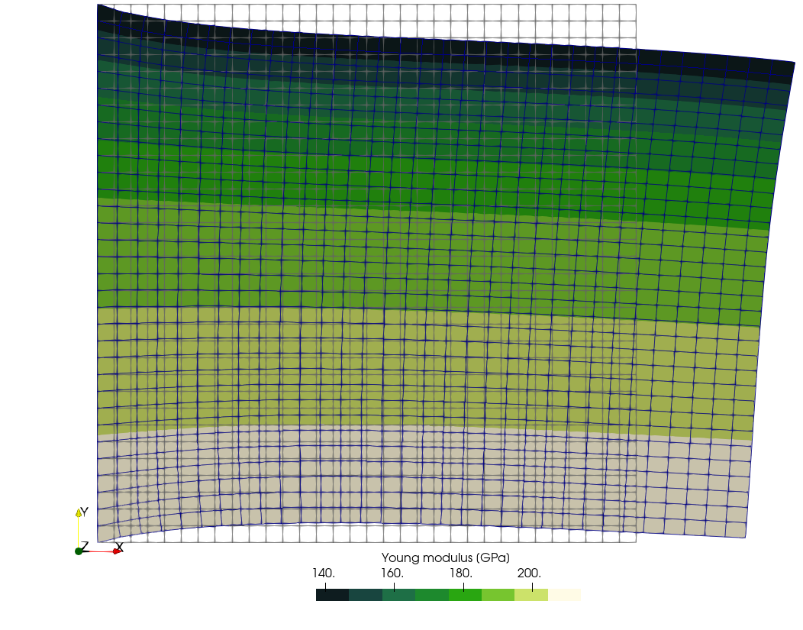
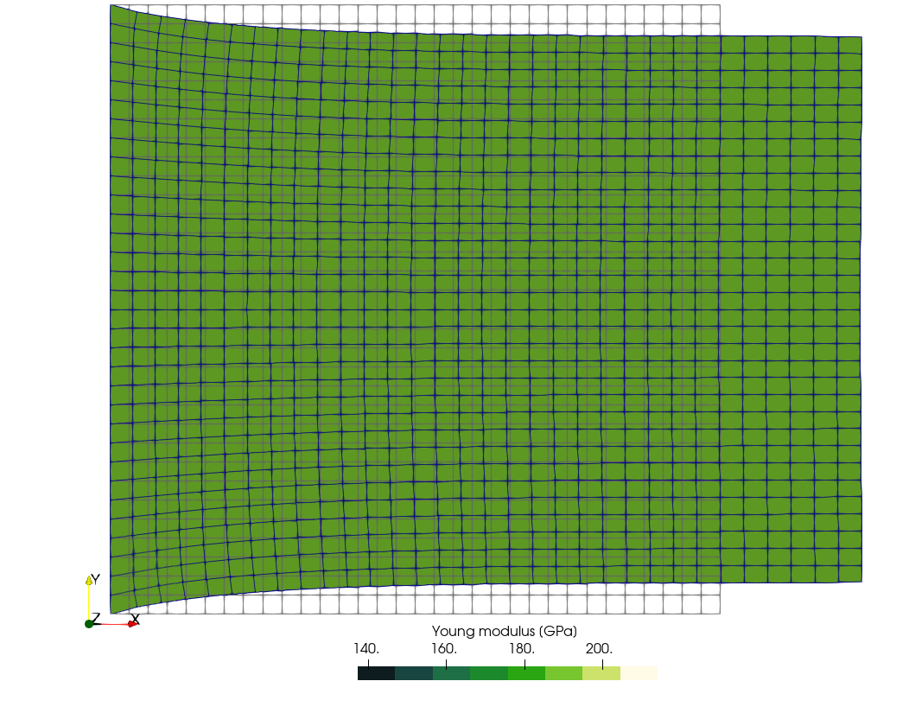
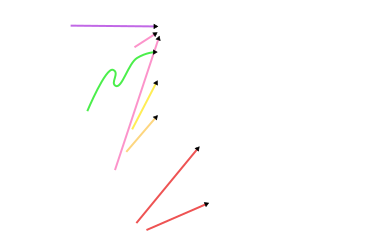
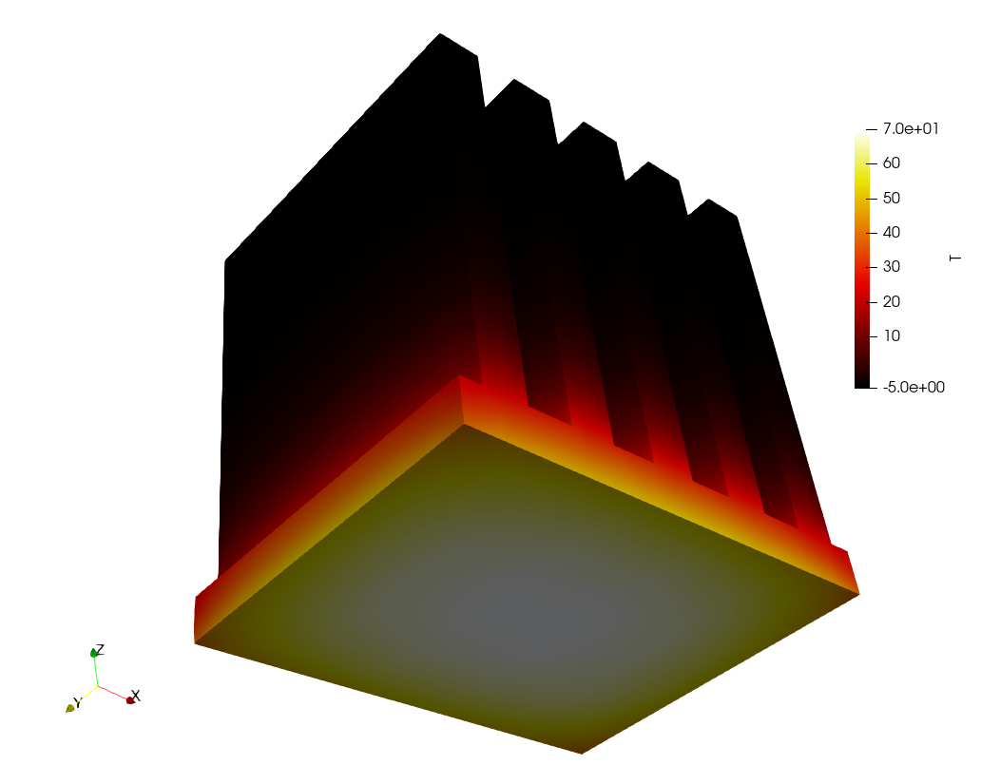
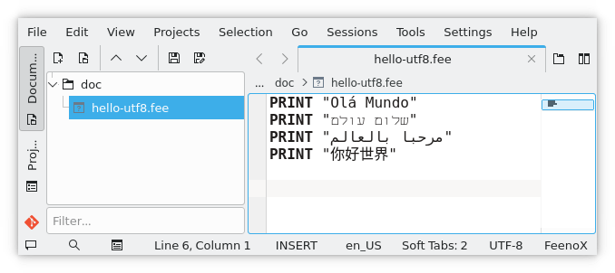
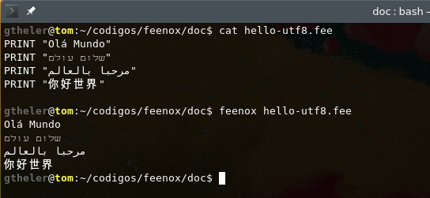

> T(x,y) := 200
38c38
< WRITE_MESH mechanical-square-temperature.vtk  E  VECTOR u v 0   
---
> WRITE_MESH mechanical-square-uniform.vtk  E  VECTOR u v 0   
$ feenox mechanical-square-uniform.fee 
$
```

::: {#fig:mechanical-square layout-ncol=2}




Mechanical plane-strain square with temperature-dependent Young modulus and comparison with uniform reference case.
:::


In real applications this distribution\ $T(x,y)$ can be read from the output of an actual heat conduction problem. See @sec:non-conformal for a revisit of this case, reading the temperature from an unstructured triangular mesh instead of hard-coding it as an algebraic expression of space.

So remember, in FeenoX *everything is an expression*---especially temperature, as also shown in the next section.

### Matching formulations {#sec:matching-formulations}


The [Lorenz’ dynamical system](http://en.wikipedia.org/wiki/Lorenz_system) system and the [NAFEMS\ LE10](https://www.nafems.org/publications/resource_center/p18/) benchmark problem, both discussed earlier in @sec:scope, illustrate how well the FeenoX input file matches the usual human-readable formulation of ODE or PDE problems.
In effect, @fig:nafems-le10-problem-input shows there is a trivial one-to-one correspondence between the sections of the problem formulated in a sheet of paper and the text file `nafems-le10.fee`.
The same effect can be seen in the NAFEMS LE11 problem, which involves a temperature distribution given as an algebraic expression of $\vec{x}$:

```include
nafems-le11.md
```

{#fig:nafems-le11-problem-input width_html=100% width_latex=100% width_texinfo=15cm} 

This feature can be better appreciated by comparing the input files needed to solve these kind of NAFEMS benchmarks with other finite-element tools. @Sec:le10-other gives a glimpse for the NAFEMS\ LE10 problem, where the input files are way too cryptic and cumbersome as compared to what FeenoX needs.


### Comparison of solutions {#sec:comparison-of-solutions}

One cornerstone design feature is that FeenoX has to provide a way to compare its numerical results with other already-know solutions---either analytical or numerical---in order to verify their validity. Indeed, being able to take the difference between the numerical result and an algebraic expression evaluated at arbitrary locations (usually quadrature points to compute~$L_p$ norms of the error) is a must if code verification through the Method of Manufactured Solutions is required (see @sec:mms).

Let us consider a one-dimensional slab reactor with uniform macroscopic cross sections

$$
\begin{aligned}
\Sigma_t &= 0.54628~\text{cm}^{-1} \\
\Sigma_s &= 0.464338~\text{cm}^{-1} \\
\nu\Sigma_f &= 1.70 \cdot 0.054628~\text{cm}^{-1}
\end{aligned}
$$

such that, if computed with neutron transport theory, is exactly critical with a width of $a = 2 \cdot 10.371065~\text{cm}$. Just to illustrate a simple case, we can solve it using the diffusion approximation with zero flux at both as. This case has an analytical solution for both the effective multiplication factor

$$
k_\text{eff} = \frac{\nu\Sigma_f}{(\Sigma_t - \Sigma_s) + D \cdot \left(\frac{\pi}{a} \right)^2}
$$

and the flux distribution

$$
\phi(x) = \frac{\pi}{2} \cdot \sin\left(\frac{x}{a} \cdot \pi\right)
$$

provided the diffusion coefficient\ $D$ is defined as

$$
D = \frac{1}{3 \cdot \Sigma_t}
$$


We can solve both the numerical and analytical problems in FeenoX, and more importantly, we can subtract them at any point of space we want:

```{.feenox include="neutron-diffusion-1d-null.fee"}
```

```terminal
$ feenox neutron-diffusion-1d-null.fee 
# x     phi1    phi_diff        phi1(x)-phi_diff(x)
+0.000  +0.000  +0.000  +0.000
+10.371 +1.574  +1.571  +0.003
+20.742 +0.000  +0.000  -0.000
+1.474  +0.348  +0.348  +0.001
+2.829  +0.654  +0.653  +0.001
+4.074  +0.911  +0.909  +0.002
+5.217  +1.118  +1.116  +0.002
+6.268  +1.280  +1.277  +0.002
+7.233  +1.399  +1.397  +0.003
+8.120  +1.483  +1.480  +0.003
+8.935  +1.537  +1.534  +0.003
+9.683  +1.565  +1.562  +0.003
+11.059 +1.565  +1.562  +0.003
+11.807 +1.537  +1.534  +0.003
+12.622 +1.483  +1.480  +0.003
+13.509 +1.399  +1.397  +0.003
+14.474 +1.280  +1.277  +0.002
+15.525 +1.118  +1.116  +0.002
+16.668 +0.911  +0.909  +0.002
+17.913 +0.654  +0.653  +0.001
+19.268 +0.348  +0.348  +0.001
# keff      =   0.96774162
# kdiff     =   0.96797891
# rel error =   -2.45e-04
$
```

Something similar could have been done for two groups of energy, although the equations get a little bit more complex so we leave it as an example in the Git repository.

A notable non-trivial thermo-mechanical problem that nevertheless has an analytical solution for the displacement field is the  [“Parallelepiped whose Young’s modulus is a function of the temperature”](https://www.seamplex.com/feenox/examples/#parallelepiped-whose-youngs-modulus-is-a-function-of-the-temperature) (@fig:parallelepiped).
The problem consists of finding the non-dimensional temperature\ $T$ and displacements\ $u$, $v$
and $w$ distributions within a solid parallelepiped of length\ $\ell$ whose base is a square of $h\times h$.
The solid is subject to heat fluxes and to a traction pressure at the same time.
The non-dimensional Young’s modulus\ $E$ of the material depends on the temperature\ $T$
in a know algebraically way, whilst both the Poisson coefficient\ $\nu$ and the thermal conductivity\ $k$
are uniform and do not depend on the spatial coordinates:

$$
\begin{aligned}
E(T) &= \frac{1000}{800-T} \\
\nu &= 0.3 \\
k &= 1
\end{aligned}
$$

](parallelepiped.svg){#fig:parallelepiped}

The thermal boundary conditions are

 * Temperature at point\ $A$ at $(\ell,0,0)$ is zero \label{temp0}
 * Heat flux $q^{\prime \prime}$ through $x=\ell$ is +2
 * Heat flux $q^{\prime \prime}$ through $x=0$ is -2
 * Heat flux $q^{\prime \prime}$ through $y=h/2$ is +3
 * Heat flux $q^{\prime \prime}$ through $y=-h/2$ is -3
 * Heat flux $q^{\prime \prime}$ through $z=h/2$ is +4
 * Heat flux $q^{\prime \prime}$ through $z=-h/2$ is -4

The mechanical boundary conditions are

 * Point $O$ at $(0,0,0)$ is fixed
 * Point $B$ at $(0,h/2,0)$ is restricted to move only in the\ $y$ direction
 * Point $C$ at $(0,0,/h2)$ cannot move in the\ $x$ direction
 * Surfaces\ $x=0$ and\ $x=\ell$ are subject to an uniform normal traction equal to one

The analytical solution is

$$
\begin{aligned}
T(x,y,z) &= -2x -3y -4z + 40 \\
u(x,y,z) &= \frac{A}{2} \cdot\left[x^2 + \nu\cdot\left(y^2+z^2\right)\right] + B\cdot xy + C\cdot xz + D\cdot x - \nu\cdot \frac{Ah}{4} \cdot \left(y+z\right) \\
v(x,y,z) &= -\nu\cdot \left[A\cdot x y + \frac{B}{2} \cdot \left(y^2-z^2+\frac{x^2}{\nu}\right) + C\cdot y z + D\cdot y -A\cdot h/4\cdot x - C\cdot h/4\cdot z\right] \\
w(x,y,z) &= -\nu\cdot \left[A\cdot x z + B\cdot yz + C/2\cdot \left(z^2-y^2+\frac{x^2}{\nu}\right) + D\cdot z + \frac{Ch}{4} \cdot y - \frac{Ah}{4} \cdot x\right] \\
\end{aligned}
$$

where~$A=0.002$, $B=0.003$, $C=0.004$ and~$D=0.76$.
The reference results are the temperature at points O and D and the displacements at points A and D (@tbl:parallelepiped}.

Point |  Unknown  |  Reference value
:----:|:---------:|:---------------------
  O   |    $T$    | +40.0
  D   |    $T$    | -35.0
  A   |    $u$    | +15.6
      |    $v$    | -0.57
      |    $w$    | -0.77
  D   |    $u$    | +16.3
      |    $v$    | -1.785
      |    $w$    | -2.0075

: Reference results the original benchmark problem {#tbl:parallelepiped}

First, the thermal problem is solved with FeenoX and the temperature distribution $T(x,y,z)$ is written into a `.msh` file.

```{.feenox include="neutron-diffusion-1d-null.fee"}
```

Then, the mechanical problem reads two meshes: one for solving the actual mechanical problem and another one for reading $T(x,y,z)$ from the previous step. Note that the former contains second-order hexahedra and the latter first-order tetrahedra. After effectively solving the problem, it writes again @tbl:parallelepiped in Markdown. 


### Run-time arguments {#sec:run-time-arguments}

The usage of run-time command-line arguments was illustrated in @sec:parametric.
The idea is that if the expression `$n` (or `${n}`) is found in the input file, the FeenoX parser expands the expression literally as the $n$-th non-optional argument in the command line.
The case $n=0$ is particular in the sense that, as explained in @sec:sugar, expands to the name of the input file without the leading directory path and the trailing extension `.fee`.

The definition [`DEFAULT_ARGUMENT_VALUE`](https://www.seamplex.com/feenox/doc/feenox-manual.html#default_argument_value) can be used to give a default value for arguments not provided.
otherwise, FeenoX would complain:

```terminal
$ echo "PRINT \$1" | feenox -
error: input file needs at least one more argument in commandline
$ echo -e "DEFAULT_ARGUMENT_VALUE 1 hello\nPRINT \$1" | feenox -
hello
$ 
```

This feature is extensively used in parametric and optimization runs such as in the [verification using the Method of Manufactured solutions](https://github.com/seamplex/feenox/tree/main/tests/mms):

```{.feenox include="thermal-square-mms.fee"}
```

which is called from a Bash loop that looks like

```bash
bcs="dirichlet neumann"
elems="tri3 tri6 quad4 quad8 quad9"
algos="struct frontal delaunay"
cs="4 6 8 10 12 16 20 24 30 36 48"

[...]

for bc in ${bcs}; do
 for elem in ${elems}; do
  for algo in ${algos}; do

    [...]
     
    for c in ${cs}; do
  
     name="thermal_square_${bc}-${elem}-${algo}-${c}"
   
     # prepare mesh
     if [ ! -e square-${elem}-${algo}-${c}.msh ]; then
       lc=$(echo "PRINT 1/${c}" | feenox -)
       gmsh -v 0 -2 square.geo ${elem}.geo ${algo}.geo -clscale ${lc} -o square-${elem}-${algo}-${c}.msh
     fi
   
     # run feenox
     feenox thermal-square.fee ${bc} ${elem} ${algo} ${c} ${vtk} | tee -a ${dat}.dat 
      
    done
 
    [...]
    
  done
 done
done
```

The full script can be found in [`tests/mms/thermal2d/2d/run.sh`](https://github.com/seamplex/feenox/blob/main/tests/mms/thermal/2d/run.sh).

In the input file above, the instruction [`WRITE_MESH`](https://www.seamplex.com/feenox/doc/feenox-manual.html#write_mesh) with an explicit file name was given

```feenox
WRITE_MESH thermal-square_$1-$2-$3-$4.vtk T q T_mms T(x,y)-T_mms(x,y)
```

because non-standard output fields are needed (namely `T_mms` and `T(x,y)-T_mms(x,y)`).
If the [`WRITE_RESULTS`](https://www.seamplex.com/feenox/doc/feenox-manual.html#write_results) is used without and explicit `FILE` keyword, the output file name is the basename of the input file and the expansion of all the arguments in the command line, i.e. `$0-[$1-[$2...]].msh`.

The study ["Comparison of resource consumption for different FEA programs"](https://github.com/seamplex/feenox/tree/main/tests/nafems/le10) also performs a parametric run on the mesh size using similar ideas.


### Git and macro-friendliness {#sec:git-friendliness}

The FeenoX input files as plain ASCII files by design.
This means that they can be tracked with Git or any other version control system so as to allow reliable traceability of computations. Along with the facts that FeenoX interacts well with
 
 a. Gmsh, that can either use ASCII input files as well or be used as an API from C, C++, Python and Julia, and
 b. Other scripting languages such as Bash, Python or even AWK, whose input files are ASCII files as well,
 
makes it possible to track a whole computation using FeenoX as a Git repository, as already exemplified in @sec:complex.
It is important to note that what files that should be tracked in Git include

 1. READMEs and documentation in Markdown
 2. Shell scripts
 3. Gmsh input files and/or scripts
 4. FeenoX input files

Files that should not be tracked include

 1. Documentation in HTML or PDF
 2. Mesh files
 3. VTK and result files

since in principle they could be generated from the files in the Git repository by executing the scripts, Gmsh and/or FeenoX.

Even more, in some cases, the FeenoX input files---following the Unix rule of generation @sec:unix-generation--can be created out of generic macros that create particular cases. For example, say one has a mesh of a fin-based dissipator where all the surfaces are named `surf_1_`$i$ for $i=1,...,26$. All of them will have a convection boundary condition while surface number\ 6 is the one that is attached to the electronic part that has to be cooled. Instead of having to "manually" giving the list of surfaces that have the convection condition, we can use M4 to do it for us:

```{.feenox include="fins.fee.m4"}
```

Note that since FeenoX was born in Unix, we can pipe the output of `m4` to FeenoX directly by using `-` as the input file in the command line:

```terminal
$ m4 fins.fee.m4 | feenox -
$
```

@Fig:fins-temperature confirms that all the faces have the right boundary conditions: face number six got the power BC and all the rest got the convection BC.

{#fig:fins-temperature}


Besides being ASCII files, should special characters be needed for any reason within a particular application of FeenoX, UTF-8 characters can be used natively as illustrated in @fig:utf-8.

::: {#fig:utf-8 layout-ncol=2}




Special characters in Kate and in Bash.
:::


## Results output {#sec:output}

> ```include
> 320-output.md
> ```

The output in FeenoX is 100% user defined, i.e. everything that FeenoX writes comes from one of the following output instructions:

 * [`PRINT`](https://www.seamplex.com/feenox/doc/feenox-manual.html#print)
 * [`PRINTF`](https://www.seamplex.com/feenox/doc/feenox-manual.html#printf)
 * [`PRINT_FUNCTION`](https://www.seamplex.com/feenox/doc/feenox-manual.html#print_function)
 * [`PRINT_VECTOR`](https://www.seamplex.com/feenox/doc/feenox-manual.html#print_vector)
 * [`WRITE_MESH`](https://www.seamplex.com/feenox/doc/feenox-manual.html#write_mesh)
 * [`WRITE_RESULTS`](https://www.seamplex.com/feenox/doc/feenox-manual.html#write_results)
 * [`DUMP`](https://www.seamplex.com/feenox/doc/feenox-manual.html#dump)

In the absence of any of these instructions, FeenoX _will not_ write anything.
Not in the standard output, not in any other file. Nothing (Unix rule of silence, @sec:unix-silence).

 Computer | Monthly Rental  | Relative Speed | First Delivery 
:----------------|:------------------------:|:-----------:|:-----------:
 CDC 3800        |         $ 50,000         |     1       |  Jan 66
 CDC 6600        |         $ 80,000         |     6       |  Sep 64
 CDC 6800        |         $ 85,000         |     20      |  Jul 67
 GE 635          |         $ 55,000         |     1       |  Nov 64
 IBM 360/62      |         $ 58,000         |     1       |  Nov 65
 IBM 360/70      |         $ 80,000         |     2       |  Nov 65
 IBM 360/92      |         $ 142,000        |     20      |  Nov 66
 PHILCO 213      |         $ 78,000         |     2       |  Sep 65
 UNIVAC 1108     |         $ 45,000         |     2       |  Aug 65

: Relative speed is expressed with reference to IBM 7030. Data for computers expected to appear after 1965 was estimated. {#tbl:1965}

This is a sound design decision that follows the Unix rules of silence and, more importantly, of economy.
In effect, more than fifty years ago CPU time was far more expensive than engineering time (@tbl:1965).
At that time, engineering programs had to write _everything_ they computed because it was too expensive to re-run the calculation in case a single result was missing.

Nowadays the engineering time is far more expensive than CPU time.
Therefore, the time needed for the user to find and process a single result in a soup of megabytes of a cluttered output file far outweighs the cost of running a computation from scratch with the needed result as the only output.
Especially if the expensive engineers are smart enough to set up the problem using a coarse mesh and run the actual fine execution only after having checked everything works as expected.

The input file from the [tensile-test tutorial](https://www.seamplex.com/feenox/doc/tutorials/110-tensile-test/) illustrates this idea: only 8 lines are needed to define and solve the problem (including the instructions [`SOLVE_PROBLEM`](https://www.seamplex.com/feenox/doc/feenox-manual.html#solve_problem) and [`COMPUTE_REACTION`](https://www.seamplex.com/feenox/doc/feenox-manual.html#compute_reaction)) and almost twice as much instructions for getting the required output as needed (mostly [`PRINT`](https://www.seamplex.com/feenox/doc/feenox-manual.html#print)s and one [`WRITE_RESULTS`](https://www.seamplex.com/feenox/doc/feenox-manual.html#write_results)):

```{.feenox include="tensile-test.fee"}
```


Moreover, when solving PDEs, FeenoX will be also smart enough not to compute quantities which are not going to be written anywhere.
For example, if the input file does not reference the principal stress `sigma1` (or [`WRITE_RESULTS`](https://www.seamplex.com/feenox/doc/feenox-manual.html#write_results) does not ask for it) then FeenoX will not compute it.

### Output formats {#sec:output-formats}

With the ASCII output to standard output (and other text files) controlled with `PRINT`-like instructions, YAML or JSON outputs can be easily implemented within the input file itself.
For example,

```feenox
DEFAULT_ARGUMENT_VALUE 1 "hello world"
phi = (1+sqrt(5))/2 

PRINTF "a: %.3f" 1/3
PRINT TEXT "phi:" phi SEP " "
PRINT message: ${1}   SEP " "
```

would give

```terminal
$ feenox yaml.fee | tee test.yaml | yq .
{
  "a": 0.333,
  "phi": 1.61803,
  "message": "hello world"
}
$ cat test.yaml 
a: 0.333
phi: 1.61803
message: hello world
$ 
```

Now, JSON is more picky and care with quoted characters is needed:

 1. Curly brackets `{` and `}` are used for multi-line input in FeenoX so they have to be quoted as `\{` and `\}`.
 2. Double quotes `"`  are used to delimit keywords with blanks, so they also have to be quoted `\"` when appearing verbatim in an output token.

```feenox
DEFAULT_ARGUMENT_VALUE 1 "hello world"
phi = (1+sqrt(5))/2 

PRINTF "\{ \"a\": %.3f," 1/3
PRINT  TEXT "\"phi\":" phi ,
PRINT  "\"message\": \"${1}\" \}"
```

```terminal
$ feenox json.fee | jq .
{
  "a": 0.333,
  "phi": 1.61803,
  "message": "hello world"
}
$
```

In the same sense, in principle any ASCII-based format can be implemented this way.
Markdown output, which can then be converted to other formats as well (such as LaTeX which can then create professionally-looking tables as in @fig:latex-tables), has been already covered in @sec:interoperability.

Current version can write space and time-dependent distributions into Gmsh's `.msh` and VTK's `.vtk` formats.
Both of them are open standard and have open-source readers.
Other formats such as VTK's `.vtu` or CalculiX's `.frd` should be easy to add, but in any case the mesh data converters such as [Meshio](https://github.com/nschloe/meshio) can be used to convert FeenoX's post-processing output to other formats as well.


### Data exchange between non-conformal meshes {#sec:non-conformal}

To illustrate how the output of a FeenoX execution can be read by another FeenoX instance, let us revisit the plane-strain square from @sec:expression. This time, instead of setting the temperature with an algebraic expression, we will solve a thermal problem that gives rise to the same temperature distribution but on a different mesh.

First, we solve a thermal problem on the same square\ $[-1,+1]\times[-1,+1]$ such that the resulting temperature field is $T(x,y) = 200 + 350\cdot y$:

```{.feenox include="thermal-square.fee"}
```

Now, we read the temperature\ $T(x,y)$ from the thermal output mesh file `thermal-square-temperature.msh` (which is a triangular unstructured grid) into the mechanical input mesh file `square-centered.msh` (which is a structured quadrangular grid):

```{.feenox include="mechanical-square-temperature-from-msh.fee"}
```

Indeed, the terminal mimic shows the difference between the mechanical input from this section and the one that used an explicit algebraic expression.

```terminal
$ gmsh -2 square-centered-unstruct.geo 
[...]
Info    : Done meshing 2D (Wall 0.012013s, CPU 0.033112s)
Info    : 65 nodes 132 elements
Info    : Writing 'square-centered-unstruct.msh'...
Info    : Done writing 'square-centered-unstruct.msh'
Info    : Stopped on Wed Aug  3 17:47:39 2022 (From start: Wall 0.0208329s, CPU 0.064825s)
$ feenox thermal-square.fee 
$ feenox mechanical-square-temperature-from-msh.fee 
$ diff mechanical-square-temperature-from-msh.fee mechanical-square-temperature.fee
26,27c26,29
< # read the temperature from a previous result
< READ_MESH thermal-square-temperature.msh DIM 2 READ_FUNCTION T
---
> 
> # known temperature distribution
> # (we could have read it from an outpout of a thermal problem)
> T(x,y) := 200 + 350*y
36c38
< WRITE_MESH mechanical-square-temperature-from-msh.vtk  E T VECTOR u v 0   
---
> WRITE_MESH mechanical-square-temperature.vtk  E  VECTOR u v 0   
$ 
```

# Quality assurance {#sec:qa}

> ```include
> 400-qa.md
> ```

The development of FeenoX is tracked with the distributed version control system Git.
The official repository is hosted on Github at <https://github.com/seamplex/feenox/>.
New non-trivial features are added in new branches which are then eventually merged into the main branch.

Note that nowadays mentioning that the source code of a piece of software is tracked with Git (why wouldn't it?) is like saying a hotel has a private bathroom in each room (why wouldn't it?). But the reader ought to keep in mind that there is a non-negligible fraction of production calculation codes (even nuclear-related) whose source code is _not_ tracked with a DVCS, let alone features and bugfixes follow the branch-review-merge path.

## Reproducibility and traceability {#sec:traceability}

> ```include
> 410-reproducibility.md
> ```

As stated in the previous section, the official repository is freely available on Github.
As long as the copying conditions (GPLv3+) are met, the repository can be freelu cloned and/or forked.

Each binary executable `feenox` has embedded a literal string with the version of the source code used to build it.
When running without arguments, it will print the version (which includes the hash of the last commit to the repository) and the usage:

```terminal
$ feenox
FeenoX v1.0.7-g9b98430 
a cloud-first free no-fee no-X uniX-like finite-element(ish) computational engineering tool

usage: feenox [options] inputfile [replacement arguments] [petsc options]

  -h, --help         display options and detailed explanations of commmand-line usage
  -v, --version      display brief version information and exit
  -V, --versions     display detailed version information
  -c, --check        validates if the input file is sane or not
  --pdes             list the types of PROBLEMs that FeenoX can solve, one per line
  --elements_info    output a document with information about the supported element types
  --linear           force FeenoX to solve the PDE problem as linear
  --non-linear       force FeenoX to solve the PDE problem as non-linear

Run with --help for further explanations.
$ 
```

As required by the GNU Standards, running with `-v` or `--version` will print copyright information as well:

```terminal
$ feenox -v
FeenoX v1.0.7-g9b98430 
a cloud-first free no-fee no-X uniX-like finite-element(ish) computational engineering tool

Copyright © 2009--2024 Seamplex, https://seamplex.com/feenox
GNU General Public License v3+, https://www.gnu.org/licenses/gpl.html. 
FeenoX is free software: you are free to change and redistribute it.
There is NO WARRANTY, to the extent permitted by law.
$ 
```

And running with `-V` or `--versions` will print detailed versioning information about 

 #. the date and time of the last commit to the repository
 #. the date and time of compilation
 #. the architecture, compiler type, version and flags used to build the executable
 #. the versions of the external numerical libraries used to link the executable

```terminal
$ feenox --versions
FeenoX v1.0.7-g9b98430 
a cloud-first free no-fee no-X uniX-like finite-element(ish) computational engineering tool

Last commit date   : Tue Mar 19 16:17:30 2024 -0300
Build date         : Wed Mar 20 07:40:34 2024 -0300
Build architecture : linux-gnu x86_64
Compiler version   : gcc (Debian 12.2.0-14) 12.2.0
Compiler expansion : gcc -Wl,-z,relro -I/usr/include/x86_64-linux-gnu/mpich -L/usr/lib/x86_64-linux-gnu -lmpich
Compiler flags     : -O3 -flto=auto -no-pie
Builder            : gtheler@tom
GSL version        : 2.7.1
SUNDIALS version   : N/A
PETSc version      : Petsc Development GIT revision: v3.20.5-856-g0d3f65ad054  GIT Date: 2024-03-20 02:13:21 +0000
PETSc arch         : arch-linux-c-debug
PETSc options      : --download-eigen --download-hdf5 --download-hypre --download-metis --download-mumps --download-parmetis --download-scalapack --download-slepc --with-64-bit-indices=no --with-debugging=yes --with-precision=double --with-scalar-type=real PETSC_ARCH=arch-linux-c-debug --force
SLEPc version      : SLEPc Development GIT revision: v3.20.1-36-g7a35a7b97  GIT Date: 2023-12-02 02:30:03 -0600
$ 
```

The version is composed of three dot-separted integers: 

 #. the major version (major changes)
 #. the minor version (incompatible input changes)
 #. the revision (individual commits from last tag)

The `autogen.sh` script builds this string at compile time, which is stored in a header and finally embedded into the executable.
Periodically, source and binary tarballs are built (using automated scripts in the `dist` subdirectory) and published online.

Given the input-file scheme thoroughfully explained in @sec:input---especially the separation of the problem formulation from the mesh data--the input files can be tracked with Git (or any other VCS) as well, therefore enhancing traceability of results and data governance.
Again, this might be obvious in the 2020s. But there are many FEM solvers which mix the mesh data with the problem definition (e.g. when external loads have to be given at the nodes instead of using expressions like `p=rho*g*z` or `Fx=1e3`).

## Automated testing {#sec:testing}


> ```include
> 420-testing.md
> ```

The `make check` target will execute a set of Bash scripts which will run hundreds of cases and compare their solutions to reference values.
These references might be

 i. analytical solutions,
 ii. known reference solutions, or
 iii. random reference solutions.
 
Depending on the type of case being run, some of these tests might work as very simplified verification cases.
But the bulk work as regressions tests so developers adding new features can check they do not break existing working code.

For example, if by mistake a developer flips a sign of one term when setting convection boundary conditions in the heat-conduction PDE, i.e. from

```c
double rhs = h*Tref;
```

to 

```c
double rhs = -h*Tref;
```

then the `make check` step will detect it:

```terminal
```

## Bug reporting and tracking


> ```include
> 430-bugs.md
> ```

github


## Verification {#sec:verification}

> ```include
> 440-verification.md
> ```


open source (really, not like CCX -> mostrar ejemplo)
GPLv3+ free
Git + gitlab, github, bitbucket

### Method of Exact Solutions {#sec:mes}

### Method of Manufactured Solutions {#sec:mms}

## Validation

> ```include
> 450-validation.md
> ```

already done for Fino

hip implant, 120+ pages, ASME, cases of increasing complexity

## Documentation {#sec:documentation}

> ```include
> 460-documentation.md
> ```

it's not compact, but almost!
Compactness is the property that a design can fit inside a human being's head. A good practical test for compactness is this: Does an experienced user normally need a manual? If not, then the design (or at least the subset of it that covers normal use) is compact.
unix man page
markdown + pandoc = html, pdf, texinfo


```include
sds-appendices.md
```


```include
sds-appendices.md
```
