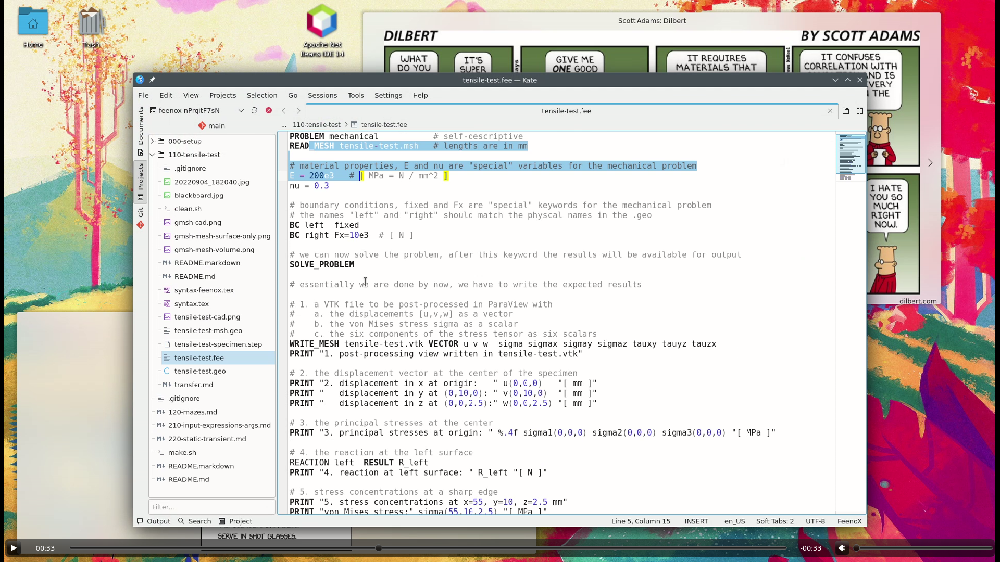

---
title: Tensile test
subtitle: FeenoX Tutorial \#1
titleblock: |
 FeenoX Tutorial \#1: Tensile test
 =================================
lang: en-US
number-sections: true
toc: true
prev_link: ../000-setup
prev_title: \#0 Setup your system
next_link: ../120-mazes
next_title: \#2 Solving mazes without AI
...

# Foreword {#sec:foreword}

Welcome to **FeenoX’s tutorial number one**. Good for you!
This first case...
 
 1. serves as a step-by-step tutorial to use [FeenoX](https://www.seamplex.com/feenox/) for the first time.
 2. shows that [FeenoX](https://www.seamplex.com/feenox/) does what a finite-element(ish) tool is supposed to do, and
 3. (last but not least) illustrates [FeenoX](https://www.seamplex.com/feenox/)’ design basis and the philosophy behind its implementation (spoiler alert, it's the [Unix philosophy](https://en.wikipedia.org/wiki/Unix_philosophy), discussed in @sec:unix) and encourages the reader to consider and evaluate the differences (both advantages and disadvantages) between the approach proposed in this tutorial with traditional both free and non-free finite-element programs,.

> **Heads up**: this tutorial, being the first is also detailed and long. Those impatient readers might want to check directly some of the [annotated examples](https://seamplex.com/feenox/examples/) in [FeenoX webpage](https://seamplex.com/feenox/).
 
## Summary
 
 * Here is a 1-min video of what we are going to go through during the tutorial:

   :::: {.not-in-format .latex}
   {width=100%}\ 
   ::::

   :::: {.only-in-format .latex}
   {width=100% width_latex=100%}\ 
   ::::

     
 * We are going to understand what each of the parts of the [FeenoX](https://www.seamplex.com/feenox/) input file does:

   ```{.feenox include="tensile-test.fee"}
   ```

 * We are going to run
     
    1. [Gmsh](http://gmsh.info/),
    2. [FeenoX](https://www.seamplex.com/feenox/), and
    3. [ParaView](https://www.paraview.org/)
    
   to obtain the results listed in @sec:expected.
   Note that these three tools (and any other tool used throuhgout any of the tutorials, including the operating system is free (as an “free speech”) and open source (as in “the source code is available”).

 * We are going to illustrate that [FeenoX](https://www.seamplex.com/feenox/) (and [Gmsh](http://gmsh.info/) and up to some degree, [ParaView](https://www.paraview.org/) as well) works very much like an engineering “transfer function” between one (or more) input files and zero (or more) output files (which might include the terminal):

   ```include
   transfer.md
   ```
   
   This design-basis decision has to do both with
    
    1. The fact that [FeenoX](https://www.seamplex.com/feenox/) is a **cloud-first** tool. Not cloud friendly nor cloud native, but **cloud first**.
    2. The Unix Philosophy, discussed in @sec:unix.

   
{width=100%}

 
 
# Problem description {#sec:problem}

A tensile test specimen of nominal cross-sectional area\ $A = 20~\text{mm} \times 5~\text{mm} = 100~\text{mm}^2$ is fully fixed on one end (flat end face normal to the $x$ axis at $x<0$, magenta surface not shown) and a tensile load of $F_x = 10~\text{kN}$ is applied at the other end (flat end face at $x>0$, green surface). The Young modulus is\ $E=200~\text{GPa}$ and the Poisson’s ratio is\ $\nu=0.3$.


::: {#fig:tensile-cad}
```{=html}
<div class="ratio ratio-16x9">
 <iframe src="https://www.caeplex.com/project/problem.php?id=41dd1&embed" allowfullscreen></iframe>
</div>
```
```{=latex}
\includegraphics[width=0.95\linewidth]{tensile-test-cad.png}
```

Tensile test specimen CAD from CAEplex <https://caeplex.com/p/41dd1> `(rotate and zoom it)`{=html}
:::


## Expected results {#sec:expected}

 1. Compute the displacement and stress distribution within the geometry. Create pictures of their distribution with a post-processing tool.
 2. Show that the specimen experiences elongation along the\ $x$ axis and a mild contraction in\ $y$ (and even milder in $z$).
 3. Check that the normal tension at the center of the specimen matches the theoretical solution $\sigma_x = F_x/A$
 4. Check that the reaction at the fixed end balances the external load\ $\mathbf{F}$ applied at the opposite face.
 5. Show that there are stress concentrations at the heads of the coupon.


# Geometry and mesh {#sec:mesh}

Following the general idea of performing only one thing well (thoroughly discussed in the [FeenoX Software Design Specification](https://seamplex.com/feenox/doc/sds.html)), and the particular Unix rules (@sec:unix) of

 a. [composition](https://homepage.cs.uri.edu/~thenry/resources/unix_art/ch01s06.html#id2877684), and
 b. [parsimony](https://homepage.cs.uri.edu/~thenry/resources/unix_art/ch01s06.html#id2878022)
 
the generation of the set of nodes and elements required to perform a mechanical computation using the finite element method is outside of [FeenoX](https://www.seamplex.com/feenox/)’ scope. That is to say,

> The finite-element mesh is not a direct _input_ of [FeenoX](https://www.seamplex.com/feenox/). 
> It has to be created and stored in a separate file which is then referred from the actual input file.

In the particular case of the tensile test problem, the geometry is given as a [STEP file](tensile-test-specimen.step).
It is meshed by [Gmsh](http://gmsh.info/) (or, following the rule of [diversity](https://homepage.cs.uri.edu/~thenry/resources/unix_art/ch01s06.html#id2879078), any other meshing tool which can write meshes in [MSH format](http://gmsh.info/doc/texinfo/gmsh.html#MSH-file-format)
keeping information about [physical groups](http://gmsh.info/doc/texinfo/gmsh.html#Elementary-entities-vs-physical-groups)).

A 3D CAD file consists of volumes, surfaces, edges and vertices. Each volume is defined by a set its boundary surfaces, each surface by a set of its boundary edges, and each edge by a set of its boundary vertices. Depending on the problem dimension, these geometrical entities will be linked to either material properties or boundary conditions:


|  Problem dimension  |    Material properties     |      Boundary conditions      |
|:-------------------:|:--------------------------:|:------------------------------:
|          3          |         Volumes            | Surfaces, edges and vertices  |
|          2          |         Surfaces           | Edges and vertices            |
|          1          |         Edges              | Vertices                      |

Even though mathematically speaking the whole boundary of the domain ought to have an associated boundary condition, depending on the type of physical problem being solved, some entities in the boundary might not need to have an explicit boundary condition. For instance, when solving a mechanical problem, those surfaces without an explicit condition are treated as “free” surfaces, i.e. free to deform with a traction identically zero without a prescribed displacement. For a thermal heat-conduction problem, free surfaces usually mean they are treated as adiabatic. In general, each case has to be checked with the documentation of the finite-element tool being used to solve the problem. In the case of FeenoX, we will walk through them togeteher.

The creation of a finite-element mesh involves basically four steps:

 1. reading the CAD file with the continuous domain of the problem,
 2. identifying the continuous volumes that will be linked to material properties,
 3. identifying the continuous surfaces, edges and vertices that will be linked to boundary conditions ,
 4. setting up meshing options, such as the elements’
    * type: tetrahedra or hexahedra (there might be transition elements such as wedges, pyramids, etc. as well)
    * order: linear or quadratic (higher-order elements are not currently supported in FeenoX)
    * sizing: characteristic edge sizes, possible locally-refined
    * quality: extra optimization steps to remove negative jacobians (in curved second-order elements) and improve overall mesh quality
    * etc.

Since we are solving a mechanical problem with [FeenoX](https://www.seamplex.com/feenox/), any surface (or edge or vertex) that does not have an explicit boundary condition will act as a free surface (homogeneous traction). Also, the problem asks for conditions on only two surfaces, namely the two longitudinal ends of the tensile test specimen so we have to identify only these two faces. Moreover, since there is only one volume in the CAD file we do not need to explicitly link it to material properties (as there is only one, the link is trivial and it is performed automatically by [FeenoX](https://www.seamplex.com/feenox/) as explained in the next section). But still, we need to identify it so as to have [Gmsh](http://gmsh.info/) to generate the bulk elements.

 0. If you have not already, clone the [FeenoX repository](https://github.com/seamplex/feenox/) and `cd` to [`doc/tutorials/110-tensile-test`](https://github.com/seamplex/feenox/tree/main/doc/tutorials/110-tensile-test). Make sure you have `git` installed first.
 
    ```terminal
    $ sudo apt-get install git
    [...]
    $ git clone https://github.com/seamplex/feenox/
    Cloning into 'feenox'...
    remote: Enumerating objects: 8224, done.
    remote: Counting objects: 100% (1126/1126), done.
    remote: Compressing objects: 100% (567/567), done.
    remote: Total 8224 (delta 599), reused 959 (delta 528), pack-reused 7098
    Receiving objects: 100% (8224/8224), 20.76 MiB | 17.25 MiB/s, done.
    Resolving deltas: 100% (5873/5873), done.
    $ cd feenox/doc/tutorials/110-tensile-test
    $
    ```
 

 1. In a shell capable of doing graphics, open the file `tensile-test-specimen.step` with [Gmsh](http://gmsh.info/):

    ```terminal
    $ gmsh tensile-test-specimen.step
    ```

 2. Rotate the model until you see the whole 3D geometry and ask [Gmsh](http://gmsh.info/) to show the ids of the geometrical surfaces by going to
 
    * Tools $\rightarrow$ Options $\rightarrow$ Geometry $\rightarrow$ Surface labels
    
    You should see something like this:
    
    \ 

 3. Note that the left-most (in the $x$ axis) surface has an id of one and the right-most surface has an id of seven. That's all we need to know about the CAD model, that the "left" surface is 1 in the STEP and that "right" is 7. You can close the [Gmsh](http://gmsh.info/) graphical window now.

 4. Open your text editor (mine is [Kate](../000-setup) with syntax highlighting set to "C") and create a file named [`tensile-test.geo`](tensile-test.geo) with the following content:

    ```{.c include="tensile-test.geo"}
    ```
    
 5. Call [Gmsh](http://gmsh.info/) from the shell passing `-3` as the first parameter and `tensile-test.geo` as the second to create a three-dimensional mesh (that is what the `-3` means)  named `tensile-test.msh` (this step does not need to have a graphical terminal):
  
    ```terminal
    $ gmsh -3 tensile-test.geo
    Info    : Running 'gmsh -3 tensile-test.geo' [Gmsh 4.10.5, 1 node, max. 1 thread]
    Info    : Started on Sat Sep 10 15:22:59 2022
    Info    : Reading 'tensile-test.geo'...
    Info    : Reading 'tensile-test-specimen.step'...
    Info    :  - Label 'Shapes/ASSEMBLY/=>[0:1:1:2]/Pad' (3D)
    Info    :  - Color (0.8, 0.8, 0.8) (3D & Surfaces)
    Info    : Done reading 'tensile-test-specimen.step'
    Info    : Done reading 'tensile-test.geo'
    Info    : Meshing 1D...
    Info    : [  0%] Meshing curve 1 (Line)
    Info    : [ 10%] Meshing curve 2 (Line)
    Info    : [ 10%] Meshing curve 3 (Line)
    [...]
    -----8<----- more output cut out -----8<-----
    [...]
    Info    : Final volume mesh: worst distortion = 0.796943 (0 elements in ]0, 0.2])
    Info    : Done applying elastic analogy to high-order mesh (0.652083 s)
    Info    : Done optimizing mesh (Wall 0.595085s, CPU 0.652091s)
    Info    : 10754 nodes 8949 elements
    Info    : Writing 'tensile-test.msh'...
    Info    : Done writing 'tensile-test.msh'
    Info    : Stopped on Sat Sep 10 15:23:01 2022 (From start: Wall 1.35632s, CPU 1.62598s)
    $
    ```
    
    If you don't like [Gmsh](http://gmsh.info/)' verbosity, you can change it with the command-line option `-v`.
    I recommend you read its [extensive documentation](http://gmsh.info/doc/texinfo/gmsh.html) for further details.
    
 6. Now that the mesh file has been created, you can open it with the [Gmsh](http://gmsh.info/) GUI to check how it looks like.
 
    ```terminal
    $ gmsh tensile-test.msh
    ```
    
    By default, [Gmsh](http://gmsh.info/) will show you something like this:
    
    \ 
    
    
    Here you can see that both end surfaces have "explicit" triangles while the rest of the surfaces seem to be hollow. This comes from the fact that we defined physical groups only for the two end faces and not for the rest of the faces---which is perfectly fine. We can ask for a nicer view by going to
    
     * Tools $\rightarrow$ Options $\rightarrow$ Mesh $\rightarrow$ 3D element faces
     
    We can then add a clipping plane to peek at the tetrahedra in the bulk of the specimen:
    
     * Tools $\rightarrow$ Clipping $\rightarrow$ Mesh $\rightarrow$ $A=0$, $B=1$, "Keep whole elements"
     
    Now you should get 
    
    \ 
    
    Feel free to close [Gmsh](http://gmsh.info/) now, we are done with it.


In general, multi-solid problems need to have different physical volumes in order for [FeenoX](https://www.seamplex.com/feenox/) to be able to set different mechanical properties. Even though this simple problem has a single solid and an explicit link is not needed, a physical volumetric group is needed in order for [Gmsh](http://gmsh.info/) to write the volumetric elements (i.e. tetrahedra) into the [output MSH file](tensile-test.msh) (which is an input for [FeenoX](https://www.seamplex.com/feenox/)).

The usage of [physical groups](http://gmsh.info/doc/texinfo/gmsh.html#Elementary-entities-vs-physical-groups) to define boundary conditions follows the rule of [representation](https://homepage.cs.uri.edu/~thenry/resources/unix_art/ch01s06.html#id2878263) as it folds knowledge into data instead of focusing on algorithmically setting loads on individual nodes, which is a common practice among some finite-element solvers. The reason is that asking for nodal loads in the solver’s input file makes the programmer’s life easier but the user’s life harder.
However, complicating things for a few developers only once but simplifying things for a lot of users during the lifespan of an engineering software tool is definitely a wise design choice.

This approach of using physical groups to set boundary conditions that refer to actual CAD faces means that the formulation of the problem being solved is completely determined from the continuous CAD geometry and does not depend on the details of the mesh. 
This allows for [extensibility](https://homepage.cs.uri.edu/~thenry/resources/unix_art/ch01s06.html#id2879112) in at least two ways:

 1. The mesh can be refined (or coarsened) arbitrarily, either by
 
     #. changing the value of `Mesh.MeshSizeMax` in the GEO file,
     #. passing a refinement factor in [Gmsh](http://gmsh.info/)’s command-line option `-clscale`, and/or
     #. using one of the many [ways of specifying mesh element sizes](http://gmsh.info/doc/texinfo/gmsh.html#Specifying-mesh-element-sizes),

    and then using it in [FeenoX](https://www.seamplex.com/feenox/) with _exactly the same input file_. There is no need to re-compute nodal loads nor to perform any other pre-processing step, providing [simplicity](). More advanced tutorials (and some examples such as [this one](https://www.seamplex.com/feenox/examples/#parametric-study-on-a-cantilevered-beam)) show how to perform parametric mesh convergence studies (and even [optimization loops](https://www.seamplex.com/feenox/examples/#optimizing-the-length-of-a-tuning-fork)).
    
 2. A mesh with many physical groups can be used for many cases (say a tensile case first and a bending case later) where they set different boundary conditions on different sets of physical groups. This provides [clarity](https://homepage.cs.uri.edu/~thenry/resources/unix_art/ch01s06.html#id2877610).


# FeenoX Input file {#sec:input}

[FeenoX](https://www.seamplex.com/feenox/) reads a plain-text input file---which in turns also reads the mesh generated in the previous section---that defines the problem, asks [FeenoX](https://www.seamplex.com/feenox/) to solve it and writes whatever output is needed. See section “Interfaces” in the [SDS](https://seamplex.com/feenox/doc/sds.html#interfaces) for a thorough discussion of both inputs and outputs.

The input file is a [syntactically-sweetened](http://en.wikipedia.org/wiki/Syntactic_sugar) way to ask the computer to perform the actual computation (which is what computers do). This input file, as illustrated in the example below lives somewhere near the English language so a person can read through it from the top down to the bottom and more or less understand what is going on (rule of [least surprise](https://homepage.cs.uri.edu/~thenry/resources/unix_art/ch01s06.html#id2878339)). The idea is that this input file should match as much as possible the definition of the problem as an engineer would cast it in a plain sheet of paper (or blackboard).

{#fig:blackboard}

Yet in the extreme case that the complexity of the problem asks for, the input file could be machine-generated by a script or a macro (rule of [generation](https://homepage.cs.uri.edu/~thenry/resources/unix_art/ch01s06.html#id2878742)).
Or if the circumstances call for an actual graphical interface for properly processing (both pre and post) the problem, the input file could be created by a separate cooperating front-end such as [CAEplex](https://www.caeplex.com) in [@fig:tensile-cad] above (rule of [separation](https://homepage.cs.uri.edu/~thenry/resources/unix_art/ch01s06.html#id2877777)).
In any case, the input files---both for [Gmsh](http://gmsh.info/) and for [FeenoX](https://www.seamplex.com/feenox/)---can be tracked with [Git](https://en.wikipedia.org/wiki/Git) in order to increase traceability and repeatability of engineering computations.
This is not true for most of the other FEA tools available today, particularly the ones that do not follow McIlroy’s recommendations above.

Given that the problem is relatively simple, following the rule of [simplicity](https://homepage.cs.uri.edu/~thenry/resources/unix_art/ch01s06.html#id2877917),
the input file [`tensile-test.fee`](tensile-test.fee) ought to be also simple. Other cases with more complexity might lead to more complex input files.

Out of the full input file listed in @sec:foreword, the lines that actually ask [FeenoX](https://www.seamplex.com/feenox/) to perform the problem at hand are:

```{.feenox include="tensile-test-base.fee"}
```

The details of why, how and what “FeenoX input files” look like is discussed in [section\ 3.1 of the Software Design Specification](https://www.seamplex.com/feenox/doc/sds.html#sec:input).
TL; DR: there are

 * definitions (nouns), and
 * instructions (verbs).
 
The first line is a _definition_ (“problem” is a noun) that asks [FeenoX](https://www.seamplex.com/feenox/) to solve a mechanical problem.
The second line is an _instruction_ (“read” is a verb) that reads the mesh that we created in the previous step.

The next two lines are instructions that assign numerical values to specially-named variables that hold the material properties using the `=` instruction.
In this case, since there is only one material with homogeneous properties we can use the special scalar variables `E` and `nu` to hold the Young modulus and Poisson’s ratio respectively. For completeness, this is a quick table about how to define material properties:


|                  |    Single material                |     Multi material                    |
|:----------------:|:---------------------------------:|:-------------------------------------:|
|  Homogeneous     | `E = 200e3`                       | `E_name = 200e3`                      |
|  Non-homogeneous | `E(x,y,z) = 1000/(800-T(x,y,z))`  | `E_name(x,y,z) = 1000/(800-T(x,y,z))` |


Since this is the first tutorial, it is expected that we have to handle the simpler case, namely `E=200e3` and `nu=0.3`.
Some further comments about these two lines:

 1. Although we are “defining” material properties, the `=` operator is actually and instruction that assigns the expression in the right-hand side to the variable in the left-hand side. The mechanical problem uses `E` and `nu` as special variables for homogeneous isotropic material properties. Modal also need `rho` for density and thermal uses `k` for conductivity. If we were defining non-homogeneous properties instead, we would be defining a function of space `E(x,y,z)` that can be given by an algebraic expression as in the table above or by interpolating reading point-wise defined data from various sources. More details in further tutorials, or you can browse the [examples](https://www.seamplex.com/feenox/examples) like [this](https://www.seamplex.com/feenox/examples/#parallelepiped-whose-youngs-modulus-is-a-function-of-the-temperature) or [this one](https://www.seamplex.com/feenox/examples/#temperature-dependent-material-properties). Compare with the way of setting non-homogeneous properties in other FEA software.
 
 2. Mind the units! The mesh defines the location of nodes using a certain length unit, in this case millimeters. That means that the denominator of units of the Young modulus are millimeters squared. Now, if we use Newtons for the loads (wait until we discuss the boundary conditions below), that means that the numerator is Newton. Hence, $E$ is expected to be in Mega Pascals = N $\cdot$ mm$^{-2}$. It does not matter if you define first the units of stress for $E$ and then the units of force and length or whatever order suits you. You have to be consistent.
 
 3. The right hand side is expected to be an expression. So if $\nu$ was numerically equal to one third, the line
 
    ```feenox
    nu = 1/3
    ```
    
    would be perfectly valid. In [FeenoX](https://www.seamplex.com/feenox/), everything is an expression. Remember that (and compare with what you have to do to write algebraic expressions in other FEA software).
 
 4. Note that this simple case where there is only one material, we do not have to “link” material properties to physical volume in the mesh. [FeenoX](https://www.seamplex.com/feenox/) is smart enough to figure it out by it own, need to tell it the obvious. Compare with other FEA software.
 
 
The next two lines set the boundary conditions:

```feenox
# boundary conditions, fixed and Fx are "special" keywords for the mechanical problem
# the names "left" and "right" should match the physical names in the .geo
BC left  fixed
BC right Fx=10e3  # [ N ]
```

The keyword [`BC`](https://seamplex.com/feenox/doc/feenox-manual.html#bc) tells [FeenoX](https://www.seamplex.com/feenox/) that it has to set a boundary condition on the physical surface given by the second word. This time we do need to give a physical surface name, since nothing is obvious here. The type and value of the boundary condition is defined by the remaining of the line: 

 a. the “left” surface is fully `fixed`, which is a shortcut for `u=0`, `v=0` and `w=0`.
 b. the “right” surface has a total force in the $x$ direction equal to one thousand Newtons
 
More complex settings like defining values individual degrees of freedom or multiple physical groups are possible with a slightly more complex syntax. As before, remember that everything is an expression so 
 
```feenox
BC right Fx=0.05*E  # [ N ]
```

is also perfectly valid, provided the units of the factor\ 0.05 make sense. Compare with how boundary conditions have to be set in other FEA software.


The final line contains the keyword [`SOLVE_PROBLEM`](https://seamplex.com/feenox/doc/feenox-manual.html#solve_problem) telling [FeenoX](https://www.seamplex.com/feenox/) that all keywords needed to fully define the problem have been already given and it can proceed to solve it. When executed, [FeenoX](https://www.seamplex.com/feenox/) will read all the definitions and define whatever is needed to be defined. It will then execute all the instructions in the order of appearance in the input file, minding some basic conditional blocks. When it executes `SOLVE_PROBLEM`, well, it solves the problem.

## Outputs

The remaining part of the input file writes the five results that the problem formulation expects to be computed as required in @sec:expected.
Note (and compare with other FEA software) that the output in [FeenoX](https://www.seamplex.com/feenox/) is 100% defined by the user.
If there are no output instructions, [FeenoX](https://www.seamplex.com/feenox/) will---following the Unix rule of silence---run silently.
If the user wants to know something, she will have to ask [FeenoX](https://www.seamplex.com/feenox/) for an explicit output.
The rationale behind this rule is that engineering time is far more expensive than computer time.
Therefore, most of the time it makes much more sense to re-run a case that directly shows what one needs instead of having to manually browse through tons of numbers in order to find one single value.
This last policy comes from really old design patterns dating from times when computer time was more expensive than people’s time.
Again, compare with other FEA software.


### Displacements and stresses

```feenox
# 1. a VTK file to be post-processed in ParaView with
#    a. the displacements [u,v,w] as a vector
#    b. the von Mises stress sigma as a scalar
#    c. the six components of the stress tensor as six scalars
WRITE_MESH tensile-test.vtk VECTOR u v w  sigma sigmax sigmay sigmaz tauxy tauyz tauzx
PRINT "1. post-processing view written in tensile-test.vtk"
```

The instruction [`WRITE_MESH`](https://seamplex.com/feenox/doc/feenox-manual.html#write_mesh) asks [FeenoX](https://www.seamplex.com/feenox/) to write a file for post-processing. Here, we want to write a file named `tensile-test.vtk` containing a vector with the three displacements $[u,v,w]$, then the von Mises stress $\sigma$ and finally the six components of the stress tensor.


### Show elongation and contraction

```feenox
# 2. the displacement vector at the center of the specimen
PRINT "2. displacement in x at origin:   " u(0,0,0)   "[ mm ]"
PRINT "   displacement in y at (0,10,0): " v(0,10,0)  "[ mm ]"
PRINT "   displacement in z at (0,0,2.5):" w(0,0,2.5) "[ mm ]"
```

The displacement field can be accessed as three scalar functions of space $u(x,y,z)$, $v(x,y,z)$ and $w(x,y,z)$. These functions can be evaluated at any arbitrary point in space, and that is what these [`PRINT`](https://seamplex.com/feenox/doc/feenox-manual.html#print) instructions do.


### Check normal tension at center

```feenox
# 3. the principal stresses at the center
PRINT "3. principal stresses at origin: " %.4f sigma1(0,0,0) sigma2(0,0,0) sigma3(0,0,0) "[ MPa ]"
```

Same thing happens to the principal stresses $\sigma_1$, $\sigma_2$ and $\sigma_3$.


### Check reactions

```feenox
# 4. the reaction at the left surface
COMPUTE_REACTION left  RESULT R_left
PRINT "4. reaction at left surface: " R_left "[ N ]"
```

The [`COMPUTE_REACTION`](https://seamplex.com/feenox/doc/feenox-manual.html#compute_reaction) keyword takes a physical group as the first parameter and stores the result in either the scalar or vector given after `RESULT`. In this case, it is a vector whose three elements are printed in the same line.


### Show stress concentrations

```feenox
# 5. stress concentrations at a sharp edge
PRINT "5. stress concentrations at x=55, y=10, z=2.5 mm"
PRINT "von Mises stress:" sigma(55,10,2.5) "[ MPa ]"
PRINT "Tresca    stress:" sigma1(55,10,2.5)-sigma3(55,10,2.5) "[ MPa ]"
PRINT "stress tensor:"
PRINT %.1f sigmax(55,10,2.5) tauxy(55,10,2.5)  tauzx(55,10,2.5)
PRINT %.1f tauxy(55,10,2.5)  sigmay(55,10,2.5) tauyz(55,10,2.5)
PRINT %.1f tauzx(55,10,2.5)  tauyz(55,10,2.5)  sigmaz(55,10,2.5)
```

A couple of [`PRINT`](https://seamplex.com/feenox/doc/feenox-manual.html#print)s. Note that [FeenoX](https://www.seamplex.com/feenox/) does not have a Tresca stress function, but it can be easily computed as $\sigma_1-\sigma_3$. Recall that “everything is an expression.”


## Notes

Some notes summarizing the section:

 * The [FeenoX](https://www.seamplex.com/feenox/) input file is clean as a whistle:
 
    - It is [syntactically sugared](https://en.wikipedia.org/wiki/Syntactic_sugar) by using English-like keywords.
    - Nouns are definitions and verbs are instructions.
    - Simple problems need simple inputs.
    - Simple things should be simple, complex things should be possible. 
    - Whenever a numerical value is needed an expression can be given (i.e. “everything is an expression.”)
    - The input file should match as much as possible the paper (or blackboard) formulation of the problem.
    - Input files are [distributed version control](https://en.wikipedia.org/wiki/Distributed_version_control)-friendly.
 
   See a more detailed decription (and discussion) about the input in [section\ 3 of the Software Design Specification](https://www.seamplex.com/feenox/doc/sds.html#sec:input).
 
 * The mesh `tensile-test.msh` file is the output of [Gmsh](http://gmsh.info/) when invoked with the input [`tensile-test.geo`](tensile-test.geo) above. It can be either [version\ 4.1](http://gmsh.info/doc/texinfo/gmsh.html#MSH-file-format) or [2.2](http://gmsh.info/doc/texinfo/gmsh.html#MSH-file-format-version-2-_0028Legacy_0029). It is not part of [FeenoX](https://www.seamplex.com/feenox/) the input file, but referred to by the file name. This allows the input file to be tracked by Git (or any other DVCS).
   
 * The mechanical properties, namely the Young modulus\ $E$ and the Poisson’s ratio\ $\nu$ are uniform in space. Therefore, they can be simply set using special variables `E` and `nu`.
 
 * Boundary conditions are set by referring to the physical surfaces defined in the mesh. The keyword `fixed` is a shortcut for setting the individual displacements in each direction `u=0`, `v=0` and `w=0`.
 
 * An explicit location within the logical flow of the input file hast to be given where [FeenoX](https://www.seamplex.com/feenox/) ought to actually solve the problem with the keyword [`SOLVE_PROBLEM`](https://seamplex.com/feenox/doc/feenox-manual.html#solve_problem). It should be after defining the material properties and the boundary conditions and before computing secondary results (such as the reactions) and asking for outputs.
 
 * The reaction in the physical group “left” is computed after the problem is solved (i.e. after `SOLVE_PROBLEM`) and the result is stored in a vector named `R_left` of size three. There is nothing special about the name `R_left`, it could have been any other valid identifier name.
 
 * A [post-processing output file](tensile-test.vtk) in format [VTK](https://lorensen.github.io/VTKExamples/site/VTKFileFormats/) is created, containing:
    - The displacement vector $\mathbf{u}=[u,v,w]$ as a three-dimensional vector field
    - The von Mises stress `sigma` ($\sigma$) as an scalar field
    - The six components of the stress tensor `sigmax`, `sigmay`, `sigmaz`, `tauxy`, `tauyz` and `tauzx` ($\sigma_x$, $\sigma_x$, $\sigma_x$, $\tau_{xy}$, $\tau_{yz}$, $\tau_{zx}$ respectively) as six scalar fields
    
 * Some of the asked results are printed to the terminal (i.e. the [standard output](https://en.wikipedia.org/wiki/Standard_streams#Standard_output_(stdout))).
 Note that
 
     1. The actual output (including post-processing files) is 100% defined by the user, and
     2. If no output instructions are given in the input file (`PRINT`, `WRITE_MESH`, etc.) then no output will be obtained.
 
   Not only do these two facts follow the rule of [silence](https://homepage.cs.uri.edu/~thenry/resources/unix_art/ch01s06.html#id2878450) but they also embrace the rule of [economy](https://homepage.cs.uri.edu/~thenry/resources/unix_art/ch01s06.html#id2878666): the time needed for the user to find and process a single result in a soup of megabytes of a cluttered output file far outweighs the cost of running a computation from scratch with the needed result as the only output. 
   
 * The principal stresses $\sigma_1$, $\sigma_2$ and $\sigma_3$ are evaluated at the origin. There is no need to have an actual node at $\mathbf{x}=(0,0,0)$ since [FeenoX](https://www.seamplex.com/feenox/) can evaluate functions at any arbitrary point.


# Execution {#sec:execution}


Opening a terminal and calling both [Gmsh](http://gmsh.info/) and [FeenoX](https://www.seamplex.com/feenox/) in sequence should go as smooth (and as fast) as follows.

```{=html}
<div id="tensile-test-execution"></div>
<script>AsciinemaPlayer.create('tensile-test.cast', document.getElementById('tensile-test-execution'), {cols:133,rows:32, poster: 'npt:0:20'});</script>
```

Here is a static mimic of a 12-second terminal session:

```terminal
$ gmsh -3 tensile-test.geo
Info    : Running 'gmsh -3 tensile-test.geo' [Gmsh 4.10.5, 1 node, max. 1 thread]
Info    : Started on Sat Oct  1 15:43:13 2022
Info    : Reading 'tensile-test.geo'...
Info    : Reading 'tensile-test-specimen.step'...
Info    :  - Label 'Shapes/ASSEMBLY/=>[0:1:1:2]/Pad' (3D)
Info    :  - Color (0.8, 0.8, 0.8) (3D & Surfaces)
Info    : Done reading 'tensile-test-specimen.step'
Info    : Done reading 'tensile-test.geo'
Info    : Meshing 1D...
Info    : [  0%] Meshing curve 1 (Line)
Info    : [ 10%] Meshing curve 2 (Line)
[...]
Info    : Done optimizing mesh (Wall 0.624045s, CPU 0.675089s)
Info    : 10754 nodes 8949 elements
Info    : Writing 'tensile-test.msh'...
Info    : Done writing 'tensile-test.msh'
Info    : Stopped on Sat Oct  1 15:43:15 2022 (From start: Wall 1.47622s, CPU 1.64583s)
$ feenox tensile-test.fee 
1. post-processing view written in tensile-test.vtk
2. displacement in x at origin:         0.0376532       [ mm ]
   displacement in y at (0,10,0):       -0.00149662     [ mm ]
   displacement in z at (0,0,2.5):      -0.000375989    [ mm ]
3. principal stresses at origin:        99.9998 0.0002  -0.0000 [ MPa ]
4. reaction at left surface:    -10000  -0.000441991    -0.000318119    [ N ]
5. stress concentrations at x=55, y=10, z=2.5 mm
von Mises stress:       138.329 [ MPa ]
Tresca    stress:       138.917 [ MPa ]
stress tensor:
138.5   9.8     -2.1
9.8     2.1     -0.5
-2.1    -0.5    0.5
$
```

You can now open [ParaView](https://www.paraview.org/):

```terminal
$ paraview tensile-test.vtk
```

{width=100%}

> Congratulations! You just finished your **first FeenoX tutorial**!

 * Keep in mind this was a very detailed tutorial where we digged into a lot of subtle details. Forthcoming tutorials will not be as detailed as this one.
 * The problem was selected to be very simple. Any actual industrial application will need further discussions, such as
 
    a. The left face cannot be really fully fixed in a tensile test machine.
    b. There are other boundary conditions that better describe the actual physics.
    c. If we wanted to understand what happens in a pure tensile case we would need to have another type of boundary condition in the left face.
    d. The material properties are assumed to be uniform and linear. A thorough discussion of the application of these two assumptions have to be given before any actual application.

Please take some minutes to dig further down into the philosophy of what you just achieved.


# Unix philosophy* {#sec:unix}

> This section is optional so you can skip it.
> Nevertheless, it important that you read this section at least one.

[FeenoX](https://www.seamplex.com/feenox/)’ cloud-first design and implementation is largely based on the [Unix philosophy](https://homepage.cs.uri.edu/~thenry/resources/unix_art/ch01s06.html), as introduced in [Eric Raymond](http://www.catb.org/esr/)’s seminal book [The Art of Unix Programming](http://www.catb.org/esr/writings/taoup/). A quotation from such seminal book helps to illustrate this idea:

> [Doug McIlroy](https://en.wikipedia.org/wiki/Douglas_McIlroy), the inventor of [Unix pipes](https://en.wikipedia.org/wiki/Pipeline_%28Unix%29) and one of the founders of the [Unix tradition](https://en.wikipedia.org/wiki/Unix), had this to say at the time:
>
>   (i) Make each program do one thing well. To do a new job, build afresh rather than complicate old programs by adding new features.
>
>   (ii) Expect the output of every program to become the input to another, as yet unknown, program. Don't clutter output with extraneous information. Avoid stringently columnar or binary input formats. Don't insist on interactive input.
>
> [...]
>
> He later summarized it this way (quoted in “A Quarter Century of Unix” in 1994):
>
>   * This is the Unix philosophy: Write programs that do one thing and do it well. Write programs to work together. Write programs to handle text streams, because that is a universal interface.


Keep in mind that even though the quotes above and many FEA programs that are still mainstream today date both from the early 1970s, fifty years later they still

 * Do not make just only one thing well.
 * Do complicate old programs by adding new features.
 * Do not expect the their output to become the input to another.
 * Do clutter output with extraneous information.
 * Do use stringently columnar and/or binary input (and output!) formats.
 * Do insist on interactive output.

A further note is that not only is [FeenoX](https://www.seamplex.com/feenox/) both [free](https://www.gnu.org/philosophy/free-sw.en.html) and [open-source](https://opensource.com/resources/what-open-source) software but it also is designed to connect and to work with ([rule of composition](https://homepage.cs.uri.edu/~thenry/resources/unix_art/ch01s06.html#id2877684)) other free and open source software, like

 * [Gmsh](http://gmsh.info/),
 * [ParaView](https://www.paraview.org/),
 * [Gnuplot](http://gnuplot.info/),
 * [Pyxplot](http://www.pyxplot.org.uk/),
 * [Pandoc](https://pandoc.org/),
 * [TeX](https://tug.org/)
 
and many others, including of course the operating system [GNU](https://www.gnu.org/)/[Linux](https://www.kernel.org/).

> **Heads up**: it is extremely important to note here that 
>
>  a. the adjective “free” in the expression “free software” refers to _freedom_ and not to _price_. A better wording would be “libre software” instead. When we say “free software” we mean “free” as in “free speech” not as in “free beer.” The difference will be made clear throughout the tutorial. In what follows, we use “gratis” or “for a fee” when referring to price and “free” and “privative” (because it privates users from their freedom) or “non-free” when referring to freedom.
>  b. “free software” does not mean “open source.” The two terms are related but not equal, having different technical and ethical meanings with different roots and rationales for each one. There are books and discussions online about the matter. The important thing to remember here is that FeenoX is both _free_ and _open source_ under the terms of [GNU General Public License](https://www.gnu.org/licenses/gpl-3.0) version\ 3 or, at the user convenience, any later version. The opposite is of “open source” is “closed source.” Note that a closed-source piece of software is privative by definition, but an open-source piece of software can be either free (as most open-source software is) or non-free (as a tiny fraction is).
>  c. the importance of FeenoX (and in general any engineering-related tool) being free (it is GPLv3+) and open source (its source tree can be cloned from Github) is way more profound than the basic fact you do not have to pay a software license. The most important issue of FeenoX being open source is that anyone can
>
>      1. see,
>      2. analyze, and eventually
>      3. understand
>
>     what equations are being solved and how they are being solved withing a digital computer. The most important issue of FeenoX being free software, besides the three pints above, is that anyone can _modify_ it to suit their needs and then share those modifications. Of course most people do not know how to see, analyze, understand and/or modify computational source code. But the main key is that these people have the _freedom_ to ask somebody else to do it for them, either gratis or for a fee. This is not the case for other non-free (wrongly called “commercial”) engineering tools, where users do not have the freedom to see what and how the equations are being solved, let alone asking a third party to review them.
>
>     On the other hand, even though it is true that FeenoX can be executed by anyone without paying any royalty to the owner of the copyright, that does not mean that its usage is completely gratis. These issues still hold:
>      #. Downloading and executing the tool might incur in expenses such as electricity consumption, network connections, storage capacity, computing power, etc. 
>      #. Even though the tool is freely distributed under the GPLv3+, people distributing it can charge a fee for the distribution. It is not illegal to sell free software for a fee. It is illegal to _prevent_ other people from distributing it gratis and to _prevent_ other people from accessing the source code, though.
>      #. There can be services that provide the execution of the tool in the cloud (i.e. somebody else’s computer) for a fee (e.g. [CAEplex](https://www.caeplex.com)).
>      #. The code does have a copyright owner, which is the original author of FeenoX. Yet, instead of using these rights to take freedom away from its users, they are used to make nobody can take it away by using the [copyleft licensing mechanism](https://en.wikipedia.org/wiki/Copyleft).
>      #. There might be application cases for which the tool as it is might be limited or inadequate. As already discussed, it is possible (i.e. anybody has the _freedom_) to hire someone (possibly the original author of the code) to modify FeenoX in order to add features or functionalities in such a way to allow for the adequate application of the tool. These kind of works might involve a development fee.

In particular, this tutorial has been created from scratch using free and open source software only (Markdown converted to PDF and HTML with Pandoc using Kate as the main editor).
Even the [terminal recorder](https://asciinema.org/) used to show the [actual execution](#sec:execution) is GPLv3. 

Following the Unix philosophy, [FeenoX](https://www.seamplex.com/feenox/) also makes use of high-quality free and open source mathematical libraries which contain numerical methods designed by mathematicians and programmed by professional programmers instead of hard-coding ad-hoc mathematical algorithms. In particular, it uses

 * [GNU Scientific Library](https://www.gnu.org/software/gsl/)
 * [PETSc](https://www.mcs.anl.gov/petsc/) (and all its respective dependencies)
 * [SLEPc](http://slepc.upv.es/)
 * [kdtree](https://github.com/jtsiomb/kdtree)
 * [uthash](http://troydhanson.github.com/uthash/)
 
This way, [FeenoX](https://www.seamplex.com/feenox/) bounds its scope to doing only one thing and to doing it well: namely, to build and solve finite-element formulations of partial differential equations instead of implementing numerical methods to solve the discretized equations. And it does so on high grounds, both

 i. _ethical_: since it is [free software](https://www.gnu.org/philosophy/open-source-misses-the-point.en.html), all users can
 
      0. run,
      1. share,
      2. modify, and/or
      3. re-share their modifications.
      
    If a user cannot read or write code to either
    
      a. check that FeenoX solves the right equations right (i.e. to perform independent verification and validation), and/or
      b. to modify FeenoX to suit their needs,
      
    at least they has the _freedom_ to hire someone to do it for her, and
    
 ii. _technological_: since it is [open source](http://www.catb.org/~esr/writings/cathedral-bazaar/cathedral-bazaar/), advanced users can detect and correct bugs and even improve the algorithms. [Given enough eyeballs, all bugs are shallow.](https://en.wikipedia.org/wiki/Linus%27s_law)
 
Check out the [programming and contributing](https://seamplex.com/feenox/doc/#programming-and-contributing) section of the FeenoX documentation for further details regarding

 #. FeenoX’s roadmap
 #. Programming languages
 #. Coding styles and guidelines
 #. Rules of conduct
 #. Related tools
 #. etc.
 
 
A final comment is that [FeenoX](https://www.seamplex.com/feenox/) is designed to work as an engineering “transfer function” between one (or more) input files and zero (or more) output files (which might include the terminal):

```include
transfer.md
```

In computer-science, this transfer-function-like workflow is called a _filter_ or _pipe_. Indeed, we already quoted [Doug McIlroy](https://en.wikipedia.org/wiki/Douglas_McIlroy) who invented [Unix pipelines](https://en.wikipedia.org/wiki/Pipeline_(Unix)). When solving a finite-element problem, [FeenoX](https://www.seamplex.com/feenox/) thus needs two files:

 1. A FeenoX input file (discussed in @sec:input)
 2. A mesh file (discussed in @sec:mesh)

Depending on the expected results (@sec:expected) there might be zero (i.e. rule of [silence](https://homepage.cs.uri.edu/~thenry/resources/unix_art/ch01s06.html#id2878450)) or more outputs, such as

 1. User-formatted output to the standard output (i.e. the terminal)
 2. VTK files for post-processing with [ParaView](https://www.paraview.org/)
 3. MSH files for post-processing with [Gmsh](http://gmsh.info/) (or to be re-read in further computations)
 4. ASCII files with subsets of resulting distributions
 5. Other user-defined output
 
