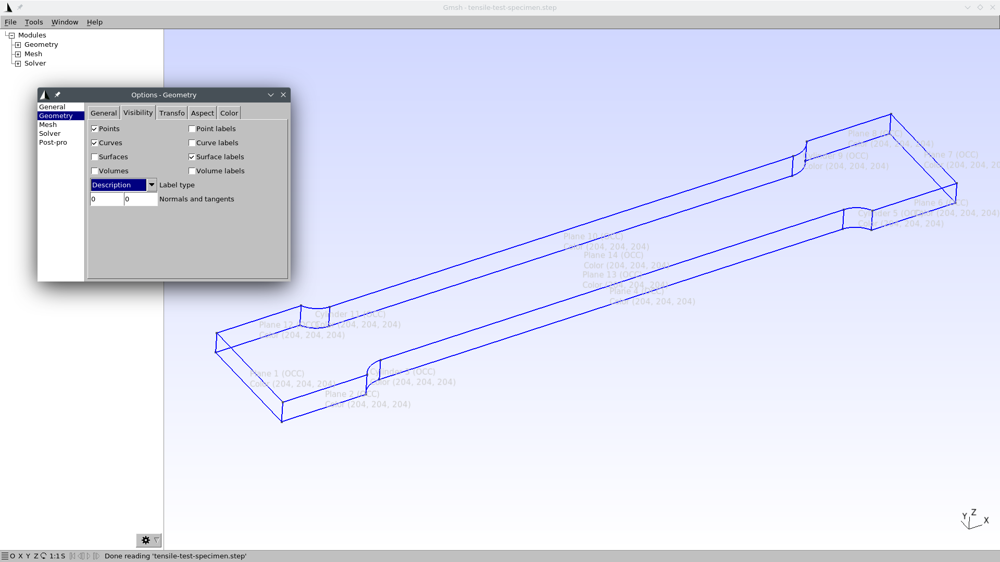
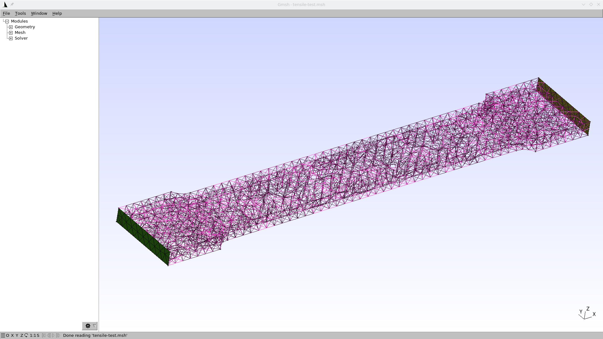
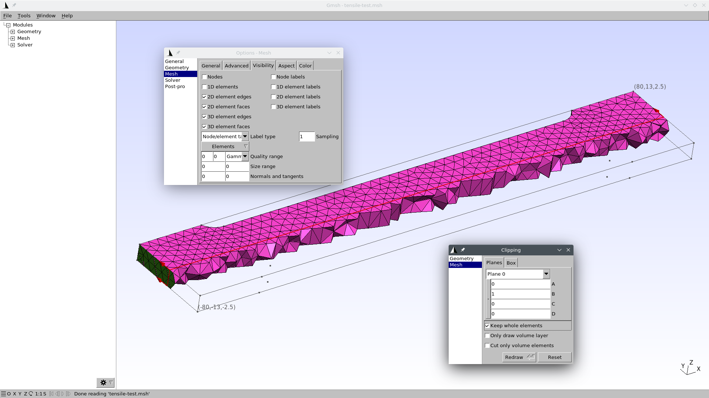

---
title: Tensile test
subtitle: FeenoX Tutorial \#1
titleblock: |
 FeenoX Tutorial \#1: Tensile test
 =================================
lang: en-US
number-sections: true
toc: true
...

# Foreword {#sec:foreword}

Welcome to FeenoX’ tutorial number one!
This first case...
 
 1. serves as a step-by-step tutorial to use FeenoX for the first time.
 2. shows that FeenoX does what a finite-element(ish) tool is supposed to do, and
 3. (last but not least) illustrates FeenoX’ design basis and the philosophy behind its implementation (spoiler alert, it's the [Unix philosophy](https://en.wikipedia.org/wiki/Unix_philosophy)) and encourages the reader to consider and evaluate the differences (both advantages and disadvantages) between the approach proposed in this tutorial with traditional both free and non-free finite-element programs,.

> _Heads up_: this tutorial, being the first is also detailed and long. Those impatient readers might want to check directly some of the [annotated examples](https://seamplex.com/feenox/examples/) in [FeenoX webpage](https://seamplex.com/feenox/).
 
For the nearly impatient, here is a summary of what we are going to achieve by the end of the tutorial.
We are going to understand what each of the parts of the FeenoX input file do:

```{.feenox include="tensile-test.fee"}
```

And we are going to run bot Gmsh and FeenoX to obtain the results listed in @sec:expected.


**Terminal mimic**

**Paraview picture**


# Unix philosophy {#sec:unix}

FeenoX’ cloud-first design and implementation is largely based on the [Unix philosophy](https://homepage.cs.uri.edu/~thenry/resources/unix_art/ch01s06.html), as introduced in [Eric Raymond](http://www.catb.org/esr/)’s seminal book [The Art of Unix Programming](http://www.catb.org/esr/writings/taoup/). A quotation from such seminal book helps to illustrate this idea:

> [Doug McIlroy](https://en.wikipedia.org/wiki/Douglas_McIlroy), the inventor of [Unix pipes](https://en.wikipedia.org/wiki/Pipeline_%28Unix%29) and one of the founders of the [Unix tradition](https://en.wikipedia.org/wiki/Unix), had this to say at the time:
>
>   (i) Make each program do one thing well. To do a new job, build afresh rather than complicate old programs by adding new features.
>
>   (ii) Expect the output of every program to become the input to another, as yet unknown, program. Don't clutter output with extraneous information. Avoid stringently columnar or binary input formats. Don't insist on interactive input.
>
> [...]
>
> He later summarized it this way (quoted in “A Quarter Century of Unix” in 1994):
>
>   * This is the Unix philosophy: Write programs that do one thing and do it well. Write programs to work together. Write programs to handle text streams, because that is a universal interface.


Keep in mind that even though the quotes above and many FEA programs that are still mainstream today date both from the early 1970s, fifty years later they still

 * Do not make just only one thing well.
 * Do complicate old programs by adding new features.
 * Do not expect the their output to become the input to another.
 * Do clutter output with extraneous information.
 * Do use stringently columnar and/or binary input (and output!) formats.
 * Do insist on interactive output.

A further note is that not only is FeenoX both [free](https://www.gnu.org/philosophy/free-sw.en.html) and [open-source](https://opensource.com/resources/what-open-source) software but it also is designed to connect and to work with ([rule of composition](https://homepage.cs.uri.edu/~thenry/resources/unix_art/ch01s06.html#id2877684)) other free and open source software, like

 * [Gmsh](http://gmsh.info/),
 * [ParaView](https://www.paraview.org/),
 * [Gnuplot](http://gnuplot.info/),
 * [Pyxplot](http://www.pyxplot.org.uk/),
 * [Pandoc](https://pandoc.org/),
 * [TeX](https://tug.org/)
 
and many others, including of course the operating system [GNU](https://www.gnu.org/)/[Linux](https://www.kernel.org/).

> _Heads up_: it is extremely important to note here that 
>
>  a. the adjective “free” in the expression “free software” refers to _freedom_ and not to _price_. A better wording would be “libre software” instead. When we say “free software” we mean “free” as in “free speech” not as in “free beer.” The difference will be made clear throughout the tutorial. In what follows, we use “gratis” or “for a fee” when referring to price and “free” and “privative” (because it privates users from their freedom) or “non-free” when referring to freedom.
>  b. “free software” does not mean “open source.” The two terms are related but not equal, having different technical and ethical meanings with different roots and rationales for each one. There are books and discussions online about the matter. The important thing to remember here is that FeenoX is both _free_ and _open source_ under the terms of [GNU General Public License](https://www.gnu.org/licenses/gpl-3.0) version\ 3 or, at the user convenience, any later version. The opposite is of “open source” is “closed source.” Note that a closed-source piece of software is privative by definition, but an open-source piece of software can be either free (as most open-source software is) or non-free (as a tiny fraction is).
>  c. the importance of FeenoX (and in general any engineering-related tool) being free (it is GPLv3+) and open source (its source tree can be cloned from Github) is way more profound than the basic fact you do not have to pay a software license. The most important issue of FeenoX being open source is that anyone can
>
>      1. see,
>      2. analyze, and eventually
>      3. understand
>
>     what equations are being solved and how they are being solved withing a digital computer. The most important issue of FeenoX being free software, besides the three pints above, is that anyone can _modify_ it to suit their needs and then share those modifications. Of course most people do not know how to see, analyze, understand and/or modify computational source code. But the main key is that these people have the _freedom_ to ask somebody else to do it for them, either gratis or for a fee. This is not the case for other non-free (wrongly called “commercial”) engineering tools, where users do not have the freedom to see what and how the equations are being solved, let alone asking a third party to review them.
>
>     On the other hand, even though it is true that FeenoX can be executed by anyone without paying any royalty to the owner of the copyright, that does not mean that its usage is completely gratis. These issues still hold:
>      #. Downloading and executing the tool might incur in expenses such as electricity consumption, network connections, storage capacity, computing power, etc. 
>      #. Even though the tool is freely distributed under the GPLv3+, people distributing it can charge a fee for the distribution. It is not illegal to sell free software for a fee. It is illegal to _prevent_ other people from distributing it gratis and to _prevent_ other people from accessing the source code, though.
>      #. There can be services that provide the execution of the tool in the cloud (i.e. somebody else’s computer) for a fee (e.g. [CAEplex](https://www.caeplex.com)).
>      #. The code does have a copyright owner, which is the original author of FeenoX. Yet, instead of using these rights to take freedom away from its users, they are used to make nobody can take it away by using the [copyleft licensing mechanism](https://en.wikipedia.org/wiki/Copyleft).
>      #. There might be application cases for which the tool as it is might be limited or inadequate. As already discussed, it is possible (i.e. anybody has the _freedom_) to hire someone (possibly the original author of the code) to modify FeenoX in order to add features or functionalities in such a way to allow for the adequate application of the tool. These kind of works might involve a development fee.

In particular, this tutorial has been created from scratch using free and open source software only (Markdown converted to PDF and HTML with Pandoc using Kate as the main editor).
Even the [terminal recorder](https://asciinema.org/) used to show the [actual execution](#sec:execution) is GPLv3. 

Following the Unix philosophy, FeenoX also makes use of high-quality free and open source mathematical libraries which contain numerical methods designed by mathematicians and programmed by professional programmers instead of hard-coding ad-hoc mathematical algorithms. In particular, it uses

 * [GNU Scientific Library](https://www.gnu.org/software/gsl/)
 * [PETSc](https://www.mcs.anl.gov/petsc/) (and all its respective dependencies)
 * [SLEPc](http://slepc.upv.es/)
 * [kdtree](https://github.com/jtsiomb/kdtree)
 * [uthash](http://troydhanson.github.com/uthash/)
 
This way, FeenoX bounds its scope to doing only one thing and to doing it well: namely, to build and solve finite-element formulations of partial differential equations instead of implementing numerical methods to solve the discretized equations. And it does so on high grounds, both

 i. _ethical_: since it is [free software](https://www.gnu.org/philosophy/open-source-misses-the-point.en.html), all users can
 
      0. run,
      1. share,
      2. modify, and/or
      3. re-share their modifications.
      
    If a user cannot read or write code to either
    
      a. check that FeenoX solves the right equations right (i.e. to perform independent verification and validation), and/or
      b. to modify FeenoX to suit their needs,
      
    at least they has the _freedom_ to hire someone to do it for her, and
    
 ii. _technological_: since it is [open source](http://www.catb.org/~esr/writings/cathedral-bazaar/cathedral-bazaar/), advanced users can detect and correct bugs and even improve the algorithms. [Given enough eyeballs, all bugs are shallow.](https://en.wikipedia.org/wiki/Linus%27s_law)
 
Check out the [programming and contributing](https://seamplex.com/feenox/doc/#programming-and-contributing) section of the FeenoX documentation for further details regarding

 #. FeenoX’ roadmap
 #. Programming languages
 #. Coding styles and guidelines
 #. Rules of conduct
 #. Related tools
 #. etc.
 
 
A final preliminary comment before starting the actual tutorial is that FeenoX is designed to work as an engineering “transfer function” between one (or more) input files and zero (or more) output files (which might include the terminal):

```include
transfer.md
```

In computer-science, this transfer-function-like workflow is called a _filter_ or _pipe_. Indeed, we already quoted [Doug McIlroy](https://en.wikipedia.org/wiki/Douglas_McIlroy) who invented [Unix pipelines](https://en.wikipedia.org/wiki/Pipeline_(Unix)). When solving a finite-element problem, FeenoX thus needs two files:

 1. A FeenoX input file (discussed in @sec:input)
 2. A mesh file (discussed in @sec:mesh)

Depending on the expected results (@sec:expected) there might be zero (i.e. rule of silence) or more outputs, such as

 1. User-formatted output to the standard output (i.e. the terminal)
 2. VTK files for post-processing with ParaView
 3. MSH files for post-processing with Gmsh (or to be re-read in further computations)
 4. ASCII files with subsets of resulting distributions
 5. Other user-defined output
 
 
 
# Problem description

A tensile test specimen of nominal cross-sectional area\ $A = 20~\text{mm} \times 5~\text{mm} = 100~\text{mm}^2$ is fully fixed on one end (flat end face normal to the $x$ axis at $x<0$, magenta surface not shown) and a tensile load of $F_x = 10~\text{kN}$ is applied at the other end (flat end face at $x>0$, green surface). The Young modulus is\ $E=200~\text{GPa}$ and the Poisson’s ratio is\ $\nu=0.3$.


::: {#fig:tensile-cad}
```{=html}
<div class="embed-responsive embed-responsive-16by9">
  <iframe class="embed-responsive-item" style="border: 0" src="https://www.caeplex.com/project/problem.php?id=41dd1&embed"></iframe>
</div> 
```
```{=latex}
\includegraphics[width=0.95\linewidth]{tensile-test-cad.png}
```

Tensile test specimen CAD from CAEplex <https://caeplex.com/p/41dd1> `(rotate and zoom it)`{=html}
:::


## Expected results {#sec:expected}

The following results are expected to be obtained by the end of the tutorial:

 1. Compute the displacement and stress distribution within the geometry. Create pictures of their distribution with a post-processing tool.
 2. Show that the specimen experiences elongation along the\ $x$ axis and a mild contraction in\ $y$ (and even milder in $z$).
 3. Check that the normal tension at the center of the specimen matches the theoretical solution $\sigma_x = F_x/A$
 4. Check that the reaction at the fixed end balances the external load\ $\mathbf{F}$ applied at the opposite face.
 5. Show that there are stress concentrations at the heads of the coupon.


# Geometry and mesh {#sec:mesh}

Following the general idea of performing only one thing well (thoroughly discussed in the [FeenoX Softwre Design Specification](https://seamplex.com/feenox/doc/sds.html)), and the particular Unix rules of

 a. [composition](https://homepage.cs.uri.edu/~thenry/resources/unix_art/ch01s06.html#id2877684), and
 b. [parsimony](https://homepage.cs.uri.edu/~thenry/resources/unix_art/ch01s06.html#id2878022)
 
the generation of the set of nodes and elements required to perform a mechanical computation using the finite element method is outside of FeenoX’ scope. That is to say,

> The finite-element mesh is an _input_ to FeenoX. 

In the particular case of the tensile test problem, the geometry is given as a [STEP file](tensile-test-specimen.step).
It is meshed by [Gmsh](http://gmsh.info/) (or, following the rule of [diversity](https://homepage.cs.uri.edu/~thenry/resources/unix_art/ch01s06.html#id2879078), any other meshing tool which can write meshes in [MSH format](http://gmsh.info/doc/texinfo/gmsh.html#MSH-file-format)
keeping information about [physical groups](http://gmsh.info/doc/texinfo/gmsh.html#Elementary-entities-vs-physical-groups)).

A 3D CAD file consists of volumes, surfaces, edges and vertices. Each volume is defined by a set its boundary surfaces, each surface by a set of its boundary edges, and each edge by a set of its boundary vertices. Volumes are linked to material properties surfaces, edges and points are linked to boundary conditions. For 2D problems, material properties are assigned to surfaces and boundary conditions to edges and vertices. For 1D problems, material properties are assigned to edges and boundary conditions to vertices.

Even though mathematically speaking the whole boundary of the domain ought to have an associated boundary condition, depending on the type of physical problem being solved, some entities in the boundary might not need to have an explicit boundary condition. For instance, when solving a mechanical problem, those surfaces without an explicit condition are treated as “free” surfaces, i.e. free to deform with a traction identically zero without a prescribed displacement. For a thermal heat-conduction problem, free surfaces usually mean they are treated as adiabatic. Each case has to be checked with the documentation of the tool being used to solve the problem.

The creation of a finite-element mesh involves basically four steps:

 1. reading the CAD file with the continuous domain of the problem,
 2. identifying the continuous volumes that will be linked to material properties,
 3. identifying the continuous surfaces, edges and vertices that will be linked to boundary conditions ,
 4. setting up meshing options, such as the elements’
    * type: tetrahedra or hexahedra (there might be transition elements such as wedges, pyramids, etc. as well)
    * order
    * sizing
    * quality
    * etc.

Since we are solving a mechanical problem with FeenoX, any surface (or edge or vertex) that does not have an explicit boundary condition will act as a free surface (homogeneous traction). Also, the problem asks for conditions on only two surfaces, namely the two longitudinal ends of the tensile test specimen so we have to identify only these two faces. Moreover, since there is only one volume in the CAD file we do not need to explicitly link it to material properties (as there is only one, the link is trivial and it is performed automatically by FeenoX as explained in the next section). But still, we need to identify it so as to have Gmsh to generate the bulk elements.

 1. Open the file `tensile-test-specimen.step` with Gmsh (in a shell capable of doing graphics):

    ```terminal
    $ gmsh tensile-test-specimen.step
    ```

 2. Rotate the model until you see the whole 3D geometry and ask Gmsh to show the ids of the geometrical surfaces by going to
 
    * Tools $\rightarrow$ Options $\rightarrow$ Geometry $\rightarrow$ Surface labels
    
    You should see something like this:
    
    \ 

 3. Note that the left-most (in the $x$ axis) surface has an id of one and the right-most surface has an id of seven. That's all we need to know about the CAD model, that the "left" surface is 1 in the STEP and that "right" is 7. You can close the Gmsh graphical window now.

 4. Open your text editor (mine is Kate with syntax highlighting set to "C") and create a file named `tensile-test.geo` with the following content:

    ```{.c include="tensile-test.geo"}
    ```
    
 5. Call Gmsh from the shell passing `-3` as the first parameter and `tensile-test.geo` as the second to create a three-dimensional mesh (that is what the `-3` means)  named `tensile-test.msh` (this step does not need to have a graphical terminal):
  
    ```terminal
    $ gmsh -3 tensile-test.geo
    Info    : Running 'gmsh -3 tensile-test.geo' [Gmsh 4.10.5, 1 node, max. 1 thread]
    Info    : Started on Sat Sep 10 15:22:59 2022
    Info    : Reading 'tensile-test.geo'...
    Info    : Reading 'tensile-test-specimen.step'...
    Info    :  - Label 'Shapes/ASSEMBLY/=>[0:1:1:2]/Pad' (3D)
    Info    :  - Color (0.8, 0.8, 0.8) (3D & Surfaces)
    Info    : Done reading 'tensile-test-specimen.step'
    Info    : Done reading 'tensile-test.geo'
    Info    : Meshing 1D...
    Info    : [  0%] Meshing curve 1 (Line)
    Info    : [ 10%] Meshing curve 2 (Line)
    Info    : [ 10%] Meshing curve 3 (Line)
    [...]
    -----8<----- more output cut out -----8<-----
    [...]
    Info    : Final volume mesh: worst distortion = 0.796943 (0 elements in ]0, 0.2])
    Info    : Done applying elastic analogy to high-order mesh (0.652083 s)
    Info    : Done optimizing mesh (Wall 0.595085s, CPU 0.652091s)
    Info    : 10754 nodes 8949 elements
    Info    : Writing 'tensile-test.msh'...
    Info    : Done writing 'tensile-test.msh'
    Info    : Stopped on Sat Sep 10 15:23:01 2022 (From start: Wall 1.35632s, CPU 1.62598s)
    $
    ```
    
    If you don't like Gmsh' verbosity, you can change it with the command-line option `-v`.
    I recommend you read its [extensive documentation](http://gmsh.info/doc/texinfo/gmsh.html) for further details.
    
 6. Now that the mesh file has been created, you can open it with the Gmsh GUI to check how it looks like.
 
    ```terminal
    $ gmsh tensile-test.msh
    ```
    
    By default, Gmsh will show you something like this:
    
    \ 
    
    
    Here you can see that both end surfaces have "explicit" triangles while the rest of the surfaces seem to be hollow. This comes from the fact that we defined physical groups only for the two end faces and not for the rest of the faces---which is perfectly fine. We can ask for a nicer view by going to
    
     * Tools $\rightarrow$ Options $\rightarrow$ Mesh $\rightarrow$ 3D element faces
     
    We can then add a clipping plane to peek at the tetrahedra in the bulk of the specimen:
    
     * Tools $\rightarrow$ Clipping $\rightarrow$ Mesh $\rightarrow$ $A=0$, $B=1$, "Keep whole elements"
     
    Now you should get 
    
    \ 
    
    Feel free to close Gmsh now, we are done with it.


In general, multi-solid problems need to have different physical volumes in order for FeenoX to be able to set different mechanical properties. Even though this simple problem has a single solid and an explicit link is not needed, a physical volumetric group is needed in order for Gmsh to write the volumetric elements (i.e. tetrahedra) into the [output MSH file](tensile-test.msh) (which is an input for FeenoX).

The usage of [physical groups](http://gmsh.info/doc/texinfo/gmsh.html#Elementary-entities-vs-physical-groups) to define boundary conditions follows the rule of [representation](https://homepage.cs.uri.edu/~thenry/resources/unix_art/ch01s06.html#id2878263) as it folds knowledge into data instead of focusing on algorithmically setting loads on individual nodes, which is a common practice among some finite-element solvers. The reason is that asking for nodal loads in the solver’s input file makes the programmer’s life easier but the user’s life harder.
However, complicating things for a few developers only once but simplifying things for a lot of users during the lifespan of an engineering software tool is definitely a wise design choice.

This approach of using physical groups to set boundary conditions that refer to actual CAD faces means that the formulation of the problem being solved is completely determined from the continuous CAD geometry and does not depend on the details of the mesh. 
This allows for [extensibility](https://homepage.cs.uri.edu/~thenry/resources/unix_art/ch01s06.html#id2879112) in at least two ways:

 1. The mesh can be refined (or coarsened) arbitrarily, either by
 
     #. changing the value of `Mesh.MeshSizeMax` in the GEO file,
     #. passing a refinement factor in Gmsh’s command-line option `-clscale`, and/or
     #. using one of the many [ways of specifying mesh element sizes](http://gmsh.info/doc/texinfo/gmsh.html#Specifying-mesh-element-sizes),

    and then using it in FeenoX with _exactly the same input file_. There is no need to re-compute nodal loads nor to perform any other pre-processing step, providing [simplicity](). More advanced tutorials (and some examples such as [this one](https://www.seamplex.com/feenox/examples/#parametric-study-on-a-cantilevered-beam)) show how to perform parametric mesh convergence studies (and even [optimization loops](https://www.seamplex.com/feenox/examples/#optimizing-the-length-of-a-tuning-fork)).
    
 2. A mesh with many physical groups can be used for both many cases (say a tensile case first and a bending case later) where they set different boundary conditions on different sets of physical groups. This provides [clarity](https://homepage.cs.uri.edu/~thenry/resources/unix_art/ch01s06.html#id2877610).


# FeenoX Input file {#sec:input}

As discussed in @sec:unix, FeenoX reads a plain-text input file---which in turns also reads the mesh generated in te previos section---that defines the problem, asks FeenoX to solve it and writes whatever output is needed. See section “Interfaces” in the [SDS](https://seamplex.com/feenox/doc/sds.html#interfaces) for a thorough discussion of both inputs and outputs.

The input file is a [syntactically-sweetened](http://en.wikipedia.org/wiki/Syntactic_sugar) way to ask the computer to perform the actual computation (which is what computers do). This input file, as illustrated in the example below lives somewhere near the English language so a person can read through it from the top down to the bottom and more or less understand what is going on (rule of [least surprise](https://homepage.cs.uri.edu/~thenry/resources/unix_art/ch01s06.html#id2878339)). The idea is that this input file should match as much as possible the definition of the problem as an engineer would cast it in a plain sheet of paper (or blackboard).

{#fig:blackboard}

Yet in the extreme case that the complexity of the problem asks for, the input file could be machine-generated by a script or a macro (rule of [generation](https://homepage.cs.uri.edu/~thenry/resources/unix_art/ch01s06.html#id2878742)).
Or if the circumstances call for an actual graphical interface for properly processing (both pre and post) the problem, the input file could be created by a separate cooperating front-end such as [CAEplex](https://www.caeplex.com) in [@fig:tensile-cad] above (rule of [separation](https://homepage.cs.uri.edu/~thenry/resources/unix_art/ch01s06.html#id2877777)).
In any case, the input files---both for Gmsh and for FeenoX---can be tracked with [Git](https://en.wikipedia.org/wiki/Git) in order to increase traceability and repeatability of engineering computations.
This is not true for most of the other FEA tools available today, particularly the ones that do not follow McIlroy’s recommendations above.

Given that the problem is relatively simple, following the rule of [simplicity](https://homepage.cs.uri.edu/~thenry/resources/unix_art/ch01s06.html#id2877917),
the input file [`tensile-test.fee`](tensile-test.fee) ought to be also simple. Other cases with more complexity might lead to more complex input files.

```{.feenox include="tensile-test.fee"}
```

 * The mesh [`tensile-test.msh`](tensile-test.msh) is the output of Gmsh when invoked with the input [`tensile-test.geo`](tensile-test.geo) above. It can be either [version\ 4.1](http://gmsh.info/doc/texinfo/gmsh.html#MSH-file-format) or [2.2](http://gmsh.info/doc/texinfo/gmsh.html#MSH-file-format-version-2-_0028Legacy_0029).
 * The mechanical properties, namely the Young modulus\ $E$ and the Poisson’s ratio\ $\nu$ are uniform in space. Therefore, they can be simply set using special variables `E` and `nu`.
 * Boundary conditions are set by referring to the physical surfaces defined in the mesh. The keyword `fixed` is a shortcut for setting the individual displacements in each direction `u=0`, `v=0` and `w=0`.
 * An explicit location within the logical flow of the input file hast to be given where FeenoX ought to actually solve the problem with the keyword `FINO_STEP`. It should be after defining the material properties and the boundary conditions and before computing secondary results (such as the reactions) and asking for outputs.
 * The reaction in the physical group “left” is computed after the problem is solved (i.e. after `FINO_STEP`) and the result is stored in a vector named `R` of size three. There is nothing special about the name `R`, it could have been any other valid identifier name.
 * A [post-processing output file](tensile-test.vtk) in format [VTK](https://lorensen.github.io/VTKExamples/site/VTKFileFormats/) is created, containing:
    - The von Mises stress `sigma` ($\sigma$) as an scalar field
    - The three principal stresses `sigma1`, `sigma_2` and\ `sigma_3` ($\sigma_1$, $\sigma_2$ and $\sigma_3$ respectively) as three scalar fields
    - The displacement vector $\mathbf{u}=[u,v,w]$ as a three-dimensional vector field
 * Some results are printed to the terminal (i.e. the [standard output](https://en.wikipedia.org/wiki/Standard_streams#Standard_output_(stdout))) to summarize the run.
 Note that
 
     1. The actual output (including post-processing files) is 100% defined by the user, and
     2. If no output instructions are given in the input file (`PRINT`, `MESH_POST`, etc.) then no output will be obtained.
 
   Not only do these two facts follow the rule of [silence](https://homepage.cs.uri.edu/~thenry/resources/unix_art/ch01s06.html#id2878450) but they also embrace the rule of [economy](https://homepage.cs.uri.edu/~thenry/resources/unix_art/ch01s06.html#id2878666): the time needed for the user to find and process a single result in a soup of megabytes of a cluttered output file far outweighs the cost of running a computation from scratch with the needed result as the only output. 
 * Finally, the von\ Mises stress\ $\sigma(0,0,0)$ evaluated at the origin is written to an [ASCII](https://en.wikipedia.org/wiki/ASCII) file [`tensile-sigma.dat`](tensile-sigma.dat) rounded to the nearest integer (in MPa). This is used to test the outcome of FeenoX’s self-tests using the `make check` [target](https://www.gnu.org/software/make/manual/make.html#Standard-Targets) in an [automated way](https://homepage.cs.uri.edu/~thenry/resources/unix_art/ch01s06.html#id2878742).
Note that there is no need to have an actual node at $\mathbf{x}=(0,0,0)$ since FeenoX (actually [wasora](https://www.seamplex.com/wasora)) can evaluate functions at any arbitrary point.

# Execution {#sec:execution}

Opening a terminal and calling both Gmsh and FeenoX in sequence should go as smooth (and as fast) as this: 
```{=html}
<asciinema-player src="tensile-test.cast" cols="133" rows="32" preload="true" poster="npt:0:20"></asciinema-player>
```

Here is a static mimic of a 22-second terminal session:

```{.terminal style=terminal}
$ gmsh -3 tensile-test.geo
Info    : Running 'gmsh -3 tensile-test.geo' [Gmsh 4.5.2-git-2373007b0, 1 node, max. 1 thread]
Info    : Started on Wed Jan 29 11:07:04 2020
Info    : Reading 'tensile-test.geo'...
Info    : Reading 'tensile-test-specimen.step'...
Info    :  - Label 'Shapes/ASSEMBLY/=>[0:1:1:2]/Pad' (3D)
Info    :  - Color (0.8, 0.8, 0.8) (3D & Surfaces)
Info    : Done reading 'tensile-test-specimen.step'
Info    : Done reading 'tensile-test.geo'
Info    : Meshing 1D...
Info    : [  0 %] Meshing curve 1 (Line)
Info    : [ 10 %] Meshing curve 2 (Line)
Info    : [ 10 %] Meshing curve 3 (Line)
[...]
Info    : [100 %] Meshing surface 14 order 2
Info    : [100 %] Meshing volume 1 order 2
Info    : Surface mesh: worst distortion = 0.90913 (0 elements in ]0, 0.2]); worst gamma = 0.722061
Info    : Volume mesh: worst distortion = 0.824145 (0 elements in ]0, 0.2])
Info    : Done meshing order 2 (1.32521 s)
Info    : 49534 nodes 40321 elements
Info    : Writing 'tensile-test.msh'...
Info    : Done writing 'tensile-test.msh'
Info    : Stopped on Wed Jan 29 11:07:07 2020
$ fino tensile-test.fin
....................................................................................................
----------------------------------------------------------------------------------------------------
====================================================================================================
displ_max =     0.076   mm
sigma_max =     160.2   MPa
principal1 at center =  99.99998119     MPa
reaction  = [   -1.000e+04      -1.693e-04      -1.114e-03      ] Newtons
$
```


 * The three lines with the dots, dashes and double dashes are ASCII progress bars for the assembly of the stiffness matrix, the solution of the linear system and the computation of stresses, respectively. They are turned on with `PROGRESS_ASCII`.
 * Almost any location within the input file where a numerical value is expected can be replaced by an algebraic expression, including standard functions like `log`, `exp`, `sin`, etc. See [wasora’s reference](https://www.seamplex.com/wasora/reference.html#functions) for details.
 * Once again, if the `MESH_POST` and `PRINT` instructions were not included, there would not be any default output of the execution ([rule of silence](http://www.linfo.org/rule_of_silence.html)). This should be emphasized over and over, as I have recently (i.e. thirteen years after the commercial introduction of smartphones) stumbled upon a the output file of a classical FEM program that seems to have been executed in 1970: paginated ASCII text ready to be fed to a matrix-doy printed containing all the possible numerical output because the CPU cost of re-running the case of course overwhelms the hourly rate of the engineer that hast to understand the results. For more than fifty years (and counting), McIlroy’s second bullet
 from [@sec:foreword]  above has been blatantly ignored.
 * It has already been said that the output is 100% controlled by the user. Yet this fact includes not just what is written but also how: the precision of the printed results is controlled with [`printf` format specifiers](https://en.wikipedia.org/wiki/Printf_format_string). Note the eight decimal positions in the evaluation of $\sigma_1$ at the origin, whilst the expected value was $100~\text{MPa}$ (the load is $F_x=10^4~\text{N}$ and the cross-sectional area is $100~\text{mm}^2$).
 * If available, the [MUMPS Solver](http://mumps-solver.org/) direct solver can be used instead of the default GAMG-preconditioned GMRES itearative solver by passing the option `--mumps` in the command line. More on solvers in [@sec:performance].
 
# Results

After the problem is solved and an appropriately-formatted output file is created, FeenoX’s job is considered done. In this case, the post-processing file is written using `MESH_POST`. The [VTK output](tensile-test.vtk) can be post-processed with the free and open source tool [ParaView](http://www.paraview.org/) (or any other tool that reads [VTK files]((https://lorensen.github.io/VTKExamples/site/VTKFileFormats/)) such as [Gmsh in post-processing mode](http://gmsh.info/doc/texinfo/gmsh.html#Post_002dprocessing)), as illustrated in [@fig:tensile-vtk].

{.img-fluid #fig:tensile-vtk}

## Check

Qualitatively speaking, FeenoX does what a mechanical finite-element program is expected to do:

 * The displacement vector and scalar von Mises stress fields are computed by FeenoX, as they are successfully read by Paraview.
 * Elongation in the\ $x$ direction and mild contractions in $y$ and $z$ are observed.
 * The principal stress $\sigma_1$ should be equal to $F_x/A$, where
     * $F_x=10^4~\text{N}$, and
     * $A = 20~\text{mm} \times 5~\text{mm} = 100~\text{mm}^2$.
     
   In effect, $\sigma_1(0,0,0) = 100~\text{MPa}$.
 * The numerical reaction $\mathbf{R}$ at the fixed end reported by FeenoX is
 
   $$
   \mathbf{R} = \left[ \begin{matrix}-10^4 \\ \approx 10^{-4} \\ \approx 10^{-3}\end{matrix}\right] ~\text{N}
   $$
   
   which serves as a consistency check.
 * Stress concentrations are obtained where they are expected.


```{=html}
<div class="embed-responsive embed-responsive-16by9">
  <iframe class="embed-responsive-item" style="border: 0" src="https://www.caeplex.com/project/results.php?id=41dd1&embed"></iframe>
</div> 
```
 
 
