---
title: Heat conduction
subtitle: FeenoX Tutorial \#3
titleblock: |
 FeenoX Tutorial \#3: Heat conduction
 ====================================
lang: en-US
number-sections: true
toc: true
prev_link: ../120-mazes
prev_title: \#2 Solving mazes
...

# Summary

Welcome to **FeenoX’s tutorial number three**.
Here you will learn how to solve the heat conduction equation with FeenoX in all of its flavors: 

 a. linear and non-linear,
 b. static and transient.

All the files needed to go through the tutorial are available in [FeenoX's Git repository under `doc/tutorials/320-thermal`](https://github.com/seamplex/feenox/tree/main/doc/tutorials/320-thermal). 
Make sure you also check the [heat conduction examples](https://www.seamplex.com/feenox/examples/thermal.html).


 * We start solving linear steady-state problems. As long as neither of the
 
    a. material properties, nor
    b. sources
    
   depend on the temperature $T(\mathbf{x})$ and 
   
    c. the boundary conditions do not depend or depend linearly on $T(\mathbf{x})$
    
   then problem is linear.
   If these three guys depend on space $\mathbf{x}$ (but not on $T(\mathbf{x})$), the problem is still linear no matter how complex it looks like:

   ```{.feenox include="manufactured.fee"}
   ```

 * If these conditions are not met, then the problem is non-linear.
   FeenoX is able to detect this and will **automatically** switch to a non-linear solver.
   Why would the user need to tell the solver if the problem is linear or not?
   If you think it through, it should be the other way round. And that is what FeenoX does.
   
 * Non-linearities can be triggered by either
 
    - adding a boundary conditions that depends non-linearly on $T(\mathbf{x})$, such as radiation, and/or
    - having a conductivity that depends on temperature, which is the case for most materials anyway, and/or
    - using heat sources that are temperature-dependent, where increasing $T$ decreases the source.

 * We can check if FeenoX can detect the non-linearities by passing `--snes_monitor` and/or `--snes_view` in the command line. Here, [SNES](https://petsc.org/release/manual/snes/) means "Scalable Non-linear Equation Solvers" in PETSc's jargon. The `--snes_view` option shows some details about the solver. In linear problems, SNES is not used but the [KSP](https://petsc.org/release/manual/ksp/) (Krylov SubSpace solvers) framework is used instead. Therefore, if we used `--snes_view` in a linear problem then FeenoX would complain about an unused command-line option. 
 
 * If, for some reason, the user does not want to have FeenoX to auto-detect the non-linearities then she could force the problem type using either
 
   a. the keywords `LINEAR` and `NON_LINEAR` in the [`PROBLEM`](https://www.seamplex.com/feenox/doc/feenox-manual.html#problem) definition, or
   b. the [command-line options](https://www.seamplex.com/feenox/doc/feenox-manual.html#invocation) `--linear` and `--non-linear`.
 
 * Different linear and non-linear solvers (and pre-conditioners) can be chosen either from the command line (e.g. `--snes_type=newtonls`) or from the `PROBLEM` definition (e.g. `NONLINEAR_SOLVER newtonls`).
  Check out the [FeenoX manual section for the keyword `PROBLEM`](https://www.seamplex.com/feenox/doc/feenox-manual.html#problem) for further details.
  FeenoX can have hard-coded PETSc options using the [`PETSC_OPTIONS` definition](https://www.seamplex.com/feenox/doc/feenox-manual.html#petsc_options) as well.
    
 * Finally we show how to solve transient problems. Transients are triggered by setting [`end_time`](https://www.seamplex.com/feenox/doc/feenox-manual.html#end_time) to a positive value.
 
 * FeenoX uses [PETSc's TS](https://petsc.org/release/manual/ts/) framework for transient problems. Different schemes can be chosen either from the command line (e.g. `--ts_type=bdf`) or from the `PROBLEM` definition (e.g. `TRANSIENT_SOLVER bdf`).
 
 * We solve transient problems either
 
    i. starting from an arbitrary initial temperature distribution using constant boundary conditions
    ii. starting from a steady-state solution and changing the boundary conditions over time
    iii. both
    
 * Transient problems Different time stepping 
 
# Linear steady-state problems

In this section we are going to ask FeenoX to compute a temperature distribution $T(\mathbf{x})$ that satisfies the linear heat conduction equation

$$
- \text{div} \Big[ k(\mathbf{x}) \cdot \text{grad} \left[ T(\mathbf{x}) \right] \Big] = q(\mathbf{x})
$$ {#eq:heat}

along with proper boundary conditions.


## Temperature conditions

The simplest heat conduction problem involves a slab geometry with prescribed temperatures at both ends.
If the conductivity $k$ is uniform, then the solution is a linear interpolation of these two temperatures---independently of the actual value of the conductivity.

### Single-material slab

Let us create a unitary slab between $x=0$ and $x=1$ with Gmsh using this `slab.geo`:

```{.c include="slab.geo"}
```

The end at $x=0$ is called `left` and the one at $x=1$ is called `right`.
So we can ask FeenoX to solve a thermal problem with uniform conductivity $k$ and fixed temperatures at both ends by

 1. Defining [`PROBLEM`](https://www.seamplex.com/feenox/doc/feenox-manual.html#problem) as [`thermal`](http://seamplex.com/feenox/doc/feenox-manual.html#thermal) and giving either `1d` or `DIM 1`:
 
    ```feenox
    PROBLEM thermal 1d
    ```
    
    We can check which problems FeenoX can solve by running it with `--pdes`:
    
    ```terminal
    $ feenox --pdes
    laplace
    mechanical
    modal
    neutron_diffusion
    neutron_sn
    thermal
    $    
    ```
 
 2. Setting the [special variable `k`](https://www.seamplex.com/feenox/doc/feenox-manual.html#k) to a constant:
 
    ```feenox
    k = 1
    ```
 
    The fact that the conductivity is given as a variable means that 
    
     i. there is a single material, and
     ii. its conductivity is uniform, i.e. it does not depend on space.
     
 3. Giving `T` equal to the desired temperature values after the [`BC`](https://www.seamplex.com/feenox/doc/feenox-manual.html#bc) definition for both `left` and `right`

    ```feenox
    BC left  T=0
    BC right T=1
    ```
    
    Recall that the names `left` and `right` come from the names of the physical grupos the `.msh` file read by FeenoX (which of course were defined in the `.geo`). 

After the instruction [`SOLVE_PROBLEM`](https://www.seamplex.com/feenox/doc/feenox-manual.html#solve_problem) is executed, the solution $T(x)$ is available as the one-dimensional function `T(x)`.
We can then
 
 i. print its definition values with [`PRINT_FUNCTION`](https://www.seamplex.com/feenox/doc/feenox-manual.html#print_function), and/or
 ii. evaluate it at any arbitrary location `x`. FeenoX will use the shape functions to interpolate the nodal solutions.
 
Here's a working input file `slab-uniform.fee`:

```{.feenox include="slab-uniform.fee"}
```

We can run it to get the requested results:
 
```terminal
$ gmsh -1 slab.geo 
Info    : Running 'gmsh -1 slab.geo' [Gmsh 4.11.0-git-e8fe6f6a2, 1 node, max. 1 thread]
Info    : Started on Sat Dec  2 14:12:31 2023
Info    : Reading 'slab.geo'...
Info    : Done reading 'slab.geo'
Info    : Meshing 1D...
Info    : Meshing curve 1 (Line)
Info    : Done meshing 1D (Wall 0.000329053s, CPU 0.00022s)
Info    : 11 nodes 12 elements
Info    : Writing 'slab.msh'...
Info    : Done writing 'slab.msh'
Info    : Stopped on Sat Dec  2 14:12:31 2023 (From start: Wall 0.00535225s, CPU 0.020205s)
$ feenox slab-uniform.fee 
0       0
1       1
0.1     0.1
0.2     0.2
0.3     0.3
0.4     0.4
0.5     0.5
0.6     0.6
0.7     0.7
0.8     0.8
0.9     0.9
# the temperature at x=2/3 is   0.666667
``` 

> **Homework**
>
> 1. Check that the solution does not depend on $k$.
> 2. Change the values of the boundary conditions and check the result is always a linear interpolation.
 
### Two-material slab

If we have two (or more) materials, there are two ways to give their properties:

 1. Using the [`MATERIAL`](https://www.seamplex.com/feenox/doc/feenox-manual.html#material) keyword, or
 2. Appending `_groupname` to either a variable or a function of space.

For example, let us now create a geometry where the left half of the slab ($x<0.5$) is made of metal (i.e. high conductivity $k=9$) and the right half of the slab ($x>0.5$) is made of plastic (i.e. low conductivity $k=1$):

```{.c include="metal-plastic-slab.geo"}
```

We now have two "volumetric" labels `metal` and `plastic`.
The first way to give the conductivities is with the [`MATERIAL`](https://www.seamplex.com/feenox/doc/feenox-manual.html#material) keyword, one for each material:

```{.feenox include="metal-plastic-material.fee"}
```

The other way is to use two variables, namely `k_metal` and `k_plastic`:

```{.feenox include="metal-plastic-vars.fee"}
```

```terminal
$ feenox metal-plastic-vars.fee | tee vars.txt
0       0
0.5     0.1
1       1
0.1     0.02
0.2     0.04
0.3     0.06
0.4     0.08
0.6     0.28
0.7     0.46
0.8     0.64
0.9     0.82
# the temperature at x=1/2 is   0.1
$ feenox metal-plastic-material.fee > material.txt
$ diff vars.txt material.txt 
$ 
```


## Heat flux conditions

Let us now investigate another boundary condition, namely setting a heat flux condition.
Going back to the single-material one-dimensional slab, let us keep $T(x=0)=0$ but set $q'(x=1)=1$.
We can check if the heat flux at the other side `left` (i.e. where we fixed the temperature) is equal in magnitude and oppposite in sign to the prescribed heat flux at `right` with the [`COMPUTE_REACTION`](https://www.seamplex.com/feenox/doc/feenox-manual.html#compute_reaction) instruction:
```{.feenox include="slab-uniform-heatflux.fee"}
```

```terminal
$ feenox slab-uniform-heatflux.fee 
0       0
1       1
0.1     0.0999997
0.2     0.2
0.3     0.3
0.4     0.4
0.5     0.5
0.6     0.6
0.7     0.7
0.8     0.8
0.9     0.9
# the heatflux at left is -0.999997
$ 
```

Let us now introduce a non-uniform conductivity depending on space as

$$
k(x) = 1+x
$$

and set the heat flux to $1/\log(2)$.
This problem has the analytical solution

$$
T(x) = \frac{\log(1+x)}{\log(2)}
$$

which we can check with [`PRINT_FUNCTION`](https://www.seamplex.com/feenox/doc/feenox-manual.html#print_function):

Since we have only one material, we can define a function `k(x)` to define the space-dependent property:

```{.feenox include="slab-kofx-heatflux.fee"}
```

```terminal
$ feenox slab-kofx-heatflux.fee | sort -g | tee slab-kofx-heatflux.dat
0       0       0
0.1     0.137399        -0.000104342
0.2     0.262851        -0.000183236
0.3     0.378267        -0.000244866
0.4     0.485133        -0.000293832
0.5     0.58463 -0.000332899
0.6     0.677707        -0.000365263
0.7     0.765143        -0.000392187
0.8     0.847582        -0.000414528
0.9     0.925566        -0.000433506
1       0.99955 -0.000449861
$ pyxplot slab-kofx-heatflux.ppl
$ 
```

::: {#fig:slab-kofx}

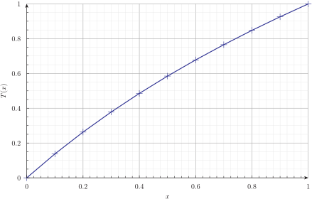{#fig:slab-kofx-heatflux}

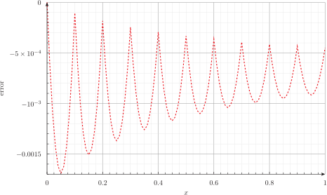{#fig:slab-kofx-error}

Output of `slab-kofx-heatflux.fee`
:::

> **Homework**
>
> 1. Verify that $T(x) = \frac{\log(1+x)}{\log(2)}$ is a solution of the differential equation and satisfies the boundary conditions.
> 2. Rewrite the space-dependent conductivity $k(x)=1+x$ using the `MATERIAL` keyword.

## Convection conditions

To define a convection condition we need to pass two parameters to the `BC` keyword:

 * A convection coefficient `h`
 * A reference temperature `Tref`
 
For instance

```feenox
BC right h=100+y  Tref=2000
```

To illustrate this feature, let us solve heat conduction on the [Stanford Bunny](https://en.wikipedia.org/wiki/Stanford_bunny) with

 * A fixed space-dependent temperature in the base
 * A convection condition on the rest of the external surface where the coefficient $h$ varies with the vertical $z$ coordinate
 
```{.feenox include="bunny-thermal.fee"}
```
 
::: {#fig:bunny-thermal}
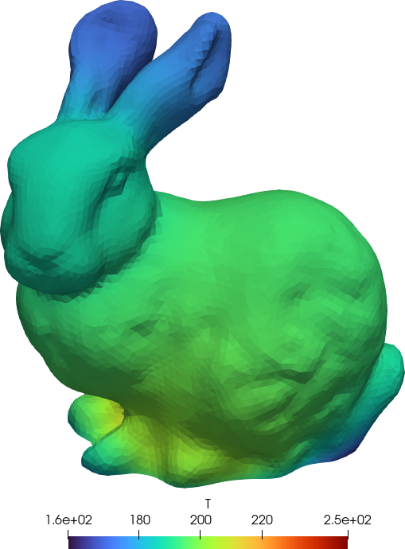{#fig:bunny-thermal1 width_html=100% width_latex=33%}
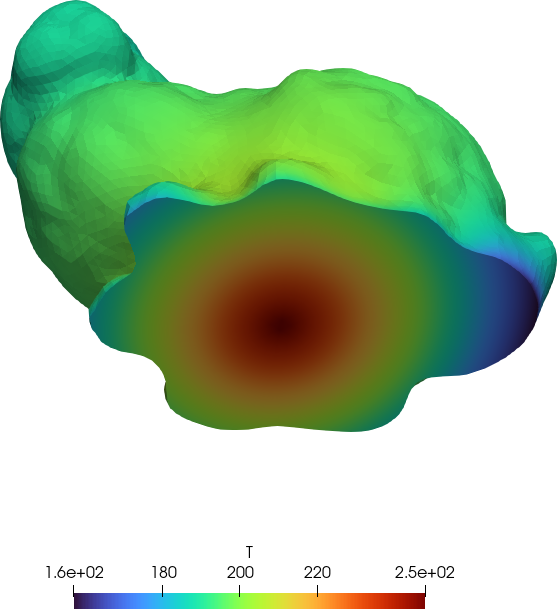{#fig:bunny-thermal2 width_html=100% width_latex=33%}
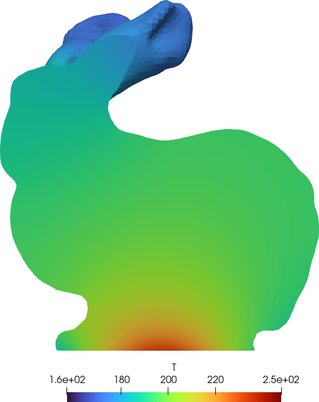{#fig:bunny-thermal3 width_html=100% width_latex=33%}

Output of `bunny-thermal.fee`
:::
 

## Volumetric heat sources

So far all the sources of heat came from boundary conditions.
Let us now define volumetric heat sources, that is to say, heat which is dissipated in the bulk of the materials.

To do so, we can use the [property `q`](https://www.seamplex.com/feenox/doc/feenox-manual.html#q) which works exactly like the [conductivity `k`]((https://www.seamplex.com/feenox/doc/feenox-manual.html#k)):

 * If there is only one material, it can be defined either as a variable `q` or a function `q(x,y,z)`
 * If there are many materials, it can be defined either
    a. within the `MATERIAL` keyword, or
    b. by defining a variable or function named `q_groupname`, one for each volumetric group in the mesh

Consider the unit square $[0,1]\times[0,1]$:

```{.c include="square.geo"}
```

Let us set 

  * uniform unitary conductivity $k$
  * uniform unitary power source $q$
  * $T=0$ at the four edges

Note that since there are four different groups holding the same boundary condition we can use the `LABEL` keyword in `BC` to "add" labels to the condition:
  
```{.feenox include="square-power.fee"}
```

{#fig:square-power}

    
## Space-dependent properties: manufactured solution

To finish the linear steady-state section, we show how to perform a simple MMS verification using the same unit square as in the previous section.

> Make sure you check out the [MMS](https://github.com/seamplex/feenox/tree/main/tests/mms) section within the [tests](https://github.com/seamplex/feenox/tree/main/tests) directory in the Git repository.

First, let us manufacture a solution temperature, say

$$
T(x,y) = 1 + \sin^2(2x) \cdot \cos^2(3y)
$$

with a certain conductivity

$$
k(x,y) = 1 + x - \frac{y}{2}
$$

which translate to FeenoX ASCII syntax as

```feenox
T_manufactured(x,y) = 1 + sin(2*x)^2 * cos(3*y)^2
k(x,y) = 1 + x - y/2
```

Then, using the differential equation we can work out what the source needs to be in order for that manufactured temperature to be the solution. For that end we use the [`derivative`](https://www.seamplex.com/feenox/doc/feenox-manual.html#derivative) functional:

```feenox
VAR x' x'' y' y''
q(x,y) = -(derivative(k(x',y) * derivative(T_manufactured(x'',y), x'', x'), x', x) + \
           derivative(k(x,y') * derivative(T_manufactured(x,y''), y'', y'), y', y))
```

We also decide that `left` and `top` get Dirichlet conditions:

```feenox
BC left   T=T_manufactured(x,y)
BC top    T=T_manufactured(x,y)
```

But `bottom` and `right` get Neumann conditions:

```feenox
BC bottom q=+(-k(x,y)*derivative(T_manufactured(x,y'),y',y))
BC right  q=-(-k(x,y)*derivative(T_manufactured(x',y),x',x))
```

After solving the problem, we want to show that the $L-2$ error is small.
For that end, we use the [`INTEGRATE`](https://www.seamplex.com/feenox/doc/feenox-manual.html#integrate) instruction:

```feenox
INTEGRATE (T(x,y)-T_manufactured(x,y))^2 RESULT e2
```

Putting everything together:

```{.feenox include="manufactured.fee"}
```

```terminal
$ feenox manufactured.fee 
3.62229e-05
$ 
```


> Once again, make sure you check out the [MMS](https://github.com/seamplex/feenox/tree/main/tests/mms) section.
> A proper verification is performed there by using Maxima to compute the symbolic expressions for the sources and boundary conditions and by sweeping over different mesh sizes (and element types) to show that the convergence rate matches the theoretical value.

::: {#fig:mms}
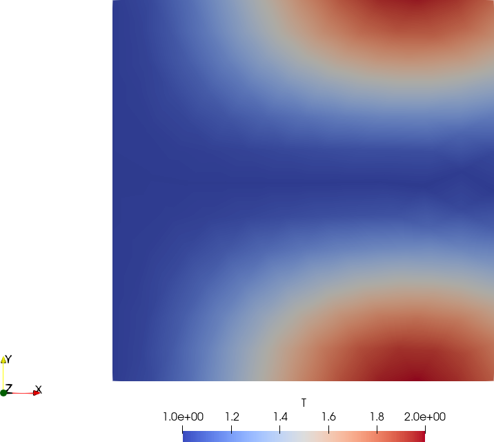{#fig:mms-T width=50%}
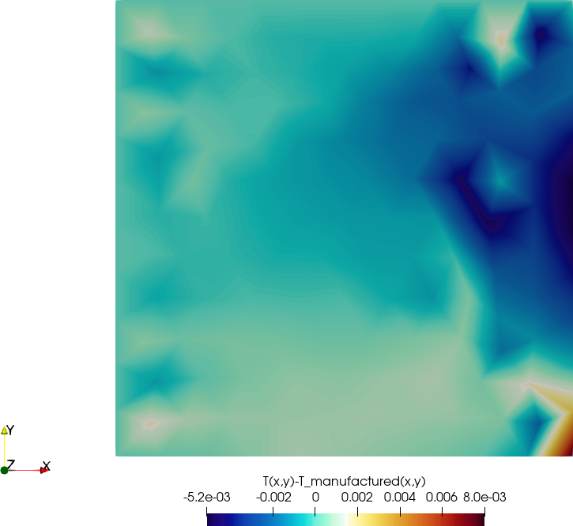{#fig:mms-dT width=50%}

Output of `manufactured.fee`
:::


# Non-linear state-state problems

If in the heat @eq:heat above the thermal conductivity $k$ or the volumetric heat source $q$ depends on the solution $T(\mathbf{x})$, or the boundary conditions depend non-linearly on $T(\mathbf{x})$ then the problem is non linear. FeenoX's parser can detect these dependencies so it will use a non-linear solver automatically. That is to say, there is no need for the user to tell the solver which kind of problem it needs to solve---which is reasonable. Why would the user have to tell the solver?


As we all know, solving a non-linear system of equations is far more complex than solving linear problems.
Even more, the most-widely scheme used to solve the non-linear equation $\mathbf{F}(\mathbf{u})=0$,namely the Newton-Raphson method which is the basis of [PETSc's SNES framework](https://petsc.org/release/manual/snes/), involves repeatedly solving a linear system starting from an initial guess $\mathbf{u}_0$:

 1. Solve $J(\mathbf{u}_k) \cdot \Delta \mathbf{u}_k = -\mathbf{F}(\mathbf{u}_k)$
 2. Update $\mathbf{u}_{k+1} \leftarrow \mathbf{u}_{k} + \Delta \mathbf{u}_{k}$


The matrix $J = \mathbf{F}^{\prime}$ associated with these linear solves (which changes from iteration to iteration) is called the jacobian matrix. FeenoX builds an appropriate jacobian for each type of non-linearity, ensuring the convergence is as fast as possible. Advanced users might investigate that indeed $J(\mathbf{u})$ is correct by using the PETSc options `--snes_test_jacobian` and, for smaller problems, `--snes_test_jacobian_view`. Note that these options render the execution far slower, so make sure the mesh is coarse.

The solver options can be changed at runtime either using keywors in the [`PROBLEM`](https://www.seamplex.com/feenox/doc/feenox-manual.html#problem) definition or command-line options:

 * `NONLINEAR_SOLVER newtonls` or `--snes_type=newtonls`
 * `LINEAR_SOLVER gmres` or `--ksp_type=gmres`
 * `PRECONDITIONER gamg` or `--pc_type=gamg`
 
Check out the [`PROBLEM` keyword entry in the FeenoX manual](https://www.seamplex.com/feenox/doc/feenox-manual.html#problem) and the links to PETSc's documentation for further details.
Moreover, advanced users might notice that some problems might require a non-trivial combination of particular PETSC options. These can be given in the input file using the [`PETSC_OPTIONS` definition](https://www.seamplex.com/feenox/doc/feenox-manual.html#petsc_options) as well.


## Temperature-dependent heat flux: radiation

One way of introducing a non-linearity is by having a prescribed heat-flux boundary condition to depend on the temperature in a non-linear way.
A radiation boundary condition is exactly this because the heat flux depends on $T^4(\mathbf{x})$.
To illustrate this concept, let us consider the one-dimensional slab $x \in [0,1]$ with uniform conductivity equal to 50.

 * At $x=0$ (`left`) we set a prescribed heat flux equal to 1200 W/m$^2$.
 * At $x=1$ (`right`) we set a radiation boundary condition with an emissivity $e$ of 0.8 and an absolute reference temperature of 293.15 K. 

This problem, even though it is non-linear, has an analytical solution: a linear interpolation between the temperature at $x=1$ which is

$$
T(1) = \left( \frac{1200}{\sigma \cdot e} + T_\text{ref}^4\right)^{\frac{1}{4}}
$$
and the temperature at $x=0$

$$
T(0) = T(1) + \frac{1200}{50}
$$
where $\sigma$ is the Stefan-Boltzmann constant. Just for fun, instead of looking up online its numerical value, we can FeenoX to compute it from the "more fundamental" constants $h$, $c$ and $k_b$.

FeenoX uses [PETSc's SNES framework](https://petsc.org/release/manual/snes/) to solve the resulting non-linear equations.
The available solvers---which can be selected either through `PROBLEM SNES` definition or from the command line---are iterative in nature.
The convergence of these algorithms depend on a good initial guess, which by default is a uniform distribution equal to the average of all the temperatures `T` or `Tref` that appear on the temperature and convection boundary conditions.
Since in this case we only have heat fluxes, the initial guess would be zero which might not be appropriate.
We can give an explicit initial guess can be given with the function `T_guess(x)` (or `T_guess(x,y)` or `T_guess(x,y,z)` if the dimensions were two or three).

Putting everything together in a FeenoX input file:


```{.feenox include="radiation-as-heatflux-kelvin.fee"}
```

We can run FeenoX with the PETSc option `--snes_monitor` to check how the residuals converge as the iterative non-linear solver proceeds:

```terminal
$ feenox radiation-as-heatflux-kelvin.fee --snes_monitor
  0 SNES Function norm 1.200000000000e+03 
  1 SNES Function norm 1.013534450309e+03 
  2 SNES Function norm 8.205392002604e+02 
  3 SNES Function norm 1.010983873807e+02 
  4 SNES Function norm 2.318614629013e+00 
  5 SNES Function norm 1.311027509018e-03 
  6 SNES Function norm 3.975272228975e-10 
452.897 452.897
428.897 428.897
$
```

In this case we used SI units with absolute temperatures.
If we wanted to get the temperature in Celsius, we could have done:

```{.feenox include="radiation-as-heatflux-celsius.fee"}
```

> **Homework**
>
> 1. Rewrite the radiation boundary condition as a convection condition. Hint: note that $T^4 - T_\text{ref}^4$ is a difference of squares.
> Look for `radiation-as-convection.fee` in FeenoX's `tests` directory for the answer.
> 2. Explain why the solver converges even though there are no prescribed temperature conditions. Hint: think it as a convection condition.

## Temperature-dependent conductivity

Another general source of non-linearity in engineering problems modeled as PDEs is due to material properties depending on the unknown.
For heat conduction, this is true when the thermal conductivity depends on the temperature as a certain function $k(T)$.
In general, this dependency is given either using 
 
  a. an algebraic expression with a correlation to experimental data, or
  b. a pointwise-defined "table" with the actual experimental data
 
FeenoX can understand both of them.
In this section we use the former, and in the next section we use the latter.
Consider a pellet of uranium dioxide as the ones used inside the fuel elements of nuclear power reactors.
According to ["Thermophysical Properties of Materials For Nuclear Engineering"](https://www.nuclear-power.com/nuclear-engineering/heat-transfer/thermal-conduction/thermal-conductivity/thermal-conductivity-of-uranium-dioxide/), the thermal conductivity of UO$_2$ can be approximated by

$$
k(\tau) [ \text{W} \cdot \text{m}^{-1} \cdot \text{K}^{-1} ] = \frac{100}{7.5408 + 17.692 \cdot \tau + 3.614 \tau^2} + \frac{6400}{t^{5/2}} \cdot \exp \left( \frac{-16.35}{\tau} \right)
$$
where $\tau = T [ \text{K} ] / 1000$.

How do we tell FeenoX to use this correlation?
Easy: define a special function of space `k(x,y,z)` that uses to this correlation with `T(x,y,z)` as the argument.
If we want `T` in Kelvin:

```feenox
VAR T'
tau(T') = T'/1000 
cond(T') = 100/(7.5408 + 17.692*tau(T') + 3.614*tau(T')^2) + 6400/(tau(T')^(5/2))*exp(-16.35/tau(T'))

# k is in W/(m K)
k(x,y,z) = cond(T(x,y,z))
```

If we want `T` in Celsius:

```feenox
# T is in Celsius, T' is in Kelvin
VAR T'
tau(T') = (T'+273.15)/1000 
cond(T') = 100/(7.5408 + 17.692*tau(T') + 3.614*tau(T')^2) + 6400/(tau(T')^(5/2))*exp(-16.35/tau(T'))

# k is in W/(m K)
k(x,y,z) = cond(T(x,y,z))
```

Two points to take into account:

 1. The symbol `T` is already reserved for the solution field, which is a function of space `T(x,y,z)`, at the time the `PROBLEM` keyword is parsed. Therefore, we cannot use `T` as a variable. If we defined `tau(T)`, we would get
 
    ```terminal
    $ feenox pellet-non-linear-k-uniform-q.fee
    error: pellet-non-linear-k-uniform-q.fee: 4: there already exists a function named 'T'
    $ 
    ```

    If we tried to define `tau(T)` before `PROBLEM`, then FeenoX would fail when trying to allocate space for the `thermal` problem solution as there would already be defined a symbol `T` for the argument of `tau`.
   
 2. When giving a non-uniform conductivity as a special function, this function has to be a function of space `k(x,y,z)`. The dependence on temperature is introduced by using the solution `T` evaluated at point `(x,y,z)`. That is why we defined the correlation as a function of a single variable and then defined the conductivity as the correlation evaluated at `T(x,y,z)`. But if we used the `MATERIALS` keyword, we could have directly written the whole expression:
 
    ```feenox
    MATERIAL uo2 k=100/(7.5408 + 17.692*tau(T(x,y,z)) + 3.614*tau(T(x,y,z))^2) + 6400/(tau(T(x,y,z))^(5/2))*exp(-16.35/tau(T(x,y,z)))
    ```

 
 
Other than this, we are ready to solve for the temperature distribution in a UO$_2$ pellet with a uniform power source (we will refine the power source and make it more interesting later on).
The geometry is half a fuel pellet with 

 * symmetry conditions on the base (`symmetry` in the mesh)
 * prescribed temperature on the external surface (`external` in the mesh)
 * convection on the top surface (`gap` in the mesh)
 * a uniform power source
 
All the values for these conditions are uniform and correspond roughly to actual figures found in a power nuclear reactor core.

```{.feenox include="pellet-non-linear-k-uniform-q.fee"}
```

The execution with `--snes_monitor` should give something like this:

```terminal
$ feenox pellet-non-linear-k-uniform-q.fee --snes_monitor
  0 SNES Function norm 8.445939693892e+03 
  1 SNES Function norm 2.730091094770e+00 
  2 SNES Function norm 4.316892050932e-02 
  3 SNES Function norm 1.021064388940e-05 
1094.77
$ 
```

::: {#fig:pellet-non-linear-k-uniform-q}
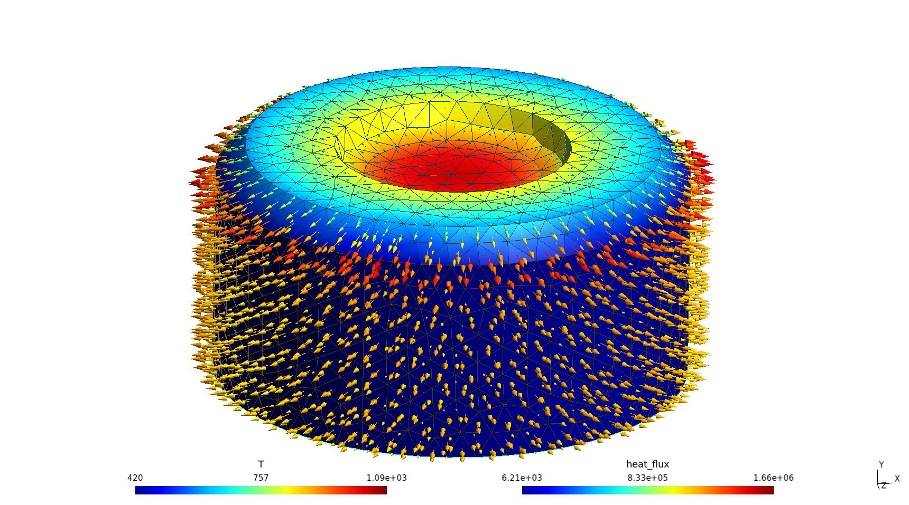{#fig:pellet-non-linear-k-uniform-q-top}

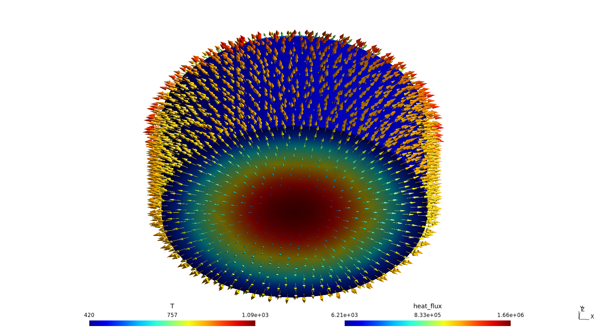{#fig:pellet-non-linear-k-uniform-q-bottom}

Temperature and heat flux distribution for a half UO$_2$ pellet with uniform power source.
:::


If we comment out the line with the initial guess, then FeenoX does converge but it needs one step more:

```terminal
$ feenox pellet-non-linear-k-uniform-q.fee --snes_monitor
  0 SNES Function norm 2.222870199708e+02 
  1 SNES Function norm 6.228090579878e-01 
  2 SNES Function norm 4.109509310386e-02 
  3 SNES Function norm 1.603956028971e-04 
  4 SNES Function norm 2.124156299986e-09 
1094.77
$ 
```

If, for some reason, we do not want to solve this problem as non-linear, then we can force FeenoX to solve it as if it was a linear problem.
We can either choose so from the input file writing

```feenox
PROBLEM thermal LINEAR
```

or by passing `--linear` in the command-line options:

```terminal
$ feenox pellet-non-linear-k-uniform-q.fee --snes_monitor --linear
717.484
WARNING! There are options you set that were not used!
WARNING! could be spelling mistake, etc!
There is one unused database option. It is:
Option left: name:-snes_monitor (no value) source: command line
$ 
```

## Temperature-dependent sources

The volumetric power generated by fissioning nuclei of U$^{235}$ in the UO$_2$ is not uniform throughout the fuel.
It depends on...

 1. The location of the fuel bundle inside the core: in general, pellets located near the center dissipate more power than those located at the periphery).
 2. The location of the pellet inside the fuel element: the effect depends on the reactor design but for reactors where the moderator is separated from the coolant, this change is very significative.
 3. The spatial location $\mathbf{x}$ inside the pellet: points near the periphery of the pellet now dissipate more power than those located in the bulk because they "have access" to more moderated neutrons coming from the outside.
 4. The temperature $T(\mathbf{x})$: hot nuclei are less likely to fission.

along with other nuclear-related stuff such as fuel burn-up, concentration of poisons, control systems, etc.

Anyway, this is a tutorial about FeenoX capabilities.
Our goal here is to show what FeenoX can do and how to ask it to to such things.
So let us model a custom power source depending both on space and on the local temperature like

$$
q(x,y,z) = q_0 \cdot (1 + 20~\text{mm}^{-1} \cdot x) \cdot \left[1 - \frac{ T(x,y,z)-800~\text{ºC}}{2000 ~\text{ºC}} \right]
$$

> **Note:** According to [Le Chatelier's principle](https://en.wikipedia.org/wiki/Le_Chatelier's_principle), the power should decrease when the temperature increases.

To also illustrate how to set a conductivity that depends directly on interpolated experimental data, in this case we use the numerical data from the IAEA report above by defining `cond(T')` as a function of type `DATA`:
 
```feenox
VAR T'
FUNCTION cond(T') INTERPOLATION steffen DATA {
400                4.74
450                4.50
500                4.28
550                4.07
600                3.89
650                3.91
700                3.55
750                3.40
800                3.26
850                3.13
900                3.01
950                2.90
1000               2.79
1050               2.70
1100               2.61
1132               2.55
1150               2.52
1200               2.45 }
```

Since we want to compare the temperature distribution using this non-linear power source with respect to the previous case with uniform power, we read back the temperature we wrote with the instruction [`WRITE_RESULTS`](https://www.seamplex.com/feenox/doc/feenox-manual.html#write_results). With no further arguments, that instruction writes a `.msh` file with the temperature distribution `T` as a scalar field and the three heat fluxes `qx`, `qy` and `qz` as a vector---which we used to create fig:pellet-non-linear-k-uniform-q. If no `FILE` keyword is given, the default mesh file is named like the FeenoX input file with the extension `.fee` renamed to `.msh`. So we can then ask FeenoX to retrieve the old temperature distribution as a function of space, with a new name (since there is already a function `T`), say `T_uniform`:
 
```feenox
READ_MESH pellet-non-linear-k-uniform-q.msh DIM 3 READ_FIELD T as T_uniform
```

Now we can write the results, including the algebraic difference (or any other operation) of `T` and `T_uniform`. For that end, we now use [`WRITE_MESH`](https://www.seamplex.com/feenox/doc/feenox-manual.html#write_mesh):

```feenox
WRITE_MESH $0.vtk T T(x,y,z)-T_uniform(x,y,z) q VECTOR qx qy qz 
```

> **Note:** If the input file does not explicitly asks for the heat fluxes or does not have the instruction `WRITE_RESULTS`, then the heat fluxes are not computed at all to save CPU time.

Just to change things a little bit, we now write a VTK post-processing file (instead of `.msh` like in the previous case). Since `WRITE_MESH` is a generic instruction (while `WRITE_RESULTS` is PDE-aware so it knows which are the available fields) we have to list what we want to write in the VTK:

 1. The current temperature distribution `T`. Since `T` is a function of space, there is no need to pass the arguments `(x,y,z)`, it will be understood as "write the function of space `T` in the output mesh."
 2. The algebraic difference between the current temperature distribution and the one read from last case's output. This time, we are asking FeenoX to write an algebraic expression, so the arguments of both functions are needed.
 3. The heat power source `q` as a scalar function of space. Again, no need to give the arguments.
 4. A three-dimensional vector whose three components are the three heat fluxes.

By default, `WRITE_MESH` writes nodal-based fields. If the `CELLS` keyword is used, all the following fields are written as cell-based fields, until the `NODES` keyword appears again (or until there are no more fields, of course).
 
> **Note:** In this case the "old" mesh is the very same as the "current" mesh. Therefore, no interpolation is needed and the difference $T(x,y,z)-T_\text{uniform}(x,y,z)$ will be evaluated node by node. But if the mesh over which $T_\text{uniform}(x,y,z)$ was different (even with a different element order), then FeenoX would be able to interpolate it at the nodes (or cell centers) of the new mesh. 
 
 
Putting everything together, we have:

```{.feenox include="pellet-non-linear-k-non-linear-q.fee"}
```

which we can run as simply as

```terminal
$ feenox pellet-non-linear-k-non-linear-q.fee 
1026.17
$ 
```

to get an output VTK file we can then further post-process to get @fig:pellet-non-linear-k-non-linear-q.

::: {#fig:pellet-non-linear-k-non-linear-q}
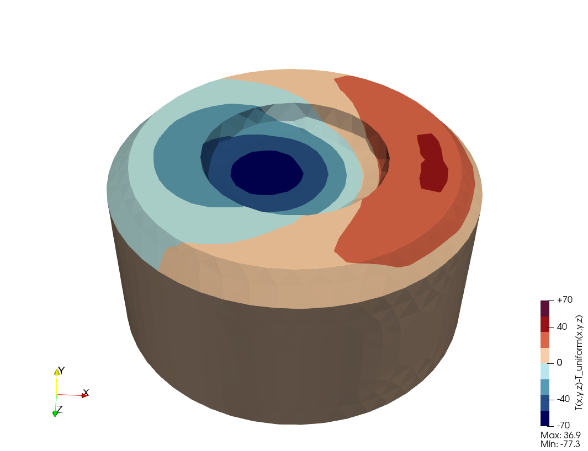{#fig:diff-T width_html=100% width_latex=75%}

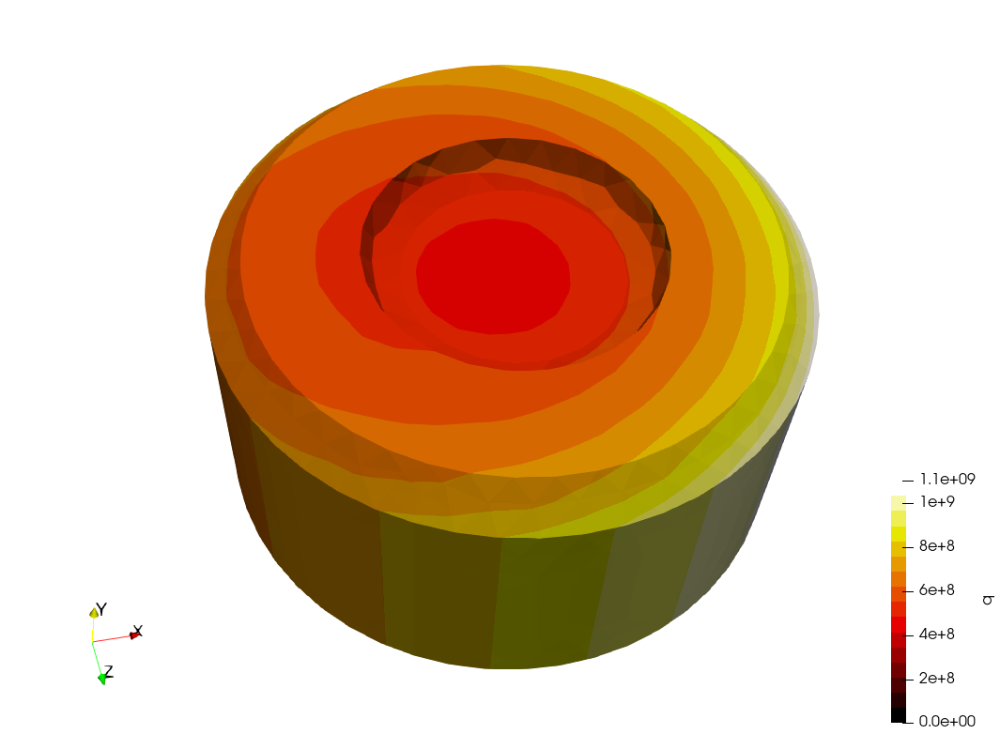{#fig:power width_html=100% width_latex=75%}

Results for the non-uniform power case
:::


# Transient problems

In this final section of the tutorial we solve the transient heat conduction equation

$$
\rho(\mathbf{x}, T) \cdot c_p(\mathbf{x}, T) \cdot \frac{\partial T}{\partial t} - \text{div} \left[ k(\mathbf{x}, T) \cdot \text{grad}{T} \right] = q'''(\mathbf{x}, T)
$$

For this end, we need the product of the density $\rho$ and heat capacity $c_p$.
This product can be given by either

 a. `rho` and `cp` separately
 b. `rhocp` as a single property
 c. the thermal diffusivity `kappa` (equal to $k / (\rho c_p)$)

As with any other transient problem in FeenoX, it is triggered by setting the special variable `end_time` to a positive value.
FeenoX uses [PETSc's TS](https://petsc.org/release/manual/ts/) framework for transient problems.
By default, it uses an adaptive time stepper. An initial $\Delta t$ can be given with the special variable [`dt`](https://www.seamplex.com/feenox/doc/feenox-manual.html#dt).
The range can be controlled with [`min_dt`](https://www.seamplex.com/feenox/doc/feenox-manual.html#min_dt) and [`max_dt`](https://www.seamplex.com/feenox/doc/feenox-manual.html#max_dt), which can be expressions of the special variable [`t`](https://www.seamplex.com/feenox/doc/feenox-manual.html#t).

If one needs to stop the transient problem before it reaches the prescribed `end_time`, the special variable [`done`](https://www.seamplex.com/feenox/doc/feenox-manual.html#done) can be set to true. After the next `PROBLEM_SOLVE` instruction, the transient problem will finish.
 
The initial condition can be given by defining a function `T_0` of space.
If there is no `T_0` defined, the initial condition is obtained by solving a steady-state problem with `t=0`.
 
## From an arbitrary initial condition

TBD

## From a steady state

TBD

