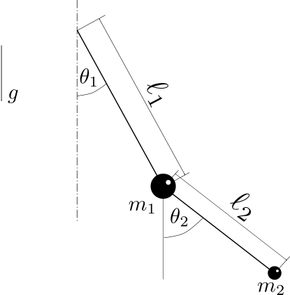
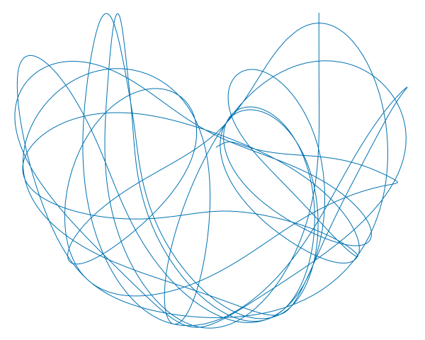
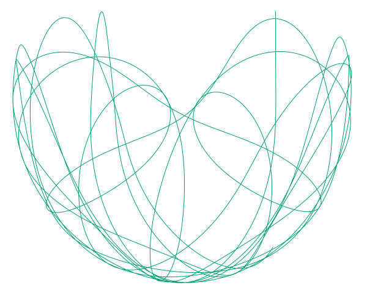
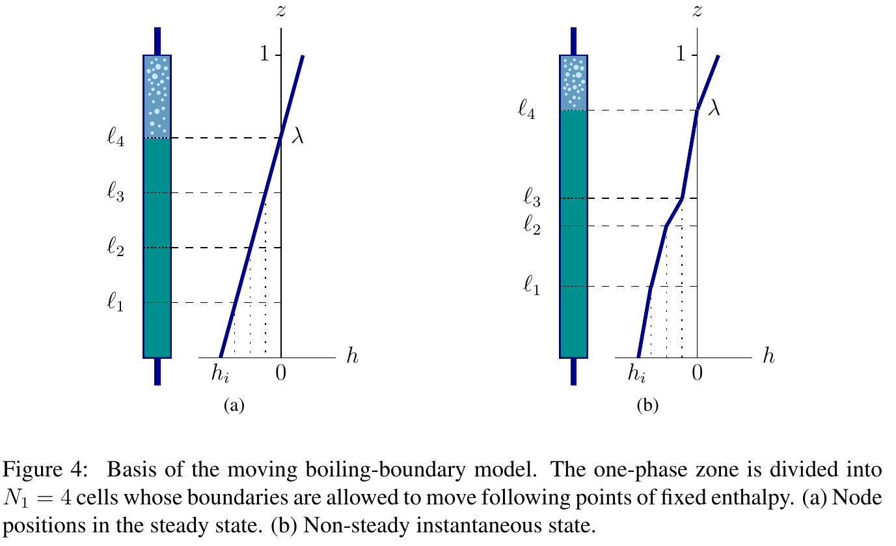
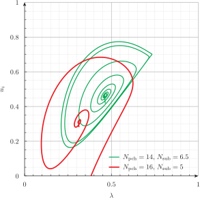
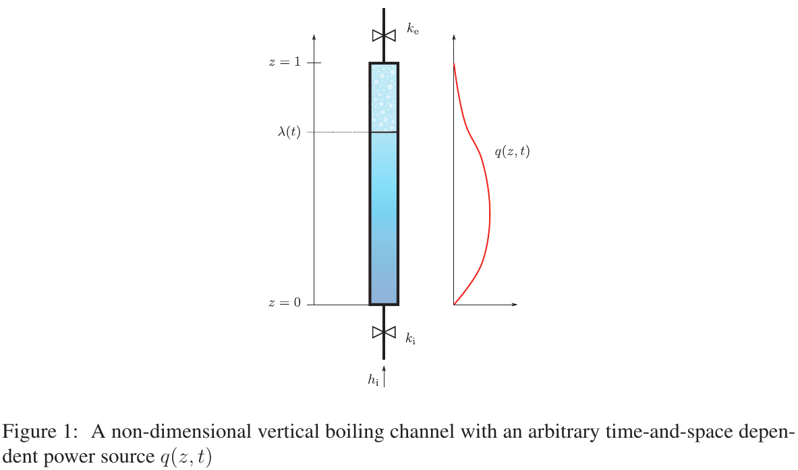
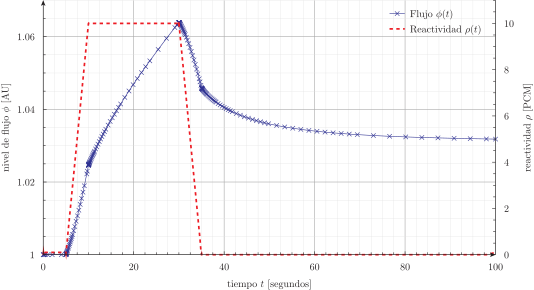

---
title: Ordinary Differential Equations & Differential-Algebraic Equations
titleblock: |
 Ordinary Differential Equations & Differential-Algebraic Equations
 ==================================================================
lang: en-US
toc: true 
...
# Lorenz' attractor---the one with the butterfly

Solve

$$
\begin{cases}
\dot{x} &= \sigma \cdot (y - x)  \\
\dot{y} &= x \cdot (r - z) - y   \\
\dot{z} &= x y - b z             \\
\end{cases}
$$

for $0 < t < 40$ with initial conditions

$$
\begin{cases}
x(0) = -11  \\
y(0) = -16  \\
z(0) = 22.5 \\
\end{cases}
$$

and $\sigma=10$, $r=28$ and $b=8/3$, which are the classical parameters
that generate the butterfly as presented by Edward Lorenz back in his
seminal 1963 paper [Deterministic non-periodic
flow](http://journals.ametsoc.org/doi/abs/10.1175/1520-0469%281963%29020%3C0130%3ADNF%3E2.0.CO%3B2).
This example's input file ressembles the parameters, inital conditions
and differential equations of the problem as naturally as possible with
an ASCII file.


```feenox
PHASE_SPACE x y z     # Lorenz attractor’s phase space is x-y-z
end_time = 40         # we go from t=0 to 40 non-dimensional units

sigma = 10            # the original parameters from the 1963 paper
r = 28
b = 8/3

x_0 = -11             # initial conditions
y_0 = -16
z_0 = 22.5

# the dynamical system's equations written as naturally as possible
x_dot = sigma*(y - x)
y_dot = x*(r - z) - y
z_dot = x*y - b*z

PRINT t x y z        # four-column plain-ASCII output
```


```terminal
$ feenox lorenz.fee > lorenz.dat
$ gnuplot lorenz.gp
$ python3 lorenz.py
$ sh lorenz2x3d.sh < lorenz.dat > lorenz.html

```


::: {#fig:ex_lorenz}
{width=48%}
{width=48%}

The Lorenz attractor computed with FeenoX plotted with two different tools
:::


# The double pendulum

Find the location of the two bobs vs time in the double pendulum
in @fig:double-pendulum.

{#fig:double-pendulum
width="60%"}

Use these four different approaches:

a.  Hamiltonian formulation with numerical derivatives

    $$
    \begin{aligned}
    \mathcal{H}(\theta_1, \theta_2, p_1, p_2) =&
     - \frac{\ell_2^2 m_2 p_1^2 - 2 \ell_1 \ell_2 m_2 \cos(\theta_1-\theta_2) p_1 p_2 + \ell_1^2 (m_1+m_2) p_2^2}
     {\ell_1^2 \ell_2^2 m_2 \left[-2m_1-m_2+m_2\cos\Big(2(\theta_1-\theta_2)\Big)\right]} \\
     & - \Big[ m_1 g \ell_1 \cos \theta_1 + m_2 g (\ell_1 \cos \theta_1 + \ell_2 \cos \theta_2) \Big]
    \end{aligned}
    $$

    $$
    \begin{cases}
    \displaystyle  \dot{\theta}_1 &= \displaystyle +\frac{\partial \mathcal{H}}{\partial p_1} \\
    \displaystyle  \dot{\theta}_2 &= \displaystyle +\frac{\partial \mathcal{H}}{\partial p_2} \\
    \displaystyle  \dot{p}_1 &= \displaystyle -\frac{\partial \mathcal{H}}{\partial \theta_1} \\
    \displaystyle  \dot{p}_2 &= \displaystyle -\frac{\partial \mathcal{H}}{\partial \theta_2} \\
    \end{cases}
    $$

    ``` feenox
    # the double pendulum solved by the hamiltonian formulation
    # and numerically computing its derivatives

    PHASE_SPACE theta1 theta2 p1 p2
    VAR theta1' theta2' p1' p2'

    H(theta1,theta2,p1,p2) = \
              - (m1*g*l1*cos(theta1) + m2*g*(l1*cos(theta1) \
              + l2*cos(theta2))) \
              - (l2^2*m2*p1^2 - 2*l1*l2*m2*cos(theta1-theta2)*p1*p2 + \
                   l1^2*(m1+m2)*p2^2)/(l1^2*l2^2*m2 \ 
                     * (-2*m1-m2+m2*cos(2*(theta1-theta2))))


    theta1_dot .= +derivative(H(theta1,theta2,p1',p2), p1', p1)
    theta2_dot .= +derivative(H(theta1,theta2,p1,p2'), p2', p2)

    p1_dot     .= -derivative(H(theta1',theta2,p1,p2), theta1', theta1)
    p2_dot     .= -derivative(H(theta1,theta2',p1,p2), theta2', theta2)
    ```

b.  Hamiltonian formulation with analytical derivatives

    $$
    \begin{cases}
    \dot{\theta}_1 &= \displaystyle         \frac{p_1 \ell_2 - p_2 \ell_1 \cos(\theta_1-\theta_2)}{\ell_1^2 \ell_2 [m_1 + m_2 \sin^2(\theta_1-\theta_2)]} \\
    \dot{\theta}_2 &= \displaystyle  \frac{p_2 (m_1+m_2)/m_2 \ell_1 - p_1 \ell_2 \cos(\theta_1-\theta_2)}{\ell_1 \ell_2^2 [m_1 + m_2 \sin^2(\theta_1-\theta_2)]} \\
    \dot{p_1} &= \displaystyle -(m_1+m_2) g \ell_1 \sin(\theta_1) - c_1 + c_2 \\
    \dot{p_2} &= \displaystyle -m_2 g \ell_2 \sin(\theta_2) + c_1 - c_2
    \end{cases}
    $$ where the expressions $c_1$ and $c_2$ are

    $$\begin{aligned}
    c1 &= \frac{p_1 p_2 \sin(\theta_1-\theta_2)}{\ell_1 \ell_2 \Big[m_1+m_2 \sin(\theta_1-\theta_2)^2\Big]} \\
    c2 &= \frac{\Big[ p_1^2 m_2 \ell_2^2 - 2 p_1 p_2 m_2 \ell_1 \ell_2 \cos(\theta_1-\theta_2)
       + p_2^2 (m_1+m_2) \ell_1^2)\Big] \sin(2 (\theta_1-\theta_2)}{
      2 \ell_1^2 \ell_2^2 \left[m_1+m_2 \sin^2(\theta_1-\theta_2)\right]^2}
    \end{aligned}
    $$

    ``` feenox
    # the double pendulum solved by the hamiltonian formulation
    # and analytically computing its derivatives

    PHASE_SPACE theta1 theta2 p1 p2 c1 c2

    theta1_dot .=            (p1*l2 - p2*l1*cos(theta1-theta2))/(l1^2*l2*(m1 + m2*sin(theta1-theta2)^2))
    theta2_dot .= (p2*(m1+m2)/m2*l1 - p1*l2*cos(theta1-theta2))/(l1*l2^2*(m1 + m2*sin(theta1-theta2)^2))

    p1_dot .= -(m1+m2)*g*l1*sin(theta1) - c1 + c2
    p2_dot .=      -m2*g*l2*sin(theta2) + c1 - c2

    c1 .= p1*p2*sin(theta1-theta2)/(l1*l2*(m1+m2*sin(theta1-theta2)^2))
    c2 .= { (p1^2*m2*l2^2 - 2*p1*p2*m2*l1*l2*cos(theta1-theta2)
             + p2^2*(m1+m2)*l1^2)*sin(2*(theta1-theta2))/
            (2*l1^2*l2^2*(m1+m2*sin(theta1-theta2)^2)^2) }
    ```

c.  Lagrangian formulation with numerical derivatives

    $$
    \begin{aligned}
    \mathcal{L}(\theta_1, \theta_2, \dot{\theta}_1, \dot{\theta}_2) =& 
    \frac{1}{2} m_1 \ell_1^2 \dot{\theta}_1^2 +
    \frac{1}{2} m_2 \left[\ell_1^2 \dot{\theta}_1^2 + \ell_2^2 \dot{\theta}_2^2 + 2 \ell_1 \ell_2 \dot{\theta}_1 \dot{\theta}_2 \cos(\theta_1-\theta_2)\right] + \\
    & m_1 g  \ell_1\cos \theta_1 + m_2 g \left(\ell_1\cos \theta_1 + \ell_2 \cos \theta_2 \right)
    \end{aligned}
    $$

    $$
    \begin{cases}
    \displaystyle \frac{\partial}{\partial t}\left(\frac{\partial \mathcal{L}}{\partial \dot{\theta}_1}\right) &= \displaystyle \frac{\partial \mathcal{L}}{\partial \theta_1} \\
    \displaystyle  \frac{\partial}{\partial t}\left(\frac{\partial \mathcal{L}}{\partial \dot{\theta}_2}\right) &= \displaystyle \frac{\partial \mathcal{L}}{\partial \theta_2}
    \end{cases}
    $$

    ``` feenox
    # the double pendulum solved by the lagrangian formulation
    # and numerically computing its derivatives

    PHASE_SPACE theta1 theta2 dL_dthetadot1 dL_dthetadot2
    VAR theta1' theta2' theta1_dot' theta2_dot'

    L(theta1,theta2,theta1_dot,theta2_dot) = {
    # kinetic energy of m1
     1/2*m1*l1^2*theta1_dot^2 + 
    # kinetic energy of m2
     1/2*m2*(l1^2*theta1_dot^2 + l2^2*theta2_dot^2 + 2*l1*l2*theta1_dot*theta2_dot*cos(theta1-theta2))
     + ( 
    # potential energy of m1 
     m1*g *  l1*cos(theta1) +
    # potential energy of m2
     m2*g * (l1*cos(theta1) + l2*cos(theta2))
     ) }

    # there is nothing wrong with numerical derivatives, is there?
    dL_dthetadot1 .= derivative(L(theta1, theta2, theta1_dot', theta2_dot), theta1_dot', theta1_dot)
    dL_dthetadot2 .= derivative(L(theta1, theta2, theta1_dot, theta2_dot'), theta2_dot', theta2_dot)

    dL_dthetadot1_dot .= derivative(L(theta1', theta2,theta1_dot, theta2_dot), theta1', theta1)
    dL_dthetadot2_dot .= derivative(L(theta1, theta2',theta1_dot, theta2_dot), theta2', theta2)

    ```

d.  Lagrangian formulation with analytical derivatives

    $$
    \begin{cases}
    0 &= (m_1+m_2) \ell_1^2 \ddot{\theta}_1 + m_2 \ell_1 \ell_2 \ddot{\theta}_2 \cos(\theta_1-\theta_2) + m_2 \ell_1 \ell_2 \dot{\theta}_2^2 \sin(\theta_1-\theta_2) + \ell_1 (m_1+m_2) g \sin(\theta_1) \\
    0 &= m_2 \ell_2^2 \ddot{\theta}_2 + m_2 \ell_1 \ell_2 \ddot{\theta}_1 \cos(\theta_1-\theta_2) - m_2 \ell_1 \ell_2 \dot{\theta}_1^2 \sin(\theta_1-\theta_2) + \ell_2 m_2 g \sin(\theta_2)
    \end{cases}
    $$

    ``` feenox
    # the double pendulum solved by the lagrangian formulation
    # and analytically computing its derivatives

    PHASE_SPACE theta1 theta2 omega1 omega2

    # reduction to a first-order system
    omega1 .= theta1_dot
    omega2 .= theta2_dot

    # lagrange equations
    0 .= (m1+m2)*l1^2*omega1_dot + m2*l1*l2*omega2_dot*cos(theta1-theta2) + \
     m2*l1*l2*omega2^2*sin(theta1-theta2) + l1*(m1+m2)*g*sin(theta1)


    0 .= m2*l2^2*omega2_dot + m2*l1*l2*omega1_dot*cos(theta1-theta2) - \
     m2*l1*l2*omega1^2*sin(theta1-theta2) + l2*m2*g*sin(theta2)
    ```

The combination Hamilton/Lagrange and numerical/analytical is given in
the command line as arguments `$1` and `$2` respectively.


```feenox
# the double pendulum solved using different formulations

# parameters
end_time = 10
m1 = 0.3
m2 = 0.2
l1 = 0.3
l2 = 0.25
g = 9.8

# inital conditions
theta1_0 = pi/2
theta2_0 = pi

# include the selected formulation
DEFAULT_ARGUMENT_VALUE 1 hamilton
DEFAULT_ARGUMENT_VALUE 2 numerical
INCLUDE double-$1-$2.fee

# output the results vs. time
PRINT t theta1 theta2 theta1_dot theta2_dot \
      l1*sin(theta1)                -l1*cos(theta1) \
      l1*sin(theta1)+l2*sin(theta2) -l1*cos(theta1)-l2*cos(theta2) 
```


```terminal
$ for guy in hamilton lagrange; do
   for form in numerical analytical; do
     feenox double.fee $guy $form > double-${guy}-${form}.tsv;
     m4 -Dguy=$guy -Dform=$form -Dtype=$RANDOM double.gp.m4 | gnuplot -;
   done;
  done
$ 

```


::: {#fig:double-results}
{width=48%}
{width=48%}

{width=48%}
{width=48%}

Position of the double pendulum's $m_2$ solved with four (slightly) different formulations
:::


# Vertical boiling channel

## Original Clausse-Lahey formulation with uniform power distribution

Implementation of the dynamical system as described in

-   [The Moving Boiling-Boundary Model Of A Vertical Two-Phase Flow
    Channel
    Revisited](http://www.cimec.org.ar/ojs/index.php/mc/article/view/3277/3200),
    by Jeremy Theler, Alejandro Clausse and Fabián J. Bonetto (2010).

> | The original paper was written using the **first** version of the
>   code, named mochin.
> | Recall that FeenoX is a [third system
>   effect](../doc/sds.md#sec:architecture).



For reference, the non-dimensional equations are

$$
\begin{aligned}
0 &=  \frac{1}{2} \left (\frac{d\ell_{n-1}}{dt} + \frac{d\ell_n}{dt} \right) + N_{1} (\ell_n - \ell_{n-1}) - u_i \quad\quad \text{for $n=1,\dots,N_1$} \nonumber\\
0 &=  u_i - u_e + N_\text{sub} \, (1 - \lambda ) \nonumber\\
0 &= \rho_e - \frac{1}{1+N_\text{pch} \, \eta (1-\lambda)} \nonumber \\
0 &= \lambda - m + \frac{ \ln \left( 1/\rho_e \right) }{N_\text{pch} \, \eta} \nonumber \\
0 &= \dot{m} + \rho_e u_e - u_i \nonumber \\
0 &= m \, \dot{u}_i + u_i \, \dot{m} - \frac{N_\text{sub} (1-m)}{\eta^2 N_\text{pch}} \, \dot{\eta} - \frac{N_\text{sub}}{\eta N_\text{pch}} \, \dot{m} + \rho_e {u_e}^2 - {u_i}^2 + \frac{m}{\text{Fr}}  - \text{Eu}  \nonumber\\
& \quad\quad\quad + \Lambda \left\{ m \cdot u_i^2 + \frac{N_\text{sub} \ln(1/\rho_e)}{(\eta N_\text{pch})^2}\left( \frac{N_\text{sub}}{\eta N_\text{pch}} - 2 u_i \right) +  \frac{\lambda^2 N_\text{sub}^2}{2 N_\text{pch}} +  \frac{2 u_i N_\text{sub}(1-\lambda)}{(\eta N_\text{pch})} \right. \nonumber \\
& \quad\quad\quad\quad\quad\quad \left. + \frac{N_\text{sub}^2}{\eta N_\text{pch}} \left[ \left(\frac{1}{2} - \lambda \right) - \frac{1-\lambda}{\eta N_\text{pch}} \right] \right\} + k_i u_i^2 + k_e \rho_e u_e^2  & 
\end{aligned}
$$ where $\ell_0 = 0$ and $\ell_{N_1}=\lambda$. See the full paper for
the details.

The input file `boiling-2010-eta.fee` takes two optional arguments from
the command line:

1.  The phase-change number $N_\text{pch}$ (default is 14)
2.  The subcooling number $N_\text{sub}$ (default is 6.5)

When run, FeenoX...

a.  computes the steady state conditions (including the Euler number of
    of the two numbers from the command line),

b.  prints a commented-out block (each line starting with `#`) with the
    dimensionless numbers of the problem,

c.  disturbs the inlet velocity to 90% of the nominal value,

d.  solves the system up to a non-dimensional time of 100, and

e.  for each time step, writes three columns:

    i.  the non-dimensional time $t$
    ii. the non-dimesinoal location of the boiling interface $\lambda$
    iii. the non-dimensional inlet velocity $u_i$

The input file [`boiling-2010.fee`](boiling-2010.fee) contains the
original Clausse-Lahey formulation without the intermediate
variable $\eta$.


```feenox
##############################
# vertical boiling channel
# clausse & lahey nodalization, nondimensional DAE version
# version with eta (N1+5 variables) as presented at MECOM 2010
# Theler G., Clausse A., Bonetto F.,
# The moving boiling-boundary model of a vertical two-phase flow channel revisited.
# Mecanica Computacional, Volume XXIX Number 39, Fluid Mechanics (H), pages 3949-3976.
# http://www.cimec.org.ar/ojs/index.php/mc/article/view/3277/3200
# updated to work with FeenoX
# jeremy@seamplex.com
##############################

##############################
# non-dimensional parameters
##############################
DEFAULT_ARGUMENT_VALUE 1 14
DEFAULT_ARGUMENT_VALUE 2 6.5
Npch = $1    # phase-change number (read from command line)
Nsub = $2    # subcooling number   (read from command line)

Fr = 1       # froude number
Lambda = 3   # distributed friction number
ki = 6       # inlet head loss coefficient
ke = 2       # outlet head loss coefficient


##############################
# phase-space definition
##############################
N1 = 6       # nodes in the one-phase region
VECTOR l SIZE N1

PHASE_SPACE l ui ue m rhoe eta

# the boiling frontier is equal to the last one-phase node position
# and we refer to it as lambda throughout the file
ALIAS l[N1] AS lambda 


##############################
# DAE solver settings
##############################
end_time = 100        # final integration time

# compute the initial derivatives of the differential objects
# from the variables of both differential and algebraic objects
INITIAL_CONDITIONS_MODE FROM_VARIABLES


##############################
# steady state values
##############################
IF Npch<(Nsub+1e-2)
 PRINT "Npch =" Npch "should be larger than Nsub =" Nsub SEP " "
 ABORT
ENDIF

# compute the needed euler (external pressure) number
Eu = {  (1/Npch)*(Nsub^2 + 0.5*Lambda*Nsub^2 + ke*Nsub^2)
      + (1/Npch^2)*(-Nsub^3 + Lambda*Nsub^2 - Lambda*Nsub^3
                     + ki*Nsub^2 + ke*Nsub^2 - ke*Nsub^3)
      + (Nsub/Npch)* 1/Fr * (1 + log(1 + Npch - Nsub)/Nsub)
      + 0.5*Nsub^4/Npch^3*Lambda }
      
# and the steady-state (starred in the paper) values
ui_star = Nsub/Npch
lambda_star = Nsub/Npch
m_star = lambda_star + 1/Npch*(log(1+Npch*(1-lambda_star)))
rhoe_star = 1/(1 + Npch*(1-lambda_star))
ue_star = ui_star + Nsub*(1-lambda_star)
eta_star = 1


##############################
# initial conditions
##############################
l_0[i] = lambda_star * i/N1
m_0 = m_star
ui_0 = 0.9*ui_star         # disturbance
ue_0 = ue_star
rhoe_0 = rhoe_star
eta_0 = eta_star

# stop the integration if certain variables get out of
# the [0:1] interval -> unstable condition
done = done | m>1 | lambda>1 | ui<0 | ui>1
IF done
 PRINT TEXT "\# model is out of bounds" Nsub Npch m lambda ui
 ABORT
ENDIF


##############################
# the dynamical system equations
##############################
# equations (29)
0 .= 0.5*(        0  + l_dot[1]) + N1*(l[1] -     0 ) - ui

# TODO: this used to work but now it does not
# 0[i]<2:N1> .= 0.5*(l_dot[i-1] + l_dot[i]) + N1*(l[i] - l[i-1]) - ui
 
0 .= 0.5*(l_dot[2-1] + l_dot[2]) + N1*(l[2] - l[2-1]) - ui
0 .= 0.5*(l_dot[3-1] + l_dot[3]) + N1*(l[3] - l[3-1]) - ui
0 .= 0.5*(l_dot[4-1] + l_dot[4]) + N1*(l[4] - l[4-1]) - ui
0 .= 0.5*(l_dot[5-1] + l_dot[5]) + N1*(l[5] - l[5-1]) - ui
0 .= 0.5*(l_dot[6-1] + l_dot[6]) + N1*(l[6] - l[6-1]) - ui

# equation (31)
0 .= ui - ue + Nsub*(1-lambda)

# equation (34)
0 .= rhoe - 1/(1+eta*Npch*(1-lambda))

# equation (35)
0 .= lambda - m + 1/(eta*Npch)*log(1/rhoe)

# equation (36)
0 .= m_dot + rhoe*ue - ui

# equation (30)
0 .= {
   + m*ui_dot + m_dot*ui
   - Nsub*(1-m)/(eta^2*Npch)*eta_dot - Nsub/(eta*Npch)*m_dot
   + rhoe * ue^2 - ui^2 
   + m/Fr - Eu
   + ki*ui^2 + ke*rhoe*ue^2
   + Lambda*( m*ui^2
              + (Nsub*log(1/rhoe))/(eta*Npch)^2*(Nsub/(eta*Npch) - 2*ui)
              + lambda^2*Nsub^2/(2*Npch)
              + 2*ui*Nsub*(1-lambda)/(eta*Npch)
              + Nsub^2/(eta*Npch)*((0.5-lambda)-(1-lambda)/(eta*Npch))
            ) }


##############################
# output results
##############################
# write information (commented out) in the ouput header
IF in_static
 PRINT "\# vertical boiling channel with uniform power (eta formulation 2010)"
 PRINT "\# Npch = "   Npch
 PRINT "\# Nsub = "   Nsub
 PRINT "\# Fr   = "   Fr
 PRINT "\# Lambda = " Lambda
 PRINT "\# ki   = "   ki
 PRINT "\# ke   = "   ke
 PRINT "\# Eu   = "   %.10f Eu
ENDIF

PRINT t lambda ui
```


```terminal
$ feenox boiling-2010.fee | tee boiling-2010-14-6.5.dat
# vertical boiling channel with uniform power (original formulation 2010)
# Npch =        14
# Nsub =        6.5
# Fr   =        1
# Lambda =      3
# ki   =        6
# ke   =        2
# Eu   =        9.1375899118
0       0.464286        0.417857
1.52588e-05     0.464286        0.41787
3.05176e-05     0.464286        0.417884
[...]
49.9456 0.260377        0.532362
49.9759 0.270814        0.556147
50      0.279815        0.574653
$ feenox boiling-2010.fee 16 5 | tee boiling-2010-16-5.dat
# vertical boiling channel with uniform power (original formulation 2010)
# Npch =        16
# Nsub =        5
# Fr   =        1
# Lambda =      3
# ki   =        6
# ke   =        2
# Eu   =        5.8724697515
0       0.3125  0.28125
1.52588e-05     0.3125  0.281258
3.05176e-05     0.3125  0.281267
[...]
9.70317 0.383792        0.00373348
9.71746 0.375037        -0.0176774
# model is out of bounds        5       16      0.600731        0.375037        -0.0176774  
$ 

```


{width=85%}


## Arbitrary power distribution

Extension of the Clausse-Lahey model to support arbitrary (and
potentially time-dependent) power profiles as explained in

-   [A Moving Boiling-Boundary Model Of An Arbitraryly-Powered Two-Phase
    Flow
    Loop](https://cimec.org.ar/ojs/index.php/mc/article/view/4091/4017),
    by Jeremy Theler, Alejandro Clausse and Fabián J. Bonetto (2012).

> | The original paper was written using the **second** version of the
>   code, named wasora.
> | Recall that FeenoX is a [third system
>   effect](../doc/sds.md#sec:architecture).



For reference, the non-dimensional equations are

$$
\begin{aligned}
0 &= \, -\frac{1}{h_\text{i}(t)} \cdot \frac{d h_\text{i}}{dt} \left( N_1 - n - \frac{1}{2} \right) \Big[\ell_{n}(t) - \ell_{n-1}(t) \Big]  
+ \frac{1}{2} \left( \frac{d\ell_n}{dt} + \frac{d\ell_{n-1}}{dt} \right)  \quad\quad & \nonumber \\
& \quad\quad\quad\quad - u_\text{i}(t) - \frac{N_1}{h_\text{i}(t)} \cdot \frac{N_\text{sub}}{N_\text{pch}} \int_{\ell_{n-1}(t)}^{\ell{n}(t)} q(z,t) \, dz \quad\quad\quad\quad\quad \text{for $n=1,\dots,N_1$}
\\
0 &=  u_\text{i}(t) - u_\text{e}(t)  + N_\text{sub} \int_{\lambda(t)}^{1} q(z',t) \, dz' 
\\
0 &=  \, \rho_\text{e}(t) - \frac{1}{\displaystyle 1 + N_\text{pch} \cdot \eta(t) \cdot \int_{\lambda(t)}^{1} q(z',t) \, dz'}
\\
0 &= \lambda(t) - m(t) + \int_{\lambda(t)}^{1} \frac{dz}{\displaystyle 1 + N_\text{pch} \cdot \eta(t) \cdot \int_{\lambda(t)}^{z} q(z',t) \, dz'} 
\\
0 &= \varphi(t) - \int_{\lambda(t)}^{1} \frac{ \displaystyle u_\text{i}(t) + N_\text{sub}  \int_{\lambda(t)}^{z} q(z',t) \, dz'}{\displaystyle 1 + N_\text{pch}  \cdot \eta(t) \cdot \int_{\lambda(t)}^{z} q(z',t) \, dz'} \, dz
\\
0 &= \frac{d m(t)}{dt} + \rho_\text{e}(t) \cdot u_\text{e}(t) - u_\text{i}(t)
\\
0 &= 
 \frac{d u_\text{i}(t)}{dt} \cdot \lambda(t) + u_\text{i}(t) \cdot \frac{d \lambda(t)}{dt} + \frac{d\varphi(t)}{dt}
 + \rho_\text{e}(t) \, u_\text{e}^2(t) - \rho_\text{i}(t) \, u_\text{i}^2(t)  \\
& \quad\quad\quad\quad +
\Lambda \cdot \left[ u_\text{i}^2(t) \cdot \lambda(t) +
 \int_{\lambda(t)}^{1} \frac{\left( \displaystyle u_\text{i}(t) + N_\text{sub}  \int_{\lambda(t)}^{z} q(z',t) \, dz'\right)^2}{\displaystyle 1 + N_\text{pch}  \cdot \eta(t) \cdot \int_{\lambda(t)}^{z} q(z',t) \, dz'} \, dz \right] \\
& \quad\quad\quad\quad\quad\quad
 + k_\text{i} \cdot \rho_\text{i}(t) \, u_\text{i}^2(t)
 + k_\text{e} \cdot \rho_\text{e}(t) \, u_\text{e}^2(t)
+ \frac{m(t)}{\text{Fr}} - \text{Eu}(t) \\
0 &= h_\text{i}(t) + f(\mathbf{x}, \mathbf{\dot{x}}, t) \\
0 &= \text{Eu}(t) + g(\mathbf{x}, \mathbf{\dot{x}}, t)
\end{aligned}
$$

Again, see the full paper for the details.

The input file `boiling-2012-steady.fee` computes the steady-state
profiles of

-   the velocity $u(z)$
-   the enthalpy $h(z)$
-   the density $h(z)$

where

1.  the first argument is a string with the power profile (default
    `uniform`), either

    a.  `uniform`

        ``` feenox
        # uniform power profile
        qstar(z) = 1
        ```

    b.  `sine`

        ``` feenox
        # 2. sine-shaped power profile
        qstar(z) = pi/2 * sin(z*pi)
        ```

    c.  `arbitrary`

        ``` feenox
        # arbitray normalized interpolated power profile
        FUNCTION potencia(z) INTERPOLATION splines DATA {
        0      0
        0.2    2.5 
        0.5    3
        0.6    2.5
        0.7    1.4
        0.85   0.3
        1      0 }
        norm = integral(potencia(z'), z', 0, 1)
        qstar(z) = 1/norm * potencia(z)
        ```

2.  the second argument is the subcooling number $N_\text{sub}$ (default
    6.5)

3.  the third argument is the Euler number $\text{Eu}$ (default is 11),
    from which the phase-change number $N_\text{pch}$ is computed.

The transient problem is solved using the input below,
`boiling-2012.fee`.

> There is a slight difference in the distributed head loss term between
> the 2010 and 2012 formulations for the uniform power profile case.
> There's a bounty for those who can find it.


```feenox
##############################
# vertical boiling channel with arbitrary power distribution
# extended clausse & lahey nodalization
# as presented at ENIEF 2012
# Theler G., Clausse A., Bonetto F.,
# A Moving Boiling-Boundary Model of an Arbitrary-Powered Two-Phase Flow Loop
# Mecanica Computacional Volume XXXI, Number 5, Multiphase Flows, pages 695--720, 2012
# https://cimec.org.ar/ojs/index.php/mc/article/view/4091/4017
# updated to work with FeenoX
# jeremy@seamplex.com
##############################

DEFAULT_ARGUMENT_VALUE 1 uniform
DEFAULT_ARGUMENT_VALUE 2 6.5
DEFAULT_ARGUMENT_VALUE 3 11

##############################
# non-dimensional parameters
##############################
Nsub = $2    # subcooling number
Eu = $3      # euler number

Fr = 1       # froude number
Lambda = 3   # distributed friction number
ki = 6       # inlet head loss coefficient
ke = 2       # outlet head loss coefficient

##############################
# phase-space definition
##############################
N1 = 6       # nodes in the one-phase region
VECTOR l SIZE N1
PHASE_SPACE l ui ue m rhoe phi eta hi

# the boiling frontier is equal to the last one-phase node position
# and we refer to it as lambda throughout the file
ALIAS l[N1] AS lambda 


##############################
# DAE solver settings
##############################
end_time = 100        # final integration time

# compute the initial derivatives of the differential objects
# from the variables of both differential and algebraic objects
INITIAL_CONDITIONS_MODE FROM_VARIABLES

# forbid implicit declaration of variables from now on to
# detect typos at parse time
IMPLICIT NONE   


##############################
# steady state values
##############################
VAR z'
# include the steady-state power profile from a file:
INCLUDE boiling-2012-$(1).fee
# the transient space-dependant power profile in this case
# is constant and equal to the steady-state profile
q(z,t) = qstar(z)

# functions needed for the steady-state computation
lambdastar(Npch) = root(integral(qstar(z'), z', 0, z) - Nsub/Npch, z, 0, 1)
q2phistar(z,Npch) = integral(qstar(z'), z', lambdastar(Npch), z)
F(Npch) = {
   (Nsub/Npch + Nsub*q2phistar(1,Npch))^2/(1 + Npch * q2phistar(1,Npch))
 - (Nsub/Npch)^2
 + Lambda*(Nsub/Npch)^2*lambdastar(Npch)
 + Lambda*integral((Nsub/Npch + Nsub*q2phistar(z,Npch))^2/(1 + Npch*q2phistar(z,Npch)), z, lambdastar(Npch), 1)
 + ki*(Nsub/Npch)^2
 + ke*(Nsub/Npch + Nsub*q2phistar(1,Npch))^2 / (1 + Npch*q2phistar(1,Npch)) 
 + 1/Fr * (lambdastar(Npch) + integral(1/(1 + Npch*q2phistar(z,Npch)), z, lambdastar(Npch), 1))
 - Eu }
Npch = root(F(Npch), Npch, Nsub+1e-3, 50)

IF Npch<(Nsub+1e-2)
 PRINT TEXT "Npch =" Npch TEXT "should be larger than Nsub =" Nsub SEP " "
 ABORT
ENDIF


##############################
# initial conditions
##############################
ui_0 = 0.9*Nsub/Npch  # disturbance
hi_0 = -Nsub/Npch
ue_0 = Nsub/Npch + Nsub * integral(qstar(z'), z', lambdastar(Npch), 1)
rhoe_0 = 1/(1 + Npch * integral(qstar(z'), z', lambdastar(Npch), 1))
eta_0 = 1
m_0 = lambdastar(Npch) + integral(1/(1 + Npch * eta_0 * integral(qstar(z'),z',lambdastar(Npch),z)), z, lambdastar(Npch), 1)
l_0[i] = root(hi_0 * i/N1 + integral(qstar(z'), z', 0, z), z, 0, 1)
phi_0 = integral((Nsub/Npch + Nsub*integral(qstar(z'), z', lambdastar(Npch), z))/(1 + Npch*eta*integral(qstar(z'), z', lambdastar(Npch), z)), z, lambdastar(Npch), 1)


# stop the integration if certain variables get out of
# the [0:1] interval -> unstable condition
done = done | m>1 | lambda>1 | ui<0 | ui>1
IF done
 PRINT TEXT "\# model is out of bounds" Nsub Npch m lambda ui
 ABORT
ENDIF


##############################
# the dynamical system equations
##############################
0 .= -1/hi*hi_dot * (N1 - 1-0.5)*(l[1] - 0)      + 0.5*(l_dot[1] + 0)          - ui - Nsub/Npch * N1/hi * integral(q(z,t), z, 0,      l[1])

# TODO: this used to work in wasora
# 0(i)<2:N1> .= -1/hi*hi_dot * (N1 - i-0.5)*(l(i) - l(i-1)) + 0.5*(l_dot(i) + l_dot(i-1)) - ui - Nsub/Npch * N1/hi * integral(q(z,t), z, l(i-1), l(i))

0 .= -1/hi*hi_dot * (N1 - 2-0.5)*(l[2] - l[2-1]) + 0.5*(l_dot[2] + l_dot[2-1]) - ui - Nsub/Npch * N1/hi * integral(q(z,t), z, l[2-1], l[2])
0 .= -1/hi*hi_dot * (N1 - 3-0.5)*(l[3] - l[3-1]) + 0.5*(l_dot[3] + l_dot[3-1]) - ui - Nsub/Npch * N1/hi * integral(q(z,t), z, l[3-1], l[3])
0 .= -1/hi*hi_dot * (N1 - 4-0.5)*(l[4] - l[4-1]) + 0.5*(l_dot[4] + l_dot[4-1]) - ui - Nsub/Npch * N1/hi * integral(q(z,t), z, l[4-1], l[4])
0 .= -1/hi*hi_dot * (N1 - 5-0.5)*(l[5] - l[5-1]) + 0.5*(l_dot[5] + l_dot[5-1]) - ui - Nsub/Npch * N1/hi * integral(q(z,t), z, l[5-1], l[5])
0 .= -1/hi*hi_dot * (N1 - 6-0.5)*(l[6] - l[6-1]) + 0.5*(l_dot[6] + l_dot[6-1]) - ui - Nsub/Npch * N1/hi * integral(q(z,t), z, l[6-1], l[6])

0 .= ui - ue + Nsub*integral(q(z,t), z, lambda, 1)
0 .= rhoe - 1/(1 + Npch * eta * (1 - lambda))
0 .= lambda - m + integral(1/(1 + Npch*eta*integral(q(z',t),z',lambda,z)), z, lambda, 1)
0 .= m_dot + rhoe*ue - ui
0 .= phi - integral((ui + Nsub*integral(q(z',t), z', lambda, z))/(1 + Npch*eta*integral(q(z',t), z', lambda, z)), z, lambda, 1)


0 .= {
  + ui_dot*lambda
  + ui*l_dot(N1)
  + phi_dot
  + Lambda*(ui^2*lambda +
      integral((ui + Nsub  *  integral(q(z',t), z', lambda, z))^2/
               ( 1 + Npch*eta*integral(q(z',t), z', lambda, z)),
                z, lambda, 1) )
  + rhoe * ue^2
  - ui^2 
  + ki*ui^2
  + ke*rhoe*ue^2
  + m/Fr
  - Eu }


# constant inlet enthalpy and pressure drop
0 .= hi_dot

##############################
# output results
##############################
# write information (commented out) in the ouput header
IF in_static
 PRINT TEXT "\# vertical boiling channel with arbitrary power: $(1) (2012)"
 PRINT TEXT "\# Npch = "   Npch
 PRINT TEXT "\# Nsub = "   Nsub
 PRINT TEXT "\# Fr   = "   Fr
 PRINT TEXT "\# Lambda = " Lambda
 PRINT TEXT "\# ki   = "   ki
 PRINT TEXT "\# ke   = "   ke
 PRINT TEXT "\# Eu   = "   %.10f Eu
ENDIF

PRINT t lambda ui
```


```terminal
$ feenox boiling-2012.fee uniform | tee boiling-2012-uniform.dat
[...]
$ feenox boiling-2012.fee sine | tee boiling-2012-sine.dat
[...]
$ feenox boiling-2012.fee arbitrary | tee boiling-2012-arbitrary.dat
[...]
$ 

```


{width=85%}


# Reactor point kinetics

En esta sección extra ilustramos rápidamente las funcionalidades,
aplicadas a las ecuaciones de cinética puntual de reactores. Todos los
casos usan los siguientes parámetros cinéticos:

``` feenox
nprec = 6    # seis grupos de precursores
VECTOR c[nprec]
VECTOR lambda[nprec] DATA 0.0124   0.0305   0.111    0.301    1.14     3.01
VECTOR beta[nprec]   DATA 0.000215 0.001424 0.001274 0.002568 0.000748 0.000273
Beta = vecsum(beta)
Lambda = 40e-6
```

## Cinética puntual directa con reactividad vs. tiempo

Este primer ejemplo resuelve cinética puntual con una
reactividad $\rho(t)$ dada por una "tabla", es decir, una función de un
único argumento (el tiempo $t$) definida por pares de puntos
$[t,\rho(t)]$ e interpolada linealmente.


```feenox
INCLUDE parameters.fee   # parámetros cinéticos
PHASE_SPACE phi c rho    # espacio de fases
end_time = 100           # tiempo final

rho_0 = 0                # condiciones iniciales
phi_0 = 1
c_0[i] = phi_0 * beta[i]/(Lambda*lambda[i])

# "tabla" de reactividad vs. tiempo en pcm
FUNCTION react(t) DATA {   0    0 
                           5    0
                           10  10
                           30  10
                           35   0
                           100  0   }

# sistema de DAEs
rho = 1e-5*react(t)
phi_dot = (rho-Beta)/Lambda * phi + vecdot(lambda, c)
c_dot[i] = beta[i]/Lambda * phi - lambda[i]*c[i]

PRINT t phi rho    # salida: phi y rho vs. tiempo


```


```terminal
$ feenox reactivity-vs.time.fee > flux.dat
$ pyxplot kinetics.ppl

```





## Cinética inversa

Ahora tomamos la salida $\phi(t)$ del caso anterior y resolvemos
cinética inversa de dos maneras diferentes:

1.  Con la fórmula integral de la literatura clásica


```feenox
INCLUDE parameters.fee
FUNCTION flux(t) FILE flux.dat

# definimos una función de flujo que permite tiempos negativos
flux_a = vec_flux_t[1]
flux_b = vec_flux_t[vecsize(vec_flux)]
phi(t) = if(t<flux_a, flux(flux_a), flux(t))

# calculamos la reactividad con la fórmula integral
VAR t'
rho(t) := { Lambda * derivative(log(phi(t')),t',t) +
  Beta * ( 1 - 1/phi(t) *
   integral(phi(t-t') * sum((lambda[i]*beta[i]/Beta)*exp(-lambda[i]*t'), i, 1, nprec), t', 0, 1e4) ) }

PRINT_FUNCTION rho MIN 0 MAX 50 STEP 0.1

```


```terminal
null
```


2.  Resolviendo el mismo sistema de DAEs pero leyendo $\phi(t)$ en lugar
    de $\rho(t)$

El caso 2 es "adaptivo" en el sentido de que dependiendo del error
tolerado y de las derivadas temporales de las variables del espacio de
las fases, el esfuerzo computacional se adapta automáticamente a través
del paso de tiempo $\Delta t$ con el que se resuelve el sistema DAE. Por
defecto, el método es Adams-Bashforth de orden variable (implementado
por la biblioteca SUNDIALS).


```feenox
INCLUDE parameters.fee
PHASE_SPACE phi c rho

end_time = 50
dae_rtol = 1e-7

rho_0 = 0
phi_0 = 1
c_0[i] = phi_0 * beta[i]/(Lambda*lambda[i])

FUNCTION flux(t) FILE flux.dat

phi = flux(t)
phi_dot = (rho-Beta)/Lambda * phi + vecdot(lambda, c)
c_dot[i] = beta[i]/Lambda * phi - lambda[i]*c[i]

PRINT t phi rho
```


```terminal
null
```


::: {#fig-inverse layout="[1]"}
![$t \in [0,100]$](inverse.svg){#fig-inverse1}

![$t \in [9.75,10.25]$](inverse-zoom.svg){#fig-inverse2}

Reactividad calculada mediante cinética inversa de dos maneras diferentes
:::


## Control de inestabilidades de xenón

Ahora introducimos un poco más de complejidad. A las ecuaciones de
cinética puntual le agregamos cinética de xenón 135. Como el sistema
resultante es inestable ante cambios de flujo, la reactividad es ahora
una función de la posición de una barra de control ficticia cuya
importancia está dada por una interpolación tipo Steffen de su posición
adimensional $z$. Una lógica de control PI (con una banda muerta del
0.3%) "mueve" dicha barra de control de forma tal de forzar al reactor a
bajar la potencia del 100% al 80% en mil segundos, mantenerse durante
tres mil segundos a esa potencia y volver al 100% en cinco mil:


```feenox
INCLUDE parameters.fee

FUNCTION setpoint(t) DATA {
0     1
1000  1
2000  0.8
5000  0.8
10000 1
20000 1 }

end_time = vecmax(vec_setpoint_t)  # tiempo final = último tiempo de setpoint(t)
max_dt = 1                         # no dejamos que dt aumente demasiado

# importancia de la barra de control como función de la inserción
FUNCTION rodworth(z) INTERPOLATION akima DATA {
0     2.155529e+01*1e-5*10
0.2   6.337352e+00*1e-5*10    
0.4  -3.253021e+01*1e-5*10
0.6  -7.418505e+01*1e-5*10   
0.8  -1.103352e+02*1e-5*10   
1    -1.285819e+02*1e-5*10  
}

# constantes para el xenón
gammaX = 1.4563E10       # xenon-135 direct fission yield
gammaI = 1.629235E11     # iodine-135 direction fission yield
GammaX = -3.724869E-17   # xenon-135 reactivity coefficiente

lambdaX = 2.09607E-05    # xenon-135 decay constant
lambdaI = 2.83097E-05    # iodine-135 decay constant

sigmaX = 2.203206E-04    # microscopic XS of neutron absorption for Xe-134

PHASE_SPACE rho phi c I X
INITIAL_CONDITIONS_MODE FROM_VARIABLES

z_0 = 0.5                # estado estacionario
phi_0 = 1
c_0[i] = phi_0 * beta[i]/(Lambda*lambda[i])
I_0 = gammaI*phi_0/lambdaI
X_0 = (gammaX + gammaI)/(lambdaX + sigmaX*phi_0) * phi_0
rho_bias_0 = -rodworth(z_0) - GammaX*X_0

# --- DAEs ------------------------------
rho = rho_bias + rodworth(z) + GammaX*X
phi_dot = (rho-Beta)/Lambda * phi + vecdot(lambda, c)
c_dot[i] = beta[i]/Lambda * phi - lambda[i]*c[i]

I_dot = gammaI * phi - lambdaI * I
X_dot = gammaX * phi + lambdaI * I - lambdaX * X - sigmaX * phi * X

# --- sistema de control ----------------
# movemos la barra de control si el error excede una banda muerta del 0.3%
vrod = 1/500    # 1/500-avos de núcleo por segundo
band = 3e-3
error = phi - setpoint(t)
z = z_0 + integral_dt(vrod*((error>(+band))-(error<(-band))))

PRINT t phi z setpoint(t)
```


```terminal
null
```


## Mapas de diseño

Finalizamos recuperando unos resultados derivados de mi tesis de
maestría <https://doi.org/10.1016/j.nucengdes.2010.03.007>. Consiste en
cinética puntual de un reactor de investigación con retroalimentación
termohidráulica por temperatura del refrigerante y del combustible
escrita como modelos de capacitancia concentrada[^1] cero-dimensionales.
El estudio consiste en barrer paramétricamente el espacio de
coeficientes de reactividad $[\alpha_c, \alpha_f]$, perturbar el estado
del sistema dinámico ($\Delta T_f = 2~\text{ºC}$) y marcar con un color
la potencia luego de un minuto para obtener mapas de estabilidad tipo
Lyapunov.

Para barrer el espacio de parámetros usamos series de números
cuasi-aleatorios @halton de forma tal de poder realizar ejecuciones
sucesivas que van llenando densamente dicho espacio como ilustramos en
la @fig-map:

``` bash
#!/bin/bash

while read ac af; do
#  echo $ac $af
 feenox point-nucengdes.fee ${ac} ${af} | tee -a point.dat
done < rhalton

```

[^1]: Del inglés [*lumped capacitance*]{lang="en-US"}.


```feenox
nprec = 6    # six precursor groups
VECTOR c[nprec]
VECTOR lambda[nprec] DATA 1.2400E-02 3.0500E-02 1.1100E-01 3.0100E-01 1.1400E+00 3.0100E+00 
VECTOR beta[nprec]   DATA 2.4090e-04 1.5987E-03 1.4308E-03 2.8835E-03 8.3950E-04 3.0660E-04
Beta = vecsum(beta)
Lambda = 1.76e-4

IF in_static
 alpha_T_fuel = 100e-5*(qrng2d_reversehalton(1,$1)-0.5)
 alpha_T_cool = 100e-5*(qrng2d_reversehalton(2,$1)-0.5)

 Delta_T_cool = 2
 Delta_T_fuel = 0

 P_star = 18.8e6       # watts
 T_in = 37             # grados C 
 hA_core = 1.17e6      # watt/grado
 mc_fuel = 47.7e3      # joule/grado
 mc_cool = 147e3       # joule/grado
 mflow_cool = 520      # kg/seg
 c_cool = 4.18e3 * 147e3/mc_cool       # joule/kg
ENDIF

PHASE_SPACE phi c T_cool T_fuel rho
end_time = 60
dae_rtol = 1e-7

rho_0 = 0
phi_0 = 1
c_0[i] = phi_0 * beta(i)/(Lambda*lambda(i))

T_cool_star = 1/(2*mflow_cool*c_cool) * (P_star+2*mflow_cool*c_cool*T_in)
T_fuel_star = 1/(hA_core) * (P_star + hA_core*T_cool_star)

T_cool_0 = T_cool_star + Delta_T_cool
T_fuel_0 = T_fuel_star + Delta_T_fuel
INITIAL_CONDITIONS_MODE FROM_VARIABLES

rho = 0
phi_dot = (rho + alpha_T_fuel*(T_fuel-T_fuel_star) + alpha_T_cool*(T_cool-T_cool_star) - Beta)/Lambda * phi + vecdot(lambda, c)
c_dot[i] = beta[i]/Lambda * phi - lambda[i]*c[i]
T_fuel_dot = (1.0/(mc_fuel))*(P_star*phi - hA_core*(T_fuel-T_cool))
T_cool_dot = (1.0/(mc_cool))*(hA_core*(T_fuel-T_cool) - 2*mflow_cool*c_cool*(T_cool-T_in))

done = done | (phi > 4)

IF done
 PRINT alpha_T_fuel alpha_T_cool phi
ENDIF
```


```terminal
$ ./point.sh 0 2048
$ ./point.sh 2048 4096
$

```


:::


Mapas de estabilidad de cinética puntual con realimentación termohidráulica
:::


