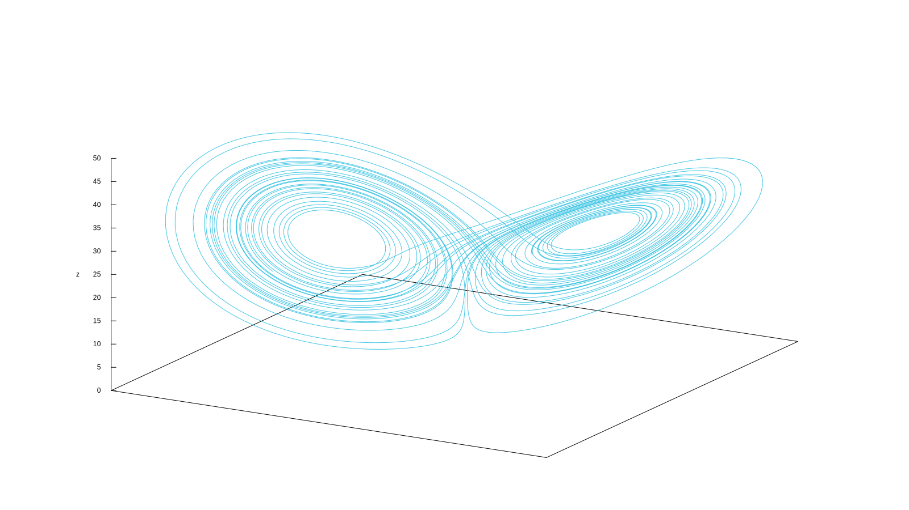

# Lorenz' attractor (the one with the butterfly)

Solve

$$
\begin{cases}
\dot{x} &= \sigma \cdot (y - x)  \\
\dot{y} &= x \cdot (r - z) - y   \\
\dot{z} &= x y - b z             \\
\end{cases}
$$

for $0 < t < 40$ with initial conditions

$$
\begin{cases}
x(0) = -11  \\
y(0) = -16  \\
z(0) = 22.5 \\
\end{cases}
$$

and $\sigma=10$, $r=28$ and $b=8/3$, which are the classical parameters
that generate the butterfly as presented by Edward Lorenz back in his
seminal 1963 paper [Deterministic non-periodic
flow](http://journals.ametsoc.org/doi/abs/10.1175/1520-0469%281963%29020%3C0130%3ADNF%3E2.0.CO%3B2).
This example's input file ressembles the parameters, inital conditions
and differential equations of the problem as naturally as possible with
an ASCII file.


```feenox
PHASE_SPACE x y z     # Lorenz attractor’s phase space is x-y-z
end_time = 40         # we go from t=0 to 40 non-dimensional units

sigma = 10            # the original parameters from the 1963 paper
r = 28
b = 8/3

x_0 = -11             # initial conditions
y_0 = -16
z_0 = 22.5

# the dynamical system's equations written as naturally as possible
x_dot = sigma*(y - x)
y_dot = x*(r - z) - y
z_dot = x*y - b*z

PRINT t x y z        # four-column plain-ASCII output
```


```terminal
$ feenox lorenz.fee > lorenz.dat
$ gnuplot lorenz.gp
$ python3 lorenz.py
$ sh lorenz2x3d.sh < lorenz.dat > lorenz.html
```


::: {#fig:ex_lorenz}
{width_html=100% width_latex=48%}
{width_html=100% width_latex=48%}

The Lorenz attractor computed with FeenoX plotted with two different tools
:::

# NAFEMS LE10 "Thick plate pressure" benchmark

{width="100%"}

Assuming the CAD has already been created in [STEP
format](nafems-le10.step) (for instance using Gmsh with [this geo
file](https://github.com/seamplex/feenox/blob/main/examples/nafems-le10-cad.geo)),
create a tetrahedral locally-refined unstructured grid with Gmsh using
the following `.geo` file:

``` c
// NAFEMS LE10 benchmark unstructured locally-refined tetrahedral mesh
Merge "nafems-le10.step";   // load the CAD

// define physical names from the geometrical entity ids
Physical Surface("upper") = {7};
Physical Surface("DCD'C'") = {1};
Physical Surface("ABA'B'") = {3};
Physical Surface("BCB'C'") = {4, 5};
Physical Curve("midplane") = {14};
Physical Volume("bulk") = {1};

// meshing settings, read Gmsh' manual for further reference
Mesh.ElementOrder = 2;      // use second-order tetrahedra
Mesh.Algorithm = 6;         // 2D mesh algorithm:  6: Frontal Delaunayfe  
Mesh.Algorithm3D = 10;      // 3D mesh algorithm: 10: HXT
Mesh.Optimize = 1;          // Optimize the mesh
Mesh.HighOrderOptimize = 1; // Optimize high-order meshes? 2: elastic+optimization

Mesh.MeshSizeMax = 80;     // main element size 
Mesh.MeshSizeMin = 20;      // refined element size

// local refinement around the point D (entity 5)
Field[1] = Distance;
Field[1].NodesList = {4};
Field[2] = Threshold;
Field[2].IField = 1;
Field[2].LcMin = Mesh.MeshSizeMin;
Field[2].LcMax = Mesh.MeshSizeMax;
Field[2].DistMin = 2 * Mesh.MeshSizeMax;
Field[2].DistMax = 6 * Mesh.MeshSizeMax;
Background Field = {2};

```

and then use this pretty-straightforward input file that has a
one-to-one correspondence with the original problem formulation from
1990:


```feenox
# NAFEMS Benchmark LE-10: thick plate pressure
PROBLEM mechanical DIMENSIONS 3
READ_MESH nafems-le10.msh   # mesh in millimeters

# LOADING: uniform normal pressure on the upper surface
BC upper    p=1      # 1 Mpa

# BOUNDARY CONDITIONS:
BC DCD'C'   v=0      # Face DCD'C' zero y-displacement
BC ABA'B'   u=0      # Face ABA'B' zero x-displacement
BC BCB'C'   u=0 v=0  # Face BCB'C' x and y displ. fixed
BC midplane w=0      #  z displacements fixed along mid-plane

# MATERIAL PROPERTIES: isotropic single-material properties
E = 210e3   # Young modulus in MPa
nu = 0.3    # Poisson's ratio

SOLVE_PROBLEM   # solve!

# print the direct stress y at D (and nothing more)
PRINT "sigma_y @ D = " sigmay(2000,0,300) "MPa"

# write post-processing data for paraview
WRITE_MESH nafems-le10.vtk sigmay VECTOR u v w
```


```terminal
$ gmsh -3 nafems-le10.geo
[...]
$ feenox nafems-le10.fee
sigma_y @ D =   -5.38016        MPa
$
```


{width_html=100% width_latex=70%}

# How to solve a maze without AI

Say you are Homer Simpson and you want to solve a maze drawn in a
restaurant's placemat, one where both the start and end are known
beforehand. In order to avoid falling into the alligator's mouth, you
can exploit the ellipticity of the Laplacian operator to solve any maze
(even a hand-drawn one) without needing any fancy AI or ML algorithm.
Just FeenoX and a bunch of standard open source tools to convert a
bitmapped picture of the maze into an unstructured mesh.

{width="100%"}


```feenox
PROBLEM laplace 2D  # pretty self-descriptive, isn't it?
READ_MESH maze.msh

# boundary conditions (default is homogeneous Neumann)
BC start  phi=0 
BC end    phi=1

SOLVE_PROBLEM

# write the norm of gradient as a scalar field
# and the gradient as a 2d vector into a .msh file
WRITE_MESH maze-solved.msh \
    sqrt(dphidx(x,y)^2+dphidy(x,y)^2) \
    VECTOR dphidx dphidy 0 
```


```terminal
$ gmsh -2 maze.geo
[...]
$ feenox maze.fee
$
```


{width_html=100% width_latex=50%}

See this LinkedIn post to see some comments and discussions: <https://www.linkedin.com/feed/update/urn:li:activity:6831291311832760320/>


