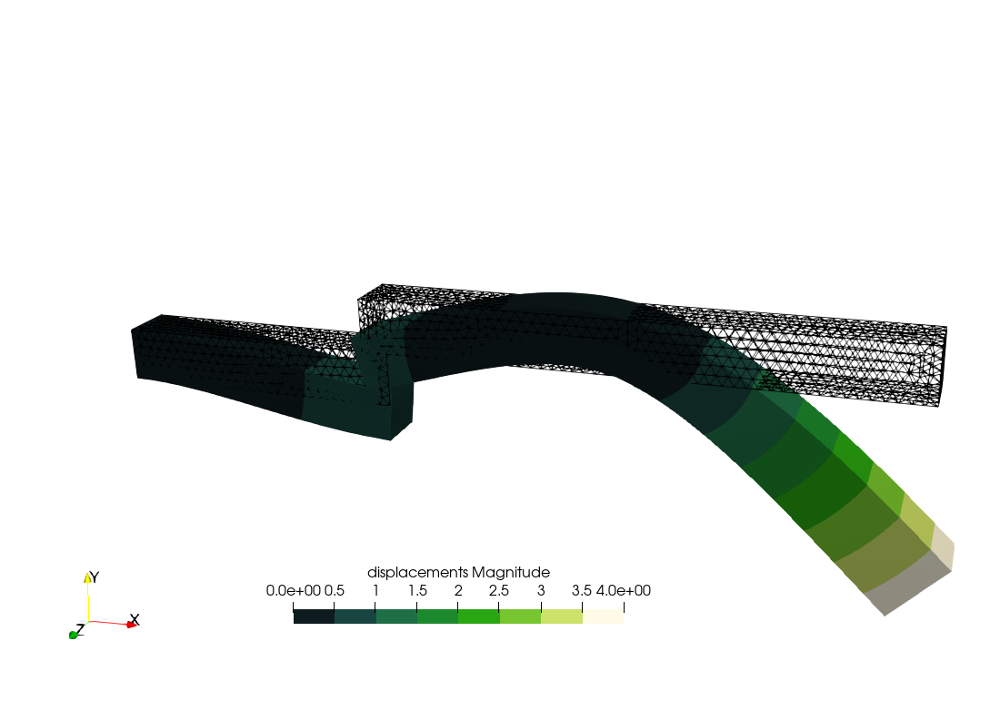

---
title: Elasticity (small and large deformation)
titleblock: |
 Elasticity (small and large deformation)
 ========================================
lang: en-US
toc: true 
...
# NAFEMS LE10 "Thick plate pressure" benchmark

{width="100%"}

Assuming the CAD has already been created in [STEP
format](nafems-le10.step) (for instance using Gmsh with [this geo
file](https://github.com/seamplex/feenox/blob/main/examples/nafems-le10-cad.geo)),
create a tetrahedral locally-refined unstructured grid with Gmsh using
the following `.geo` file:

``` c
// NAFEMS LE10 benchmark unstructured locally-refined tetrahedral mesh
Merge "nafems-le10.step";   // load the CAD

// define physical names from the geometrical entity ids
Physical Surface("upper") = {7};
Physical Surface("DCD'C'") = {1};
Physical Surface("ABA'B'") = {3};
Physical Surface("BCB'C'") = {4, 5};
Physical Curve("midplane") = {14};
Physical Volume("bulk") = {1};

// meshing settings, read Gmsh' manual for further reference
Mesh.ElementOrder = 2;      // use second-order tetrahedra
Mesh.Algorithm = 6;         // 2D mesh algorithm:  6: Frontal Delaunay
Mesh.Algorithm3D = 10;      // 3D mesh algorithm: 10: HXT
Mesh.Optimize = 1;          // Optimize the mesh
Mesh.HighOrderOptimize = 1; // Optimize high-order meshes? 2: elastic+optimization

Mesh.MeshSizeMax = 80;      // main element size 
Mesh.MeshSizeMin = 20;      // refined element size

// local refinement around the point D (entity 4)
Field[1] = Distance;
Field[1].NodesList = {4};
Field[2] = Threshold;
Field[2].IField = 1;
Field[2].LcMin = Mesh.MeshSizeMin;
Field[2].LcMax = Mesh.MeshSizeMax;
Field[2].DistMin = 2 * Mesh.MeshSizeMax;
Field[2].DistMax = 6 * Mesh.MeshSizeMax;
Background Field = {2};

```

and then use this pretty-straightforward input file that has a
one-to-one correspondence with the original problem formulation from
1990:


```feenox
# NAFEMS Benchmark LE-10: thick plate pressure
PROBLEM mechanical MESH nafems-le10.msh   # mesh in millimeters

# LOADING: uniform normal pressure on the upper surface
BC upper    p=1      # 1 Mpa

# BOUNDARY CONDITIONS:
BC DCD'C'   v=0      # Face DCD'C' zero y-displacement
BC ABA'B'   u=0      # Face ABA'B' zero x-displacement
BC BCB'C'   u=0 v=0  # Face BCB'C' x and y displ. fixed
BC midplane w=0      #  z displacements fixed along mid-plane

# MATERIAL PROPERTIES: isotropic single-material properties
E = 210e3   # Young modulus in MPa
nu = 0.3    # Poisson's ratio

# print the direct stress y at D (and nothing more)
PRINTF "σ_y @ D = %.4f MPa" sigmay(2000,0,300)

# write post-processing data for paraview
WRITE_RESULTS
```


```terminal
$ gmsh -3 nafems-le10.geo
[...]
$ feenox nafems-le10.fee
sigma_y @ D = -5.37968 MPa
$

```


{width_latex=75% width_html=100%}


# NAFEMS LE11 "Solid Cylinder/Taper/Sphere-Temperature" benchmark

::: {#fig:nafems-le11-problem}
{width="48%"} {width="48%"}

The NAFEMS LE11 problem formulation
:::

Following the spirit from LE10, note how easy it is to give a
space-dependent temperature field in FeenoX. Just write
$\sqrt{x^2+y^2}+z$ like `sqrt(x^2 + y^2) + z`!


```feenox
# NAFEMS Benchmark LE-11: solid cylinder/taper/sphere-temperature
PROBLEM mechanical 3D MESH nafems-le11.msh

# linear temperature gradient in the radial and axial direction
# as an algebraic expression as human-friendly as it can be
T(x,y,z) = sqrt(x^2 + y^2) + z

BC xz     v=0       # displacement vector is [u,v,w]
BC yz     u=0       # u = displacement in x
BC xy     w=0       # v = displacement in y
BC HIH'I' w=0       # w = displacement in z

E = 210e3*1e6       # mesh is in meters, so E=210e3 MPa -> Pa
nu = 0.3            # dimensionless
alpha = 2.3e-4      # in 1/ºC as in the problem
SOLVE_PROBLEM

# for post-processing in Paraview
WRITE_MESH nafems-le11.vtk VECTOR u v w   T sigmax sigmay sigmaz

PRINTF "sigma_z(A) = %.2f MPa" sigmaz(1,0,0)/1e6
PRINTF "wall time  = %.2f seconds" wall_time()
```


```terminal
$ gmsh -3 nafems-le11.geo
[...]
$ feenox nafems-le11.fee
sigma_z(A) = -105.04 MPa
wall time  = wall time  = 1.91 seconds
$

```


::: {#fig:nafems-le11-result}
{width=48%}
{width=48%}

The NAFEMS LE11 problem results
:::


# NAFEMS LE1 "Elliptical membrane" plane-stress benchmark

{width="90%"}

Tell FenooX the problem is `plane_stress`. Use the `nafems-le1.geo` file
provided to create the mesh. Read it with `READ_MESH`, set material
properties, `BC`s and `SOLVE_PROBLEM`!


```feenox
PROBLEM mechanical 2D plane_stress MESH nafems-le1.msh

E = 210e3
nu = 0.3

BC AB u=0
BC CD v=0
BC BC tension=10

SOLVE_PROBLEM

WRITE_MESH nafems-le1.vtk VECTOR u v 0 sigmax sigmay tauxy
PRINT "σy at point D = " %.4f sigmay(2000,0) "(reference is 92.7)" SEP " "
```


```terminal
$ gmsh -2 nafems-le11.geo
[...]
$ feenox nafems-le1.fee
σy at point D =  92.7011 (reference is 92.7)
$

```


{width=85%}


# Parametric study on a cantilevered beam

If an external loop successively calls FeenoX with extra command-line
arguments, a parametric run is obtained. This file `cantilever.fee`
fixes the face called "left" and sets a load in the negative $z$
direction of a mesh called `cantilever-$1-$2.msh`, where `$1` is the
first argument after the input file and `$2` the second one. The output
is a single line containing the number of nodes of the mesh and the
displacement in the vertical direction $w(500,0,0)$ at the center of the
cantilever's free face.

The following Bash script first calls Gmsh to create the meshes. To do
so, it first starts with a base
[`cantilever.geo`](https://github.com/seamplex/feenox/blob/main/examples/cantilever.geo)
file that creates the CAD:

``` c
// https://autofem.com/examples/determining_natural_frequencie.html
SetFactory("OpenCASCADE");

L = 0.5;
b = 0.05;
h = 0.02;

Box(1) = {0,-b/2,-h/2, L, b, h};

Physical Surface("left") = {1};
Physical Surface("right") = {2};
Physical Surface("top") = {4};
Physical Volume("bulk") = {1};

Transfinite Curve {1, 3, 5, 7} = 1/(Mesh.MeshSizeFactor*Mesh.ElementOrder) + 1;
Transfinite Curve {2, 4, 6, 8} = 2/(Mesh.MeshSizeFactor*Mesh.ElementOrder) + 1;
Transfinite Curve {9, 10, 11, 12} = 16/(Mesh.MeshSizeFactor*Mesh.ElementOrder) + 1;

Transfinite Surface "*";
Transfinite Volume "*";
```

Then another `.geo` file is merged to build
`cantilever-${element}-${c}.msh` where

- `${element}`:
  [tet4](https://github.com/seamplex/feenox/blob/main/examples/cantilever-tet4.geo),
  [tet10](https://github.com/seamplex/feenox/blob/main/examples/cantilever-tet10.geo),
  [hex8](https://github.com/seamplex/feenox/blob/main/examples/cantilever-hex8.geo),
  [hex20](https://github.com/seamplex/feenox/blob/main/examples/cantilever-hex20.geo),
  [hex27](https://github.com/seamplex/feenox/blob/main/examples/cantilever-hex27.geo)
- `${c}`: 1,2,$\dots$,10

::: {#fig:cantilever-mesh}
{width="45%"}
{width="45%"}

Cantilevered beam meshed with structured tetrahedra and hexahedra
:::

It then calls FeenoX with the input
[`cantilever.fee`](https://github.com/seamplex/feenox/blob/main/examples/cantilever.fee)
and passes `${element}` and `${c}` as extra arguments, which then are
expanded as `$1` and `$2` respectively.

``` bash
#!/bin/bash

rm -f *.dat
for element in tet4 tet10 hex8 hex20 hex27; do
 for c in $(seq 1 10); do
 
  # create mesh if not already cached
  mesh=cantilever-${element}-${c}
  if [ ! -e ${mesh}.msh ]; then
    scale=$(echo "PRINT 1/${c}" | feenox -)
    gmsh -3 -v 0 cantilever-${element}.geo -clscale ${scale} -o ${mesh}.msh
  fi
  
  # call FeenoX
  feenox cantilever.fee ${element} ${c} | tee -a cantilever-${element}.dat
  
 done
done
```

After the execution of the Bash script, thanks to the design decision
that output is 100% defined by the user (in this case with the `PRINT`
instruction), one has several files `cantilever-${element}.dat` files.
When plotted, these show the shear locking effect of fully-integrated
first-order elements. The theoretical Euler-Bernoulli result is just a
reference as, among other things, it does not take into account the
effect of the material's Poisson's ratio. Note that the abscissa shows
the number of *nodes*, which are proportional to the number of degrees
of freedom (i.e. the size of the problem matrix) and not the number of
*elements*, which is irrelevant here and in most problems.


```feenox
PROBLEM mechanical 3D
READ_MESH cantilever-$1-$2.msh   # in meters

E = 2.1e11         # Young modulus in Pascals
nu = 0.3           # Poisson's ratio

BC left   fixed
BC right  tz=-1e5  # traction in Pascals, negative z
 
SOLVE_PROBLEM

# z-displacement (components are u,v,w) at the tip vs. number of nodes
PRINT nodes %e w(500,0,0) "\# $1 $2"
```


```terminal
$ ./cantilever.sh
102     -7.641572e-05   # tet4 1
495     -2.047389e-04   # tet4 2
1372    -3.149658e-04   # tet4 3
[...]
19737   -5.916234e-04   # hex27 8
24795   -5.916724e-04   # hex27 9
37191   -5.917163e-04   # hex27 10
$ pyxplot cantilever.ppl

```


{width=100%}


# Parallelepiped whose Young's modulus is a function of the temperature

The problem consists of finding the non-dimensional temperature $T$ and
displacements $u$, $v$ and $w$ distributions within a solid
parallelepiped of length $l$ whose base is a square of $h\times h$. The
solid is subject to heat fluxes and to a traction pressure at the same
time. The non-dimensional Young's modulus $E$ of the material depends on
the temperature $T$ in a know algebraically way, whilst both the Poisson
coefficient $\nu$ and the thermal conductivity $k$ are uniform and do
not depend on the spatial coordinates:

$$\begin{aligned}
E(T) &= \frac{1000}{800-T} \\
\nu &= 0.3 \\
k &= 1 \\
\end{aligned}$$

](parallelepiped.svg){#fig:parallelepiped}

References:

- <http://www.code-aster.org/V2/doc/default/fr/man_v/v7/v7.03.100.pdf>
- <https://www.seamplex.com/docs/SP-FI-17-BM-12F2-A.pdf>

This thermo-mechanical problem is solved in two stages. First, the heat
conduction equation is solved over a coarse first-order mesh to find the
non-dimensional temperature distribution. Then, a mechanical problem is
solved where $T(x,y,z)$ is read from the first mesh and interpolated
into a finer second-order mesh so to as evaluate the non-dimensional
Young's modulus as

$$E\Big(T(x,y,z)\Big) = \frac{1000}{800-T(x,y,z)}$$

Note that there are not thermal expansion effects (i.e. the thermal
expansion coefficient is $\alpha=0$). Yet, suprinsingly enough, the
problem has analytical solutions for both the temperature and the
displacement fields.

## Thermal problem

The following input solves the thermal problem over a coarse first-order
mesh, writes the resulting temperature distribution into
`parallelepiped-temperature.msh`, and prints the $L_2$ error of the
numerical result with respect to the analytical
solution $T(x,y,z) = 40 - 2x - 3y - 4z$.


```feenox
PROBLEM thermal 3D
READ_MESH parallelepiped-coarse.msh

k = 1     # unitary non-dimensional thermal conductivity

# boundary conditions
BC left    q=+2
BC right   q=-2
BC front   q=+3
BC back    q=-3
BC bottom  q=+4
BC top     q=-4
BC A       T=0

SOLVE_PROBLEM
WRITE_MESH parallelepiped-temperature.msh T

# compute the L-2 norm of the error in the displacement field
Te(x,y,z) = 40 - 2*x - 3*y - 4*z   # analytical solution, "e" means exact
INTEGRATE (T(x,y,z)-Te(x,y,z))^2 RESULT num
PHYSICAL_GROUP bulk DIM 3  # this is just to compute the volume
PRINT num/bulk_volume
```


```terminal
$ gmsh -3 parallelepiped.geo -order 1 -clscale 2 -o parallelepiped-coarse.msh
[...]
Info    : 117 nodes 567 elements
Info    : Writing 'parallelepiped-coarse.msh'...
Info    : Done writing 'parallelepiped-coarse.msh'
Info    : Stopped on Fri Dec 10 10:32:30 2021 (From start: Wall 0.0386516s, CPU 0.183052s)
$ feenox parallelepiped-thermal.fee 
6.18981e-12
$

```


## Mechanical problem

Now this input file reads the scalar function `T` stored in the coarse
first-order mesh file `parallelepiped-temperature.msh` and uses it to
solve the mechanical problem in the finer second-order mesh
`parallelepiped.msh`. The numerical solution for the displacements over
the fine mesh is written in a VTK file (along with the temperature as
interpolated from the coarse mesh) and compared to the analytical
solution using the $L_2$ norm.


```feenox
PROBLEM mechanical 3D

# this is where we solve the mechanical problem
READ_MESH parallelepiped.msh MAIN   

# this is where we read the temperature from
READ_MESH parallelepiped-temperature.msh DIM 3 READ_FUNCTION T

# mechanical properties
E(x,y,z) = 1000/(800-T(x,y,z))   # young's modulus
nu = 0.3                         # poisson's ratio

# boundary conditions
BC O fixed
BC B u=0 w=0
BC C u=0

# here "load" is a fantasy name applied to both "left" and "right"
BC load tension=1 PHYSICAL_GROUP left PHYSICAL_GROUP right

SOLVE_PROBLEM
WRITE_MESH parallelepiped-mechanical.vtk T VECTOR u v w

# analytical solutions
h = 10
A = 0.002
B = 0.003
C = 0.004
D = 0.76

# the "e" means exact
ue(x,y,z) := A/2*(x^2 + nu*(y^2+z^2)) + B*x*y + C*x*z + D*x - nu*A*h/4*(y+z)
ve(x,y,z) := -nu*(A*x*y + B/2*(y^2-z^2+x^2/nu) + C*y*z + D*y -A*h/4*x - C*h/4*z)
we(x,y,z) := -nu*(A*x*z + B*y*z + C/2*(z^2-y^2+x^2/nu) + D*z + C*h/4*y - A*h/4*x)

# compute the L-2 norm of the error in the displacement field
INTEGRATE (u(x,y,z)-ue(x,y,z))^2+(v(x,y,z)-ve(x,y,z))^2+(w(x,y,z)-we(x,y,z))^2 RESULT num MESH parallelepiped.msh
INTEGRATE 1 RESULT den MESH parallelepiped.msh
PRINT num/den
```


```terminal
$ gmsh -3 parallelepiped.geo -order 2
[...]
Info    : 2564 nodes 2162 elements
Info    : Writing 'parallelepiped.msh'...
Info    : Done writing 'parallelepiped.msh'
Info    : Stopped on Fri Dec 10 10:39:27 2021 (From start: Wall 0.165707s, CPU 0.258751s)
$ feenox parallelepiped-mechanical.fee 
1.46196e-06
$ 

```


# Orthotropic free expansion of a cube

To illustrate the point of the previous discussion, let us solve the
thermal expansion of an unrestrained unitary cube
$[0,1~\text{mm}]\times[0,1~\text{mm}]\times[0,1~\text{mm}]$ subject to a
linear radially-symmetric temperature field
$$T(x,y,z) = 30 \text{ºC} + 150 \frac{\text{ºC}}{\text{mm}} \sqrt{x^2+y^2+z^2}$$

with a mean thermal expansion coefficient for each of the three
directions $x$, $y$ and $z$ computed from each of the three columns of
the ASME table TE-2, respectively. If the data was consistent, the
displacement at any point with the same coordinates $x=y=z$ would be
exactly equal.


```feenox
DEFAULT_ARGUMENT_VALUE 1 steffen
DEFAULT_ARGUMENT_VALUE 2 hex

PROBLEM mechanical
READ_MESH cube-$2.msh

# aluminum-like linear isotropic material properties
E = 69e3
nu = 0.28

# free expansion
BC left   u=0
BC front  v=0
BC bottom w=0

# reference temperature is 20ºC
T0 = 20
# spatial temperature distribution symmetric wrt x,y & z
T(x,y,z) = 30+150*sqrt(x^2+y^2+z^2)

# read ASME data
FUNCTION A(T') FILE asme-expansion-table.dat COLUMNS 1 2 INTERPOLATION $1
FUNCTION B(T') FILE asme-expansion-table.dat COLUMNS 1 3 INTERPOLATION $1
FUNCTION C(T') FILE asme-expansion-table.dat COLUMNS 1 4 INTERPOLATION $1

# remember that the thermal expansion coefficients have to be
#  1. the mean value between T0 and T
#  2. functions of space, so temperature has to be written as T(x,y,z)

# in the x direction, we use column B directly
alpha_x(x,y,z) = 1e-6*B(T(x,y,z))

# in the y direction, we convert column A to mean
alpha_y(x,y,z) = 1e-6*integral(A(T'), T', T0, T(x,y,z))/(T(x,y,z)-T0)

# in the z direction, we convert column C to mean
alpha_z(x,y,z) = 1e-3*C(T(x,y,z))/(T(x,y,z)-T0)

SOLVE_PROBLEM

WRITE_MESH cube-orthotropic-expansion-$1-$2.vtk T VECTOR u v w
PRINT %.3e "displacement in x at (1,1,1) = " u(1,1,1)
PRINT %.3e "displacement in y at (1,1,1) = " v(1,1,1)
PRINT %.3e "displacement in z at (1,1,1) = " w(1,1,1)
```


```terminal
$ gmsh -3 cube-hex.geo
[...]
$ gmsh -3 cube-tet.geo
[...]
$ feenox cube-orthotropic-expansion.fee 
displacement in x at (1,1,1) =  4.451e-03
displacement in y at (1,1,1) =  4.449e-03
displacement in z at (1,1,1) =  4.437e-03
$ feenox cube-orthotropic-expansion.fee linear tet
displacement in x at (1,1,1) =  4.452e-03
displacement in y at (1,1,1) =  4.447e-03
displacement in z at (1,1,1) =  4.438e-03
$ feenox cube-orthotropic-expansion.fee akima hex
displacement in x at (1,1,1) =  4.451e-03
displacement in y at (1,1,1) =  4.451e-03
displacement in z at (1,1,1) =  4.437e-03
$ feenox cube-orthotropic-expansion.fee splines tet
displacement in x at (1,1,1) =  4.451e-03
displacement in y at (1,1,1) =  4.450e-03
displacement in z at (1,1,1) =  4.438e-03
$ 

```


{width=100%}

> Differences cannot be seen graphically, but they are there as the terminal mimic illustrates.
> Yet, they are not as large nor as sensible to meshing and interpolation settings as one would
> have expected after seeing the plots from the previous section. 


# Thermo-elastic expansion of finite cylinders

Let us solve the following problem introduced by J. Veeder in his
[technical report AECL-2660 from
1967](https://inis.iaea.org/search/search.aspx?orig_q=RN:40103718).

> {width="50%"}
>
> Consider a finite solid cylinder (see insert) of radius $b$ and
> length $2h$, with the origin of coordinates at the centre. It may be
> shown that the temperature distribution in a cylindrical fuel pellet
> operating in a reactor is given approximately by
>
> $$T(r) = T_0 + T_1 \cdot \left[ 1 - \left(\frac{r}{b} \right)^2 \right]$$
>
> where $T_0$ is the pellet surface temperature and $T_1$ is the
> temperature difference between the centre and surface. The thermal
> expansion is thus seen to be the sum of two terms, the first of which
> produces uniform expansion (zero stress) at constant
> temperature $T_0$, and is therefore computationally trivial. Tho
> second term introduces non-uniform body forces which distort the
> pellet from its original cylindrical shape.

The problem is axisymmetric on the azimutal angle and axially-symmetric
along the mid-plane. The FeenoX input uses the `tangential` and `radial`
boundary conditions applied to the base of the upper half of a 3D
cylinder. The geometry is meshed using 27-noded hexahedra.

Two one-dimensional profiles for the non-dimensional range $[0:1]$ at
the external surfaces are written into an ASCII file ready to be
plotted:

1.  axial dependency of the displacement $v(z') = v(0,v,z'h)$ in the $y$
    direction at fixed $x=0$ and $y=b$, and
2.  radial dependency of the displacement $w(r') = w(0,r'b, h)$ in
    the $z$ direction at fixed $x=0$ and $z=h$

These two profiles are compared to the power expansion series given in
the original report from 1967. Note that the authors expect a 5%
difference between the reference solution and the real one.


```feenox
PROBLEM mechanical MESH veeder.msh

b = 1     # cylinder radius
h = 0.5   # cylinder height 

E = 1         # young modulus (does not matter for the displacement, only for stresses)
nu = 1/3      # poisson ratio
alpha = 1e-5  # temperature expansion coefficient

# temperature distribution as in the original paper
T1 = 1        # maximum temperature
T0 = 0        # reference temperature (where expansion is zero)
T(x,y,z) = T0 + T1*(1-(x^2+y^2)/(b^2))


# boundary conditions (note that the cylinder can still expand on the x-y plane)
BC inf      tangential radial

# write vtu output
WRITE_RESULTS

# non-dimensional numerical displacement profiles 
v_num(z') = v(0, b, z'*h)/(alpha*T1*b)
w_num(r') = w(0, r'*b, h)/(alpha*T1*b)

########
# reference solution
# coefficients of displacement functions for h/b = 0.5
a00 =  0.66056
a01 = -0.44037
a10 =  0.23356
a02 = -0.06945
a11 = -0.10417
a20 =  0.00288

b00 = -0.01773
b01 = -0.46713
b10 = -0.04618
b02 = +0.10417
b11 = -0.01152
b20 = -0.00086
 
# coefficients of displacement functions for h/b = 1.0
# a00 =  0.73197
# a01 = -0.48798
# a10 =  0.45680
# a02 = -0.01140
# a11 = -0.06841
# a20 =  0.13611
# 
# b00 =  0.26941
# b01 = -0.45680
# b10 = -0.25670
# b02 =  0.03420
# b11 = -0.27222
# b20 = -0.08167


R(r') = r'^2 - 1
Z(z') = z'^2 - 1

v_ref(r',z') = r' * (a00 + a01*R(r') + a10*Z(z') + a02* R(r')^2 + a11 * R(r')*Z(z') + a20 * Z(z')^2)
w_ref(r',z') = z' * (b00 + b01*R(r') + b10*Z(z') + b02* R(r')^2 + b11 * R(r')*Z(z') + b20 * Z(z')^2)


PRINT_FUNCTION FILE veeder_v.dat  v_num v_ref(1,z') MIN 0 MAX 1 NSTEPS 50 HEADER
PRINT_FUNCTION FILE veeder_w.dat  w_num w_ref(r',1) MIN 0 MAX 1 NSTEPS 50 HEADER
```


```terminal
$ gmsh -3 veeder.geo
[...]
$ feenox veeder.fee
$ pyxplot veeder.ppl 
$

```


{width_latex=75% width_html=100%}

{width=100%}


# Temperature-dependent material properties

Let us solve a plane-strain square fixed on the left, with an horizontal
traction on the right and free on the other two sides. The Young modulus
depends on the temperature $E(T)$ as given in the ASME II part D tables
of material properties, interpolated using a [monotonic cubic
scheme](https://en.wikipedia.org/wiki/Monotone_cubic_interpolation).

Actually, this example shows three cases:

1.  Uniform temperature identically equal to 200ºC

2.  Linear temperature profile on the vertical direction given by an
    algebraic expression

    $$T(x,y) = 200 + 350\cdot y$$

3.  The same linear profile but read from the output of a thermal
    conduction problem over a non-conformal mesh using this FeenoX
    input:

    ``` feenox
    PROBLEM thermal 2D
    READ_MESH square-centered-unstruct.msh # [-1:+1]x[-1:+1]

    BC bottom    T=-150
    BC top       T=+550
    k = 1

    SOLVE_PROBLEM
    WRITE_MESH thermal-square-temperature.msh T
    ```

Which of the three cases is executed is given by the first argument
provided in the command line after the main input file. Depending on
this argument, which is expanded as `$1` in the main input file, either
one of three secondary input files are included:

1.  `uniform`

    ``` feenox
    # uniform
    T(x,y) := 200
    ```

2.  `linear`

    ``` feenox
    # algebraic expression
    T(x,y) := 200 + 350*y
    ```

3.  `mesh`

    ``` feenox
    # read the temperature from a previous result
    READ_MESH thermal-square-temperature.msh DIM 2 READ_FUNCTION T
    ```


```feenox
# 2d plane strain mechanical problem over the [-1:+1]x[-1:+1] square
PROBLEM mechanical plane_strain
READ_MESH square-centered.msh 

# fixed at left, uniform traction in the x direction at right
BC left    fixed
BC right   tx=50

# ASME II Part D pag. 785 Carbon steels with C<=0.30%
FUNCTION E_carbon(temp) INTERPOLATION steffen DATA {
-200  216
-125  212
-75   209
25    202
100   198
150   195
200   192
250   189
300   185
350   179
400   171
450   162
500   151
550   137
}

# read the temperature according to the run-time argument $1
INCLUDE mechanical-square-temperature-$1.fee

# Young modulus is the function above evaluated at the local temperature
E(x,y) := E_carbon(T(x,y))

# uniform Poisson's ratio
nu = 0.3

SOLVE_PROBLEM
PRINT u(1,1) v(1,1)
WRITE_MESH mechanical-square-temperature-$1.vtk  E T VECTOR u v 0   
```


```terminal
$ gmsh -2 square-centered.geo
[...]
Info    : Done meshing 2D (Wall 0.00117144s, CPU 0.00373s)
Info    : 1089 nodes 1156 elements
Info    : Writing 'square-centered.msh'...
Info    : Done writing 'square-centered.msh'
Info    : Stopped on Thu Aug  4 09:40:09 2022 (From start: Wall 0.00818854s, CPU 0.031239s)
$ feenox mechanical-square-temperature.fee uniform
0.465632        -0.105128
$ feenox mechanical-square-temperature.fee linear
0.589859        -0.216061
$ gmsh -2 square-centered-unstruct.geo 
[...]
Info    : Done meshing 2D (Wall 0.0274833s, CPU 0.061072s)
Info    : 65 nodes 132 elements
Info    : Writing 'square-centered-unstruct.msh'...
Info    : Done writing 'square-centered-unstruct.msh'
Info    : Stopped on Sun Aug  7 18:33:41 2022 (From start: Wall 0.0401667s, CPU 0.107659s)
$ feenox thermal-square.fee
$ feenox mechanical-square-temperature.fee mesh
0.589859        -0.216061
$ 

```


{width=100%}

{width=100%}


# Two cubes compressing each other

Say we have two cubes of non-dimensional size $1\times 1 \times 1$, one
made out of a (non-dimensional) "soft" material and one made out of a
"hard" material. We glue the two cubes together, set radial and
tangential symmetry conditions on one side of the soft cube (so as to
allow pure traction conditions) and set a normal compressive pressure at
the other end on the hard cube. Besides on single VTU file with the
overall results, the von Mises stress output is split into two VTU
files---namely `soft.vtu` and `hard.vtu` where the stress is non-zero
only in the corresponding volume.

This example illustrates how to

1.  assign different material properties to different volumes
2.  write VTU outputs segmented by mesh volumes
3.  write results at nodes (default) and at cells


```feenox
PROBLEM mechanical 3D
READ_MESH two-cubes2.msh

MATERIAL left   E=1   nu=0.35  mat=1
MATERIAL right  E=10  nu=0.25  mat=2

# BCs 
BC zero  tangential radial
BC ramp  p=0.25

SOLVE_PROBLEM

sigma_at_1(x,y,z) = sigma(x,y,z)*(mat(x,y,z)=1)
sigma_at_2(x,y,z) = sigma(x,y,z)*(mat(x,y,z)=2)

WRITE_RESULTS FORMAT vtu displacements vonmises
WRITE_MESH two-cubes-left.vtu  sigma_at_1 CELL NAME sigma_at_1_cells sigma_at_1
WRITE_MESH two-cubes-right.vtu sigma_at_2 CELL NAME sigma_at_2_cells sigma_at_2
```


```terminal
$ gmsh -3 two-cubes.geo -order 2 -o two-cubes2.msh
[...]
$ feenox two-cubes-mechanical.fee --mumps
$ 

```


::: {#fig:two-cubes-left}
{width=48%}
{width=48%}

Von Mises stresses non-zero only over the left (soft) cube.
:::

::: {#fig:two-cubes-right}
{width=48%}
{width=48%}

Von Mises stresses non-zero only over the right (hard) cube.
:::


# Steel/aluminum paradox

> Can the maximum displacement decrease if we replace one of the steel
> components in the assembly by an aluminum component of the same
> geometry?
>
> Source:
> <https://www.linkedin.com/posts/mir-abbas-77654764_can-deflection-decrease-with-youngs-modulus-activity-7349026944690081794-7Rc0>

Consider the following configuration


for the following two cases:

1.  blue and pink is steel
2.  blue is steel and pink is aluminum

We can create this geometry in Gmsh as

``` c
SetFactory("OpenCASCADE");
Box(1) = {0, 0, 0, 5.5, 1, 1};
Box(2) = {5, 1, 0, 5, 1, 1};
Box(3) = {10, 1, 0, 5, 1, 1};
Coherence;
Mesh.MeshSizeMax = 0.2;
Mesh.ElementOrder = 2;

Physical Volume("pink") = { 1 };
Physical Volume("blue") = { 2, 3 };
Physical Surface("fixed", 35) = {1};
Physical Surface("2p", 36) = {8};
Physical Surface("p", 37) = {14};
Physical Curve("pin", 38) = {19};
```

and then call FeenoX twice with either `steel` or `alum` in the command
line to see which case has a larger deflection.


```feenox
PROBLEM mechanical MESH steel-alum.msh

MATERIAL steel E=210e3 nu=0.3
MATERIAL alum  E=69e3  nu=0.25

# choose the material for the pink block from command line
PHYSICAL_GROUP pink MATERIAL $1
PHYSICAL_GROUP blue MATERIAL steel

BC fixed fixed
BC pin v=0
F = 1000
BC p  Fy=-F
BC 2p Fy=-2*F

WRITE_RESULTS
PRINT %.1f displ_max
```


```terminal
$ gmsh -3 steel-alum.geo
[...]
$ feenox steel-alum.fee steel
3.9
$ feenox steel-alum.fee alum
2.6
$ 

```


::: {#fig:steel-alum}
{width=48%}
{width=48%}

The Steel/aluminum paradox: replacing steel with aluminum gives rise to smaller maximum displacements.
:::  


# NAFEMS GNL5 "Large-deformation beam"

> Large-strain problems in FeenoX are **WORK IN PROGRESS**. Evaluation
> of stresses, performance, parallelization, etc. will improve. Take
> this example with a grain of salt.

{width="100%"}

Consider a cantilevered beam with a square
$0.1~\text{m} \times 0.1~\text{m}$ cross section and axial length
$3.2~\text{m}$ along the $x$ axis. The material es linear elastic with
$E=2.1 \times 10^{11} \text{Pa}$ and $\nu=0$. The left end at plane
$y$-$z$ is fixed. The right end is subject to a total load of
$F_x = -3.844 \times 10^6~\text{N}$ (compressive) and
$F_y = -3.844 \times 10^3~\text{N}$ (downward).

A large-deformation buckling effect is expected due to the massive
compression of a slender structural geometry and the slight $0.1\%$
loading imperfection in the $y$ direction. The reference results are

  -------------------------------------------------------------------------
  Scalar quantity                                   Reference result
  ------------------------------------------- -----------------------------
  Maximum vertical displacement at the tip     $(-2.58 \pm 0.02)~\text{m}$

  Final vertical displacement at the tip       $(-1.36 \pm 0.02)~\text{m}$

  Final vertical displacement at the tip       $(-5.04 \pm 0.04)~\text{m}$
  -------------------------------------------------------------------------

  : Reference results for the NAFEMS GNL-5 benchmark problem

------------------------------------------------------------------------

To solve the problem, let's start with a Gmsh input file to create a
nice structured hex20 mesh:

``` c
SetFactory("OpenCASCADE");
l = 3.2;
h = 0.1;
Box(1) = {0, -h/2, -h/2, l, h, h};

Physical Surface("left") = {1};
Physical Surface("right") = {2};
Physical Volume("steel") = {1};

n = 2;  // number of elements across thickness
Transfinite Curve {2, 4, 3, 1, 7, 8, 5, 6} = n+1;
Transfinite Curve {11, 12, 9, 10} = n*32+1;
Transfinite Surface "*";
Transfinite Volume "*";

Mesh.RecombineAll = 1;            // quads & hexes
Mesh.ElementOrder = 2;            // second order
Mesh.SecondOrderIncomplete = 1;   // hex20 (and quad8) instead of hex27 (quad9)
```


This problem is non-linear and path dependent so we have to make sure
FeenoX can detect the critical buckling load, otherwise it might
converge to other possible solutions.

For that end, we run a quasi-static problem with a non-dimensional
time $t$ from $t=0$ up to $t=1$ (i.e. `end_time = 1`) and scale the
loads with the factor $t$. We start with $\Delta t_0 = 0.01$
(i.e. `dt_0 = 1e-2` meaning $1\%$ of the load) and then allow FeenoX to
choose the time (load) step.

In FeenoX, to use a linear-elastic isotropic material model in the
large-deformation (a.k.a. [Saint Venant-Kirchoff
model](https://en.wikipedia.org/wiki/Hyperelastic_material#Saint_Venant%E2%80%93Kirchhoff_model))
one can either

a.  keep $E$ and $\nu$ as global variables `E` and `nu` respectively as
    in the [linear
    case](http://localhost/milhouse/feenox/examples/mechanical.html#nafems-le10-thick-plate-pressure-benchmark)
    above and then

    i.  set the special variable `ldef` to non-zero, or
    ii. write the `NONLINEAR` keyword in the `PROBLEM` line, or
    iii. pass `--non-linear` option in the command line, or

b.  write a special `MATERIAL` with `MODEL svk` like

    ``` fee
    MATERIAL E=2.1e11 nu=0 MODEL svk
    ```

In the actual input file we use a-i:


```feenox
# NAFEMS Geometrically-Non-Linear cantilever beam
PROBLEM mechanical MESH nafems-gnl-cantilever.msh

E = 2.1e11     # linear elastic material
nu = 0
ldef = 1       # with large-strain (i.e. SVK model)

end_time = 1   # quasistatic (because problem is mechanical)
dt_0 = 1e-2    # initial time step = 1% 
min_dt = 1e-3  # minimum load increament = 0.1%

# boundary conditions with loads scaled by t
BC left fixed
BC right Fx=-3.844e6*t Fy=-3.844e3*t

SOLVE_PROBLEM

# show step, t, incremente and horizontal and vertical displacements
PRINT step_transient t dt u(3.2,0,0) v(3.2,0,0)

# write one vtu for each step and a global pvd file
WRITE_RESULTS
```


```terminal
$ gmsh -3 nafems-gnl-cantilever.geo
[...]
$ feenox nafems-gnl-cantilever.fee | tee nafems-gnl-cantilever.dat
[...]
$ awk '{print $5}' nafems-gnl-cantilever.dat | sort -rg | tail -n1
-2.58023
$ awk '{print $5}' nafems-gnl-cantilever.dat | tail -n1
-1.33159
$ awk '{print $4}' nafems-gnl-cantilever.dat | tail -n1
-5.08797
$ ./quasistatic-video.py nafems-gnl-cantilever.pvd
[...]
Saved animation to nafems-gnl-cantilever.pvd.mp4
$ pyxplot nafems-gnl-cantilever.ppl 
$ 

```


{width=100%}

{width=100%}

> Take some time to compare FeenoX's approach, namely
>
>  * one text file for the geometry
>  * one text file for the problem,
>  * a solver [designed to follow the Unix philosophy](https://www.seamplex.com/feenox/doc/sds.html)
>  * standard Unix tools to get results 
>
> against [the proposed way to solve this very same problem with a point-and-click tool](https://cds.comsol.com/model/download/837521/models.sme.large_deformation_beam.pdf?__gda__=1755866244_4e06a2471efdf19e9a27923cfc27bdc9&fileExt=.pdf).
> Spoiler: it needs 15 pages of instructions about where to click to solve the problem.


