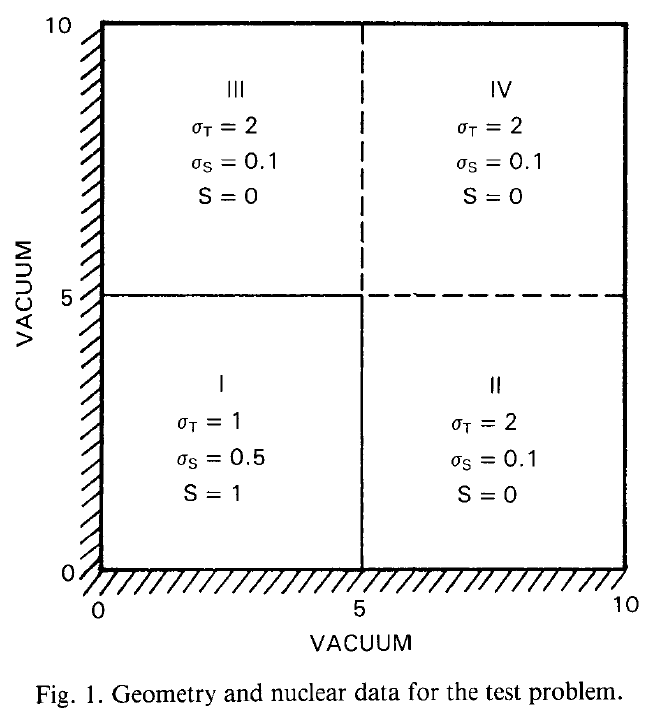

---
title: Neutron transport using $S_N$
titleblock: |
 Neutron transport using $S_N$
 =============================
lang: en-US
toc: true 
...
# Reed's problem

Reed's problem as in

-   [William H. Reed, New Difference Schemes for the Neutron Transport
    Equation, Nuclear Science and Engineering, 46:2, 309-314 (1971).
    DOI: 10.13182/NSE46-309](http://dx.doi.org/10.13182/NSE46-309)

is a common test problem for transport codes. It is comprised of
heterogeneous materials with strong absorber, vacuum, and scattering
regions. These regions are valuable to testing different aspects of
numerical discretizations.

{width="100%"}


```feenox
PROBLEM neutron_sn DIM 1 GROUPS 1 SN $1
READ_MESH reed.msh
 
MATERIAL source1       S1=50 Sigma_t1=50 Sigma_s1.1=0
MATERIAL absorber      S1=0  Sigma_t1=5  Sigma_s1.1=0
MATERIAL void          S1=0  Sigma_t1=0  Sigma_s1.1=0
MATERIAL source2       S1=1  Sigma_t1=1  Sigma_s1.1=0.9
MATERIAL reflector     S1=0  Sigma_t1=1  Sigma_s1.1=0.9

BC left  mirror
BC right vacuum

SOLVE_PROBLEM

PRINT_FUNCTION phi1
```


```terminal
$ gmsh -1 reed.geo
$ [...]
$ for n in 2 4 6 8; do feenox reed.fee ${n} | sort -g > reed-s${n}.csv; done
$

```


The solutions obtained in FeenoX with $S_2$, $S_4$, $S_6$ and $S_8$ are plotted and compared against and independent solution from <https://www.drryanmc.com/solutions-to-reeds-problem/>.

{width=100%}


# Azmy's problem

As in

-   [Y. Y. Azmy, The Weighted Diamond-Difference Form of Nodal Transport
    Methods. NUCLEAR SCIENCE AND ENGINEERING: 98, 29-40 (1988). DOI:
    10.13182/NSE88-6](https://doi.org/10.13182/NSE88-6)



## Second-order complete structured rectangular grid

This example solves the problem using a structured second-order grid. It
computes the mean flux in each quadrant by integrating $\phi_1$ over
each physical group using the instruction
[`INTEGRATE`](https://www.seamplex.com/feenox/doc/feenox-manual.html#integrate).


```feenox
DEFAULT_ARGUMENT_VALUE 1 4
PROBLEM neutron_sn DIM 2 GROUPS 1 SN $1

READ_MESH $0.msh

MATERIAL src S1=1 Sigma_t1=1 Sigma_s1.1=0.5
MATERIAL abs S1=0 Sigma_t1=2 Sigma_s1.1=0.1

PHYSICAL_GROUP llq MATERIAL src
PHYSICAL_GROUP lrq MATERIAL abs
PHYSICAL_GROUP urq MATERIAL abs
PHYSICAL_GROUP ulq MATERIAL abs

BC mirror   mirror
BC vacuum   vacuum

SOLVE_PROBLEM

# compute mean values in each quadrant
INTEGRATE phi1 OVER llq RESULT lower_left_quadrant
INTEGRATE phi1 OVER lrq RESULT lower_right_quadrant
INTEGRATE phi1 OVER urq RESULT upper_right_quadrant

PRINTF "LLQ = %.3e (ref 1.676e+0)" lower_left_quadrant/(5*5)
PRINTF "LRQ = %.3e (ref 4.159e-2)" lower_right_quadrant/(5*5)
PRINTF "URQ = %.3e (ref 1.992e-3)" upper_right_quadrant/(5*5)

WRITE_RESULTS
PRINTF "%g unknowns for S${1}, memory needed = %.1f Gb" total_dofs memory()

```


```terminal
$ gmsh -2 azmy-structured.geo
$ feenox azmy-structured.fee 2
LLQ = 1.653e+00 (ref 1.676e+0)
LRQ = 4.427e-02 (ref 4.159e-2)
URQ = 2.712e-03 (ref 1.992e-3)
16900 unknowns for S2, memory needed = 0.2 Gb
$ feenox azmy-structured.fee 4
LLQ = 1.676e+00 (ref 1.676e+0)
LRQ = 4.164e-02 (ref 4.159e-2)
URQ = 1.978e-03 (ref 1.992e-3)
50700 unknowns for S4, memory needed = 0.7 Gb
$ feenox azmy-structured.fee 6
LLQ = 1.680e+00 (ref 1.676e+0)
LRQ = 4.120e-02 (ref 4.159e-2)
URQ = 1.874e-03 (ref 1.992e-3)
101400 unknowns for S6, memory needed = 2.7 Gb
$

```


## Fist-order locally-refined unstructured triangular grid

This example solves the problem using an unstructured first-order grid.
It computes the mean flux in each quadrant by integrating $\phi_1$
over $x$ and $y$ in custom ranges using the functional
[`integral`](https://www.seamplex.com/feenox/doc/feenox-manual.html#integral).


```feenox
DEFAULT_ARGUMENT_VALUE 1 4
PROBLEM neutron_sn DIM 2 GROUPS 1 SN $1

READ_MESH $0.msh

S1_src = 1
Sigma_t1_src = 1
Sigma_s1.1_src = 0.5

S1_abs = 0
Sigma_t1_abs = 2
Sigma_s1.1_abs = 0.1

BC mirror   mirror
BC vacuum   vacuum

# sn_alpha = 1
SOLVE_PROBLEM

# compute mean values in each quadrant
lower_left_quadrant = integral(integral(phi1(x,y),y,0,5),x,0,5)/(5*5)
lower_right_quadrant = integral(integral(phi1(x,y),y,0,5),x,5,10)/(5*5)
upper_right_quadrant = integral(integral(phi1(x,y),y,5,10),x,5,10)/(5*5)

PRINT %.3e "LLQ" lower_left_quadrant  "(ref 1.676e+0)"
PRINT %.3e "LRQ" lower_right_quadrant "(ref 4.159e-2)"
PRINT %.3e "URQ" upper_right_quadrant "(ref 1.992e-3)"


# compute three profiles along x=constant
profile5(y) = phi1(5.84375,y)
profile7(y) = phi1(7.84375,y)
profile9(y) = phi1(9.84375,y)

PRINT_FUNCTION profile5 profile7 profile9 MIN 0 MAX 10 NSTEPS 100 FILE $0-$1.dat

WRITE_RESULTS
PRINTF "%g unknowns for S${1}, memory needed = %.1f Gb" total_dofs memory()

```


```terminal
$ gmsh -2 azmy.geo
$ feenox azmy.fee 2
LLQ     1.653e+00       (ref 1.676e+0)
LRQ     4.427e-02       (ref 4.159e-2)
URQ     2.717e-03       (ref 1.992e-3)
15704 unknowns for S2, memory needed = 0.1 Gb
$ feenox azmy.fee 4
LLQ     1.676e+00       (ref 1.676e+0)
LRQ     4.160e-02       (ref 4.159e-2)
URQ     1.991e-03       (ref 1.992e-3)
47112 unknowns for S4, memory needed = 0.5 Gb
$ feenox azmy.fee 6
LLQ     1.680e+00       (ref 1.676e+0)
LRQ     4.115e-02       (ref 4.159e-2)
URQ     1.890e-03       (ref 1.992e-3)
94224 unknowns for S6, memory needed = 1.6 Gb
$ feenox azmy.fee 8
LLQ     1.682e+00       (ref 1.676e+0)
LRQ     4.093e-02       (ref 4.159e-2)
URQ     1.844e-03       (ref 1.992e-3)
157040 unknowns for S8, memory needed = 4.3 Gb
$ gmsh azmy-s4.geo
$ gmsh azmy-s6.geo
$ gmsh azmy-s8.geo
$

```


  


## Flux profiles with ray effect

This section analyzes flux profiles along the $y$ axis at three
different values of $x$ as in section 6.4.1 of HyeongKae Park's Master's
thesis, namely

a.  $x=5.84375$
b.  $x=7.84375$
c.  $x=9.84375$

Some kind of "ray effect" is expected since the flux is not as large as
in the core source section and the discrete numbers of neutron
directions might induce numerical artifacts when evaluating the total
scalar neutron flux.

To better understand these profiles, the original square is rotated a
certaing angle $\theta \leq 45º$ around the $z$ direction (coming out of
the screen) keeping the S$_N$ directions fixed. Since we cannot use
mirror boundary conditions for an arbitrary $\theta$, we use the full
geometry instead of only one quarter like in the two preceding sections.

Therefore, we perform a parametric sweep over

i.  the angle $\theta$ of rotation of the original square in the $x$-$y$
    plane
ii. a mesh scale factor $c$
iii. $N=4,6,8,10,12$

``` bash
#!/bin/bash

thetas="0 15 30 45"
cs="4 3 2 1.5 1"
sns="4 6 8 10 12"

for theta in ${thetas}; do
 echo "angle = ${theta};" > azmy-angle-${theta}.geo
 for c in ${cs}; do
  gmsh -v 0 -2 azmy-angle-${theta}.geo azmy-full.geo -clscale ${c} -o azmy-full-${theta}.msh
  for sn in ${sns}; do
   if [ ! -e azmy-full-${theta}-${sn}-${c}.dat ]; then
     echo ${theta} ${c} ${sn}
     feenox azmy-full.fee ${theta} ${sn} ${c} --progress
   fi
  done
 done
done
```


```feenox
DEFAULT_ARGUMENT_VALUE 1 0
DEFAULT_ARGUMENT_VALUE 2 4
DEFAULT_ARGUMENT_VALUE 3 0
PROBLEM neutron_sn DIM 2 GROUPS 1 SN $2

READ_MESH $0-$1.msh

MATERIAL src S1=1 Sigma_t1=1 Sigma_s1.1=0.5
MATERIAL abs S1=0 Sigma_t1=2 Sigma_s1.1=0.1
BC vacuum   vacuum

sn_alpha = 0.5
SOLVE_PROBLEM

theta = $1*pi/180
x'(d,x) = d*cos(theta) - x*sin(theta)
y'(d,x) = d*sin(theta) + x*cos(theta)

profile5(x) = phi1(x'(5.84375,x), y'(5.84375,x))
profile7(x) = phi1(x'(7.84375,x), y'(7.84375,x))
profile9(x) = phi1(x'(8.84375,x), y'(9.84375,x))

PRINT_FUNCTION profile5 profile7 profile9 MIN -10 MAX 10 NSTEPS 1000 FILE $0-$1-$2-$3.dat

# WRITE_RESULTS FORMAT vtk
PRINTF "%g unknowns for S${2} scale factor = ${3}, memory needed = %.1f Gb" total_dofs memory()
# FILE res MODE "a" PATH azmy-resources.dat 
# PRINT total_dofs wall_time() memory() $1 $2 $3 FILE res
```


```terminal
$ ./azmy-full.sh
[...]
$ pyxplot azmy-full.ppl
$

```


There are lots (a lot) of results. Let's show here a dozen to illustrate the ray effect.

Let's start with $\theta=0$ (i.e. the original geometry) for $N=4$, $N=8$ and $N=12$ to see how the profiles "improve":

{width=100%}

{width=100%}

{width=100%}

Now let's fix $c$ and see what happens for different angles. Some angles are "worse" than others. It seems that $\theta=45º$ gives the "best" solution:

{width=100%}

{width=100%}

{width=100%}

{width=100%}

For a fixed spatial refinement $c=1$ it is clear that increasing $N$ improves the profiles:

{width=100%}

{width=100%}

{width=100%}

Let's how the profiles change with the angle $\theta$ at the "finest" solutions:

{width=100%}

{width=100%}


