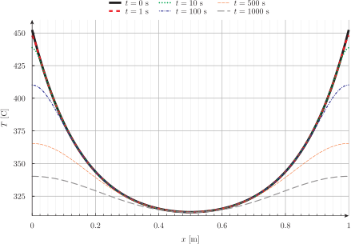
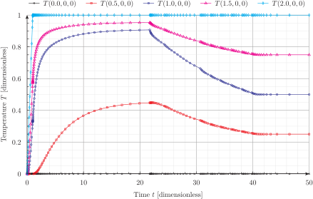

---
title: Heat conduction
titleblock: |
 Heat conduction
 ===============
lang: en-US
toc: true 
abstract: |
  Compilation of thermal problems.
  Check out the [heat conduction tutorial](https://www.seamplex.com/feenox/doc/tutorials/320-thermal/) as well.
...
# Thermal slabs

## One-dimensional linear

Solve heat conduction on the slab $x \in [0:1]$ with boundary conditions

$$\begin{cases}
T(0) = 0 & \text{(left)} \\
T(1) = 1 & \text{(right)} \\
\end{cases}$$

and uniform conductivity. Compute $T\left(\frac{1}{2}\right)$.

Please note that:

- The input written in a self-evident English-like dialect
  - Syntactic sugared plain-text ASCII file
  - Simple problems (like this one) need simple inputs
  - FeenoX follows the Unix rule of simplicity
- Output is 100% user-defined
  - No `PRINT` no output
  - Feenox follows the Unix rule of silence
- There is no node at $x=1/2=0.5$!
  - FeenoX knows how to interpolate
- Mesh separated from problem
  - The geometry comes from a Git-friendly `.geo`

  ``` c
  Point(1) = {0, 0, 0};          // geometry: 
  Point(2) = {1, 0, 0};          // two points
  Line(1) = {1, 2};              // and a line connecting them!

  Physical Point("left") = {1};  // groups for BCs and materials
  Physical Point("right") = {2};
  Physical Line("bulk") = {1};   // needed due to how Gmsh works

  Mesh.MeshSizeMax = 1/3;        // mesh size, three line elements
  Mesh.MeshSizeMin = Mesh.MeshSizeMax;
  ```

  - Unix rule of composition
  - The actual input file is a Git-friendly `.fee`


```feenox
PROBLEM thermal 1D    # tell FeenoX what we want to solve 
READ_MESH slab.msh    # read mesh in Gmsh's v4.1 format
k = 1                 # set uniform conductivity
BC left  T=0          # set fixed temperatures as BCs
BC right T=1          # "left" and "right" are defined in the mesh
SOLVE_PROBLEM         # we are ready to solve the problem
PRINT T(1/2)          # ask for the temperature at x=1/2
```


```terminal
$ gmsh -1 slab.geo
[...]
Info    : 4 nodes 5 elements
Info    : Writing 'slab.msh'...
[...]
$ feenox thermal-1d-dirichlet-uniform-k.fee 
0.5
$ 

```


# Transient heat conduction from steady-state by "turning off" BCs

This problem solves the transient over a slender cylider arising from
"turning off" a heat source that provided a fixed heat flux at both
ends, while the cylindrical surface is subject to convection conditions.

The transient goes from $t=0~\text{s}$ up to end time $t=1000~\text{s}$.
We force the time stepper to pass exactly through the following
times $t$

- 1
- 10
- 100
- `end_time`/2

At these times, the special variable `in_time_path` is true. We use an
`IF` condition to write the profile along the $x$ axis on

1.  a single file named `profiles.dat` with an extra column for the time
    $t$
2.  one file for each time step `profile-t.dat`

for the selected times (or during the static step at $t=0$ and the final
step at $t=1000$).


```feenox
# "barra" means "rod" in Spanish
PROBLEM thermal 3d MESH barra3d.msh

# times
end_time = 1000
TIME_PATH 1 10 100 end_time/2


# problem constants [SI]
# D = 0.02
# A = pi*(0.5*D)^2
# instead of computing the area from the geometry we can ask 
# feenox to do it for us by explicitly defining a physical
# group with the right dimension, we'll have the variable
# hot_area available with, well you guessed, the group's area
PHYSICAL_GROUP hot DIMENSION 2

L = 1             # length
k = 50            # conductivity 
rho = 8000        # density 
cp = 400          # heat capaccity

# boundary conditions

# 30 watts, turned off starting at t=eps and ending at t=2*eps
eps = 1e-2
BC hot  q=30/hot_area*(1-heaviside(t-eps,eps))  # "hot" has two areas
BC cool h=10 Tref=300

# advance one step
SOLVE_PROBLEM

# sample the 1d profile along the x axis at the time paths
profile(x) = T(x,0,0)
IF in_static|in_time_path|done
  # one single file with all the profiles
  PRINT_FUNCTION profile t MIN 0 MAX L NSTEPS 100 FILE profiles.dat
  
  # one file fore ach profile
  FILE profilet PATH profile-%g.dat t
  PRINT_FUNCTION profile   MIN 0 MAX L NSTEPS 100 FILE profilet
  CLOSE profilet
ENDIF

# print the progress so we know how much is left when we run it
PRINT t T(0.1,0,0)

# write the full transient in a .msh
WRITE_RESULTS FILE barra3d-transient.msh

# TODO
# WRITE_RESULTS FILE barra3d-transient.vtk
```


```terminal
$ gmsh -3 barra3d.geo
$ feenox barra3d.fee

```


{width=100%}


# Non-dimensional transient heat conduction on a cylinder

Let us solve a dimensionless transient problem over a cylinder.
Conductivity and heat capacity are unity. Initial condition is a linear
temperature profile along the $x$ axis:

$$T(x,y,z,0) = x$$

The base of the cylinder has a prescribed time and space-dependent
temperature

$$T(0,y,z,t) = \sin( 2\pi \cdot t) \cdot \sin( 2\pi \cdot y)$$

The other faces have a convection conditions with (non-dimensional) heat
transfer coefficient $h=0.1$ and $T_\text{ref} = 1$.

{width="100%"}


```feenox
PROBLEM thermal 3D
READ_MESH cylinder.msh

end_time = 2  # final time [ non-dimensional units ]
# the time step is automatically computed

# initial condition (if not given, stead-state is computed)
T_0(x,y,z) = x

# dimensionless uniform and constant material properties
k = 1
kappa = 1

# BCs 
BC hot   T=sin(2*pi*t)*sin(2*pi*y)
BC cool  h=0.1  Tref=1

SOLVE_PROBLEM


profile(x) = T(x,0,0)
VECTOR profile_times[5] DATA 0 0.5 1 1.5 2
has_to_dump_profile = sum(abs(t-profile_times[i])<0.5*dt, i, 1, vecsize(profile_times))

IF has_to_dump_profile
  PRINT_FUNCTION profile t MIN 0 MAX 1 NSTEPS 10 FILE profiles.dat
ENDIF

# print the temperature at the center of the base vs time
PRINT %e t T(0,0,0) T(0.5,0,0) T(1,0,0) has_to_dump_profile

WRITE_MESH temp-cylinder.msh T

IF done
 PRINT "\# open temp-anim-cylinder.geo in Gmsh to create a quick rough video"
 PRINT "\# run  temp-anim-cylinder.py  to get a nicer and smoother video"
ENDIF
```


```terminal
$ gmsh -3 cylinder.geo
[...]
Info    : Done optimizing mesh (Wall 0.624941s, CPU 0.624932s)
Info    : 1986 nodes 10705 elements
Info    : Writing 'cylinder.msh'...
Info    : Done writing 'cylinder.msh'
Info    : Stopped on Fri Dec 24 10:35:32 2021 (From start: Wall 0.800542s, CPU 0.896698s)
$ feenox temp-cylinder-tran.fee 
0.000000e+00    0.000000e+00    5.000000e-01    1.000000e+00
1.451938e-04    4.406425e-07    5.000094e-01    9.960851e-01
3.016938e-04    9.155974e-07    5.000171e-01    9.921274e-01
5.566768e-04    1.689432e-06    5.000251e-01    9.862244e-01
8.565589e-04    2.599523e-06    5.000292e-01    9.800113e-01
1.245867e-03    3.780993e-06    5.000280e-01    9.728705e-01
1.780756e-03    5.404230e-06    5.000176e-01    9.643259e-01
2.492280e-03    7.563410e-06    4.999932e-01    9.545723e-01
3.428621e-03    1.040457e-05    4.999538e-01    9.436480e-01
[...]
1.978669e+00    -6.454358e-05   1.500891e-01    2.286112e-01
1.989334e+00    -3.234439e-05   1.500723e-01    2.285660e-01
2.000000e+00    1.001730e-14    1.500572e-01    2.285223e-01
# open temp-anim-cylinder.geo in Gmsh to create a quick rough video
# run  temp-anim-cylinder.py  to get a nicer and smoother video
$ python3 temp-anim-cylinder.py
Info    : Reading 'temp-cylinder.msh'...
Info    : 1986 nodes
Info    : 10612 elements
Info    : Done reading 'temp-cylinder.msh'
0 1 0.0
0.01 12 0.8208905327853042
0.02 15 0.8187351216040447
0.03 17 0.7902629708599855
[...]
Info    : Writing 'temp-cylinder-smooth-198.png'...
Info    : Done writing 'temp-cylinder-smooth-198.png'
199
Info    : Writing 'temp-cylinder-smooth-199.png'...
Info    : Done writing 'temp-cylinder-smooth-199.png'
all frames dumped, now run
ffmpeg -framerate 20 -f image2 -i temp-cylinder-smooth-%03d.png temp-cylinder-smooth.mp4
to get a video
$ ffmpeg -y -f image2 -i temp-cylinder-smooth-%03d.png  -framerate 20 -pix_fmt yuv420p -c:v libx264 -filter:v crop='floor(in_w/2)*2:floor(in_h/2)*2'  temp-cylinder-smooth.mp4
[...]
$

```


:::: {.not-in-format .latex .texi}
{width=100%}
::::


# Non-dimensional transient heat conduction with time-dependent properties

Say we have two cubes of non-dimensional size $1\times 1 \times 1$, one
made with a material with unitary properties and the other one whose
properties depend explicitly on time. We glue the two cubes together,
fix one side of the unitary material to a fixed zero temperature and set
a ramp of temperature between zero and one at the opposite end of the
material with time-varying properties.

This example illustrates how to

1.  assign different material properties to different volumes
2.  give time-dependent material properties and boundary conditions
3.  plot temperatures as function of time at arbitrary locations on
    space


```feenox
PROBLEM thermal 3D
READ_MESH two-cubes.msh

end_time = 50
# initial condition (if not given, stead-state is computed)
# T_0(x,y,z) = 0

# dimensionless uniform and constant material properties
k_left = 0.1+0.9*heaviside(t-20,20)
rho_left = 2-heaviside(t-20,20)
cp_left = 2-heaviside(t-20,20)

# dimensionless uniform and constant material properties
k_right = 1
rho_right = 1
cp_right = 1

# BCs 
BC zero  T=0
BC ramp  T=limit(t,0,1)
BC side  q=0

SOLVE_PROBLEM

PRINT t T(0,0,0) T(0.5,0,0) T(1,0,0) T(1.5,0,0) T(2,0,0)

```


```terminal
$ gmsh -3 two-cubes.geo
[...]
$ feenox two-cubes-thermal.fee > two-cubes-thermal.dat
$ 

```


{width=100%}


