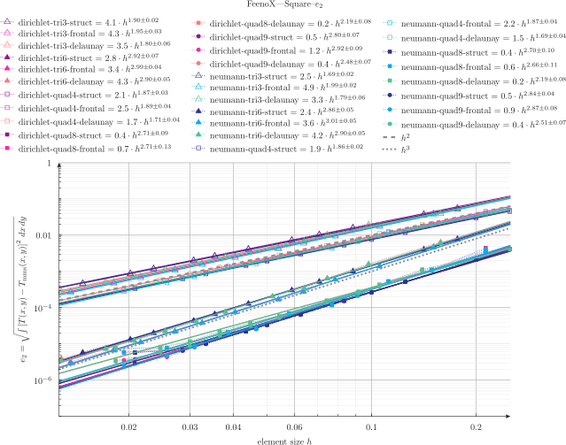

# MMS verification: thermal 2D square

This directory shows how to perform verification of the 2D thermal solver using the Method of Manufactured Solutions.

> Make sure you follow up with the [3D cases](../3d) as well.

The chosen domain is a square of size one with the lower left corner at $x=0$ and $y=0$ as in

```
SetFactory("OpenCASCADE");
Rectangle(1) = {0, 0, 0, 1, 1, 0};

Physical Surface("bulk", 1) = {1};
Physical Curve("left", 2) = {4};
Physical Curve("right", 3) = {2};
Physical Curve("bottom", 4) = {1};
Physical Curve("top", 5) = {3};
```

The manufactured solution $T(x,y)$ and thermal conductivity $k(x,y)$ are given in the FeenoX input file `thermal-square.fee` as

```feenox
# MMS data, set T_mms(x) and k_mms(x) as desired
T_mms(x,y) = 1 + sin(2*x)^2 * cos(3*y)^2
k_mms(x,y) = 1 + x - 0.5*y
```

As explained below, a script `run.sh` will
 
 1. perform a parametric sweep over different mesh sizes
 2. compute the numerical error with respect to the manufactured solution
 3. fit the slope of the logarithm of the error with respect to the logarithm of the mesh size
 4. create a Markdown table with the slopes
 5. create a Pyxplot file to plot the logarithmic errors


## Dependencies

The binaries `feenox`, `gmsh` and `maxima` need to be available to be called from the script.

 * [FeenoX](https://www.seamplex.com/feenox)
 * [Gmsh](http://gmsh.info/)
 * [Maxima](https://maxima.sourceforge.io/)
 * [Pyxplot](https://pyxplot.org.uk/) (optional)


 
## Execution

Run the script `run.sh` (and `clean.sh` if you want to re-run):

```terminal
./clean.sh
./run.sh
```

By default this will run over a few combinations of 

 * BCs
   - dirichlet
   - neumann
 * element types
   - tri3
   - tri6
   - quad4
   - quad8
   - quad9
 * meshing algorithms
   - struct
   - frontal
   - dealaunay
 * refinement factors $c$ such that the mesh size $h$ is propotional to $1/c$,
   - 4
   - 8
   - 12
   - 16
   - 20
   - 24

Feel free to edit `run.sh` and modify these combinations:

```bash
bcs="dirichlet neumann"
elems="tri3 tri6 quad4 quad8 quad9"
algos="struct frontal delaunay"
cs="4 8 12 16 20 24"
```

You can also edit `thermal-square.fee` and change the expressions for the temperature and the conductivity.
The `run.sh` script calls Maxima to compute the appropriate volumetric source $q(x,y)$ and the Neumann boundary conditions. 

While running you'll see 8 columns:

 1. logarithm of the mesh size $\log(h)$
 2. logarithm of the $L-2$ error $\log(e_2)$
 3. logarithm of the $L-\infty$ error $\log(e_\infty)$
 4. $c$ factor for mesh size $h \propto 1/c$
 5. number of cells (volumetric elements)
 6. number of nodes (degrees of freedom)
 7. total memory in Mb
 8. wall time in seconds
 
After running, along the output for the individual combinations, you'll get aggregated results:

 * `thermal-square-results.md` a Markdown table with the slopes of each combination of BC, element type and meshing algorithm
 * `thermal-square.ppl` a Pyxplot file to create plots of the $L_2$ errors vs. element size
 
If you want to keep on VTK output for each case, run with `vtk` as the argument:

```terminal
./run.sh vtk
```


Each combination of BC, element type and meshing algorithm has a data file with the errors ($e_2$ and $e_\infty$) vs. the element size\ $h$, which is fitted with FeenoX and plotted with Pyxplot:

```terinal
pyxplot thermal-square.ppl
```

There's also a markdown file with a table listing the order of convergence of each combination at `thermal-square-results.md`.


# Detailed explanation

To be done.


# Results


 boundary condition | element type | algorithm | order of convergence
--------------------|--------------|-----------|:----------------------:
 dirichlet | tri3 | struct |  1.9
 dirichlet | tri3 | frontal |  2.1
 dirichlet | tri3 | delaunay |  1.9
 dirichlet | tri6 | struct |  3.0
 dirichlet | tri6 | frontal |  3.1
 dirichlet | tri6 | delaunay |  3.1
 dirichlet | quad4 | struct |  2.0
 dirichlet | quad4 | frontal |  2.1
 dirichlet | quad4 | delaunay |  1.9
 dirichlet | quad8 | struct |  3.0
 dirichlet | quad8 | frontal |  3.2
 dirichlet | quad8 | delaunay |  2.7
 dirichlet | quad9 | struct |  3.0
 dirichlet | quad9 | frontal |  3.1
 dirichlet | quad9 | delaunay |  2.8
 neumann | tri3 | struct |  1.9
 neumann | tri3 | frontal |  2.1
 neumann | tri3 | delaunay |  2.0
 neumann | tri6 | struct |  2.9
 neumann | tri6 | frontal |  3.1
 neumann | tri6 | delaunay |  3.1
 neumann | quad4 | struct |  2.0
 neumann | quad4 | frontal |  2.0
 neumann | quad4 | delaunay |  1.9
 neumann | quad8 | struct |  3.0
 neumann | quad8 | frontal |  3.2
 neumann | quad8 | delaunay |  2.8
 neumann | quad9 | struct |  3.0
 neumann | quad9 | frontal |  3.1
 neumann | quad9 | delaunay |  2.8


 

