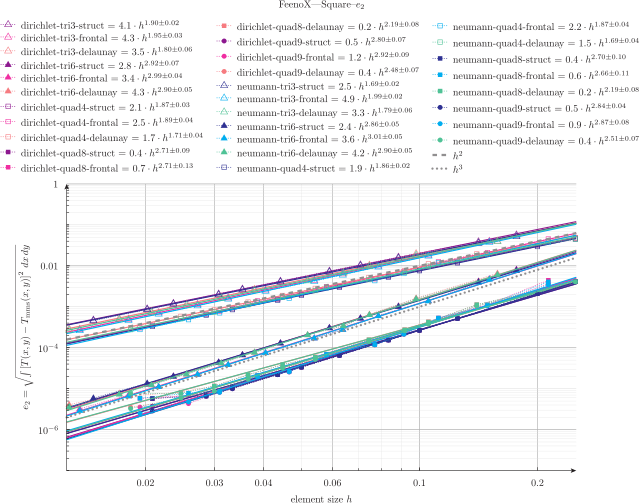

 Boundary condition | Element type | Algorithm | Order of convergence
--------------------|--------------|-----------|:----------------------:
 dirichlet | tri3 | struct | 1.9
 dirichlet | tri3 | frontal | 2.0
 dirichlet | tri3 | delaunay | 2.0
 dirichlet | tri6 | struct | 3.0
 dirichlet | tri6 | frontal | 3.0
 dirichlet | tri6 | delaunay | 3.0
 dirichlet | quad4 | struct | 2.0
 dirichlet | quad4 | frontal | 2.1
 dirichlet | quad4 | delaunay | 2.0
 dirichlet | quad8 | struct | 2.8
 dirichlet | quad8 | frontal | 2.9
 dirichlet | quad8 | delaunay | 2.6
 dirichlet | quad9 | struct | 2.9
 dirichlet | quad9 | frontal | 3.0
 dirichlet | quad9 | delaunay | 2.8
 neumann | tri3 | struct | 1.9
 neumann | tri3 | frontal | 2.1
 neumann | tri3 | delaunay | 2.0
 neumann | tri6 | struct | 2.9
 neumann | tri6 | frontal | 3.1
 neumann | tri6 | delaunay | 3.0
 neumann | quad4 | struct | 2.0
 neumann | quad4 | frontal | 2.1
 neumann | quad4 | delaunay | 2.0
 neumann | quad8 | struct | 2.8
 neumann | quad8 | frontal | 2.8
 neumann | quad8 | delaunay | 2.6
 neumann | quad9 | struct | 2.9
 neumann | quad9 | frontal | 3.1
 neumann | quad9 | delaunay | 2.8

 
 
