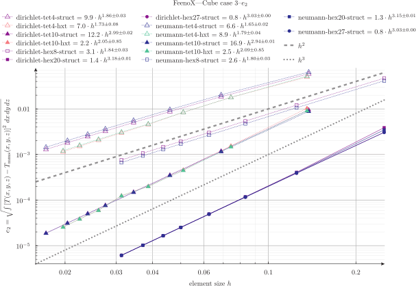

# MMS verification: thermal 3D cube


 boundary condition | element type | algorithm | order of convergence
--------------------|--------------|-----------|:----------------------:
 dirichlet | tet4 | struct | 1.8
 dirichlet | tet4 | hxt | 2.0
 dirichlet | tet10 | struct | 3.0
 dirichlet | tet10 | hxt | 3.1
 dirichlet | hex8 | struct | 2.0
 dirichlet | hex20 | struct | 3.1
 dirichlet | hex27 | struct | 3.0
 neumann | tet4 | struct | 1.8
 neumann | tet4 | hxt | 2.0
 neumann | tet10 | struct | 3.0
 neumann | tet10 | hxt | 3.0
 neumann | hex8 | struct | 2.0
 neumann | hex20 | struct | 3.0
 neumann | hex27 | struct | 3.0

 



This directory shows how to perform verification of the 3D thermal solver using the Method of Manufactured Solutions.

> Make sure you understand the basis from the [2D cases](../2d) before digging into the 3D cases.
> Look at the [mechanical cases](../../mechanical) as well.


The idea is similar to the 2 [2D cases](../2d) but now `run.sh` takes an integer $n$ as an argument.
For each $n$, the temperature and conductivity are defined in a file `thermal-cuben-T.fee`:

 1. steady-state uniform conductivity
 
    ```feenox
    T_mms(x,y,z) = 1 + sin(2*x)^2 * cos(3*y)^2 * sin(4*z)
    k_mms(x,y,z) = 1
    ```
 
 2. steady-state space-dependent conductivity

    ```feenox
    T_mms(x,y,z) = 1 + sin(2*x)^2 * cos(3*y)^2 * sin(4*z)
    k_mms(x,y,z) = 1+log(1+x)+0.5*y*z^2
    ```

 3. steady-state temperature-dependent

    ```feenox
    T_mms(x,y,z) = 1 + sin(2*x)^2 * cos(3*y)^2 * sin(4*z)
    k_mms(x,y,z) = 1+0.5*T(x,y,z)
    ```
 
 4. steady-state space & temperature-dependent
 
    ```feenox
    T_mms(x,y,z) = 1 + sin(2*x)^2 * cos(3*y)^2 * sin(4*z)
    k_mms(x,y,z) = 1+0.5*T(x,y,z)+log(1+x)+0.5*y*z^2
    ```
