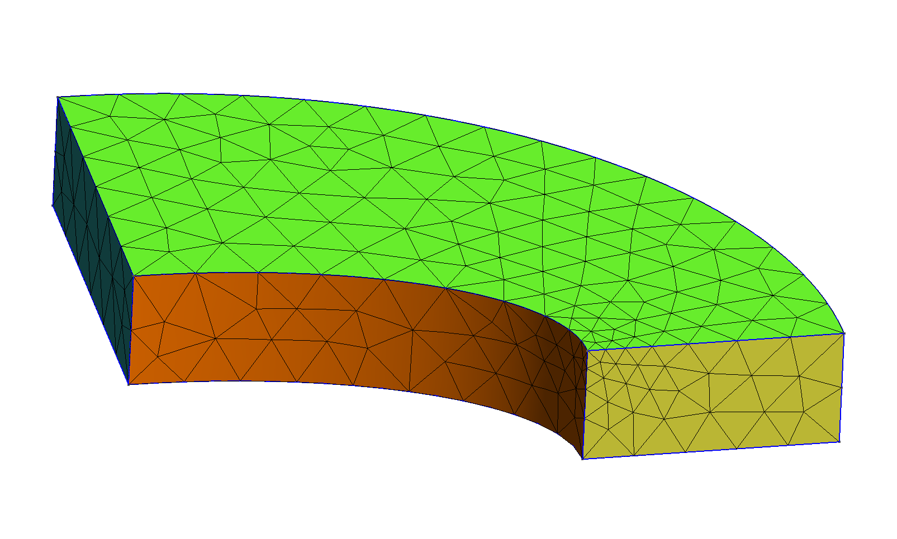
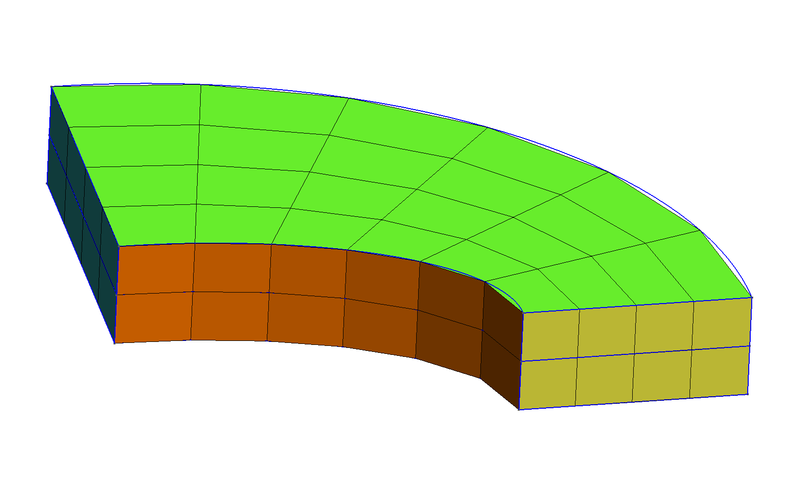

# Solving the NAFEMS LE10 problem with different codes

The files in this directory parametrically solve the [NAFEMS LE 10 problem](https://www.seamplex.com/feenox/examples/#nafems-le10-thick-plate-pressure-benchmark) with a number of different FEA codes, namely

 * [FeenoX](https://www.seamplex.com/feenox)
 * [Sparselizard](http://sparselizard.org/)
 * [Code Aster](http://https://www.code-aster.org)
 * [CalculiX](http://www.calculix.de/)

using two types of [Gmsh](http://gmsh.info/)-generated second-order grids

 1. locally-refined (around point $D$) unstructured curved tetrahedral grid, and
 2. straight incomplete (i.e. hex20) fully-structured hexahedral mesh.

over a wide range of mesh refinements.

:::



The two types of meshes used in this test
:::


The expected result, namely $\sigma_y$ at point $D$ and the wall time, CPU time and memory are recorded for each run so as to create plots of these results vs. the refinement factor $c \in [0:1]$ and vs. the total number of degrees of freedom being solved for (which can be different in each code even for the same $c$).

This way of executing FEA programs follows the FeenoX design basis of being both cloud and script friendly. The reasons for requiring these friendlinesses are explained in FeenoX documentation, particularly in the [SRS](https://www.seamplex.com/feenox/doc/srs.html) and [SDS](https://www.seamplex.com/feenox/doc/sds.html). It might happen that some of the codes tests seem to need to setup and/or read the results in a unnecessarily complex and/or cumbersome way because they were not designed to be either cloud and/or script friendly. It might also happen that the cumbersomeness comes from my lack of expertise about how to properly use the code.

The NAFEMS\ LE10 problem was chosen because 

 * it is a well-established benchmark since its publication in 1990
 * it is simple yet has displacement boundary condition on an edge in addition to faces that makes it challenging
 * the reference solution is a single scalar which is easy to compare among different approaches


Even though there are some particular comments for each of the code used in this comparison, this directory is not about the differences (and eventually pros and cons) each code has for defining and solving a FEA problem. It is about comparing the consumption of computational resources needed to solve the same problem (or almost) in the cloud. The differences about how to set up the problem and considerations about usage, cloud friendliness and scriptability are addressed in a separate directory regarding benchmark NAFEMS\ LE11, that involves defining a temperature distribution given by an algebraic expression (under preparation at the time of this writing).


## Reference solution

The original problem formulation (which can be found in [one of FeenoX' annotated examples](https://www.seamplex.com/feenox/examples/#nafems-le10-thick-plate-pressure-benchmark)) states that the reference solution is -5.38\ MPa. This can be confirmed with FeenoX using the input `le10-ref.fee`. 

```terminal
$ gmsh -3 le10-ref.geo
[...]
Info    : Done meshing order 2 (Wall 0.456586s, CPU 0.438907s)
Info    : 205441 nodes 59892 elements
Info    : Writing 'le10-ref.msh'...
Info    : Done writing 'le10-ref.msh'
Info    : Stopped on Thu Oct 28 12:03:28 2021 (From start: Wall 1.30955s, CPU 1.44333s)
$ time feenox le10-ref.fee
σ_y(D) =  -5.3792 MPa

real    1m34.485s
user    1m30.677s
sys     0m10.449s
$
```

This run can also be used to "calibrate" the timing. Just run the `le10-ref.fee` case yourself and see how long FeenoX needs in your server. This figure should help you to scale up (or down) the ordinates of the figures for the parametric results shown here.


## Scripted parametric execution

The driving script is called `run.sh`.
If one executes the `run.sh` script, one gets

```terminal
$ ./run.sh 
usage: ./run.sh { tet | hex } c_min n_steps
$ 
```

The first argument is either `tet` or `hex`. The second is the lower end of the range for the mesh refinement factor $c \in [c_\text{min}:1]$. In principle there is no problem setting `c_min` to 0 because it will never be reached exactly, although the meshes will be insanely large. The last argument is the number of steps.

Note that the range $[c_\text{min}:1]$ will be swept using a quasi-random number sequence and all the results will be cached until removed by  executing `clean.sh`. So if one first runs 

```terminal
./run.sh tet 0.1 8
```

and then

```terminal
-/run.sh tet 0.1 12
```

the second execution would only execute four actual steps, reading the cached values for the first eight.
This will hold as long as `c_min` is the same for all invocations of `run.sh`.


To check which of the codes are available in your configuration, run with `--check`:

```terminal
$ ./run.sh --check
FeenoX GAMG:  yes
FeenoX MUMPS: yes
Sparselizard: yes
Code Aster:   yes
CalculiX:     yes
$
```

Run a single step (i.e. $c=1$, which are the default meshes shown above) for each case to see if everything works.

```
./run.sh tet 1 1
./run.sh hex 1 1
```

The geometry and the meshes are created with [Gmsh](http://gmsh.info/). The refinements are made by setting the `-clscale` command-line parameter equal to $c$ to control the elements' size. The actual values taken by $c \in [c_\text{min}:1]$ are given by running FeenoX with the input `steps.fee`. This uses a Sobol quasi-random number sequence that starts with $c=1$ and then fills the interval in subsequent steps.
For example, five steps for $c_\text{min} = 0.1$ gives

```terminal
$ feenox steps.fee 0.1 5 
1
0.55
0.775
0.325
0.4375
$
```

The first step is the coarsest mesh. The second one is the middle-range mesh, and the following steps start to "fill" in the blanks. Since the `run.sh` script caches the results it gets, further steps can be performed by reusing the existing data. So if we now want to run ten steps,

```terminal
$ feenox steps.fee 0.1 10
1
0.55
0.775
0.325
0.4375
0.8875
0.6625
0.2125
0.26875
0.71875
$
```

and the first five steps will use cached data instead of re-running all the codes.


A successful execution of `run.sh` will give files `*.dat` with the following columns:

 1. the parameter $c \in [c_\text{min}:1]
 2. the total number of degrees of freedom
 3. the stress $\sigma_y$ evaluated at point $D$
 4. the wall time in seconds
 5. the kernel-mode CPU time in seconds
 6. the user-mode CPU time in seconds
 7. the maximum memory used by the program, in kB

The rows will follow the execution order, so they will be unsorted on the refinement factor (and number of degrees of freedom) so they are not suitable for plotting them directly, at leas using lines to connect consecutive data points.
Not only does the script `plot.sh` sort them but it also creates appropriate SVG figures using [Gnuplot](http://www.gnuplot.info/) and a markdown report, either `report-tet.md` or `report-hex.md`. The SVG files are interactive so they can be opened with a web browser, zoomed in and out and the individual curves can be turned on and off by clicking on the label.


# Explanations, comments and caveats

> **Disclaimer**: I am the author of FeenoX so all of my comments are likely to be biased.
If you are reading this and feel like something is not true or is indeed way too biased, please contact me and help me to have the fairest comparison possible. There might still be some subjectivity and I apologize in advance for that.


 * The objective of this test is to compare consumption of resources for cloud-based computations. It is therefore suggested to run it on a cloud server and not on a local laptop.
 
 * In order to have the most fair comparison possible, even though the codes can measure CPU and memory consumption themselves, all of them are run through the `time` tool (the actual binary tool at `/usr/bin/time`, not the shell's internal).
 
 * This is a **serial test only** so the variable `OMP_NUM_THREADS` is set to one to avoid spawning OpenMP threads. MPI-based parallel tests across different hosts will come later on. OpenMP will not be the main focus of the scalability study.
 
 * The wall time should thus be equal to the sum of kernel-space CPU time plus user-space CPU time plus some latency that depends on the operating system's scheduler.
 
 * The hex mesh is created as a first-order mesh and then either 
   
    1. converted to a (straight) second-order incomplete (i.e. hex20) mesh, or
    2. the first-order mesh is fed to the code and it is asked to use second-order elements.
   
   depending on the capabilities of each code (some codes honor the element type in the mesh but others change the order and number of nodes on the fly).
   
 
 * The second column of the output is the total number of degrees of freedom. In principle for a simple three-dimensional problem like this one it should be equal to three times the number of nodes. But Code Aster (apparently) sets Dirichlet boundary conditions as Lagrange multipliers, increasing the matrix size. On the contrary, CalculiX removes the degrees of freedom that correspond to nodes with  Dirichlet boundary conditions resulting in a smaller matrix size. Sparselizard needs complete elements so it uses hex27 when reading a hex8 mesh and setting order = 2, resulting in a (much) higher degree-of-freedom count for the hex case.

 * Most codes allow to choose the actual linear sparse solver at runtime, maybe depending on the availability of particular solving libraries at compilation time. For these codes, there are many curves, one for each supported preconditioner+solver commbination.
 
 * When the mesh is big, chances are that the code runs out of memory being killed by the operating system (if there is no swap partition, which there should be not). Code Aster and CalculiX have out-of-core capabilities in which they can run with less memory than the actual requested, at the expense of larger CPU times by using a tailor-made disk-swapping procedure. The other codes are killed by the operating system when this happens and there is no data point for that particular value of $c$.
 
 * The number of iterations needed to converge iterative solvers depends on the tolerance. In all cases, default tolerances have been used.


## FeenoX

The `run.sh` script calls `feenox` with the `le10.fee` input file as the first argument and `${m}-${c}` as the second one, resulting in something like `tet-1` or `hex-0.2`. This argument is expanded where the input file contains a `$1`, namely the mesh file name. It prints the total number of degrees of freedom and the stress\ $\sigma_y$ at point $D$. It does not write any post-processing file (the `WRITE_MESH` keyword is commented out):

```feenox
# NAFEMS Benchmark LE-10: thick plate pressure
PROBLEM mechanical DIMENSIONS 3
DEFAULT_ARGUMENT_VALUE 1 1
READ_MESH le10_2nd-$1.msh   # FeenoX honors the order of the mesh

BC upper    p=1      # 1 Mpa
BC DCDC     v=0      # Face DCD'C' zero y-displacement
BC ABAB     u=0      # Face ABA'B' zero x-displacement
BC BCBC     u=0 v=0  # Face BCB'C' x and y displ. fixed
BC midplane w=0      #  z displacements fixed along mid-plane

E = 210e3   # Young modulus in MPa (because mesh is in mm)
nu = 0.3    # Poisson's ratio

SOLVE_PROBLEM   # TODO: implicit

PRINT total_dofs %.8f sigmay(2000,0,300)

# write post-processing data for paraview
# WRITE_MESH le10-feenox-${c}.vtk VECTOR u v w sigmax sigmay sigmaz tauxy tauzx tauyz
```

The mesh file should already contain a second-order mesh. The file `le10-tet.geo` already creates tet10 elements, but the `le10-hex.geo` creates hex8 elements that have to be converted to hex20 before FeenoX can use them. This is achieved in the `run.sh` with the block

```bash
  if [ ! -e le10-${m}-${c}.msh ]; then
    gmsh -3 le10-${m}.geo -clscale ${c} -o le10-${m}-${c}.msh || exit 1
    gmsh -3 le10-${m}-${c}.msh -setnumber Mesh.SecondOrderIncomplete 1 -order 2 -o le10_2nd-${m}-${c}.msh || exit 1
  fi
```

If the file `le10-${m}-${c}.msh` does not exist (otherwise it would take it as a cached file), Gmsh is first called with either `le10-tet.geo` or `le10-hex.geo` as the input and `-clscale` is set to\ $c$ to create `le10-${m}-${c}.msh`. Then, this mesh file is explicitly converted to a second-order mesh with `-order 2` and any hex8 is converted to hex20 (instead of hex27 with `Mesh.SecondOrderIncomplete=1`) and saved as `le10_2nd-${m}-${c}.msh`. It is this last mesh file the one that FeenoX needs.


If the MUMPS solver is available through PETSc, `run.sh` adds the command-line option `--mumps`.


## Sparselizard

The following `main.cpp` is used to solve the NAFEMS LE10 benchmark with Sparselizard:

```cpp
// NAFEMS LE10 Benchmark solved with Sparselizard

#include "sparselizard.h"
using namespace sl;

int main(int argc, char **argv) {
  
  int bulk = 1;
  int upper = 2;
  int DCDC = 3;
  int ABAB = 4;
  int BCBC = 5;
  int midplane = 6;
  
  double young = 210e3;
  double poisson = 0.3;
  
  std::string c = (argc > 1) ? argv[1] : "tet-1";
  mesh mymesh("gmsh:../le10-"+c+".msh", 0);
  field u("h1xyz");
  
  parameter E;
  E|bulk = young;
  parameter nu;
  nu|bulk = poisson;

  u.setorder(bulk, 2);  
  u.compy().setconstraint(DCDC); // v=0 @ DCDC
  u.compx().setconstraint(ABAB); // u=0 @ ABAB
  u.compx().setconstraint(BCBC); // u=0 @ BCBC
  u.compy().setconstraint(BCBC); // v=0 @ BCBC
  u.compz().setconstraint(midplane); // w=0 @ midplae
  
  formulation elasticity;
  elasticity += integral(upper, array1x3(0,0,-1)*tf(u));  // p=1 @ upper
  elasticity += integral(bulk, predefinedelasticity(dof(u), tf(u), E, nu), -2);  // -2 gives an exact integration for up to 4th order polynomial"
  elasticity.generate();
  
  vec solu = solve(elasticity.A(), elasticity.b());

  // Transfer the data from the solution vector to the u field:
  u.setdata(bulk, solu);

  double lambda = young * poisson/((1+poisson)*(1-2*poisson));
  double mu = 0.5*young/(1+poisson);
  
  expression H(6,6,{lambda+2*mu,      lambda,      lambda,  0,  0,  0,
                    lambda,      lambda+2*mu,      lambda,  0,  0,  0,
                    lambda,           lambda, lambda+2*mu,  0,  0,  0,
                         0,                0,           0, mu,  0,  0,
                         0,                0,           0,  0,  mu, 0,
                         0,                0,           0,  0,  0, mu});

  expression sigma = H*strain(u);
//   u.write(bulk, "le10-sparselizard-displ.vtk", 2);
//   comp(1, sigma).write(bulk, "le10-sparselizard-sigmay.vtk", 2);   

  field sigmayy("h1");
  sigmayy.setorder(bulk, 2);
  sigmayy.setvalue(bulk, comp(1, sigma));  
  
  std::cout << elasticity.countdofs() << "\t" << sigmayy.interpolate(bulk, {2000, 0, 300})[0] << std::endl;
  
  return 0;
}
```

The main function takes one argument which should be the same as in FeenoX, i.e. `tet-1`, `hex-0.25`, etc. which is used to read the mesh file as created by Gmsh from the parent directory. The problem order is set to two. The Dirichlet BCs are then set. The Neumann BC is set into the elasticity weak formulation as a surface integral. The volume integral is performed using 2nd-order Gauss points and then the problem is solved for the displacements. The stress tensor field is computed out of the strain using the linear elastic 6x6 matrix in Voigt notation. The stress at point\ $D$ is interpolated from a smoothed field over all the elemental contributions to the node and printed into the standard output, along with the total number of degrees of freedom being solved for.

Note that Sparselizards needs tensor-product elements for the hex case, so the choice of order equal to two triggers the conversion of the hex8 stored in the `.msh` file into hex27 elements. The other codes stick to incomplete hex20 elements, so the total number of degrees of freedom is larger for Sparselizard than for the other codes for the same\ $c$.


## Code Aster

Thanks Cyprien Rusu for all the help setting up the code and the input files.

Even though Gmsh can write the mesh in the very efficient MED format which Code Aster can read, since it is a binary file (it is based on HDF5) the version of the MED library which both Gmsh as Aster are linked with should be the same. Since Code Aster is tricky to compile with custom dependencies and Gmsh uses a newer MED library by default, this path was discharged.

It was decided to use the text-based (and archaic format UNV). The second-order mesh `le10_2nd-${m}-${c}.msh` is converted to UNV with Gmsh:

```bash
    if [ ! -e le10_2nd-${m}-${c}.unv ]; then
      gmsh -3 le10_2nd-${m}-${c}.msh -o le10_2nd-${m}-${c}.unv || exit 1
    fi
```

The argument that the Code Aster executable needs is an "export" file that defines some run-time options for the execution (memory and cpu limits, number of MPI instances, etc.) and links Fortran file units (the ones that were introduced in 1954) to actual filesystem names, like the "comm" (input) file, the mesh file, the output file, etc. Interestingly enough, Code Aster would modify the input export file (sic) and rename relative file paths to absolute ones. This makes it hard to track export files with Git, but what `run.sh` does is it uses a template export file

```
P actions make_etude
P debug nodebug
P memjob 2097152
P memory_limit 15500.0
P mode interactif
P mpi_nbcpu 1
P mpi_nbnoeud 1
P ncpus 0
P time_limit 9000.0
P tpsjob 16
P version stable
A memjeveux 128.0
A tpmax 9000.0

F comm le10.comm         D  1
F libr le10_2nd-_m_.unv  D  20
F libr le10-_m_.rmed     R  80
F mess message-_m_       R  6
F resu DD-_m_.txt        R  17
R base base-stage1-_m_   R  0
```

and then `sed` would replace `_m_` with `${m}` to have a per-$c$ Git-ignored export file which can be further modified as needed.

The actual problem definition is stored in `le10.comm`:

```
DEBUT(LANG='EN')
mesh = LIRE_MAILLAGE(UNITE=20,FORMAT='IDEAS')
model = AFFE_MODELE(AFFE=_F(MODELISATION=('3D', ), PHENOMENE='MECANIQUE', TOUT='OUI'), MAILLAGE=mesh)

mater = DEFI_MATERIAU(ELAS=_F(E=210000.0, NU=0.3))
fieldmat = AFFE_MATERIAU(AFFE=_F(MATER=(mater, ), TOUT='OUI'), MODELE=model)

load = AFFE_CHAR_MECA(DDL_IMPO=(_F(DY=0.0, GROUP_MA=('DCDC', )),
                                _F(DX=0.0, GROUP_MA=('ABAB', )),
                                _F(DX=0.0, DY=0.0, GROUP_MA=('BCBC', )),
                                _F(DZ=0.0, GROUP_MA=('midplane', ))),
                      MODELE=model,
                      PRES_REP=_F(GROUP_MA=('upper', ), PRES=1.0))

reslin = MECA_STATIQUE(CHAM_MATER=fieldmat, EXCIT=_F(CHARGE=load), MODELE=model)

reslin = CALC_CHAMP(reuse=reslin,
                    CONTRAINTE=('SIGM_ELGA', 'SIGM_ELNO', 'SIGM_NOEU', 'SIEF_ELGA', 'SIEF_ELNO', 'SIEF_NOEU'),
                    CRITERES=('SIEQ_ELGA', 'SIEQ_ELNO', 'SIEQ_NOEU'),
                    RESULTAT=reslin)

#IMPR_RESU(RESU=_F(RESULTAT=reslin), UNITE=80)

IMPR_RESU(
  FORMAT='RESULTAT', 
  RESU=_F(
    GROUP_MA=('DD', ), 
    IMPR_COOR='OUI', 
    NOM_CHAM=('SIGM_NOEU', ), 
    NOM_CMP=('SIYY'), 
    RESULTAT=reslin
  ), 
  UNITE=17
)           
          
FIN()
```

Instead of writing the full results into unit 80 (i.e. `le10-${m}.rmed`), only an ASCII file with nodal values of the stress tensor are written for those nodes that belong to the `DD` physical group (the $D$-$D^\prime$) segment in the original geometry. For some reason, Code Aster won't accept a zero-dimensional physical group (i.e. a point) to write the ASCII result. So the `run.sh` has to parse this ASCII file so as to find the row corresponding to point $D$ and extract the value of $\sigma_y$, which is the fifth column:

```bash
      grep "2.00000000000000E+03  0.00000000000000E+00  3.00000000000000E+02" DD-${m}-${c}.txt | awk '{print $5}' >> aster_default_${m}-${c}.sigmay
```

The total number of degrees of freedom is taken from the "message" output (unit 6) by grepping the French expression for "degrees of freedom". Luckily UTF8 works well:

```bash
      grep "degrés de liberté:" message-${m}-${c}  | awk '{printf("%g\t", $7)}' > aster_default_${m}-${c}.sigmay
```


## CalculiX

Thanks Sergio Pluchinsky for all the help to set up the inputs and the mesh files.

As explained below, I just followed his suggestions without understanding them. 
The way CalculiX input files work will remain unheard of to me for the time being.

The following paragraph explains what `run.sh` does (which is needlessly cumbersome IMHO) to make CalculiX work.
It should be noted before the explanation starts that I had to modify the Gmsh UNV writer to handle both "groups of nodes" and "groups of elements" at the same time: https://gitlab.onelab.info/gmsh/gmsh/-/commit/a7fef9f6e8a7c870cf39b8702c57f3e33bfa948d . So make sure the Gmsh version you use is later than that commit.
Also, there is this `unical.c` conversion tool from UNV to INP that I initially borrowed from <https://github.com/calculix/unical1> but had to modify to make it work and is included in this directory. For large problems, this conversion procedure takes a non-trivial amount of time (i.e. more than five minutes for $c=0.128125$) which is not accounted for in the resulting curves.

The second-order mesh `le10_2nd-${m}-${c}.msh` is converted to UNV but with both options `SaveGroupsOfElements` and `SaveGroupsOfNodes` equal to true. Then, this UNV (which needs a Gmsh version later than commit `a7fef9f6` from November 2021 otherwise the next step will fail if there are an odd number of nodes) is read by the slighlty-modified tool `unica1l` that creates a `.inp` mesh file which can be read by CalculiX:

```bash
    if [ ! -e le10_mesh-${m}-${c}.inp ]; then
      gmsh -3 le10_2nd-${m}-${c}.msh -setnumber Mesh.SaveGroupsOfElements 1 -setnumber Mesh.SaveGroupsOfNodes 1 -o le10_calculix-${m}-${c}.unv || exit 1
      ./unical1 le10_calculix-${m}-${c}.unv le10_mesh-${m}-${c}.inp || exit
    fi
```

The main input is a template that reads the appropiate `.inp` mesh file for $c$ and sets succesively the Spooles solver, the internal with diagonal scaling and the internal with Cholesky preconditioning.
There is a reason I still cannot understand that explains why there has to be one template for `tet` and one for `hex`. In effect, Sergio pointed me to section that explains the `DLOAD` keyword (used to set a pressure boundary condition) in the `ccx` manual. It says (casing is verbatim):

> This option allows the specification of distributed loads. These include constant pressure loading on element faces, edge loading on shells and mass loading (load per unit mass) either by gravity forces or by centrifugal forces. 
> For surface loading the faces of the elements are numbered as follows (for the node numbering of the elements see Section 3.1):
>
> for hexahedral elements:
>
>  * face 1: 1-2-3-4
>  * face 2: 5-8-7-6
>  * face 3: 1-5-6-2
>  * face 4: 2-6-7-3
>  * face 5: 3-7-8-4
>  * face 6: 4-8-5-1
>
> for tetrahedral elements:
>
>  * Face 1: 1-2-3
>  * Face 2: 1-4-2
>  * Face 3: 2-4-3
>  * Face 4: 3-4-1

So it seems that CalculiX needs some sort of mesh-dependent numbering of the faces of volumetric elements to set surface Neumann boundary conditions (!). This is why I had to blindly rely on Sergio's expertise to handle these `UPPERFn` and `Pn` lines within the `Dload` section below. In any case, the two templates for tets and hexes are, respectively:

```
*include, input = le10_mesh-tet-xxx.inp 
*Material, Name=STEEL
*Elastic
200e3, 0.3
*Solid section, Elset=C3D10, Material=STEEL
*Step
**Static, Solver=PaStiX
**Static, Solver=Pardiso
**Static, Solver=Spooles
**Static, Solver=Iterative scaling
**Static, Solver=Iterative Cholesky
*Boundary, Fixed
ABAB, 1, 1
DCDC, 2, 2
BCBC, 1, 2
MIDPLANE, 3, 3
*Dload
UPPERF1, P1, 1
UPPERF2, P2, 1
UPPERF3, P3, 1
UPPERF4, P4, 1
*Node file
RF, U
*El file
S, E
*End step
```

```
*include, input = le10_mesh-hex-xxx.inp 
*Material, Name=STEEL
*Elastic
200e3, 0.3
*Solid section, Elset=C3D20, Material=STEEL
*Step
**Static, Solver=PaStiX
**Static, Solver=Pardiso
**Static, Solver=Spooles
**Static, Solver=Iterative scaling
**Static, Solver=Iterative Cholesky
*Boundary, Fixed
ABAB, 1, 1
DCDC, 2, 2
BCBC, 1, 2
MIDPLANE, 3, 3
*Dload
UPPERF6, P6, 1
*Node file
RF, U
*El file
S, E
*End step
```

The appropriate template is filtered with `sed` that replaces `xxx` with the appropriate mesh and uncomments each of the solver lines successively to have a working input file:

```bash
        sed s/xxx/${c}/ le10-${m}.inp | sed 's/**Static, Solver=Spooles/*Static, Solver=Spooles/' > le10_spooles_${m}-${c}.inp
```

To read the stress at point\ $D$, an `awk` file that parses the output `.frd` file and searches for the nodal values of the stress tensor based on the coordinates of the point\ $D$ had to be written. It has to take into account that this `.frd` file does not have blank-separated fields but fixed-width ASCII columns, such as

```
 -1       371-1.52894E+00 1.19627E+00-5.85388E-02-8.97020E-03 1.73081E-03 7.02901E-01
```

where negative values appear concatenated with the previous one as a single ASCII token in a non-UNIX-friendly way.


```awk
#!/usr/bin/gawk
{
  # this only works for all-positive coordinates, otherwise we would have to use substr()
  if ($3 == "2.00000E+03" && $4 = "0.00000E+00" && $5 == "3.00000E+02")
  {
    node = $2
  }    
    
  
  if ($1 == -4 && $2 == "STRESS") {
    stresses = 1
  }
    
  if (node != 0 && stresses == 1 && found == 0) {
    if (strtonum(substr($0,4,10)) == node) {
      printf("%e\t", substr($0, 26, 12))
      found = 1
    }  
  }
}
```

The total number of degrees of freedom is read from the standard output grepping for "number of equations":

```bash
        grep -C 1 "number of equations" calculix_spooles_${m}-${c}.txt | tail -n 1 | awk '{printf("%d\t", $1)}' > calculix_spooles_${m}-${c}.sigmay
```


# Setting up the codes

## Gmsh

Both the continuous geometry and the discretized meshes are created with [Gmsh](http://gmsh.info/).
The `run.sh` script will not run if `gmsh` is not a valid command.

It is better to use latest versions instead of the one distributed in the operating system's package repositories.
In fact, to run the CalculiX test, version 4.9 or later is needed.
Either the official binaries or a compiled-from-scratch version will do.

To compile from source (OpenCASCADE is needed to create the CAD):

```terminal
sudo apt-get install libocct-data-exchange-dev libocct-foundation-dev libocct-modeling-data-dev
git clone https://gitlab.onelab.info/gmsh/gmsh.git
cd gmsh
mkdir build && cd build
cmake ..
make
sudo make install
```

To download the no-X binary version and copy it to a system-wide location do:

```terminal
wget http://gmsh.info/bin/Linux/gmsh-nox-git-Linux64-sdk.tgz
tar xvzf gmsh-nox-git-Linux64-sdk.tgz
sudo cp gmsh-nox-git-Linux64-sdk/bin/gmsh /usr/local/bin
sudo cp -P gmsh-nox-git-Linux64-sdk/lib/* /usr/local/lib
```

Check it works globally:

```terminal
$ gmsh -info
Version       : 4.9.0-nox-git-701db57af
License       : GNU General Public License
Build OS      : Linux64-sdk
Build date    : 20211019
Build host    : gmsh.info
Build options : 64Bit ALGLIB ANN Bamg Blas[petsc] Blossom Cgns DIntegration Dlopen DomHex Eigen Gmm Hxt Kbipack Lapack[petsc] LinuxJoystick MathEx Med Mesh Metis Mmg Netgen ONELAB ONELABMetamodel OpenCASCADE OpenMP OptHom PETSc Parser Plugins Post QuadMeshingTools QuadTri Solver TetGen/BR Voro++ WinslowUntangler Zlib
PETSc version : 3.14.4 (real arithmtic)
OCC version   : 7.6.0
MED version   : 4.1.0
Packaged by   : geuzaine
Web site      : https://gmsh.info
Issue tracker : https://gitlab.onelab.info/gmsh/gmsh/issues
$
```
 


## FeenoX

Not only is [FeenoX](https://www.seamplex.com/feenox) the main code that I want to test, but it also is used to compute the quasi-random sequence of mesh refinements. So it is mandatory to have a working `feenox` command.

The easiest way to set up FeenoX is to download, un-compress and copy a statically-linked binary to a system-wide location:

```
wget https://seamplex.com/feenox/dist/linux/feenox-v0.1.152-g8329396-linux-amd64.tar.gz
tar xvzf feenox-v0.1.152-g8329396-linux-amd64.tar.gz
sudo cp feenox-v0.1.152-g8329396-linux-amd64/bin/feenox /usr/local/bin
```

Instead, it can be compiled from the [Github repository](https://github.com/seamplex/feenox) using stack PETSc from `apt` (which might be considered "old" in some GNU/Linux distributions). This will also enable the MUMPS solver (so an extra curve named "feenox mumps" will be added to the results):

```terminal
sudo apt-get install gcc make git automake autoconf libgsl-dev petsc-dev slepc-dev
git clone https://github.com/seamplex/feenox
cd feenox
./autogen.sh
./configure
make
make check
sudo make install
```

Custom PETSc versions and architectures are supported as well. The default preconditioner+solver pair GAMG+cg is supported with all PETSc configurations. To make the MUMPS direct solver available, PETSc has to be configured and linked properly (i.e. configure with `--download-mumps` or use the PETSc packages from the operating system's repositories). See the [compilation guide](https://www.seamplex.com/feenox/doc/compilation.html) for further details.

Either way, check it works globally:

```terminal
$ feenox -V
FeenoX v0.1.159-gab7abd8-dirty 
a free no-fee no-X uniX-like finite-element(ish) computational engineering tool

Last commit date   : Thu Oct 28 10:43:38 2021 -0300
Build date         : Thu Oct 28 13:52:11 2021 +0000
Build architecture : linux-gnu x86_64
Compiler           : gcc (Ubuntu 9.3.0-17ubuntu1~20.04) 9.3.0
Compiler flags     : -O3
Builder            : ubuntu@ip-172-31-44-208
GSL version        : 2.5
SUNDIALS version   : 3.1.2
PETSc version      : Petsc Release Version 3.12.4, Feb, 04, 2020 
PETSc arch         : 
PETSc options      : --build=x86_64-linux-gnu --prefix=/usr --includedir=${prefix}/include --mandir=${prefix}/share/man --infodir=${prefix}/share/info --sysconfdir=/etc --localstatedir=/var --with-silent-rules=0 --libdir=${prefix}/lib/x86_64-linux-gnu --runstatedir=/run --with-maintainer-mode=0 --with-dependency-tracking=0 --with-debugging=0 --shared-library-extension=_real --with-shared-libraries --with-pic=1 --with-cc=mpicc --with-cxx=mpicxx --with-fc=mpif90 --with-cxx-dialect=C++11 --with-opencl=1 --with-blas-lib=-lblas --with-lapack-lib=-llapack --with-scalapack=1 --with-scalapack-lib=-lscalapack-openmpi --with-mumps=1 --with-mumps-include="[]" --with-mumps-lib="-ldmumps -lzmumps -lsmumps -lcmumps -lmumps_common -lpord" --with-suitesparse=1 --with-suitesparse-include=/usr/include/suitesparse --with-suitesparse-lib="-lumfpack -lamd -lcholmod -lklu" --with-ptscotch=1 --with-ptscotch-include=/usr/include/scotch --with-ptscotch-lib="-lptesmumps -lptscotch -lptscotcherr" --with-fftw=1 --with-fftw-include="[]" --with-fftw-lib="-lfftw3 -lfftw3_mpi" --with-superlu=1 --with-superlu-include=/usr/include/superlu --with-superlu-lib=-lsuperlu --with-superlu_dist=1 --with-superlu_dist-include=/usr/include/superlu-dist --with-superlu_dist-lib=-lsuperlu_dist --with-hdf5-include=/usr/include/hdf5/openmpi --with-hdf5-lib="-L/usr/lib/x86_64-linux-gnu/hdf5/openmpi -L/usr/lib/openmpi/lib -lhdf5 -lmpi" --CXX_LINKER_FLAGS=-Wl,--no-as-needed --with-hypre=1 --with-hypre-include=/usr/include/hypre --with-hypre-lib=-lHYPRE_core --prefix=/usr/lib/petscdir/petsc3.12/x86_64-linux-gnu-real --PETSC_ARCH=x86_64-linux-gnu-real CFLAGS="-g -O2 -fstack-protector-strong -Wformat -Werror=format-security -fPIC" CXXFLAGS="-g -O2 -fstack-protector-strong -Wformat -Werror=format-security -fPIC" FCFLAGS="-g -O2 -fstack-protector-strong -fPIC -ffree-line-length-0" FFLAGS="-g -O2 -fstack-protector-strong -fPIC -ffree-line-length-0" CPPFLAGS="-Wdate-time -D_FORTIFY_SOURCE=2" LDFLAGS="-Wl,-Bsymbolic-functions -Wl,-z,relro -fPIC" MAKEFLAGS=w
SLEPc version      : SLEPc Release Version 3.12.2, Jan 13, 2020
$
```

The `PETSc options` line will tell if MUMPS is available or not, so grepping will tell:

```terminal
$ feenox -V | grep -i mumps | wc -l
1
$
```


## Sparselizard

In order to test [Sparselizard](http://sparselizard.org/), a sub-directory named `sparselizard` should exist in the directory where `run.sh` is, and an executable named `sparselizard` should exist in that sub-directory. 

This can be achieved by cloning and compiling the [Github repository](https://github.com/halbux/sparselizard/). It should use PETSc/SLEPc obtained by executing the `install_external_libs/install_petsc.sh` script (which pulls latest main from the Gitlab repository). Also the Gmsh API is needed to read `.msh` v4, so run `install_external_libsoptional_install_gmsh_api.sh` as well.
The `main.cpp` is the file `le10.cpp` provided in the `le10-aster-lizard` directory.
Thefore, a symbolic link has to be added in the `sparselizard` directory to point `main.cpp` to `../le10.cpp`:


```terminal
cd feenox/tests/nafems/le10-aster-lizard
git clone https://github.com/halbux/sparselizard/
cd sparselizard/
ln -s ../le10.cpp main.cpp
cd install_external_libs/
./install_petsc.sh
./optional_install_gmsh_api.sh
cd ..
make
cd ..
```


## Code Aster

Code Aster is tricky to compile (and use, at least for me). 
The following works (only) in Ubuntu 20.04:

```terminal
wget https://www.code-aster.org/FICHIERS/aster-full-src-14.6.0-1.noarch.tar.gz
tar xvzf aster-full-src-14.6.0-1.noarch.tar.gz 
cd aster-full-src-14.6.0
mkdir -p $HOME/aster
python3 setup.py --aster_root=$HOME/aster
cd 
source aster/etc/codeaster/profile.sh 
```

Check it does work globally:

```terminal
$ as_run --getversion
<INFO> Version exploitation 14.6.0 - 11/06/2020 - rev. b3490fa3b76c
$
```

Note that compilation from the repository fails in Debian\ 11:

```terminal
$ sudo apt-get install mercurial
$ sudo apt-get install gcc g++ gfortran cmake python3 python3-dev python3-numpy tk bison flex dh-exec
$ sudo apt-get install liblapack-dev libblas-dev libboost-python-dev libboost-numpy-dev zlib1g-dev
$ hg clone http://hg.code.sf.net/p/codeaster/src codeaster-src
$ cd codeaster-src
$ ./waf configure
$ ./waf build
checking environment... executing: ./waf.engine build --out=build/std --jobs=4
Waf: Entering directory `/home/gtheler/codigos/3ros/codeaster-src/build/std/release'
[1521/8549] Processing bibfor/echange/lub_module.F90
[2174/8549] Compiling bibfor/prepost/cmqlql.F90
[2175/8549] Compiling bibfor/prepost/cmhho.F90
[2177/8549] Compiling bibfor/prepost/cm1518.F90
[4370/8549] Compiling bibfor/algorith/dtmprep_noli_lub.F90
[6623/8549] Compiling bibfor/algorith/dtmclean_noli_yacs.F90
[7258/8549] Compiling bibcxx/Utilities/GenericParameter.cxx
[7259/8549] Compiling bibcxx/Utilities/CppToFortranGlossary.cxx
[7260/8549] Compiling bibcxx/Utilities/ConvertibleValue.cxx
[7263/8549] Compiling bibcxx/PythonBindings/LoadResultInterface.cxx
In file included from ../../../bibcxx/Utilities/ConvertibleValue.cxx:24:
../../../bibcxx/Utilities/ConvertibleValue.h: In member function ‘const ReturnValue& ConvertibleValue<ValueType1, ValueType2>::getValue() const’:
../../../bibcxx/Utilities/ConvertibleValue.h:69:24: error: ‘runtime_error’ is not a member of ‘std’
   69 |             throw std::runtime_error( "Impossible to convert " + _valToConvert );
      |                        ^~~~~~~~~~~~~

In file included from /usr/include/boost/smart_ptr/detail/sp_thread_sleep.hpp:22,
                 from /usr/include/boost/smart_ptr/detail/yield_k.hpp:23,
                 from /usr/include/boost/smart_ptr/detail/spinlock_gcc_atomic.hpp:14,
                 from /usr/include/boost/smart_ptr/detail/spinlock.hpp:42,
                 from /usr/include/boost/smart_ptr/detail/spinlock_pool.hpp:25,
                 from /usr/include/boost/smart_ptr/shared_ptr.hpp:29,
                 from /usr/include/boost/shared_ptr.hpp:17,
                 from ../../../bibcxx/include/astercxx.h:37,
                 from ../../../bibcxx/PythonBindings/LoadResultInterface.h:27,
                 from ../../../bibcxx/PythonBindings/LoadResultInterface.cxx:24:
/usr/include/boost/bind.hpp:36:1: note: ‘#pragma message: The practice of declaring the Bind placeholders (_1, _2, ...) in the global namespace is deprecated. Please use <boost/bind/bind.hpp> + using namespace boost::placeholders, or define BOOST_BIND_GLOBAL_PLACEHOLDERS to retain the current behavior.’
   36 | BOOST_PRAGMA_MESSAGE(
      | ^~~~~~~~~~~~~~~~~~~~
/usr/include/boost/detail/iterator.hpp:13:1: note: ‘#pragma message: This header is deprecated. Use <iterator> instead.’
   13 | BOOST_HEADER_DEPRECATED("<iterator>")
      | ^~~~~~~~~~~~~~~~~~~~~~~

Waf: Leaving directory `/home/gtheler/codigos/3ros/codeaster-src/build/std/release'
Build failed
 -> task in 'asterbibcxx' failed with exit status 1 (run with -v to display more information)
$ 
```


## CalculiX

Thanks Sergio Pluchinsky for all the help to set up the inputs and the mesh files.

CalculiX is available at Debian/Ubuntu repositories, although the versions are not up to date and they only have the Spooles solver and the internal iterative solver with either diagonal or Cholesky preconditioning.

There are sources which come with an already-working makefile (i.e. the don't need configuration).
Sadly, the official sources won't compile (and throw millions of warnings) in Debian\ 11:

```terminal
$ wget http://www.dhondt.de/ccx_2.18.src.tar.bz2
$ tar xf ccx_2.18.src.tar.bz2 
$ cd CalculiX/ccx_2.18/src/
$ make
[...]
   21 |      &     nodef,idirf,df,cp,r,physcon,numf,set,mi,ider,ttime,time,
      |                                                             1
Warning: Unused dummy argument ‘ttime’ at (1) [-Wunused-dummy-argument]
cross_split.f:101:72:

  101 |      &           *(1.d0-pt2pt1**(1.d0/kdkm1))/r)/dsqrt(Tt1)
      |                                                                        ^
Warning: ‘a’ may be used uninitialized in this function [-Wmaybe-uninitialized]
gfortran -Wall -O2 -c cubic.f
gfortran -Wall -O2 -c cubtri.f
cubtri.f:131:18:

  131 |       CALL CUBRUL(F, VEC, W(1,1), IDATA, RDATA)
      |                  1
Error: Interface mismatch in dummy procedure ‘f’ at (1): 'f' is not a function
cubtri.f:170:20:

  170 |         CALL CUBRUL(F, VEC, W(1,J), IDATA, RDATA)
      |                    1
Error: Interface mismatch in dummy procedure ‘f’ at (1): 'f' is not a function
make: *** [Makefile:11: cubtri.o] Error 1
$  
```

Neither Ubuntu 20.04, that has a more permissive `gcc/gfortran` version, works

```terminal
$ make
Warning: ‘nelemv’ may be used uninitialized in this function [-Wmaybe-uninitialized]
zienzhu.f:368:0:

  368 |                      idxnode=idxnode1
      | 
Warning: ‘idxnode1’ may be used uninitialized in this function [-Wmaybe-uninitialized]
zienzhu.f:768:0:

  768 |                      if(ielem.eq.k.or.iaddelem.eq.k) cycle loop3
      | 
Warning: ‘iaddelem’ may be used uninitialized in this function [-Wmaybe-uninitialized]
cc -Wall -O2  -I ../../../SPOOLES.2.2 -DARCH="Linux" -DSPOOLES -DARPACK -DMATRIXSTORAGE -DNETWORKOUT -c add_rect.c
cc -Wall -O2  -I ../../../SPOOLES.2.2 -DARCH="Linux" -DSPOOLES -DARPACK -DMATRIXSTORAGE -DNETWORKOUT -c arpack.c
In file included from arpack.c:26:
spooles.h:26:10: fatal error: misc.h: No such file or directory
   26 | #include <misc.h>
      |          ^~~~~~~~
compilation terminated.
make: *** [Makefile:9: arpack.o] Error 1
$
```


So we are sticking with the binaries from the `apt` repository and the default Spooles and internal solvers.


